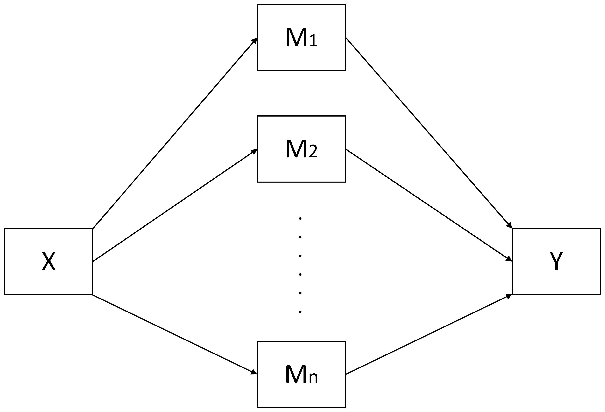
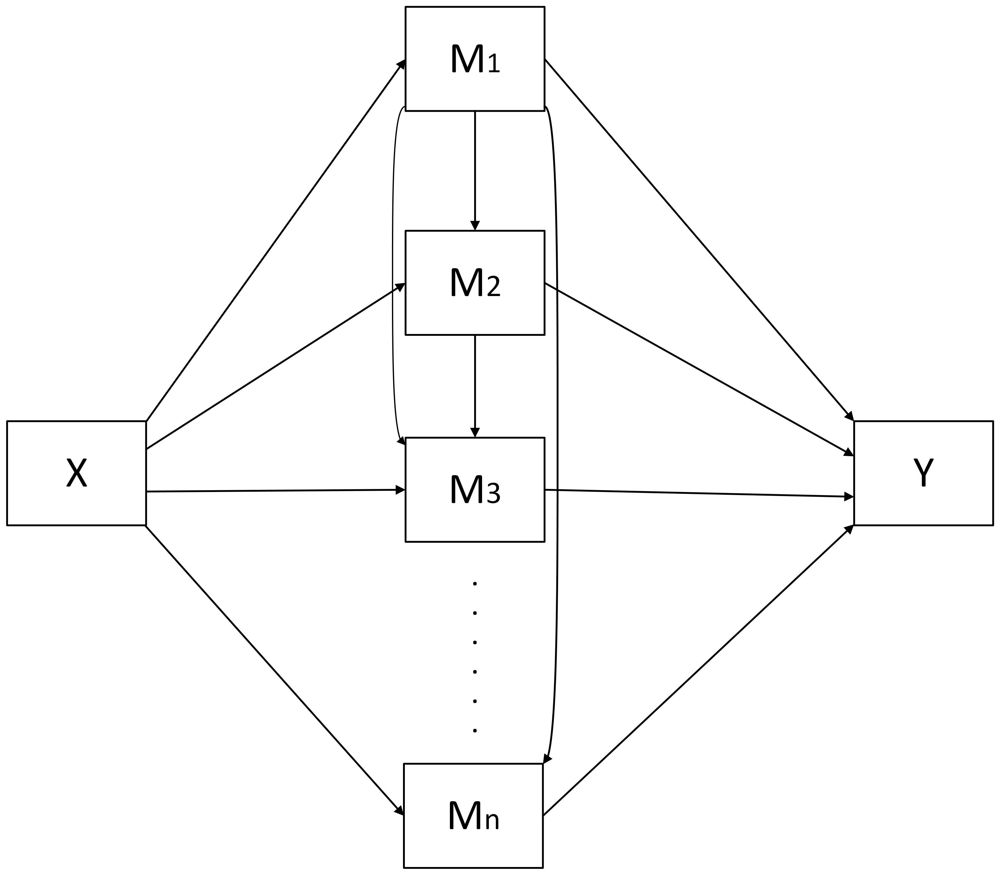
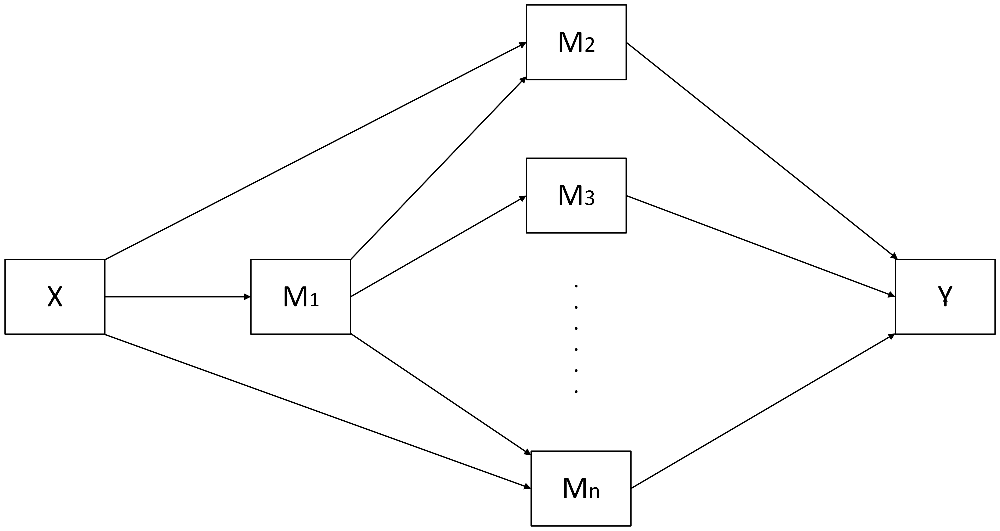
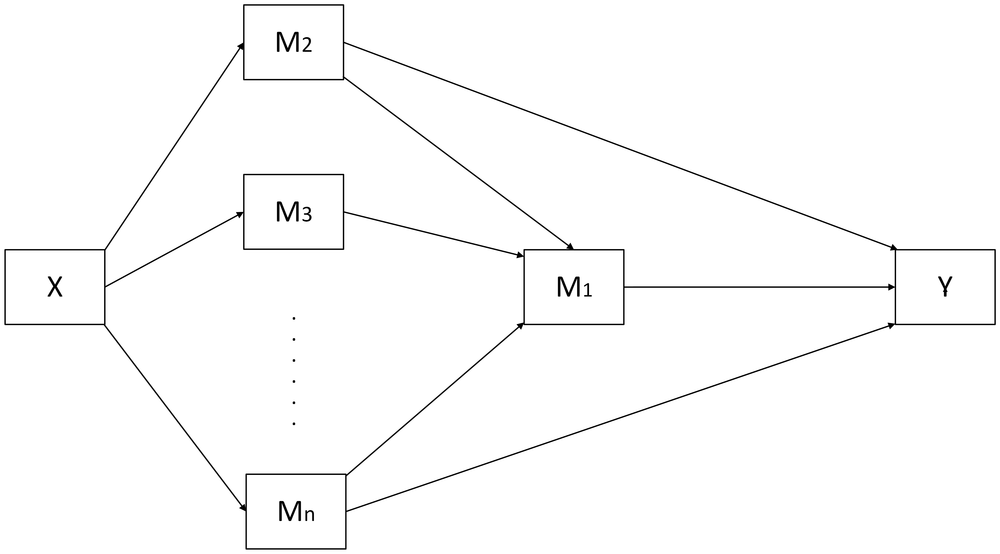

  
  # wsMed
  
  <!-- badges: start -->
  
  <!-- badges: end -->
  
  wsMed is an R package for within-subject mediation analysis designed to help researchers examine how changes in an outcome variable between two conditions are mediated through one or more variables.
The package supports multiple mediation models, including chained, parallel, and combined chained + parallel mediation, allowing for any number of mediators.
It generates both unstandardized and standardized results and provides flexible options for handling missing data, including Multiple Imputation (MI) and Full Information Maximum Likelihood (FIML).

## Installation

You can install the development version of wsMed from [GitHub](https://github.com/) with:
  
  ``` r
# install.packages("pak")
pak::pak("Yangzhen1999/wsMed")
```

Alternatively, if you prefer using devtools, you can install wsMed as follows:
  
  ``` r
# install.packages("devtools")
devtools::install_github("Yangzhen1999/wsMed")
```

## Example

This is a basic example which shows you how to solve a common problem:
  
  ``` r
library(wsMed)

# Load example data
data(example_data)

# Perform within-subject mediation analysis (Parallel mediation model)
result <- WsMed(
  data = example_data,
  M_C1 = c("A1", "B1"), # A1/B1 is A/B mediator variable in condition 1 
  M_C2 = c("A2", "B2"),  # A2/B2 is A/B mediator variable in condition 2 
  Y_C1 = "C1", # C1 is outcome variable in condition 1
  Y_C2 = "C2",  # C2 is outcome variable in condition 2
  form = "P",            # Parallel mediation
  standardized = TRUE,   # Compute standardized effects
  Na = "DE",             # Deletion method for missing data
  bootstrap = 1000,      # Bootstrap for confidence intervals
  iseed = 123            # Random seed for bootstrap
)

# Print summary results
print(result)
```

## Features

`wsMed` is a comprehensive and user-friendly package for **within-subject mediation analysis**.

### **1. Four Types of Mediation Models**

`wsMed` supports a variety of mediation models, each suitable for different experimental designs:
  
  -   **Parallel Mediation** (`"P"`) -- Multiple independent mediators acting simultaneously.
<p align="center">
  
  
  
  </p>
  
  -   **Chained/Serial Mediation** (`"CN"`) -- Sequential mediators in a chain.
<p align="center">
  
  
  
  </p>
  
  -   **Chained + Parallel Mediation** (`"CP"`) -- A combination of chained and parallel mediators.
<p align="center">
  
  
  
  </p>
    
  -   **Parallel + Chained Mediation** (`"PC"`) -- Parallel mediators influencing a chained mediator.

<p align="center">
  
  
  
  </p>
  
  Each model can handle **any number of mediators**, providing flexibility for complex studies.

How to choose and build models can be found in the tutorial on models.

### **2. Comprehensive Output**

`wsMed` provides **detailed mediation results**.
In addition to the basic model fit statistics, it includes:
  
  -   **Total and Direct Effects**: Estimates, standardized errors,p-values,z-values and CIs for the overall and direct influence of the independent variable.
-   **Indirect Effects**: Estimates, standardized errors,p-values,z-values and CIs for each mediated path in the model.
-   **Contrast Indirect Effects**: Pairwise comparisons of indirect effects between different mediation paths.
-   **Moderation Effects of 'X'**: Analysis of whether a moderator influences the mediation paths.
-   **Condition1-Condition2 Coefficients**: Comparison of coefficients between two conditions.
-   **Standardized Results**: Standardized estimates and confidence intervals, allowing for easier interpretation and comparison across variables.

### **3. Missing Data Handling**

`wsMed` offers **flexible strategies for handling missing data**: - **Listwise Deletion** (`"DE"`) -- Removes rows with missing values.
- **Full Information Maximum Likelihood** (`"FIML"`) -- Uses SEM to handle missing data in the analysis.
- **Multiple Imputation** (`"MI"`) -- Imputes missing data using the `mice` package, providing more robust results.

### **4. Standardized and Unstandardized Estimates**

-   **Unstandardized Effects**: Raw coefficients for each path in the mediation model, providing the **direct** and **indirect** effects between variables.
-   **Standardized Effects**: Standardized coefficients that express the effect sizes without depending on the measurement scale of the variables. These provide a clearer understanding of the relative importance of each mediator in the model.

### **5. Confidence Intervals (CIs)**

`wsMed` calculates **confidence intervals (CIs)** for both raw and standardized estimates, with different methods used depending on how missing data is handled:
  
  -   **Monte Carlo Confidence Intervals**: - Used when Multiple Imputation (MI) or Full Information Maximum Likelihood (FIML) is used for handling missing data.
-   Provides robust and reliable confidence intervals based on simulation.
-   **Bootstrap Confidence Intervals**:
  -   Used when **Listwise Deletion (DE)** is used to handle missing data or no missing data.
-   Provides confidence intervals based on resampling, ensuring accurate estimates for standard and non-standardized results.

### **6. User-Friendly and Efficient**

With `wsMed`, **all you need to do is call the `wsMed` function**, and the package will handle everything for you.
This makes `wsMed` accessible to both **beginners** and **advanced users**, providing a streamlined process for complex within subject mediation analysis.

