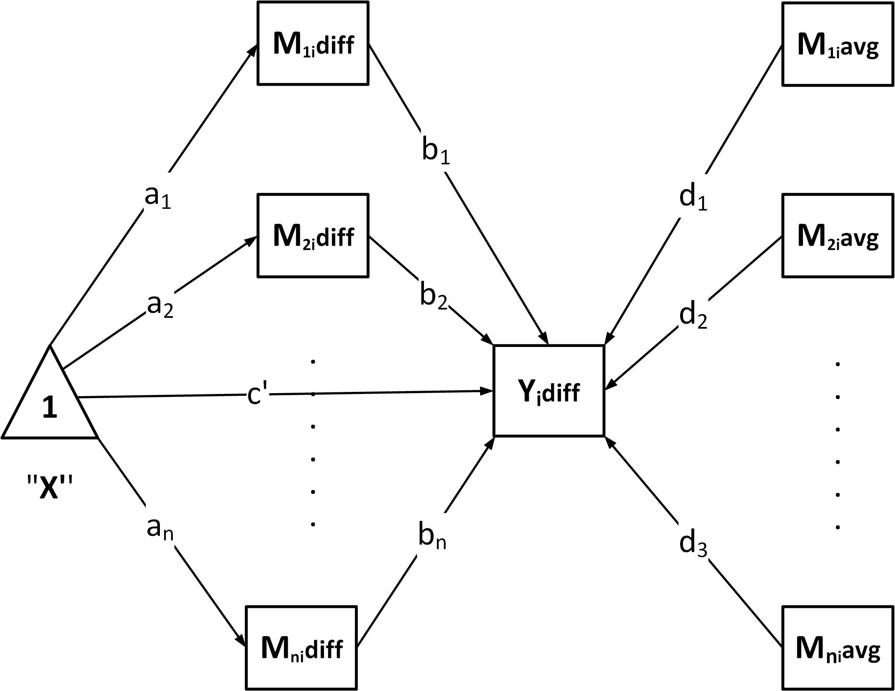
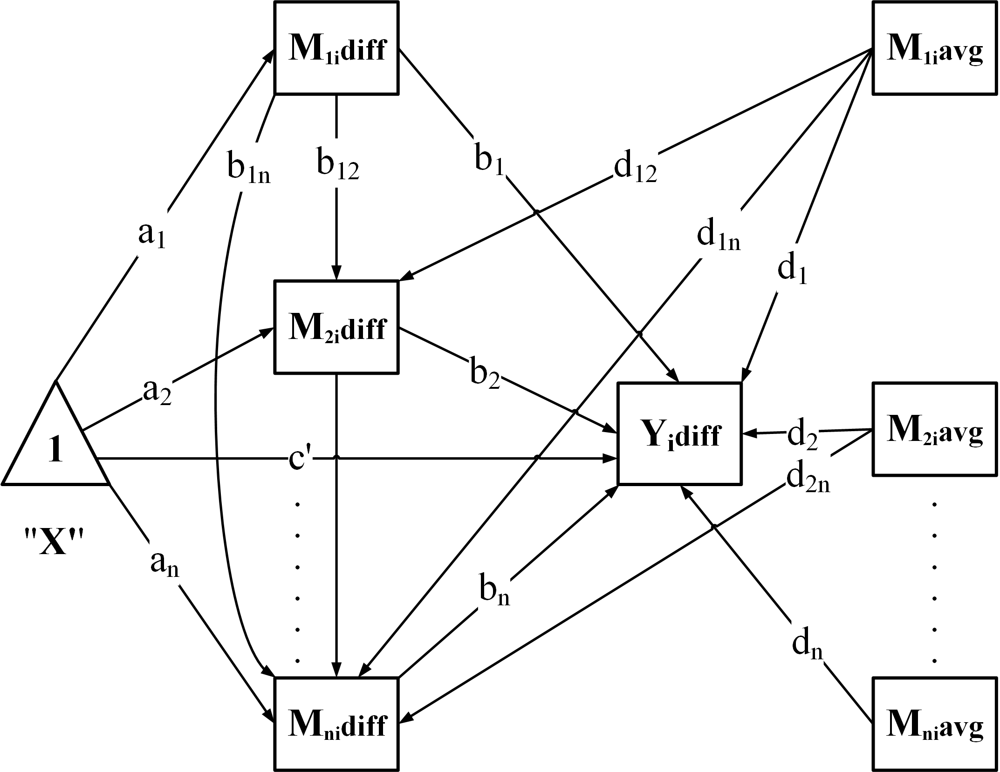
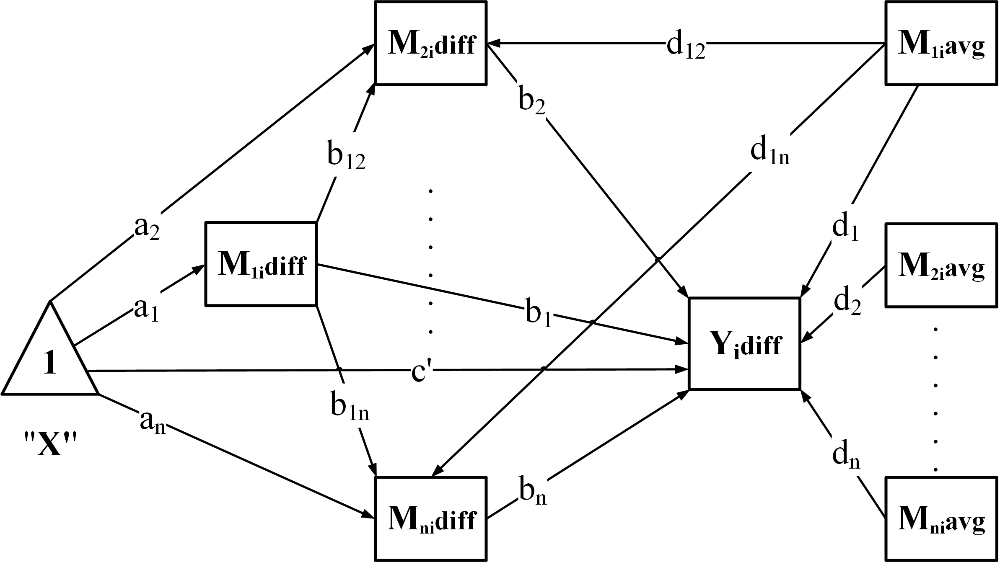
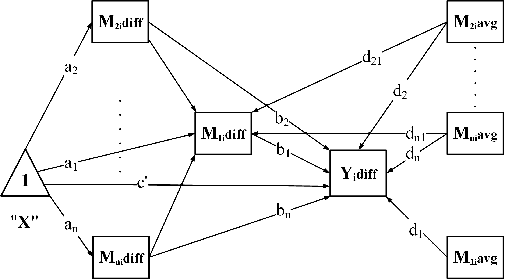

# wsMed
  
  <!-- badges: start -->
  
  <!-- badges: end -->
  
The `wsMed` function is designed for two condition within-subject
mediation analysis, incorporating SEM models through the `lavaan`
package and Monte Carlo simulation methods. This document provides a
detailed description of the function's parameters, workflow, and usage,
along with an example demonstration.

## Installation

You can install the development version of wsMed from [GitHub](https://github.com/) with:
  
  ``` r
# install.packages("pak")
pak::pak("Yangzhen1999/wsMed")
```

Alternatively, if you prefer using devtools, you can install wsMed as follows:
  
  ``` r
# install.packages("devtools")
devtools::install_github("Yangzhen1999/wsMed")
```

## Example

This is a basic example which shows you how to solve a common problem:
  
  ``` r
library(wsMed)

# Load example data
data(example_data)
set.seed(123)
example_dataN <- mice::ampute(
  data = example_data,
  prop = 0.1,
)$amp

# Perform within-subject mediation analysis (Parallel mediation model)
result <- wsMed(
  data = example_dataN,   #dataset
  M_C1 = c("A1","B1"),    # A1/B1 is A/B mediator variable in condition 1
  M_C2 = c("A2","B2"),    # A2/B2 is A/B mediator variable in condition 2
  Y_C1 = "C1",            # C1 is outcome variable in condition 1
  Y_C2 = "C2",            # C2 is outcome variable in condition 2
  form = "P",             # Parallel mediation
  C_C1 = "D1",            # within-subject covariate (e.g., measured under D1)
  C_C2 = "D2",            # within-subject covariate (e.g., measured under C2)
  C = "D3",               # between-subject covariates
  Na = "MI",              # Use multiple imputation for missing data
  standardized = TRUE,    # Request standardized path coefficients and effects
)

# Print summary results
print(result)
```

## Main Function Overview

The development version also supports a staged workflow:

```r
model <- wsmed_model(
  outcome = c(before = "C1", after = "C2"),
  mediators = list(A = c(before = "A1", after = "A2")))
fit <- wsmed_fit(model, example_data)
inference <- wsmed_infer(fit, seed = 123)
effects <- wsmed_effects(inference)
confint(effects, level = .90)
plot(effects)
```

`wsMed()` remains the one-call interface and uses the same engines. Its existing
fields remain available alongside `model`, `fit`, and `inference`. Default
printing is concise; `summary(result)` returns selected effects and
`print(result, detail = "full")` displays the original full tables. See the
"One-call and staged workflows" tutorial for MI, moderation, and joint contrasts.

`plot(result)` and `plot(inference)` select forests, continuous moderator curves,
or categorical points automatically. Use `view`, `terms`, `at`, `labels`, `title`,
and axis labels to select and present results. `plot(fit)` shows point estimates
without intervals; `plot(effects)` uses the exact extracted table. Plotting does
not fit or draw samples. The plot methods use percentile intervals, while the
named legacy helpers retain their stored interval types. See the
[plotting tutorial](https://yangzhen1999.github.io/wsMed/articles/PlottingEffects.html).

The `wsMed()` function automates the full workflow for two-condition within-subject mediation analysis.
Its main steps are:

1. **Validate inputs** – check dataset structure, mediation model type (`form`), and missing-data settings.

2. **Prepare data** – compute difference scores (`Mdiff`, `Ydiff`) and centered averages (`Mavg`)
   from the two-condition variables.

3. **Build the model** – generate SEM syntax according to the chosen structure:
   - `"P"`: Parallel mediation
    <p align="center">
    
  </p>
   - `"CN"`: Chained / serial mediation
    <p align="center">
    
  </p>
   - `"CP"`: Chained + Parallel
    <p align="center">
    
  </p>
   - `"PC"`: Parallel + Chained
   <p align="center">
    
  </p>

4. **Fit the model** – estimate parameters while handling missing data:
   - `"DE"`: listwise deletion
   - `"FIML"`: full-information ML
   - `"MI"`: multiple imputation

5. **Compute inference** – provide confidence intervals using:
   - **Bootstrap** (`ci_method = "bootstrap"`)
   - **Monte Carlo** (`ci_method = "mc"`)

6. **Optional: Standardization** – if `standardized = TRUE`, return standardized effects with CIs.

7. **Optional: Covariates** – automatically center and include:
   - **Between-subject covariates** (`C`): continuous measures are centered;
     categorical predictors are dummy-coded with the first factor level as reference.
   - **Within-subject covariates** (`C_C1`, `C_C2`): difference scores and centered averages are computed and included.

## Packaged data

`wsmed_examples` contains the prepared empirical data for the manuscript:
123 participants and 14 columns, with missing values retained. It loads directly
without SPSS or an additional import package:

```r
data(wsmed_examples, package = "wsMed")
help("wsmed_examples", package = "wsMed")
colSums(is.na(wsmed_examples))
```

The data derive from [Sagaribay's iWeek dataset](https://doi.org/10.17632/fn9n95bsh5.1)
under CC BY 4.0. The help page documents the selected variables, BMI preparation,
and missingness. `example_data` is a separate simulated tutorial dataset with
100 rows and 14 columns, including the `Group` and `W_Group` factors.

## Categorical predictors

Binary and multicategory between-subject covariates and one categorical
moderator are supported. Outcomes, mediators, and within-subject covariates
are analyzed as numeric continuous measures; categorical-response models are
not implemented. In the staged workflow, declare categories as unordered
factors and specify their level order. Numeric 0/1 columns otherwise remain
continuous. See `help("wsmed_categorical")` and the
[categorical predictor tutorial](https://yangzhen1999.github.io/wsMed/articles/CategoricalPredictors.html)
for reference coding, conditional effects, group contrasts, and missing data.

## Diagnostics and reproducibility

Interval methods retain the confidence level saved in the selected inference;
an explicit `level` overrides it. Fit diagnostics distinguish convergence from
post-fit admissibility and record each imputed dataset separately. Effect summaries
state the condition contrast, reference coding, marginal standardizer, and signed
contrast definitions. `wsmed_reproducibility(result)` returns an analysis manifest
without participant-level data or simulation draws; use `file = "analysis.rds"`
to save it to a new file.

Moderated models now account for the dependence of endogenous products on
upstream mediator disturbances, preserving marginal scales under reference
recoding. MI jointly pools marginal variances and coefficients and propagates
their covariance. Refit earlier saved moderated models and regenerate inference;
the corrected estimates and intervals can differ from version 1.1.0.
The [diagnostics and migration tutorial](https://yangzhen1999.github.io/wsMed/articles/WorkflowReliability.html)
explains these conventions and the transition from previous one-call results.
