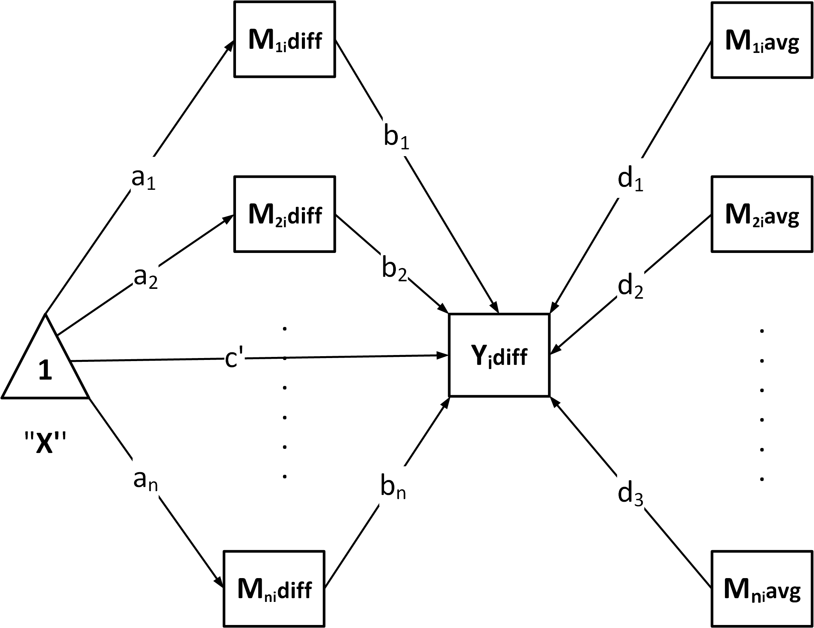

# GenerateModelP

## Introduction

The `GenerateModelP` function dynamically generates a Structural
Equation Model (SEM) formula to analysis parallel mediation for ‘lavaan’
based on the prepared dataset. This document explains the mathematical
principles and the structure of the generated model.

### 1.2 Difference Model for $Y_{\text{diff}}$

Taking the difference between the two conditions:
$$Y_{\text{diff}} = Y_{2} - Y_{1} = \left( b_{20} - b_{10} \right) + \sum\limits_{i = 1}^{N}b_{i2}M_{i2} - \sum\limits_{i = 1}^{N}b_{i1}M_{i1} + \left( e_{2} - e_{1} \right)$$

Define: - $\Delta b_{0} = b_{20} - b_{10}$: Difference in intercepts. -
$e = e_{2} - e_{1}$: Difference in residuals.

Substitute mediator difference and average: 1. **Mediator difference**:
$$M_{\text{diff},i} = M_{i2} - M_{i1}$$

2.  **Mediator average**:
    $$M_{\text{avg},i} = \frac{M_{i1} + M_{i2}}{2}$$

Substitute $M_{i2} = M_{\text{avg},i} + \frac{M_{\text{diff},i}}{2}$ and
$M_{i1} = M_{\text{avg},i} - \frac{M_{\text{diff},i}}{2}$ into the
equation:
$$Y_{\text{diff}} = \Delta b_{0} + \sum\limits_{i = 1}^{N}\left( \frac{b_{i1} + b_{i2}}{2} \cdot M_{\text{diff},i} + \left( b_{i2} - b_{i1} \right) \cdot M_{\text{avg},i} \right) + e$$

Define: - $b_{i} = \frac{b_{i1} + b_{i2}}{2}$: Average effect of the
$i$-th mediator. - $d_{i} = b_{i2} - b_{i1}$: Difference in the effect
of the $i$-th mediator.

The final equation becomes:
$$Y_{\text{diff}} = \Delta b_{0} + \sum\limits_{i = 1}^{N}\left( b_{i}M_{\text{diff},i} + d_{i}M_{\text{avg},i} \right) + e$$

------------------------------------------------------------------------

### 1.3 Regression for $M_{\text{diff}}$

Each mediator difference $M_{\text{diff},i}$ is modeled as:
$$M_{\text{diff},i} = a_{i} + \epsilon_{i}$$

Where: - $a_{i}$: Intercept term for the $i$-th mediator difference. -
$\epsilon_{i}$: Residual for $M_{\text{diff},i}$.

------------------------------------------------------------------------

## 2. Indirect Effects

For each mediator $M_{i}$, the indirect effect is defined as:
$$\text{indirect}_{i} = a_{i} \cdot b_{i}$$

Where: - $a_{i}$: Effect of the independent variable on mediator
$M_{i}$. - $b_{i}$: Average effect of mediator $M_{i}$ on the dependent
variable.

The total indirect effect is:
$$\text{total\_indirect} = \sum\limits_{i = 1}^{N}\text{indirect}_{i}$$

The contrast between indirect effects of two mediators $M_{i}$ and
$M_{j}$ is: $$CI_{i,j} = \text{indirect}_{i} - \text{indirect}_{j}$$

------------------------------------------------------------------------

## 3. Total Effect

The total effect combines the direct effect and the total indirect
effect: $$\text{total\_effect} = c_{p} + \text{total\_indirect}$$

Where $c_{p}$ is the direct effect of the independent variable on the
dependent variable.

------------------------------------------------------------------------

## 4. Comparison of Indirect Effects

When there are multiple mediators ($M_{1},M_{2},\ldots,M_{N}$),
comparing their indirect effects provides insights into the relative
influence of each mediator. This section details the formulas and
interpretations for such comparisons.

------------------------------------------------------------------------

### 4.1 Indirect Effect Definition

For a mediator $M_{i}$, the indirect effect is defined as:
$$\text{indirect}_{i} = a_{i} \cdot b_{i}$$

Where: - $a_{i}$: Effect of the independent variable on mediator
$M_{i}$. - $b_{i}$: Average effect of mediator $M_{i}$ on the dependent
variable.

------------------------------------------------------------------------

### 4.2 Comparing Indirect Effects

To compare the indirect effects of two mediators $M_{i}$ and $M_{j}$, we
calculate the contrast:
$$CI_{i,j} = \text{indirect}_{i} - \text{indirect}_{j}$$

#### **Interpretation**

1.  **$CI_{i,j} > 0$**:
    - Mediator $M_{i}$ has a stronger indirect effect than $M_{j}$.
2.  **$CI_{i,j} < 0$**:
    - Mediator $M_{j}$ has a stronger indirect effect than $M_{i}$.
3.  **$CI_{i,j} = 0$**:
    - Both mediators contribute equally to the indirect effect.

------------------------------------------------------------------------

## 5. C1- and C2-Measurement Coefficients

To compute C1- and C2-measurement coefficients $X1_{b,i}$ and
$X0_{b,i}$, consider two mediators $M_{1}$ and $M_{2}$:

------------------------------------------------------------------------

### 5.1 Difference Model with Two Mediators

From the difference model:
$$Y_{\text{diff}} = \Delta b_{0} + \left( \frac{b_{11} + b_{21}}{2} \right)M_{\text{diff}} + \left( b_{21} - b_{11} \right)M_{\text{avg}} + e$$

Define: - $b = \frac{b_{11} + b_{21}}{2}$: Average effect. -
$d = b_{21} - b_{11}$: Difference in effect.

------------------------------------------------------------------------

### 5.2 C2-Measurement Coefficients

The C2-measurement coefficient $X1_{b,i}$ is defined as:
$$X1_{b,i} = b + d$$

Substitute $b$ and $d$:
$$X1_{b,i} = \frac{b_{11} + b_{21}}{2} + \left( b_{21} - b_{11} \right) = b_{21}$$

Thus, $X1_{b,i}$ is the effect of $M_{i}$ under Condition 2.

------------------------------------------------------------------------

### 5.3 C1-Measurement Coefficients

The C1-measurement coefficient $X0_{b,i}$ is defined as:
$$X0_{b,i} = X1_{b,i} - d$$

Substitute $X1_{b,i} = b_{21}$ and $d = b_{21} - b_{11}$:
$$X0_{b,i} = b_{21} - \left( b_{21} - b_{11} \right) = b_{11}$$

Thus, $X0_{b,i}$ is the effect of $M_{i}$ under Condition 1.

**Additional Interpretation:** The coefficient $d_{i} = b_{2i} - b_{1i}$
reflects the moderating effect of the within-subject variable X,
capturing how the mediator’s influence differs across conditions.

------------------------------------------------------------------------

## 6. Summary of Regression Equations

This section summarizes all the regression equations used in the
analysis, including the difference model, indirect effects, mediator
comparisons, and C1- and C2-measurement coefficients.

------------------------------------------------------------------------

### 6.1 Difference Model

$$Y_{\text{diff}} = cp + \sum\limits_{i = 1}^{N}\left( b_{i}M_{\text{diff},i} + d_{i}M_{\text{avg},i} \right) + e$$

$$M_{\text{diff},i} = a_{i} + \epsilon_{i}$$

------------------------------------------------------------------------

### 6.2 Defined parameters

$$\text{indirect}_{i} = a_{i} \cdot b_{i}$$

$$\text{total\_indirect} = \sum\limits_{i = 1}^{N}\text{indirect}_{i}$$

$$CI_{i,j} = \text{indirect}_{i} - \text{indirect}_{j}$$

$$X1_{b,i} = b_{i} + d_{i}$$

$$X0_{b,i} = X1_{b,i} - d_{i}$$

------------------------------------------------------------------------

### Summary

By combining these equations: 1. The difference model $Y_{\text{diff}}$
decomposes into contributions from mediator differences
($M_{\text{diff}}$) and averages ($M_{\text{avg}}$). 2. Indirect effects
and their contrasts provide insights into the mediators’ relative
importance. 3. C1- and C2-measurement coefficients quantify the effects
in specific conditions.

------------------------------------------------------------------------
