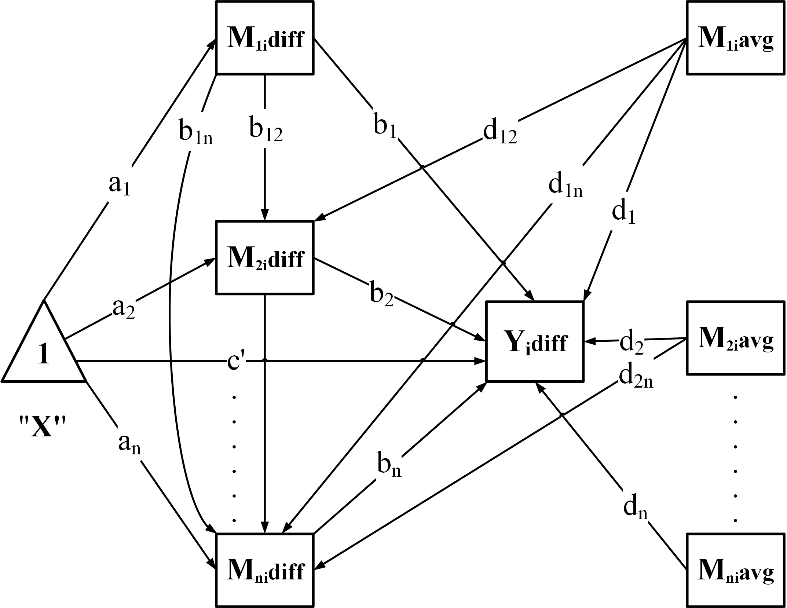

## Introduction

The `GenerateModelCN` function dynamically generates a Structural Equation Model (SEM) formula to analyze chained or nested mediation for 'lavaan' based on the prepared dataset. This document explains the mathematical principles and the structure of the generated model.

plot of chunk unnamed-chunk-1

---

## 1. Difference Model Description

### 1.1 Regression for \( Y_{\text{diff}} \) and \( M_{\text{diff}} \)

For \( N \) mediators \( M_1, M_2, \dots, M_N \), the difference model is defined as:

1. **Outcome Difference Model (\( Y_{\text{diff}} \)):**
   \[
   Y_{\text{diff}} = cp + \sum_{i=1}^N \left( b_i M_{\text{diff},i} + d_i M_{\text{avg},i} \right) + e
   \]

2. **Mediator Difference Model (\( M_{\text{diff},i} \)):**
   \[
   M_{\text{diff},i} = a_i + \sum_{j<i} \left( b_{ji} M_{\text{diff},j} + d_{ji} M_{\text{avg},j} \right) + \epsilon_i
   \]

Where:
- \( cp \): Intercept term for the outcome difference model.
- \( b_i \): Average effect of mediator \( M_i \) on \( Y_{\text{diff}} \).
- \( d_i \): Moderator effect for \( M_{\text{avg},i} \) in \( Y_{\text{diff}} \).
- \( b_{ji} \) and \( d_{ji} \): Regression coefficients for \( M_{\text{diff},j} \) and \( M_{\text{avg},j} \) on \( M_{\text{diff},i} \), respectively.
- \( \epsilon_i \): Residual for \( M_{\text{diff},i} \).

---

## 2. Indirect Effects

For each mediator \( M_i \), the indirect effect is defined as:
\[
\text{indirect}_i = a_i \cdot b_i
\]

For chained mediators, the indirect effects follow the paths through the mediators:
1. For a single mediator \( M_i \):
   \[
   \text{indirect}_i = a_i \cdot b_i
   \]

2. For a chained pathway \( M_1 \to M_2 \to \dots \to M_k \):
   \[
   \text{indirect}_{1 \dots k} = a_1 \cdot b_{12} \cdot b_{23} \cdot \dots \cdot b_k
   \]

The total indirect effect is:
\[
\text{total_indirect} = \sum_{\text{all paths}} \text{indirect}_{\text{path}}
\]

---

### 2.1 Examples of Indirect Effects
For three mediators \( M_1 \to M_2 \to M_3 \), the indirect effects include:

1. The direct path through \( M_1,M_2,and M_3 \):
   \[
   \text{indirect}_1 = a_1 \cdot b_1
   \]
   \[
   \text{indirect}_2 = a_2 \cdot b_2
   \]
   \[
   \text{indirect}_3 = a_3 \cdot b_3
   \]
2. The chained path through \( M_1 \to M_2 \):
   \[
   \text{indirect}_{12} = a_1 \cdot b_{12} \cdot b_2
   \]
3. The chained path through \( M_2 \to M_3 \):
   \[
   \text{indirect}_{23} = a_2 \cdot b_{23} \cdot b_3
   \]
4. The chained path through \( M_1 \to M_2 \to M_3 \):
   \[
   \text{indirect}_{123} = a_1 \cdot b_{12} \cdot b_{23} \cdot b_3
   \]

---

## 3. Total Effect

The total effect combines the direct effect and the total indirect effect:
\[
\text{total_effect} = cp + \text{total_indirect}
\]

Where \( cp \) is the direct effect.

---

## 4. Comparison of Indirect Effects

When there are multiple mediators or pathways, comparing their indirect effects provides insights into the relative influence of each mediator or chain.

---

### 4.1 Comparing Indirect Effects

The contrast between two indirect effects, \( \text{indirect}_{\text{path}_1} \) and \( \text{indirect}_{\text{path}_2} \), is calculated as:
\[
CI_{\text{path}_1\text{vs}\text{path}_2} = \text{indirect}_{\text{path}_1} - \text{indirect}_{\text{path}_2}
\]

#### Interpretation:
- \( CI_{\text{path}_1\text{vs}\text{path}_2} > 0 \): Pathway \( \text{path}_1 \) has a stronger indirect effect.
- \( CI_{\text{path}_1\text{vs}\text{path}_2} < 0 \): Pathway \( \text{path}_2 \) has a stronger indirect effect.

---

### 4.2 Example: Three Mediators \( M_1, M_2, M_3 \)

#### Indirect Effects
For three mediators, the following indirect effects are defined:

1. **Direct Path Effects:**
   \[
   \text{indirect}_1 = a_1 \cdot b_1
   \]
   \[
   \text{indirect}_2 = a_2 \cdot b_2
   \]
   \[
   \text{indirect}_3 = a_3 \cdot b_3
   \]

2. **Chained Path Effects:**
   \[
   \text{indirect}_{12} = a_1 \cdot b_{12} \cdot b_2
   \]
   \[
   \text{indirect}_{23} = a_2 \cdot b_{23} \cdot b_3
   \]
   \[
   \text{indirect}_{123} = a_1 \cdot b_{12} \cdot b_{23} \cdot b_3
   \]

#### Comparisons
The indirect effects are compared as follows:
   \[
   CI_{1\text{vs}2} = \text{indirect}_1 - \text{indirect}_2
   \]
   \[
   CI_{1\text{vs}3} = \text{indirect}_1 - \text{indirect}_3
   \]
   \[
   CI_{2\text{vs}3} = \text{indirect}_2 - \text{indirect}_3
   \]
   \[
   CI_{1\text{vs}12} = \text{indirect}_1 - \text{indirect}_{12}
   \]
   \[
   CI_{1\text{vs}23} = \text{indirect}_1 - \text{indirect}_{23}
   \]
   \[
   CI_{1\text{vs}123} = \text{indirect}_1 - \text{indirect}_{123}
   \]
   \[
   CI_{2\text{vs}12} = \text{indirect}_2 - \text{indirect}_{12}
   \]
   \[
   CI_{2\text{vs}23} = \text{indirect}_2 - \text{indirect}_{23}
   \]
   \[
   CI_{2\text{vs}123} = \text{indirect}_2 - \text{indirect}_{123}
   \]
   \[
   CI_{3\text{vs}12} = \text{indirect}_3 - \text{indirect}_{12}
   \]
   \[
   CI_{3\text{vs}23} = \text{indirect}_3 - \text{indirect}_{23}
   \]
   \[
   CI_{3\text{vs}123} = \text{indirect}_3 - \text{indirect}_{123}
   \]
   \[
   CI_{12\text{vs}23} = \text{indirect}_{12} - \text{indirect}_{23}
   \]
   \[
   CI_{12\text{vs}123} = \text{indirect}_{12} - \text{indirect}_{123}
   \]
   \[
   CI_{23\text{vs}123} = \text{indirect}_{23} - \text{indirect}_{123}
   \]
---

## 5. C1 and C2 Coefficients

For C1- and C2-measurement conditions, the coefficients are calculated as follows:

1. **C2-Measurement Coefficient (\( X1_{b,i} \)):**
   \[
   X1_{b,i} = b_i + d_i
   \]

2. **C1-Measurement Coefficient (\( X0_{b,i} \)):**
   \[
   X0_{b,i} = X1_{b,i} - d_i
   \]

For chained pathways:
1. **C2-Measurement Coefficient (\( X1_{b,ij} \)):**
   \[
   X1_{b,ij} = b_{ij} + d_{ij}
   \]

2. **C1-Measurement Coefficient (\( X0_{b,ij} \)):**
   \[
   X0_{b,ij} = X1_{b,ij} - d_{ij}
   \]
---
For three mediators \( M_1, M_2, M_3 \), the coefficients are calculated as follows:

   - C2-Measurement Coefficient:
     \[
     X1_{b,1} = b_1 + d_1
     \]
   - C1-Measurement Coefficient:
     \[
     X0_{b,1} = X1_{b,1} - d_1
     \]

   - C2-Measurement Coefficient:
     \[
     X1_{b,2} = b_2 + d_2
     \]
   - C1-Measurement Coefficient:
     \[
     X0_{b,2} = X1_{b,2} - d_2
     \]
   - C2-Measurement Coefficient:
     \[
     X1_{b,3} = b_3 + d_3
     \]
   - C1-Measurement Coefficient:
     \[
     X0_{b,3} = X1_{b,3} - d_3
     \]

   - C2-Measurement Coefficient:
     \[
     X1_{b,12} = b_{12} + d_{12}
     \]
   - C1-Measurement Coefficient:
     \[
     X0_{b,12} = X1_{b,12} - d_{12}
     \]
---

## 6. Summary of Regression Equations

This section summarizes all the regression equations:

1. **Outcome Difference Model (\( Y_{\text{diff}} \)):**
   \[
   Y_{\text{diff}} = cp + \sum_{i=1}^N \left( b_i M_{\text{diff},i} + d_i M_{\text{avg},i} \right) + e
   \]

2. **Mediator Difference Model (\( M_{\text{diff},i} \)):**
   \[
   M_{\text{diff},i} = a_i + \sum_{j<i} \left( b_{ji} M_{\text{diff},j} + d_{ji} M_{\text{avg},j} \right) + \epsilon_i
   \]

3. **Indirect Effects:**
   \[
   \text{indirect}_{1 \dots k} = a_1 \cdot b_{12} \cdot b_{23} \cdot \dots \cdot b_k
   \]
4. **Comparison of Indirect Effects**
    \[
    CI_{\text{path}_1\text{vs}\text{path}_2} = \text{indirect}_{\text{path}_1} - \text{indirect}_{\text{path}_2}
    \]
5. **C1- and C2-Measurement Coefficients:**
   \[
   X1_{b,i} = b_i + d_i, \quad X0_{b,i} = X1_{b,i} - d_i
   \]
   \[
   X1_{b,ij} = b_{ij} + d_{ij}, \quad X0_{b,ij} = X1_{b,ij} - d_{ij}
   \]

By combining these equations, the `GenerateModelCN` function supports chained mediation analysis with flexibility in handling nested pathways.

---
