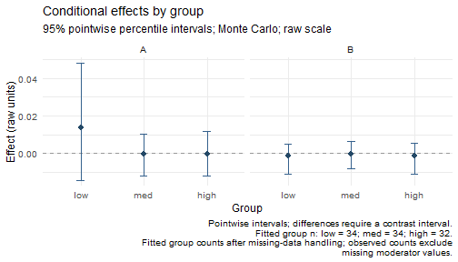
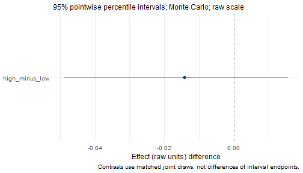

## Supported variable roles

| Role | Supported representation |
|:--|:--|
| Outcome and mediators | Numeric measures analyzed as continuous responses |
| Within-subject covariates | Paired numeric measures |
| Between-subject covariates | Numeric measures or unordered factors |
| Moderator | One numeric measure or one unordered factor with two or more levels |

Categorical support concerns predictors. It does not add binary or ordinal
outcome models, thresholds, or categorical links. A numerically coded binary
outcome would still be analyzed as continuous. In the staged interface,
character predictors and ordered factors must be converted explicitly; use an
unordered factor only when categories should be treated as nominal.

## Choose the reference category

The simulated `example_data` has 100 complete rows and 14 columns. Its `Group`
variable is already a factor, originally ordered as `high`, `med`, `low`. These
are nominal labels in artificial data, not observed subgroups of the manuscript
dataset. Here we select `low` as the reference.


``` r
data(example_data)
dat <- example_data
dat$Group <- factor(dat$Group, levels = c("low", "med", "high"))
table(dat$Group)
#> 
#>  low  med high 
#>   34   34   32
levels(dat$Group)
#> [1] "low"  "med"  "high"
```

Three categories require two indicators: `W1 = 1` for `med` and `W2 = 1` for
`high`; both are zero for `low`. Indicators are not centered. Coding uses
treatment contrasts regardless of the global R contrast option. For a binary
factor the first level is likewise the reference and one indicator is created.

Use this explicit factor declaration for categorical covariates and moderators
in both interfaces. For binary groups, `factor(x, levels = c(0, 1))` selects 0 as
the reference; `factor(x, levels = c(1, 0))` selects 1. Set the levels before
fitting so the intended categories and reference group are recorded in the model.

Existing default recognition rules are retained for compatibility. The staged
interface treats numeric 0/1 predictors as continuous, while the one-call
`wsMed()` interface retains automatic 0/1 detection. Explicit factors avoid
relying on those defaults. The one-call `C_type` and `W_type` arguments remain
available for an explicit override.
Both interfaces explain their numeric 0/1 moderator decision in a message,
retained in `fit$diagnostics$input_notes`. These messages do not alter coding.

## Fit categorical moderated mediation

This parallel model has two mediators. Group main effects enter every difference
equation. `interactions = "A -> Y"` additionally allows the A-to-Y difference
slope to vary by group. The B-to-Y slope is constant, although the indirect
effect through B can still vary because its condition effect varies by group.


``` r
model <- wsmed_model(
  outcome = c(before = "D1", after = "D2"),
  mediators = list(A = c(before = "A1", after = "A2"),
                   B = c(before = "B1", after = "B2")),
  moderator = list(variable = "Group", main_effects = "all_equations",
                   interactions = "A -> Y"))
fit <- wsmed_fit(model, dat)
inference <- wsmed_infer(fit, draws = 2000, seed = 604)
fit
#> wsMed fit: P | DE | 1 fitted dataset(s)
#> Observations: 100 of 100 input rows
#> Converged: 1 of 1 
#> Condition contrast: after - before 
#> Moderator: Group ; reference category = low 
#> Post-fit admissibility: 1 of 1 ; excluded rows: 0
```

The tutorial uses 2,000 Monte Carlo draws for speed; the package default is
20,000. Inspect the coding before interpreting coefficients:


``` r
prepared <- wsmed_inspect(fit, "data")
unique(prepared[c("Group", "W1", "W2")])
#>   Group W1 W2
#> 1   low  0  0
#> 2  high  0  1
#> 3   med  1  0
attr(prepared, "W_info")
#> $raw
#> [1] "Group"
#> 
#> $dummy_names
#> [1] "W1" "W2"
#> 
#> $dummy_map
#> $dummy_map$W1
#> [1] "low vs med"
#> 
#> $dummy_map$W2
#> [1] "low vs high"
```

In the mapping, `low vs med` means an indicator equal to one for `med` and zero
for `low`; its coefficient is **med minus low**. Use `relevel(dat$Group,
ref = "high")` before fitting to choose a different reference.

## Conditional effects and group differences

Queries use factor labels, not indicator numbers. With `at` omitted, all levels
are returned. Specify labels explicitly when their order matters.


``` r
effects <- wsmed_effects(inference,
                         at = list(Group = c("low", "med", "high")))
effects
#> wsMed indirect | raw scale | mc 
#> 95% percentile intervals; 2000 joint draws; SE from effect draws
#> Condition contrast: after - before 
#> Moderator: Group ; reference category = low 
#>                                 Estimate Std. Error  CI lower  CI upper
#> indirect_1@1: A [Group = low]   0.013966   0.015243 -0.014138  0.047896
#> indirect_2@1: B [Group = low]  -0.001067   0.003735 -0.010675  0.005063
#> indirect_1@2: A [Group = med]  -0.000403   0.005285 -0.011883  0.010425
#> indirect_2@2: B [Group = med]  -0.000513   0.003516 -0.008156  0.006507
#> indirect_1@3: A [Group = high] -0.000227   0.005365 -0.011883  0.011623
#> indirect_2@3: B [Group = high] -0.001254   0.003988 -0.010988  0.005731
#> Inference draws: 2000 retained of 2000 ; 0 excluded before effect extraction.
#> Fitted group n: low = 34; med = 34; high = 32.
#> Fitted group counts after missing-data handling; observed counts exclude
#> missing moderator values. 
#> Use as.data.frame() for the full-precision table and metadata.
plot(effects, title = "Conditional effects by group", ncol = 2)
```



The plot retains `low`, `med`, `high` on the category axis, in the requested
order. Use `view = "forest"` to display the same values as horizontal intervals.

Compare the indirect effect through A between `high` and `low` by assigning
weights to the corresponding effect identifiers. The contrast uses matched
joint draws, so its interval includes covariance between the two effects.


``` r
tab <- as.data.frame(effects)
selected <- tab$effect == "indirect_1" & tab$at %in% c("low", "high")
weights <- setNames(ifelse(tab$at[selected] == "high", 1, -1),
                    tab$term[selected])
difference <- wsmed_contrasts(effects, list(high_minus_low = weights))
difference
#> wsMed contrasts | raw scale | mc 
#> 95% percentile intervals; 2000 joint draws; SE from effect draws
#> Condition contrast: after - before 
#> Moderator: Group ; reference category = low 
#> Contrast direction (signed weights):
#>  high_minus_low: -1 * A [Group = low] +1 * A [Group = high]
#>                Estimate Std. Error CI lower CI upper
#> high_minus_low  -0.0142     0.0161  -0.0488   0.0156
#> Inference draws: 2000 retained of 2000 ; 0 excluded before effect extraction.
#> Use as.data.frame() for the full-precision table and metadata.
plot(difference)
```



The effect intervals in the group plot are pointwise. Their overlap is not a
test of equality; use the contrast interval to assess the difference.
The caption reports fitted group counts. With MI it reports their range across
completed datasets, rather than treating imputed memberships as observed.
The result table also provides `n.observed`, `n.fitted.min`, and `n.fitted.max`.
These are descriptive participant counts, not effective sample sizes for effects.


``` r
standardized <- wsmed_effects(inference, scale = "marginal",
                              at = list(Group = c("low", "med", "high")))
standardized
#> wsMed indirect | marginal scale | mc 
#> 95% percentile intervals; 2000 joint draws; SE from effect draws
#> Condition contrast: after - before 
#> Moderator: Group ; reference category = low 
#> Standardization: effect / marginal model-implied SD(D2 - D1); condition contrast is unscaled.
#> Plug-in marginal outcome-difference SD: 0.169127 
#> The denominator is not a moderator-specific conditional SD.
#>                                Estimate Std. Error CI lower CI upper
#> indirect_1@1: A [Group = low]   0.08257    0.08686 -0.08042  0.27111
#> indirect_2@1: B [Group = low]  -0.00631    0.02116 -0.06014  0.02895
#> indirect_1@2: A [Group = med]  -0.00238    0.02989 -0.06904  0.05919
#> indirect_2@2: B [Group = med]  -0.00304    0.02011 -0.04700  0.03715
#> indirect_1@3: A [Group = high] -0.00134    0.03073 -0.06809  0.06611
#> indirect_2@3: B [Group = high] -0.00742    0.02275 -0.06176  0.03274
#> Inference draws: 2000 retained of 2000 ; 0 excluded before effect extraction.
#> Fitted group n: low = 34; med = 34; high = 32.
#> Fitted group counts after missing-data handling; observed counts exclude
#> missing moderator values. 
#> Use as.data.frame() for the full-precision table and metadata.
```

Marginal standardization divides conditional indirect effects by the common
model-implied SD of the outcome difference. It does not divide by a different
within-group SD for each category. Factor labels and indicator coding remain
fixed, while coefficients and the common SD vary together across simulation
draws. See the [standardization tutorial](StandardizedModeratedMediation.html).

## The same analysis in one call

`wsMed()` remains available. The staged model above corresponds to moderator
main effects on `a1`, `a2`, and `cp`, plus the `b1` interaction:


``` r
one_call <- wsMed(dat,
  M_C1 = c("A1", "B1"), M_C2 = c("A2", "B2"),
  Y_C1 = "D1", Y_C2 = "D2", form = "P",
  W = "Group", MP = c("a1", "a2", "cp", "b1"),
  R = 2000, seed = 604)
wsmed_effects(one_call, at = list(Group = c("low", "med", "high")))
#> wsMed indirect | raw scale | mc 
#> 95% percentile intervals; 2000 joint draws; SE from effect draws
#> Condition contrast: C2 - C1 
#> Moderator: Group ; reference category = low 
#>                                  Estimate Std. Error  CI lower  CI upper
#> indirect_1@1: M1 [Group = low]   0.013966   0.015243 -0.014138  0.047896
#> indirect_2@1: M2 [Group = low]  -0.001067   0.003735 -0.010675  0.005063
#> indirect_1@2: M1 [Group = med]  -0.000403   0.005285 -0.011883  0.010425
#> indirect_2@2: M2 [Group = med]  -0.000513   0.003516 -0.008156  0.006507
#> indirect_1@3: M1 [Group = high] -0.000227   0.005365 -0.011883  0.011623
#> indirect_2@3: M2 [Group = high] -0.001254   0.003988 -0.010988  0.005731
#> Inference draws: 2000 retained of 2000 ; 0 excluded before effect extraction.
#> Fitted group n: low = 34; med = 34; high = 32.
#> Fitted group counts after missing-data handling; observed counts exclude
#> missing moderator values. 
#> Use as.data.frame() for the full-precision table and metadata.
one_call_effects <- wsmed_effects(one_call,
  at = list(Group = c("low", "med", "high")))
stopifnot(isTRUE(all.equal(coef(one_call_effects), coef(effects))),
          isTRUE(all.equal(one_call_effects$draws, effects$draws)))
```

## Categorical covariates

Endogenous products have an auxiliary moment model with the necessary upstream
residual covariances. This preserves marginal scales under reference recoding.
With MI, marginal variances and coefficients are pooled jointly; compare the same
completed datasets when checking coding equivalence. Earlier saved moderated
models need refitting. See the [diagnostics tutorial](WorkflowReliability.html)
for an executable reference-group comparison.

A categorical between-subject covariate uses the same reference coding. This
separate example adjusts for `Group` without treating it as a moderator:


``` r
adjusted_model <- wsmed_model(
  outcome = c(before = "D1", after = "D2"),
  mediators = list(A = c(before = "A1", after = "A2")),
  covariates = list(between = "Group"))
adjusted_fit <- wsmed_fit(adjusted_model, dat)
attr(wsmed_inspect(adjusted_fit, "data"), "C_info")
#> $raw
#> [1] "Group"
#> 
#> $dummy_names
#> [1] "Cb1_1" "Cb1_2"
#> 
#> $dummy_map
#> $dummy_map$Cb1_1
#> [1] "low vs med"
#> 
#> $dummy_map$Cb1_2
#> [1] "low vs high"
```

## Missing categorical predictors

`wsmed_fit()` defaults to `missing = "error"`. Listwise deletion is available,
but can discard otherwise useful measurements. FIML can be used when categorical
predictors are fully observed; missing categorical predictors are unsupported
and rejected by the staged interface. Apply the same restriction in one-call
analyses.

For multiple imputation, impute raw variables before computing dummy indicators
and interactions. The following deliberately introduces missingness into the
simulated data. In the staged interface, `mi$method` selects the method for
numeric variables (here PMM). Binary factors automatically use logistic
regression; factors with more than two levels use multinomial logistic
regression. This setting differs from the lower-level `ImputeData()` interface.


``` r
incomplete <- dat
incomplete$Group[c(3, 18, 37, 68, 89)] <- NA
incomplete$A2[c(8, 25, 43)] <- NA
mi_fit <- wsmed_fit(model, incomplete, missing = "mi",
  mi = list(m = 5, method = "pmm", seed = 123))
#> Warning: Internal MI uses main effects only and may be incompatible with
#> moderator interactions. Consider model-compatible external imputations via
#> completed; see the CompatibleImputation tutorial.
mi_inference <- wsmed_infer(mi_fit, method = "mc", draws = 2000, seed = 604)
wsmed_effects(mi_inference, at = list(Group = c("low", "med", "high")))
#> wsMed indirect | raw scale | mc 
#> 95% percentile intervals; 2000 joint draws; SE from effect draws
#> Condition contrast: after - before 
#> Moderator: Group ; reference category = low 
#> MI: per-imputation centering; first-imputation reporting reference.
#> Default MI uses main effects only; interactions may require model-compatible external imputations. 
#>                                 Estimate Std. Error  CI lower  CI upper
#> indirect_1@1: A [Group = low]   0.009419   0.014870 -0.017366  0.043063
#> indirect_2@1: B [Group = low]  -0.000937   0.003569 -0.009763  0.005991
#> indirect_1@2: A [Group = med]  -0.000454   0.005615 -0.012580  0.012517
#> indirect_2@2: B [Group = med]  -0.000255   0.003480 -0.008098  0.006710
#> indirect_1@3: A [Group = high]  0.000237   0.005470 -0.011096  0.011448
#> indirect_2@3: B [Group = high] -0.001447   0.004133 -0.011794  0.005685
#> Inference draws: 2000 retained of 2000 ; 0 excluded before effect extraction.
#> Fitted group n: low = 34-36; med = 31-33; high = 32-34.
#> Fitted group counts: range across completed datasets; observed counts exclude
#> imputed moderator values. 
#> Use as.data.frame() for the full-precision table and metadata.
```


Imputation and inference have separate seeds. Five imputations keep this example
small; choose the number and imputation model for the actual analysis. MI with
bootstrap inference is not implemented. For MI, the package retains the current
per-imputation centering and first-imputation reporting reference.
