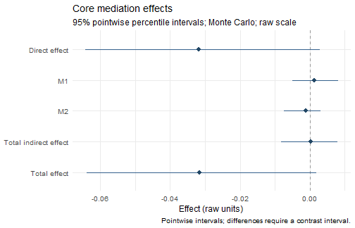

Fit a two-condition parallel mediation model, read its effects, and draw a
forest plot. This example uses complete simulated data and the one-call
`wsMed()` interface. No external data file is needed.

**Documentation version:** the reporting interfaces on this site require the
`feature/modular-api` development build (`1.1.0.9000`). Install it once:


``` r
# install.packages("pak")
pak::pak("Yangzhen1999/wsMed@feature/modular-api")
```

Restart R after updating the package, then follow the steps below.
For the published CRAN version, use `install.packages("wsMed")`; its reporting
interface differs from this development tutorial.

## 1. Match your columns to the two conditions

Use **one row per participant**, with a separate column for each measurement.
Here, `A` and `B` are mediators and `D` is the outcome:

| Role | Condition 1 | Condition 2 |
|---|---|---|
| Mediator A | `A1` | `A2` |
| Mediator B | `B1` | `B2` |
| Outcome | `D1` | `D2` |


``` r
library(wsMed)
data(example_data)
head(example_data[c("A1", "A2", "B1", "B2", "D1", "D2")], 3)
#> # A tibble: 3 × 6
#>      A1    A2     B1    B2    D1    D2
#>   <dbl> <dbl>  <dbl> <dbl> <dbl> <dbl>
#> 1 0.520 0.348 0.0935 0.254 0.702 0.485
#> 2 0.329 0.121 0.259  0.328 0     0.392
#> 3 0.208 0.168 0.295  0.342 0.336 0.706
```

The direction is **condition 2 minus condition 1**. Put the mediator columns
in the same order in `M_C1` and `M_C2`. Replace the column names when using your
data; wsMed constructs the differences internally.

## 2. Run the analysis


``` r
result <- wsMed(
  data = example_data,
  M_C1 = c("A1", "B1"), M_C2 = c("A2", "B2"),
  Y_C1 = "D1", Y_C2 = "D2",
  form = "P", Na = "DE", ci_method = "mc",
  R = 2000, seed = 123, verbose = FALSE
)
```

`form = "P"` requests parallel mediation. `Na = "DE"` removes incomplete
analysis rows; this dataset is complete. `R = 2000` keeps this teaching example
quick, and `seed` makes its Monte Carlo draws repeatable in the same environment.
For a final analysis, assess interval stability with more draws.

## 3. Read the core effects


``` r
s <- summary(result)
knitr::kable(s$effects[c("label", "estimate", "std.error", "conf.low", "conf.high")],
  digits = 4, col.names = c("Effect / pathway", "Estimate", "SE", "CI lower", "CI upper"))
```


|Effect / pathway      | Estimate|     SE| CI lower| CI upper|
|:---------------------|--------:|------:|--------:|--------:|
|Direct effect         |  -0.0318| 0.0171|  -0.0643|   0.0030|
|M1                    |   0.0013| 0.0031|  -0.0049|   0.0081|
|M2                    |  -0.0011| 0.0026|  -0.0073|   0.0031|
|Total indirect effect |   0.0002| 0.0040|  -0.0082|   0.0079|
|Total effect          |  -0.0316| 0.0170|  -0.0639|   0.0019|


Read the table in three steps:

- The specific indirect rows describe the pathways through A (`M1`) and B (`M2`),
  in the order supplied to `M_C1` and `M_C2`. Their sum
  is the **total indirect effect**.
- The **total effect** is the direct effect plus the total indirect effect.
- The estimates above are **unstandardized**. The interval columns are 95%
  percentile Monte Carlo intervals. An interval containing zero does not
  establish that the effect is exactly zero.

The synthetic variable names describe roles, not substantive constructs.
Use study-specific names when reporting your own analysis, and distinguish
statistical mediation from a causal interpretation.

For the console report, use `print(result)`. For additional path coefficients,
use `print(result, detail = "full")`. The [results guide](ResultsGuide.html)
explains the report, structured tables and export options.

## 4. Draw the effects


``` r
plot(s, title = "Core mediation effects")
```



Each point is an effect estimate and each line is its confidence interval.
This graph uses the same rows as `s$effects`.

## 5. Make one change at a time

| Your next task | Where to go |
|---|---|
| Choose serial, mixed or custom pathways | [Choose an analysis](AnalysisGuide.html#choose-your-model) |
| Read, standardize or export tables | [Read and export results](ResultsGuide.html) |
| Add a continuous or categorical moderator | [Add moderation](AnalysisGuide.html#add-moderation) |
| Handle incomplete data | [Missing data](AnalysisGuide.html#handle-missing-data) |
| Choose another figure | [Plot gallery](PlottingEffects.html) |

<details>
<summary>Copy the complete example</summary>


``` r
library(wsMed)
data(example_data)
result <- wsMed(
  data = example_data,
  M_C1 = c("A1", "B1"), M_C2 = c("A2", "B2"),
  Y_C1 = "D1", Y_C2 = "D2",
  form = "P", Na = "DE", ci_method = "mc",
  R = 2000, seed = 123, verbose = FALSE
)
s <- summary(result)
s$effects
plot(s, title = "Core mediation effects")
```

</details>
