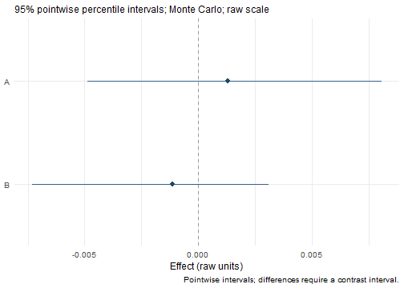
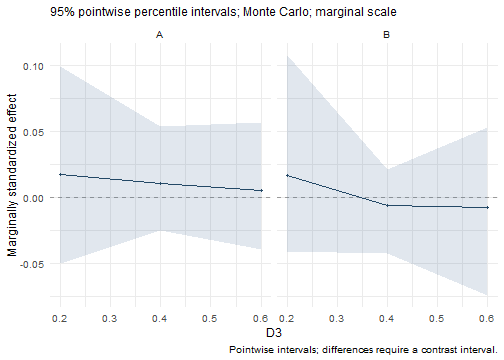

## One call remains available

`wsMed()` specifies, fits, and performs inference in one call. It uses the same
engines as the staged interface below. Existing arguments and result fields
remain available. Default printing gives an overview; `summary()` returns
selected effects, and `print(result, detail = "full")` prints the original tables.


``` r
data(example_data)
result <- wsMed(example_data,
  M_C1 = c("A1", "B1"), M_C2 = c("A2", "B2"),
  Y_C1 = "D1", Y_C2 = "D2", R = 2000, seed = 123)
result
#> wsMed analysis
#> wsMed fit: P | DE | 1 fitted dataset(s)
#> Observations: 100 of 100 input rows
#> Converged: 1 of 1 
#> Condition contrast: C2 - C1 
#> Post-fit admissibility: 1 of 1 ; excluded rows: 0 
#> Stored inference: mc 
#> Use summary() for effects; print(detail = 'full') for all legacy tables.
summary(result)
#> wsMed indirect | raw scale | mc 
#> 95% percentile intervals; 2000 joint draws; SE from effect draws
#> Condition contrast: C2 - C1 
#>                Estimate Std. Error CI lower CI upper
#> indirect_1: M1  0.00131    0.00310 -0.00488  0.00807
#> indirect_2: M2 -0.00112    0.00256 -0.00732  0.00311
#> Inference draws: 2000 retained of 2000 ; 0 excluded before effect extraction.
#> Use as.data.frame() for the full-precision table and metadata.
```

The examples use 2,000 draws for speed. The Monte Carlo default remains 20,000.

## Separate specification, fitting, and inference

Pairs are named by condition; every difference is `after - before`. Mediator
role names make custom edges and displayed pathways readable. Data remain wide,
with one row per participant. Fitting alone does not generate simulation draws.


``` r
model <- wsmed_model(
  outcome = c(before = "D1", after = "D2"),
  mediators = list(A = c(before = "A1", after = "A2"),
                   B = c(before = "B1", after = "B2")))
fit <- wsmed_fit(model, example_data)
inference <- wsmed_infer(fit, method = "mc", draws = 2000, seed = 123)
fit
#> wsMed fit: P | DE | 1 fitted dataset(s)
#> Observations: 100 of 100 input rows
#> Converged: 1 of 1 
#> Condition contrast: after - before 
#> Post-fit admissibility: 1 of 1 ; excluded rows: 0
inference
#> wsMed inference: mc | 2000 valid draws of 2000 requested
#> 95% effect intervals: percentile; stored parameter-table convention: percentile
#> Inference draws: 2000 retained of 2000 ; 0 excluded before effect extraction.
#> Use summary() or wsmed_effects() to select effects.
stopifnot(isTRUE(all.equal(inference$draws, result$mc$result$thetahatstar)))
```

`coef(fit)` and `vcov(fit)` return fitted primitive parameters and their covariance.
For MI these are Rubin-pooled quantities. `vcov(inference)` instead returns the
empirical covariance of its stored parameter draws. `summary(fit)` displays
parameters; `summary(inference)` extracts indirect effects. `confint(fit)` asks
you to run inference first. `wsmed_inspect(fit, "syntax")` exposes the generated
SEM syntax, while `wsmed_inspect(fit, "fits")` returns all backend fits.

## Query results without rerunning the analysis


``` r
effects <- wsmed_effects(inference)
as.data.frame(effects)
#>         term     effect label moderator   at     estimate   std.error
#> 1 indirect_1 indirect_1     A      <NA> <NA>  0.001311305 0.003103070
#> 2 indirect_2 indirect_2     B      <NA> <NA> -0.001119917 0.002562857
#>       conf.low   conf.high effect_type path conf.level method   interval scale
#> 1 -0.004881299 0.008066491    indirect    A       0.95     mc percentile   raw
#> 2 -0.007323464 0.003114028    indirect    B       0.95     mc percentile   raw
#>   n.valid    status moderator.value moderator.level
#> 1    2000 inference              NA            <NA>
#> 2    2000 inference              NA            <NA>
confint(effects, level = .90)
#>                     5 %        95 %
#> indirect_1 -0.002966660 0.006683333
#> indirect_2 -0.005713307 0.002124195
wsmed_effects(inference, type = "total", scale = "marginal")
#> wsMed total | marginal scale | mc 
#> 95% percentile intervals; 2000 joint draws; SE from effect draws
#> Condition contrast: after - before 
#> Standardization: effect / marginal model-implied SD(D2 - D1); condition contrast is unscaled.
#> Plug-in marginal outcome-difference SD: 0.169239 
#> The denominator is not a moderator-specific conditional SD.
#>       Estimate Std. Error CI lower CI upper
#> total  -0.1867     0.1010  -0.3836   0.0112
#> Inference draws: 2000 retained of 2000 ; 0 excluded before effect extraction.
#> Use as.data.frame() for the full-precision table and metadata.
```

These operations reuse stored joint draws. Tables retain full precision;
`digits` controls printing only. Effect and contrast intervals are percentile
intervals. This convention also applies if a bootstrap inference object stores
bias-corrected legacy parameter tables. It is recorded in `effects$query` and
the printed/plot labels. When `wsMed(ci_method = "both")` stores two inference
engines, specify `method = "mc"` or `method = "bootstrap"` in effect queries.


``` r
contrast <- wsmed_contrasts(effects,
  list(B_minus_A = c(indirect_2 = 1, indirect_1 = -1)))
contrast
#> wsMed contrasts | raw scale | mc 
#> 95% percentile intervals; 2000 joint draws; SE from effect draws
#> Condition contrast: after - before 
#> Contrast direction (signed weights):
#>  B_minus_A: +1 * B -1 * A
#>           Estimate Std. Error CI lower CI upper
#> B_minus_A -0.00243    0.00401 -0.01141  0.00521
#> Inference draws: 2000 retained of 2000 ; 0 excluded before effect extraction.
#> Use as.data.frame() for the full-precision table and metadata.
plot(effects)
```



The contrast is evaluated within each joint draw. Its interval is not obtained
by subtracting the endpoints of two separate intervals.

## Moderated mediation

The moderator specification states which difference slopes have interactions.
Moderator main effects remain in **all difference equations**, consistent with
the existing model generators. Average-component slope interactions can be
requested separately through `average_interactions`.


``` r
moderated <- wsmed_model(
  outcome = c(before = "D1", after = "D2"),
  mediators = list(A = c(before = "A1", after = "A2"),
                   B = c(before = "B1", after = "B2")),
  moderator = list(variable = "D3", main_effects = "all_equations",
                   interactions = c("A -> Y", "B -> Y")))
mod_fit <- wsmed_fit(moderated, example_data)
mod_inference <- wsmed_infer(mod_fit, draws = 2000, seed = 123)
conditional <- wsmed_effects(mod_inference, at = list(D3 = c(.2, .4, .6)),
                              scale = "marginal")
conditional
#> wsMed indirect | marginal scale | mc 
#> 95% percentile intervals; 2000 joint draws; SE from effect draws
#> Condition contrast: after - before 
#> Moderator: D3 in raw units; centering reference = 0.452271 
#> Standardization: effect / marginal model-implied SD(D2 - D1); condition contrast is unscaled.
#> Plug-in marginal outcome-difference SD: 0.169191 
#> The denominator is not a moderator-specific conditional SD.
#>                            Estimate Std. Error CI lower CI upper
#> indirect_1@1: A [D3 = 0.2]  0.01695    0.03640 -0.05036  0.09900
#> indirect_2@1: B [D3 = 0.2]  0.01668    0.03604 -0.04130  0.10725
#> indirect_1@2: A [D3 = 0.4]  0.01040    0.01985 -0.02481  0.05323
#> indirect_2@2: B [D3 = 0.4] -0.00597    0.01511 -0.04268  0.02099
#> indirect_1@3: A [D3 = 0.6]  0.00508    0.02194 -0.03986  0.05635
#> indirect_2@3: B [D3 = 0.6] -0.00764    0.03052 -0.07449  0.05259
#> Inference draws: 2000 retained of 2000 ; 0 excluded before effect extraction.
#> Use as.data.frame() for the full-precision table and metadata.
plot(conditional)
```



`plot(mod_inference)` automatically uses a continuous grid over fitted raw
moderator values. `plot(mod_inference, view = "forest")` instead displays the
reference-value effects. Use `title`, `x_label`, `y_label`, `labels`, and `ncol`
to customize the plot. For a fit without inference, `plot(mod_fit)` displays
only point estimates. See the [plotting tutorial](PlottingEffects.html) for
the shared interface and the legacy helpers' interval conventions.

Probes remain fixed in the moderator's raw units. For marginal standardization,
conditional indirect effects are divided by the marginal model-implied SD of
the outcome difference. Coefficients and scales vary jointly across draws.
Invalid standardized draws are excluded together across effects; their original
identities are in `conditional$diagnostics$invalid_draw_ids`. Plot bands are
pointwise intervals, not simultaneous confidence bands.

In the staged interface, categorical predictors must be factors. Numerical
predictors, including 0/1 columns, are treated as continuous unless converted to
factors. Default categorical probes include every observed factor level.
The [categorical predictor tutorial](CategoricalPredictors.html) demonstrates
reference coding, conditional effects, group contrasts, and missing data.

## Missing data and repeated inference

The staged fitting default rejects missing analysis values. Choose `missing =
"listwise"`, `"fiml"`, or `"mi"` explicitly. MI stores every completed dataset,
every SEM fit, and the pooled estimates/covariance. Its imputation seed is separate
from the inference seed. A new inference can reuse the fit without reimputing.


``` r
mi_fit <- wsmed_fit(model, incomplete_data, missing = "mi",
                    mi = list(m = 5, method = "pmm", seed = 123))
mi_inference <- wsmed_infer(mi_fit, draws = 20000, seed = 604)
summary(mi_inference)
```

This interface preserves the existing per-imputation centering and
first-imputation moderator reference; it does not introduce a different MI
estimand. MI with nonparametric bootstrap remains unsupported. Non-MI bootstrap
necessarily refits resampled datasets, but does not refit the original dataset.
Seeded workflow calls restore the caller's random state. With `seed = NULL`,
the current random stream advances normally.

New results can be saved with `saveRDS()` and queried later. Saved objects from
older versions continue to support the existing fields, full printing, and
plotting helpers; the new methods do not silently refit them to construct missing
modular metadata.

`confint()` now keeps the confidence level saved in the selected inference or
results object, just like effect summaries and plots. Supply `level` to override
it without drawing new samples. Primitive-parameter intervals and indirect-effect
intervals concern different quantities: use `confint(wsmed_effects(inference))`
for indirect effects. See [diagnostics and migration](WorkflowReliability.html)
for dataset-level checks, reproducibility reports, and changes from wsMed 1.1.0.

## Externally generated imputations

For an imputation model chosen to match substantive interactions, supply
`mi = list(completed = completed)` to `wsmed_fit()` (with `missing = "mi"`).
`completed` can be a list of wide datasets or a `mice` mids object. The number of
imputations is inferred; omit internal imputation method and seed controls.
Both this interface and `wsMed(..., mi_args = list(completed = completed))` reuse
the existing fitting, Rubin pooling and effect inference. See the
[model-compatible imputation tutorial](CompatibleImputation.html).
