The `plot()` methods work with fitted models, stored inference, and extracted
effects. They return editable `ggplot` objects without fitting or drawing new
samples. The four named plotting helpers remain available for one-call `wsMed`
objects and preserve their existing stored tables and interval conventions.

The named plotting functions return editable `ggplot` objects and retain the
plotted estimates and interval limits in `p$data`. Set `standardized = TRUE`
to use the standardized results already requested during fitting. With
`ci_method = "both"`, use `engine = "mc"` or `engine = "boot"` consistently.
For a single engine, the stored engine is used automatically.

## Reproducible two-condition data


``` r
set.seed(918)
n <- 350
w <- rnorm(n, 3, 2)
avg1 <- rnorm(n); avg2 <- rnorm(n)
dm1 <- 2 + .8*w + rnorm(n)
dm2 <- 1 + .4*w + .3*dm1 + rnorm(n)
dy <- .5 + .6*w + .5*dm1 + .7*dm2 + .2*dm1*w + .3*avg1 + rnorm(n)
y1 <- rnorm(n)
dat <- data.frame(M11=avg1-dm1/2, M12=avg1+dm1/2,
                  M21=avg2-dm2/2, M22=avg2+dm2/2,
                  Y1=y1, Y2=y1+dy, W=w)
dat$Group <- cut(w, c(-Inf,2,4,Inf), labels=c("A","B","C"))
fit_args <- list(data=dat, M_C1=c("M11","M21"), M_C2=c("M12","M22"),
                 Y_C1="Y1", Y_C2="Y2", form="P", Na="DE", ci_method="mc",
                 R=2000, seed=2026, standardized=TRUE, verbose=FALSE)
plain <- do.call(wsMed, fit_args)
continuous <- do.call(wsMed, c(fit_args,
  list(W="W", W_type="continuous", MP=c("b1","d1"))))
categorical <- do.call(wsMed, c(fit_args,
  list(W="Group", W_type="categorical", MP=c("b1","d1"))))
```

These separate fits illustrate each plotting interface; changing W from
continuous to grouped changes the fitted model and is not a transformation
of the original conditional estimates.

## A consistent plot method

`plot()` uses a forest plot for ordinary effects, a continuous curve for a
continuous moderator, and category points for a categorical moderator. Specify
`view` to choose another supported display. `terms` selects effects and their
order; `labels` changes displayed names.


``` r
plot(plain, terms = c("indirect_2", "indirect_1"),
     labels = c(indirect_1 = "Via M1", indirect_2 = "Via M2"),
     title = "Indirect effects")
```

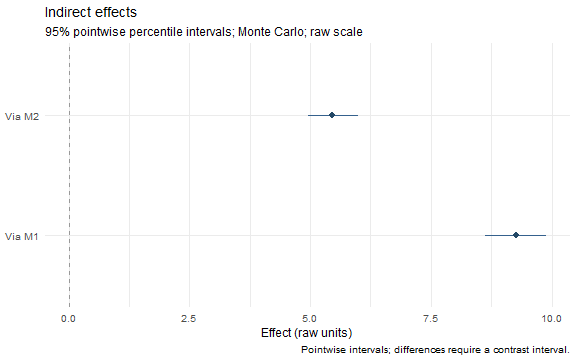

``` r
plot(continuous, n = 41, scale = "marginal", terms = "indirect_1",
     title = "Conditional indirect effect", x_label = "W (raw units)", rug = TRUE)
```

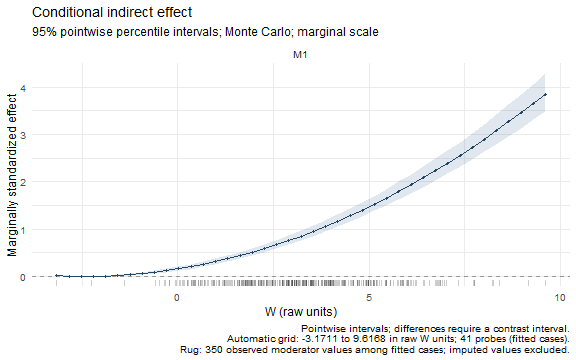

``` r
plot(categorical, at = list(Group = c("C", "A", "B")), ncol = 2,
     title = "Effects in the selected category order")
```

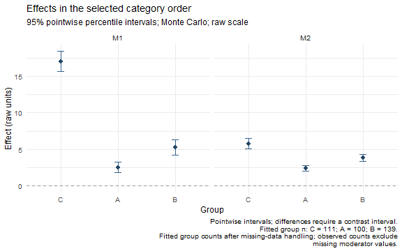

An automatic curve uses 51 equally spaced probes by default, from the smallest
to the largest finite raw moderator value among fitted cases. For MI, the
first completed dataset defines this range. The caption reports the range and
number of probes. Curves join those probes; their bands are pointwise intervals,
not simultaneous bands or exact Johnson--Neyman regions. A forest plot of a
continuous-moderator model uses the reference value unless `at` is supplied.

`rug = TRUE` marks observed raw moderator values along a curve's horizontal
axis. It uses fitted cases and excludes missing or imputed moderator values,
including in MI. It is available when plotting a fitted/inference/one-call
object, which retains the original data; extracted effects alone do not contain
the observations. Rug marks describe where data occur, without changing estimates
or interval widths.


``` r
plot(continuous, view = "conditional", at = list(W = c(1, 3, 5)),
     terms = "indirect_1", title = "Effects at three raw W values")
```

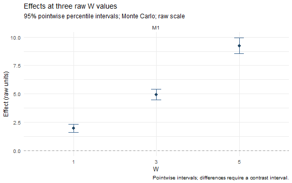

The same methods work after a staged analysis. A fit without inference shows
point estimates only. Extracting results first is useful for checking exactly
which estimates and intervals a plot displays:


``` r
effects <- wsmed_effects(continuous, at = list(W = c(1, 3, 5)),
                         terms = "indirect_1", scale = "marginal")
summary(effects)
#> wsMed indirect | marginal scale | mc 
#> 95% percentile intervals; 2000 joint draws; SE from effect draws
#> Condition contrast: C2 - C1 
#> Moderator: W in raw units; centering reference = 3.23288 
#> Standardization: effect / marginal model-implied SD(Y2 - Y1); condition contrast is unscaled.
#> Plug-in marginal outcome-difference SD: 6.28886 
#> The denominator is not a moderator-specific conditional SD.
#>                          Estimate Std. Error CI lower CI upper
#> indirect_1@1: M1 [W = 1]   0.3150     0.0314   0.2565   0.3805
#> indirect_1@2: M1 [W = 3]   0.7859     0.0494   0.6962   0.8926
#> indirect_1@3: M1 [W = 5]   1.4683     0.0771   1.3314   1.6348
#> Inference draws: 2000 retained of 2000 ; 0 excluded before effect extraction.
#> Use as.data.frame() for the full-precision table and metadata.
p <- plot(effects, view = "conditional", title = "Extracted conditional effects")
p
```

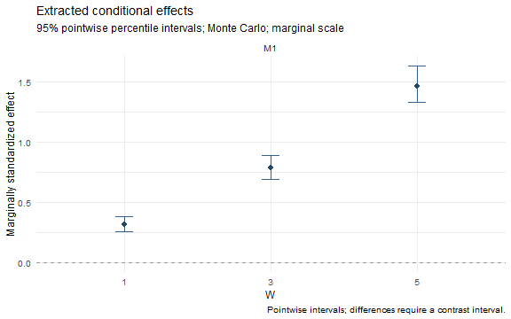

``` r
stopifnot(identical(p$data$estimate, as.data.frame(effects)$estimate),
          identical(p$data$conf.low, as.data.frame(effects)$conf.low))
```

Extracted results retain only the probes they contain; `plot(effects)` does not
add a grid. Use `wsmed_effects()` to choose different probes or a different scale.
`plot(effects, level = .90)` recalculates percentile limits from its stored draws.
`p$data` retains unrounded values; `estimate`, `conf.low`, and `conf.high` are
also available in plots produced by the named helpers. Unknown arguments are
rejected by the plot methods, so a misspelled title is not silently ignored.

The summary uses a coefficient-style numeric table without adding p-values.
It identifies whether standard errors come from effect draws; summaries of
fits instead identify the fitted or Rubin-pooled parameter covariance.
`as.data.frame(effects)` retains the complete table and metadata.

## Interval conventions

`plot()` uses the percentile intervals returned by `wsmed_effects()`, including
when bootstrap parameter tables were requested with another interval type.
For a one-call object holding two inference methods, specify
`plot(result, method = "mc")` or `plot(result, method = "bootstrap")`.

The named helpers preserve legacy behavior: `plot_effects()` uses the stored
parameter-table limits, including bias-corrected bootstrap limits if requested.
Conditional and contrast helpers use their stored percentile intervals. The
subtitle identifies the convention. A difference between a percentile interval
and a bias-corrected interval is therefore expected; it does not indicate that
plotting reran the analysis. The helpers continue to accept `engine = "boot"`,
while the plot methods use `method = "bootstrap"`.

## Forest plots

`plot_effects()` displays complete indirect effects, their total, the direct
effect (`cp`) and the total effect. Choose rows and their display order with
`paths`; use a named `labels` vector for readable descriptions.


``` r
forest <- plot_effects(plain, standardized=TRUE,
  paths=c("indirect_1", "indirect_2", "total_indirect", "cp", "total_effect"),
  labels=c(indirect_1="Via M1", indirect_2="Via M2",
           total_indirect="Total indirect", cp="Direct", total_effect="Total"))
forest
```

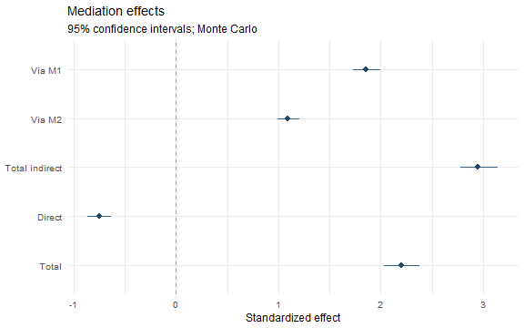

With a moderator, this forest shows effects at the model reference value
(centered continuous W = 0, or the reference category). It does not average
conditional effects across W. To display different W levels, use the next plot.

## Conditional effects by group or selected level


``` r
group_plot <- plot_conditional_effects(categorical, standardized=TRUE,
  paths=c("indirect_1","indirect_2"),
  labels=c(indirect_1="Via M1",indirect_2="Via M2"), ncol=2)
group_plot
```

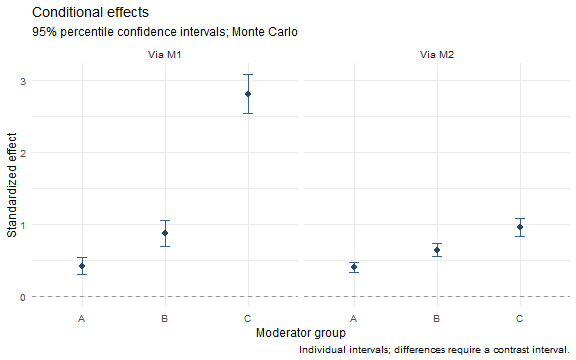

Each point and interval belongs to a fitted group. There are no interpolating
lines between categories. `levels` can select and reorder group labels.
Choose `type = "paths"` for available path coefficients or `type = "overall"`
for total indirect and total effects. All panels share their effect axis.

The same function can display the stored reference levels of a continuous W:


``` r
plot_conditional_effects(continuous, paths="indirect_effect_1",
  levels=c("-1 SD","0 SD","+1 SD"), standardized=TRUE,
  labels=c(indirect_effect_1="Via M1"))
```

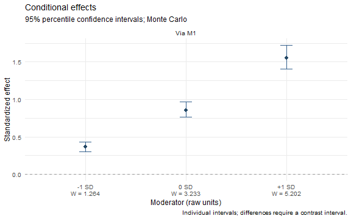

The axis includes raw W values. `indirect_1` and `indirect_effect_1` are accepted
as aliases when selecting an available indirect effect; the underlying result
tables keep their existing identifiers.

## Differences need their own intervals

One effect having an interval that excludes zero and another having an
interval that includes zero does not establish a difference between them.
`plot_contrasts()` displays the difference and its own interval instead.


``` r
contrast_plot <- plot_contrasts(categorical, standardized=TRUE,
  paths=c("indirect_1","indirect_2"),
  labels=c(indirect_1="Via M1",indirect_2="Via M2"), ncol=2)
contrast_plot
```

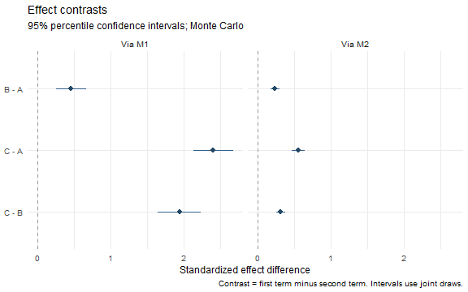

For example, `B - A` means the conditional effect in B minus that in A.
With a continuous moderator, the same function compares stored low, mean
and high moderator levels. `contrasts` selects exact labels from the result
table (also visible in `contrast_plot$data$Contrast`). Conditional contrasts
use the already-computed joint-draw contrast intervals, not differences
between endpoints of separate intervals.

Without a moderator, the plot compares indirect paths with one another:


``` r
plot_contrasts(plain, standardized=TRUE)
```

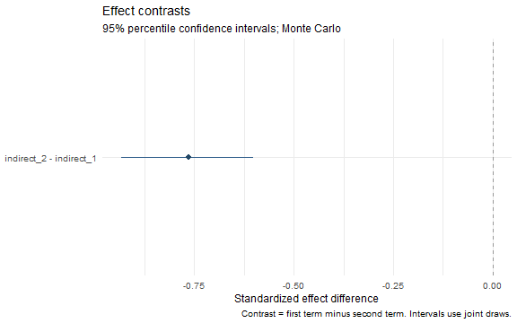

Here the helper uses stored joint draws and fitted/pooled point estimates.
Standardized contrasts are computed with each draw's own endpoint scales
before forming percentile intervals. No model is refitted. A moderator fit
currently supports contrasts within each effect across groups/levels, not
arbitrary contrasts between different indirect paths at a fixed W.
For continuous moderators, `type = "overall"` is unavailable unless an
overall contrast table is present; specific indirect and path contrasts
remain available.

## Conditional curves and their highlighted ranges


``` r
plot_moderation_curve(continuous, "total_indirect", standardized=TRUE)
```

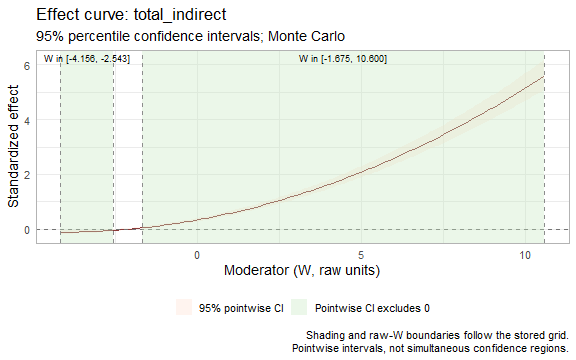

The band uses the fitted confidence level. Shading denotes stored grid values
whose pointwise interval excludes zero. Labels give raw W bounds, not sample
percentiles. Boundaries are grid approximations; they are not exact
Johnson--Neyman boundaries or simultaneous confidence regions. An adjacent
change from a negative to a positive interval breaks a highlighted range.

## Inspect and export

The `plot()` methods retain descriptive data-support information. Continuous
probes outside the observed fitted-case moderator range issue a warning when
effects are extracted and remain marked in the table and plot caption. This
is a marginal-range check, not a test of joint covariate overlap or density.
Imputed moderator values do not extend the observed range.


``` r
probe_values <- c(mean(dat$W), max(dat$W) + 1)
supported <- wsmed_effects(continuous, at = list(W = probe_values), terms = "indirect_1")
#> Warning: Moderator probes outside the observed fitted-case range of W
#> [-3.17113, 9.61675]: 10.6168. These estimates extrapolate.
as.data.frame(supported)[, c("at", "estimate", "extrapolated")]
#>                 at  estimate extrapolated
#> 1 3.23287569618678  5.373759        FALSE
#> 2 10.6167533949209 28.400634         TRUE
plot(supported, view = "forest")
```

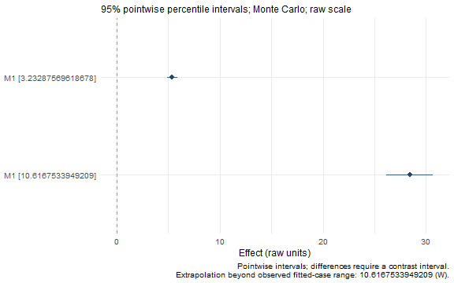

The warning above is intentional. Plotting the extracted object again does not
repeat the warning or resample. `attr(plot(supported), "wsmed_plot")$support`
records its observed range. Category plots report fitted group counts; MI
captions report the minimum and maximum across completed datasets. The table
also distinguishes observed memberships (`n.observed`) from fitted counts.
These counts are not effective sample sizes for the conditional effects.


``` r
forest$data[, c("Path","Estimate","CI.LL","CI.UL")]
#>              Path   Estimate      CI.LL      CI.UL
#> 16     indirect_1  1.8547450  1.7288211  1.9961587
#> 17     indirect_2  1.0906147  0.9883679  1.2036331
#> 18 total_indirect  2.9453597  2.7763983  3.1419685
#> 1              cp -0.7473749 -0.8609135 -0.6291048
#> 19   total_effect  2.1979847  2.0344092  2.3776610
attr(forest, "wsmed_plot")
#> $engine
#> [1] "mc"
#> 
#> $standardized
#> [1] TRUE
#> 
#> $level
#> [1] 0.95
```


``` r
ggplot2::ggsave("mediation-effects.pdf", forest, width=8, height=5)
ggplot2::ggsave("group-effects.png", group_plot, width=8, height=5, dpi=300)
```

All conditional intervals are percentile intervals; bootstrap parameter
forest plots use the stored bootstrap interval type. The common marginal
scale, fixed raw W probes and joint uncertainty are described in
[Standardized moderated mediation](StandardizedModeratedMediation.html).
