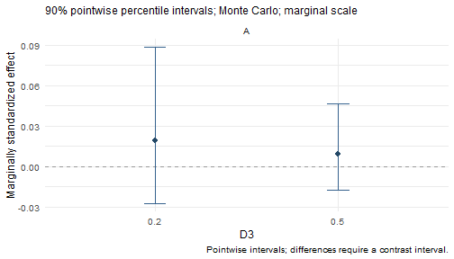

## Fit once and keep the inference settings


``` r
data(example_data)
model <- wsmed_model(
  outcome = c(before = "D1", after = "D2"),
  mediators = list(A = c(before = "A1", after = "A2")),
  moderator = list(variable = "D3", interactions = "A -> Y"))
fit <- wsmed_fit(model, example_data)
inference <- wsmed_infer(fit, draws = 1000, seed = 604, level = .90)
```

This tutorial uses 1,000 draws for speed; the default is 20,000 MC draws.
Summary, interval extraction, and plotting keep the stored confidence level.
An explicit `level` changes the quantiles computed from stored joint draws.
It does not refit, reimpute, or draw new samples.


``` r
effects <- wsmed_effects(inference, at = list(D3 = c(.2, .5)), scale = "marginal")
summary(effects)
#> wsMed indirect | marginal scale | mc 
#> 90% percentile intervals; 1000 joint draws; SE from effect draws
#> Condition contrast: after - before 
#> Moderator: D3 in raw units; centering reference = 0.452271 
#> Standardization: effect / marginal model-implied SD(D2 - D1); condition contrast is unscaled.
#> Plug-in marginal outcome-difference SD: 0.169194 
#> The denominator is not a moderator-specific conditional SD.
#>                            Estimate Std. Error CI lower CI upper
#> indirect_1@1: A [D3 = 0.2]  0.01950    0.03741 -0.02777  0.08870
#> indirect_1@2: A [D3 = 0.5]  0.00886    0.01979 -0.01737  0.04664
#> Inference draws: 1000 retained of 1000 ; 0 excluded before effect extraction.
#> Use as.data.frame() for the full-precision table and metadata.
confint(effects)                 # stored 90% level
#>                      5 %       95 %
#> indirect_1@1 -0.02777232 0.08869974
#> indirect_1@2 -0.01737350 0.04664084
confint(effects, level = .95)    # explicit override
#>                    2.5 %     97.5 %
#> indirect_1@1 -0.04443721 0.10637292
#> indirect_1@2 -0.02711014 0.05686551
plot(effects, view = "conditional")
```



``` r
stopifnot(identical(confint(effects, level = NULL), confint(effects)))
```

`confint(inference)` extracts primitive model-parameter intervals. Use
`confint(effects)` for the selected indirect or conditional effects. When a
one-call result contains both MC and bootstrap inference, choose `method`
explicitly. Each method keeps its own stored level.

Effect extraction and its associated methods use percentile intervals, including
when `wsmed_infer(..., method = "bootstrap", interval = "bc")` requested a
bias-corrected legacy parameter table. These are different interval conventions.
The existing `plot_effects()` helper preserves that parameter table; `plot()`
uses the extracted percentile intervals. `bca.simple` uses bias correction with
zero acceleration, not a full BCa acceleration estimate. See also the
[plotting tutorial](PlottingEffects.html).

## Inspect fitted datasets and inference separately


``` r
fit
#> wsMed fit: P | DE | 1 fitted dataset(s)
#> Observations: 100 of 100 input rows
#> Converged: 1 of 1 
#> Condition contrast: after - before 
#> Moderator: D3 in raw units; centering reference = 0.452271 
#> Post-fit admissibility: 1 of 1 ; excluded rows: 0
diagnostics <- wsmed_inspect(fit, "diagnostics")
diagnostics$by_dataset
#>   dataset n.used converged admissible covariance.finite
#> 1       1    100      TRUE       TRUE              TRUE
#>   covariance.min.eigenvalue complete.cases complete.case.rank
#> 1              3.988869e-08            100                  6
#>   complete.case.columns warnings message n.excluded
#> 1                     6        0                  0
wsmed_inspect(inference, "diagnostics")
#> $requested
#> [1] 1000
#> 
#> $valid
#> [1] 1000
#> 
#> $invalid
#> [1] 0
#> 
#> $reasons
#> integer(0)
#> 
#> $invalid_draw_ids
#> integer(0)
#> 
#> $warnings
#> character(0)
```

For each dataset, the report records the cases used and excluded, optimizer
convergence, the backend's post-fit admissibility check, finite parameter
covariance, its smallest eigenvalue, and warning messages. These checks assess
different properties: optimizer convergence alone does not establish an
admissible solution or a substantively appropriate model. MI reports every
completed dataset separately. Non-converged MI fits are not silently pooled;
inference rejects known inadmissible fits.

Complete-case matrix rank is descriptive and may be unavailable when there are
too few complete rows; it is not a test of FIML identification. Recorded category
counts refer to the fitted rows in each prepared dataset (completed data in MI).
Counts below five are flagged descriptively, without treating five as a general
validity threshold. Transformed variables with no usable variation stop fitting
and are named in the error, for example `M1diff` for the first mediator difference.

Inference diagnostics count exclusions before effect extraction. Standardized
effect diagnostics separately count additional invalid scale draws and their
reasons. An excluded draw's original index remains available. Do not interpret
a low failure count as proof of good model fit or adequate simulation precision.

## Interpret the effect being reported

The summary states the condition order, moderator units and centering reference,
and categorical reference groups. For marginally standardized direct and indirect
condition effects, it identifies the model-implied SD of the outcome difference
and reports its plug-in value. This is a marginal SD, not a conditional SD at each
moderator value. Draw-specific scales continue to vary jointly with coefficients.
Contrasts display signed weights and their source effects/probes.

The generated SEM now accounts for the dependence of endogenous products on
upstream mediator disturbances. `printGM()` shows its auxiliary product moment
equations and residual covariances separately from the mediation paths. These
auxiliary equations parameterize means and covariances, not new causal paths.
For the same data and model, changing a categorical reference preserves the
marginal standardizer and conditional effects, up to fitting precision.


``` r
group_model <- wsmed_model(
  c(before = "D1", after = "D2"),
  list(A = c(before = "A1", after = "A2")),
  moderator = list(variable = "Group", interactions = "A -> Y"))
group_fit <- wsmed_fit(group_model, example_data)
recoded_data <- example_data
recoded_data$Group <- relevel(recoded_data$Group, "low")
recoded_fit <- wsmed_fit(group_model, recoded_data)
probes <- list(Group = c("high", "low", "med"))
original_effects <- wsmed_effects(group_fit, at = probes, scale = "marginal")
recoded_effects <- wsmed_effects(recoded_fit, at = probes, scale = "marginal")
data.frame(group = probes$Group, original = coef(original_effects),
           recoded = coef(recoded_effects))
#>              group     original      recoded
#> indirect_1@1  high -0.001614357 -0.001614352
#> indirect_1@2   low  0.089299548  0.089299556
#> indirect_1@3   med -0.003012105 -0.003012102
stopifnot(isTRUE(all.equal(unname(coef(original_effects)),
  unname(coef(recoded_effects)), tolerance = 1e-6)))
```

For MI moderated models, marginal variances are estimated in each completed
dataset and pooled jointly with coefficients. Their within-imputation covariance
uses the delta method; Rubin's rules include between-imputation uncertainty.
MC draws retain the covariance between coefficients and standardizers.
A coding comparison must use the same completed datasets: repeating stochastic
imputation or finite MC sampling can itself change numerical results.

Models saved before this correction must be refitted and their inference rerun.
Re-extracting an old object's results cannot repair its fitted covariance model.

### Saved-object compatibility

Model and sampler identifiers are recorded separately from the package version,
because different development builds can share `1.1.0.9000`. Before new inference
or effect extraction, endogenous-product fits must have compatible model and MI
pooling identifiers. Missing or incompatible identifiers stop with instructions
to refit from the original data. The package does not silently update an old fit.
If the fit is compatible but its stored MI sampler is outdated, reuse the fit:


``` r
group_fit$provenance$algorithms
#> $product_moments
#> [1] "endogenous-products-v1"
#> 
#> $mi_marginal_pooling
#> [1] "joint-rubin-v1"
new_inference <- wsmed_infer(group_fit, draws = 100, seed = 190)
new_inference$provenance$algorithms
#> $mi_variance_sampler
#> [1] "symmetric-psd-v1"
saved <- tempfile(fileext = ".rds")
saveRDS(new_inference, saved)
restored <- readRDS(saved)
stopifnot(identical(coef(restored), coef(new_inference)))
unlink(saved)
```

For an MI object, the same `wsmed_infer(compatible_fit, ...)` call regenerates
its uncertainty estimates without reimputing or refitting. Stored coefficients,
covariances and `print(result, detail = "full")` remain available for historical
inspection. An old object without algorithm metadata can be statistically valid,
but the package cannot safely certify its moment model from its version alone.

Cross-platform checks also compare against a frozen candidate numerical baseline;
all platforms changing together must not silently change the accepted results.
The separate simulation study in the repository's `.github/validation` directory
evaluates bias and interval coverage against analytical population targets.
Passing software tests and reproducing a numerical result do not establish
coverage for every sample size, missingness mechanism or imputation model.

## Export a compact analysis manifest


``` r
report <- wsmed_reproducibility(effects)
report$analysis$missing
#> [1] "DE"
report$analysis$reference$policy
#> [1] "legacy: per-imputation centering; first-imputation probes"
report$inference$mc$controls
#> $draws
#> [1] 1000
#> 
#> $seed
#> [1] 604
#> 
#> $level
#> [1] 0.9
#> 
#> $interval
#> [1] "percentile"
#> 
#> $decomposition
#> NULL
#> 
#> $pd
#> [1] TRUE
#> 
#> $tol
#> [1] 1e-06
#> 
#> $RNGkind
#> [1] "Mersenne-Twister" "Inversion"        "Rejection"
report$fitting_versions
#> $R
#> [1] "R version 4.4.3 (2025-02-28 ucrt)"
#> 
#> $wsMed
#> [1] '1.1.0.9000'
#> 
#> $algorithms
#> $algorithms$product_moments
#> [1] "endogenous-products-v1"
#> 
#> $algorithms$mi_marginal_pooling
#> [1] "joint-rubin-v1"
#> 
#> 
#> $lavaan
#> [1] '0.6.19'
#> 
#> $mice
#> NULL
#> 
#> $platform
#> [1] "x86_64-w64-mingw32"
#> 
#> $RNGkind
#> [1] "Mersenne-Twister" "Inversion"        "Rejection"       
#> 
#> $marginal_standardization
#> [1] "Fitted model-implied marginal variances"
path <- tempfile(fileext = ".rds")
wsmed_reproducibility(effects, file = path)
stopifnot(identical(readRDS(path), report))
unlink(path)
```

The manifest records the resolved model, variable roles and coding, missing-data
and inference settings, recorded versions, diagnostics, and effect/contrast query.
It contains no participant-level data or simulation draw matrices. It is useful
alongside the analysis script, data, and dependency records, but cannot reproduce
the analysis by itself. Existing report files are not overwritten. Versions from
fitting and inference remain separate from the environment used to export.
Missing provenance in older objects is not filled using current versions.

## Move from the previous one-call workflow

| Previous usage or expectation | Current workflow |
|:--|:--|
| `wsMed(...)` performs the full analysis | Still supported; staged calls use the same engines |
| Printing shows all tables | `print(result)` is an overview; use `print(result, detail = "full")` for legacy tables |
| Read effects from nested fields | `wsmed_effects()` followed by `as.data.frame()` or `confint()` |
| Change MC to bootstrap by rerunning everything | Pass an existing fit to `wsmed_infer()`; bootstrap still fits resampled datasets |
| Inspect the generated syntax | `printGM(result)` or `wsmed_inspect(fit, "syntax")` |
| Use the named plotting helpers | Still supported; `plot()` also accepts workflow objects |
| Expect implicit 95% intervals everywhere | Methods keep the saved level; specify `level = .95` when intended |
| Numeric 0/1 predictors detected automatically | The staged interface requires explicit factors for categorical interpretation |

Older saved one-call objects retain the legacy fields and plotting helpers.
They cannot acquire missing staged metadata without refitting from the original
script and data. The new methods report this limitation rather than refitting
automatically. MI-bootstrap and categorical outcome/mediator models remain
outside the supported scope of this release.

## Statistical scope of validation

The recorded eight-scenario screening study found undercoverage for some
standardized conditional indirect effects under default multiple imputation
(the lowest observed coverage of nominal 95% intervals was 89.5%). Passing
software checks does not establish nominal coverage for every model. The
imputation model should preserve the substantive interaction structure; the
study does not isolate the cause of the observed bias and undercoverage.
See the development repository
[simulation report](https://github.com/Yangzhen1999/wsMed/blob/feature/modular-api/.github/validation/RESULTS.md)
for the design, Monte Carlo uncertainty and retained results.

A model-compatible external imputer can now supply its completed datasets via
`mi = list(completed = completed)` or one-call `mi_args = list(completed = completed)`.
This does not reimpute or change the pooling/standardization engine. See the
[model-compatible imputation tutorial](CompatibleImputation.html) for a scoped
SMC-FCS example and the paired follow-up study. Save external imputation settings
and convergence diagnostics separately; they cannot be inferred from completed data.

Internal MI with moderator interactions emits a typed compatibility warning
once per fit. This is retained in fit diagnostics and analysis manifests even
when fitted objects are never printed. The warning does not establish that an
external imputer is appropriate; its statistical and numerical checks remain
necessary. Numeric 0/1 moderator interpretation messages are separately retained
in `diagnostics$input_notes`.
