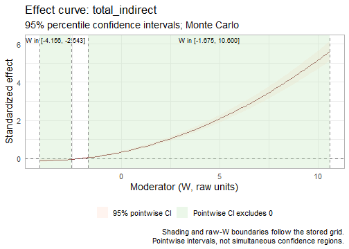

## What is standardized?

For a two-condition design, define $D M=M_2-M_1$ and $D Y=Y_2-Y_1$.
`PrepareData()` centers the mediator average component, but does not center
these differences. Standardization divides a difference by its marginal
model-implied SD, preserving its mean condition effect.

Write $s_M=SD(D M)$ and $s_Y=SD(D Y)$. Without moderation,

$$
a^*=a/s_M,\qquad b^*=b s_M/s_Y,\qquad c'^*=c'/s_Y,
\qquad IE^*=ab/s_Y.
$$

The condition contrast retains its original unit. In a serial chain, the
intermediate mediator SDs cancel. Thus every complete indirect effect, its
contrast with another complete indirect effect, the total indirect effect
and the total condition effect use the outcome-difference SD.

These are **marginal** SDs implied by the fitted model, not residual SDs,
group-specific SDs or SDs conditional on a selected moderator value. The same
endpoint scales apply at every moderator value within a fit.

## Continuous moderators: two different quantities

For a centered moderator $w_c=w-\bar w$, suppose the conditional paths are
$a(w_c)=a+a_w w_c$ and $b(w_c)=b+b_w w_c$. Then

$$
IE^*(w_c)=\frac{(a+a_w w_c)(b+b_w w_c)}{s_Y},
\qquad b^*(w_c)=(b+b_w w_c)\frac{s_M}{s_Y}.
$$

The standardized interaction coefficient is instead

$$
b_w^*=b_w\frac{s_M s_W}{s_Y},\qquad
a_w^*=a_w\frac{s_W}{s_M}.
$$

`moderation_std$mod_coeff` reports interaction coefficients per SD of a
continuous moderator. Conditional tables and curves evaluate effects at
fixed numerical moderator values in the **original units**. To recover a
conditional slope from fully standardized coefficients, use
$b^*(w_c)=b^*+b_w^*(w_c/s_W)$. The scale of an interaction is the product of
its component scale factors, not the SD of the observed product column.

## Fit a reproducible example

The following simulated data have a moderator with a nonzero mean and an SD
different from one. The mediator averages and differences are generated
separately to make the two-condition structure explicit.


``` r
set.seed(918)
n <- 350
w <- rnorm(n, 3, 2)
avg1 <- rnorm(n)
avg2 <- rnorm(n)
dm1 <- 2 + 0.8 * w + rnorm(n)
dm2 <- 1 + 0.4 * w + 0.3 * dm1 + rnorm(n)
dy <- 0.5 + 0.6 * w + 0.5 * dm1 + 0.7 * dm2 +
      0.2 * dm1 * w + 0.3 * avg1 + rnorm(n)
y1 <- rnorm(n)
dat <- data.frame(M11 = avg1 - dm1/2, M12 = avg1 + dm1/2,
                  M21 = avg2 - dm2/2, M22 = avg2 + dm2/2,
                  Y1 = y1, Y2 = y1 + dy, W = w)
```


``` r
result <- wsMed(
  data = dat, M_C1 = c("M11", "M21"), M_C2 = c("M12", "M22"),
  Y_C1 = "Y1", Y_C2 = "Y2", form = "P",
  W = "W", W_type = "continuous", MP = c("b1", "d1"),
  Na = "DE", ci_method = "mc", R = 2000, seed = 2026,
  fixed.x = FALSE, standardized = TRUE, verbose = FALSE
)
head(result$moderation_std$beta_coef)
#>                Path Mediators Level W_value  Estimate         SE 2.5.%CI.Lo 97.5.%CI.Up Sig
#> 1 indirect_effect_1         1 -1 SD   1.264 0.3659377 0.03230506  0.3050204   0.4302605   *
#> 2 indirect_effect_1         1  0 SD   3.233 0.8565050 0.05060222  0.7604226   0.9587515   *
#> 3 indirect_effect_1         1 +1 SD   5.202 1.5525336 0.07945743  1.4019444   1.7112131   *
#> 4 indirect_effect_2         2 -1 SD   1.264 0.2814658 0.02391658  0.2382061   0.3301252   *
#> 5 indirect_effect_2         2  0 SD   3.233 0.4522848 0.03551574  0.3877237   0.5277429   *
#> 6 indirect_effect_2         2 +1 SD   5.202 0.6231038 0.04872421  0.5335590   0.7248074   *
result$moderation_std$conditional_overall
#>           Effect Level W_value  Estimate         SE 2.5.%CI.Lo 97.5.%CI.Up Sig
#> 1 total_indirect -1 SD   1.264 0.6474035 0.04403820  0.5686612   0.7361678   *
#> 3 total_indirect  0 SD   3.233 1.3087898 0.06938467  1.1812746   1.4488353   *
#> 5 total_indirect +1 SD   5.202 2.1756374 0.10450931  1.9806249   2.3869356   *
#> 2   total_effect -1 SD   1.264 0.8359648 0.04061028  0.7614711   0.9227852   *
#> 4   total_effect  0 SD   3.233 1.6487966 0.06495734  1.5313773   1.7897487   *
#> 6   total_effect +1 SD   5.202 2.6670898 0.09830545  2.4921740   2.8805311   *
result$moderation_std$mod_coeff
#>     Path BaseCoef W_dummy     Estimate         SE   2.5%CI.Lo 97.5%CI.Up Sig
#> 1 bw1_W1       b1       W  0.120939967 0.00767366  0.10589394 0.13604213   *
#> 2 dw1_W1       d1       W -0.001567994 0.00778167 -0.01762458 0.01290788    
#> 3 cpw_W1       cp       W  0.151229035 0.02707509  0.09963155 0.20281562   *
#> 4 aw1_W1       a1       W  0.847008355 0.01539922  0.81451474 0.87424607   *
#> 5 aw2_W1       a2       W  0.811031030 0.01854189  0.77050108 0.84491935   *
```

`MP` requests interactions and focal paths. Moderator main effects already
included in the fitted regressions also enter conditional intercepts, even
when `a1` or `cp` is absent from `MP`. The total indirect effect includes both
mediator paths in this example, not just the path with a requested interaction.

The original `result$moderation` remains available. Without a moderator,
`standardized = TRUE` supplies parameter tables such as `result$mc$std_mc`,
but there is no conditional moderation table.


``` r
plot_moderation_curve(result, "total_indirect", standardized = TRUE)
```



The horizontal axis retains raw moderator units. Shading marks stored grid
values whose pointwise confidence interval excludes zero; boundary labels
report raw W values. These are grid approximations, not exact analytical
Johnson--Neyman boundaries or simultaneous confidence regions.

### A check of the point estimates

For this complete-data MC fit, the standardized overall effects must equal
the raw effects divided by the fitted marginal outcome SD:


``` r
sy <- sqrt(lavaan::fitted(result$mc$fit)$cov["Ydiff", "Ydiff"])
stopifnot(isTRUE(all.equal(
  result$moderation_std$conditional_overall$Estimate,
  result$moderation$conditional_overall$Estimate / sy,
  tolerance = 1e-7
)))
stopifnot(identical(result$moderation_std$theta_curve$W_raw,
                    result$moderation$theta_curve$W_raw))
```

This identity concerns point estimates. It does **not** justify dividing raw
confidence limits by the fitted SD.

## Categorical moderators

Categorical moderators retain their 0/1 dummy coding. There is no SD-of-dummy
multiplier, and all groups share the same marginal endpoint scales.
The factor levels below make the reference category explicit.


``` r
dat$Group <- cut(dat$W, c(-Inf, 2, 4, Inf), labels = c("A", "B", "C"))
levels(dat$Group)
#> [1] "A" "B" "C"
group_result <- wsMed(
  data = dat, M_C1 = c("M11", "M21"), M_C2 = c("M12", "M22"),
  Y_C1 = "Y1", Y_C2 = "Y2", form = "P",
  W = "Group", W_type = "categorical", MP = c("b1", "d1"),
  Na = "DE", ci_method = "mc", R = 2000, seed = 2026,
  fixed.x = FALSE, standardized = TRUE, verbose = FALSE
)
group_result$moderation_std$conditional_IE
#>           IE Group  Estimate         SE 2.5%CI.Lo 97.5%CI.Up Sig
#> 1 indirect_1     A 0.4317985 0.03949438 0.3609500  0.5155264   *
#> 2 indirect_1     B 0.9030258 0.10580085 0.7002119  1.1168575   *
#> 3 indirect_1     C 2.9031442 0.15930952 2.6070075  3.2351171   *
#> 4 indirect_2     A 0.4146559 0.03831356 0.3477088  0.4974758   *
#> 5 indirect_2     B 0.6610705 0.04894680 0.5725422  0.7642088   *
#> 6 indirect_2     C 0.9882944 0.06686062 0.8638378  1.1245713   *
group_result$moderation_std$IE_contrasts
#>           IE Contrast  Estimate         SE 2.5%CI.Lo 97.5%CI.Up Sig
#> 1 indirect_1    B - A 0.4712273 0.09552160 0.2848670  0.6589287   *
#> 2 indirect_1    C - A 2.4713457 0.14104375 2.2040159  2.7584021   *
#> 3 indirect_1    C - B 2.0001185 0.16125826 1.6990363  2.3274478   *
#> 4 indirect_2    B - A 0.2464146 0.03401355 0.1805038  0.3130077   *
#> 5 indirect_2    C - A 0.5736385 0.04630917 0.4836041  0.6680084   *
#> 6 indirect_2    C - B 0.3272238 0.03533971 0.2618490  0.4011361   *
group_result$moderation_std$conditional_overall
#>           Effect Group  Estimate         SE 2.5%CI.Lo 97.5%CI.Up Sig
#> 1 total_indirect     A 0.8464544 0.06061017 0.7347466  0.9787931   *
#> 3 total_indirect     B 1.5640963 0.12137367 1.3393435  1.8137175   *
#> 5 total_indirect     C 3.8914386 0.18295879 3.5709714  4.2775923   *
#> 2   total_effect     A 0.8262732 0.05725262 0.7252731  0.9507193   *
#> 4   total_effect     B 1.6669270 0.07365657 1.5298071  1.8200928   *
#> 6   total_effect     C 3.0760606 0.10983884 2.8734913  3.3155557   *
```

Use these group tables for categorical moderators. The continuous-moderator
curve example above should not be interpreted as interpolating between groups.


## Convert a fitted result without refitting

`standardize_moderation()` uses the joint MC or bootstrap draws stored in a
`wsMed` object with a moderator. It returns the standardized moderation list:


``` r
converted <- standardize_moderation(result)
stopifnot(isTRUE(all.equal(converted, result$moderation_std)))
result$moderation_std <- converted
attr(converted, "standardization")
#> $effect_scale
#> [1] "marginal model-implied endpoint scales; IE / SD(Ydiff)"
#> 
#> $moderator_units
#> [1] "raw; fixed numerical probes; dummy coding unchanged"
#> 
#> $mod_coeff_units
#> [1] "per SD of continuous W; per 0/1 dummy contrast"
#> 
#> $interval
#> [1] "percentile"
#> 
#> $engine
#> [1] "mc"
#> 
#> $fixed.x
#> [1] FALSE
#> 
#> $MI_reference
#> NULL
#> 
#> $diagnostics
#> $diagnostics$requested
#> [1] 2000
#> 
#> $diagnostics$valid
#> [1] 2000
#> 
#> $diagnostics$invalid
#> [1] 0
#> 
#> $diagnostics$invalid_indices
#> integer(0)
#> 
#> $diagnostics$reasons
#> < table of extent 0 >
```

A result without the required stored draws cannot be converted by this helper.

## Confidence intervals, bootstrap and both engines

Each valid joint draw supplies both regression coefficients and model-implied
SDs. Transform the effect using those draw-specific SDs, then summarize the
transformed draws. For continuous moderators, the selected raw values (for
example the reference mean and mean plus/minus one reference SD) remain fixed
across draws. If standardized coefficients are used, evaluate them at
$w_c/s_W^{(r)}$ in draw $r$, not at one fixed standardized moderator value.

Point estimates evaluate the effect at the fitted parameters, or at pooled
primitive parameters for MI. They are not averages of nonlinear draw effects.
Invalid joint draws are excluded with diagnostics; inspect the
`standardization` attribute for their counts, indices and reasons.

All **conditional** tables use percentile intervals, for both MC and
bootstrap. `boot_ci_type` controls parameter-table intervals; it does not
change conditional intervals. In standardized parameter tables, `"bc"` and
`"bca.simple"` use bias correction with zero acceleration, not a full
acceleration-adjusted BCa calculation. Standardized bootstrap p-values require
at least 1000 valid replicates; that is not a minimum for conditional intervals.

The following longer bootstrap example is not run during vignette rebuilding:


``` r
both_result <- wsMed(
  data = dat, M_C1 = c("M11", "M21"), M_C2 = c("M12", "M22"),
  Y_C1 = "Y1", Y_C2 = "Y2", form = "P",
  W = "W", W_type = "continuous", MP = c("b1", "d1"),
  Na = "DE", ci_method = "both", R = 5000, bootstrap = 2000,
  seed = 2026, iseed = 2026, boot_ci_type = "perc",
  standardized = TRUE
)
both_result$moderation_std$mc$conditional_overall
both_result$moderation_std$boot$conditional_overall
plot_moderation_curve(both_result, "total_indirect",
                      standardized = TRUE, engine = "boot")
```

For a single engine (`"mc"` or `"bootstrap"`), tables are directly inside
`moderation_std`. For `"both"`, they are nested under `$mc` and `$boot`;
the plotting `engine` argument selects between them.

## Missing data and reporting

FIML and MI use the same effect definition. With `fixed.x = FALSE`, estimated
external moments participate in the joint transformation. With
`fixed.x = TRUE`, transformations condition on fitted external moments.
MI supports MC inference and evaluates effects at pooled primitive parameters;
its probing and centering reference is the first completed dataset.
With MI and `fixed.x = TRUE`, external moments from that reference are held
fixed. This does not introduce population-relative moderator probing or a
new imputation procedure.

Report the condition difference direction, model and moderated paths,
moderator coding/reference and raw probe values, marginal SD definition,
missing-data method, `fixed.x`, inference engine, number of valid draws and
interval type. Distinguish standardized interaction coefficients per SD of W
from conditional indirect effects at particular raw W values.

For serial and sparse models, see the
[custom-model tutorial](GenerateModelCustom.html). Their complete indirect
effects follow the same endpoint scaling rule.


## More plots for reporting

Use `plot_effects()` for an effect forest, `plot_conditional_effects()` for
group or reference-level point intervals, and `plot_contrasts()` for effect
differences with their own confidence intervals. All three support
`standardized` and the MC/bootstrap `engine` selection. See
[Plotting mediation effects and contrasts](PlottingEffects.html) for executed
examples, selection of paths and labels, and export to PDF or PNG.
