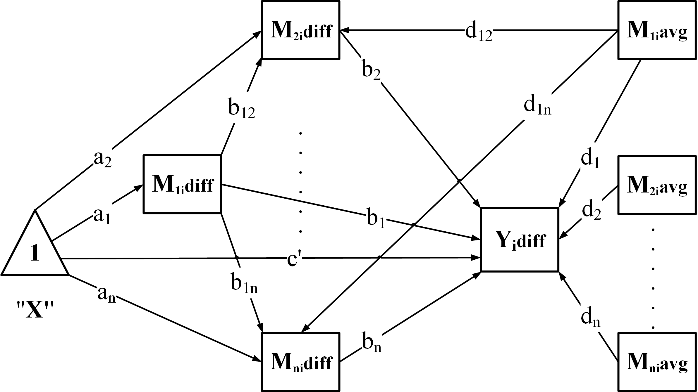
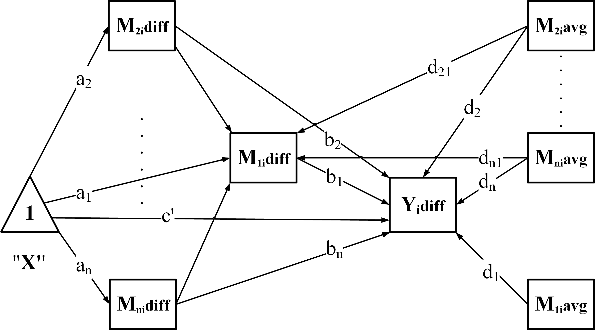

## Introduction

The `wsMed` function is designed for two condition within-subject
mediation analysis, incorporating SEM models through the `lavaan`
package and Monte Carlo simulation methods. This document provides a
detailed description of the function's parameters, workflow, and usage,
along with an example demonstration.

------------------------------------------------------------------------

## Main Function Overview

The `wsMed()` function automates the full workflow for two-condition within-subject mediation analysis.
Its main steps are:

1. **Validate inputs** – check dataset structure, mediation model type (`form`), and missing-data settings.

2. **Prepare data** – compute difference scores (`Mdiff`, `Ydiff`) and centered averages (`Mavg`)
   from the two-condition variables.

3. **Build the model** – generate SEM syntax according to the chosen structure:
   - `"P"`: Parallel mediation
    <p align="center">
    
  </p>
   - `"CN"`: Chained / serial mediation
    <p align="center">
    
  </p>
   - `"CP"`: Chained + Parallel
    <p align="center">
    
  </p>
   - `"PC"`: Parallel + Chained
   <p align="center">
    
  </p>

4. **Fit the model** – estimate parameters while handling missing data:
   - `"DE"`: listwise deletion
   - `"FIML"`: full-information ML
   - `"MI"`: multiple imputation

5. **Compute inference** – provide confidence intervals using:
   - **Bootstrap** (`ci_method = "bootstrap"`)
   - **Monte Carlo** (`ci_method = "mc"`)

6. **Optional: Standardization** – if `standardized = TRUE`, return standardized effects with CIs.

7. **Optional: Covariates** – automatically center and include:
   - **Between-subject covariates** (`C`): mean-centered and added to all regressions.
   - **Within-subject covariates** (`C_C1`, `C_C2`): difference scores and centered averages are computed and included.

------------------------------------------------------------------------

The dataset should be in wide format, where each participant has
separate columns for measurements in different conditions. Specifically,
each mediator variable (e.g., M1) should be split into two columns: one
for Condition 1 and one for Condition 2. Similarly, the outcome variable
should also have separate columns for each condition. This structure
ensures that within-subject changes can be properly analyzed.


## Calling wsMed


``` r
library(wsMed)
library(lavaan)
library(semboottools)
```

## Examples at a Glance

Below is a quick guide to what each example demonstrates so you can jump
to the one you need.

-   Example 1 — Quick Start.

-   Example 2 — Using Bootstrap Confidence Intervals

-   Example 3 — Requesting Standardized Effects.

-   Example 4 — Handling Missing Data

-   Example 5 — Moderated mediation with a continuous moderator.

-   Example 6 — Moderated mediation with a categorical moderator.

-   Example 7 — Covariates (within-subject & between-subject).

## Example

### Dataset
The dataset should be in wide format, where each participant has
separate columns for measurements in different conditions. Specifically,
each mediator variable (e.g., M1) should be split into two columns: one
for Condition 1 and one for Condition 2. Similarly, the outcome variable
should also have separate columns for each condition. This structure
ensures that within-subject changes can be properly analyzed.

For example, the first rows of `example_data` look like this:


``` r
data("example_data", package = "wsMed")
head(example_data)
```

```
## # A tibble: 6 × 14
##      A1    A2     A3     B1    B2    B3    C1    C2    C3    D1    D2     D3 Group W_Group
##   <dbl> <dbl>  <dbl>  <dbl> <dbl> <dbl> <dbl> <dbl> <dbl> <dbl> <dbl>  <dbl> <fct> <fct>  
## 1 0.520 0.348 0.0518 0.0935 0.254 0.502 0     0.240 0     0.702 0.485 0.314  low   low    
## 2 0.329 0.121 0.291  0.259  0.328 0.152 0.116 0     0.118 0     0.392 0.0133 high  high   
## 3 0.208 0.168 0.156  0.295  0.342 0.490 0.237 0.214 0.137 0.336 0.706 0.521  med   med    
## 4 0.565 0.175 0.401  0.622  0.450 0.536 0.285 0.395 0.143 0.532 0.437 0.290  med   med    
## 5 0.514 0.767 0.598  0.653  0.448 0.525 0.284 0.464 0.161 0.456 0.351 0.217  med   med    
## 6 0.763 0.567 0.803  0.766  0.716 0.554 0.260 0.313 0.177 0.813 0.666 1      med   med
```

**How to interpret these columns:**

-   A1 / A2 – the same mediator **A**, measured under **Condition 1** and
    **Condition 2**.\
-   B1 / B2 – the same mediator **B**, measured under **Condition 1**
    and **Condition 2**.\
-   C1 / C2 – the outcome variable measured under each condition.


### Example 1 -- Quick Start


``` r
result1 <- wsMed(
  data = example_data,         # Input dataset with scores from both conditions
  M_C1  = c("A1", "B1"),       # Mediators measured under Condition 1
  M_C2  = c("A2", "B2"),       # Same mediators measured under Condition 2
  Y_C1  = "C1",                # Outcome under Condition 1
  Y_C2  = "C2",                # Outcome under Condition 2
  form  = "P"                  # Model type: "P" | "CN" | "CP" | "PC"
)

print(result1)
```

#### Key Arguments in Example 1
- **`data`** – a data frame containing raw scores; variables must be named consistently with suffix `1` / `2` for the two conditions.
- **`M_C1`, `M_C2`** – character vectors with the mediator names for each condition.
- **`Y_C1`, `Y_C2`** – outcome variable names for each condition.
- **`form`** – specifies the mediation model:
  - `"P"` – parallel mediation
  - `"CN"` – chained / serial mediation (e.g., A → B → Y)
  - `"CP"` – combined parallel + serial model
  - `"PC"` – parallel-to-serial model (alternative structure)

**Additional options often used with Example 1:**
- `alpha` – set the significance level for Monte Carlo confidence intervals (default = 0.05).
- `print(..., digits = k)` – control number of decimals printed in the summary.
- `R` – number of Monte Carlo draws (default = 20000L).

By default, `wsMed()` uses **Monte Carlo confidence intervals** if `ci_method` is not specified.

You can adjust the settings as follows:


``` r
result1 <- wsMed(
  data = example_data,
  M_C1 = c("A1", "B1"),
  M_C2 = c("A2", "B2"),
  Y_C1 = "C1",
  Y_C2 = "C2",
  form = "P",
  alpha = 0.01,  # 99% confidence intervals
  R = 5000       # reduce MC draws for faster runtime in demos
)

# Control printed precision
print(result1, digits = 4) # Use 'digits' to control decimal places
```


### Example 2 -- Using Bootstrap Confidence Intervals

In this example we demonstrate how to switch from Monte Carlo to **bootstrap confidence intervals**, and how to control the number of replicates and the random seed.


``` r
result2 <- wsMed(
  data = example_data,        # Input dataset with scores from both conditions
  M_C1  = c("A1", "B1"),      # Mediators measured under Condition 1
  M_C2  = c("A2", "B2"),      # Same mediators measured under Condition 2
  Y_C1  = "C1",               # Outcome under Condition 1
  Y_C2  = "C2",               # Outcome under Condition 2
  form = "P",                 # Parallel mediation, also can use "CN","CP","PC"

  # additional argument for bootstrap

  ci_method = "bootstrap",    # Use bootstrap CI instead of Monte Carlo CI
  boot_ci_type = "perc",      # CI type: "perc" | "bc" | "bca.simple"
  bootstrap = 2000,           # Number of bootstrap replicates
  iseed = 123                 # Seed for reproducibility
)

print(result2)
```


#### Key Arguments in This Example
- **`ci_method`** – choose the CI engine (`"bootstrap"` or `"mc"`).
- **`boot_ci_type`** –`"perc"`is percentile CI and `"bc"`is bias-corrected percentile CI.
- **`bootstrap`** – number of bootstrap samples to draw (default = 2000).
- **`iseed`** – random seed to ensure reproducible bootstrap results.


You can combine these with other arguments, such as `alpha` in wsMed() to set a different confidence level, or `digits` in print() to control the number of decimal places.


### Example 3 -- Requesting Standardized Effects

You can ask `wsMed()` to compute **standardized path coefficients and effects**
by setting `standardized = TRUE`.


``` r
result3 <- wsMed(
  data = example_data,
  M_C1 = c("A1","B1","C1"),  # Three mediators measured under Condition 1
  M_C2 = c("A2","B2","C2"),  # Same mediators measured under Condition 2
  Y_C1 = "D1",               # Outcome variable in Condition 1
  Y_C2 = "D2",               # Outcome variable in Condition 2
  form = "CN",               # "CN" = Chained / Serial mediation
  standardized = TRUE,       # Request standardized path coefficients and effects
  alpha = 0.05            # Use 95% CI for standardized effects, also can use`0.01` for 99% CI
)

# Print summary with more decimals for clarity
print(result3)
```

#### Key Arguments in This Example
- **`standardized`** – returns standardized estimates, enabling effect size comparison.
- **`alpha`** – sets the confidence level for both unstandardized and standardized effects (default = 0.05)


### Example 4 -- Handling Missing Data

`wsMed()` supports three strategies via the `Na` argument:

- `"DE"` — **listwise deletion** (default if `Na` is omitted).
- `"MI"` — **multiple imputation** (via the *mice* package).
- `"FIML"` — **full information maximum likelihood** (via *lavaan*).

**Note:** When `Na = "MI"`, only monte carlo CIs are available,  bootstrap CIs are **not** available.

Generate a dataset with missing data:


``` r
library(knitr)
data(example_data)
set.seed(123)
example_dataN <- mice::ampute(
  data = example_data,
  prop = 0.1,
)$amp
```

```
## Warning: Data is made numeric because the calculation of weights requires numeric data
```


``` r
# (A) Multiple Imputation (MI) + Monte Carlo CI
result4_mi <- wsMed(
  data = example_dataN,        # dataset with missing values (wide format)
  M_C1 = c("A1","B1"),        # mediators under Condition 1
  M_C2 = c("A2","B2"),        # mediators under Condition 2
  Y_C1 = "C1",                # outcome under Condition 1
  Y_C2 = "C2",                # outcome under Condition 2
  form = "P",                 # parallel mediation
  Na   = "MI",                # handle missing data via Multiple Imputation
  standardized = TRUE         # Request standardized path coefficients and effects
)
print(result4_mi)
```


``` r
# (B) Full Information Maximum Likelihood (FIML) + Bootstrap CI

result4_fiml <- wsMed(
  data = example_data,        # dataset with missing values (wide format)
  M_C1 = c("A1","B1"),        # mediators under Condition 1
  M_C2 = c("A2","B2"),        # mediators under Condition 2
  Y_C1 = "C1",
  Y_C2 = "C2",
  form = "CN",                # chained/serial mediation (A -> B -> Y)

  # additional argument for FIML and bootstrap
  Na   = "FIML",              # full information maximum likelihood
  ci_method = "bootstrap",    # use Bootstrap CIs with FIML
  bootstrap = 2000,            # number of resamples (small for demo; typical 2000)
  boot_ci_type = "perc",      # CI type: "perc" or "bc"
  iseed = 123                 # seed for bootstrap reproducibility
)

print(result4_fiml)
```


### Example 5 -- Moderated mediation with a continuous moderator `W`

Continuous moderator W + serial-parallel mediation + missing data

``` r
result5 <- wsMed(
  data = example_dataN,
  M_C1 = c("A1","B1","C1"),# A1/B1/C1 is A/B/C mediator variable in condition 1
  M_C2 = c("A2","B2","C2"),# A2/B2/C2 is A/B/C mediator variable in condition 2
  Y_C1 = "D1",# D1 is outcome variable in condition 1
  Y_C2 = "D2",# D2 is outcome variable in condition 2
  form = "CP",# chained + parallel mediation, M1 is chained mediator by default
  W      = "D3",# name of the moderator variable (here "D3")
  W_type = "continuous", # type of the moderator ("continuous" or "categorical")
  MP     = c("a1","b2","d1","cp","b_1_2","d_1_2"),
  #   MP: which regression paths are moderated by W.
  #   a1   : X -> M1
  #   b2   : M2 -> Y
  #   d1   : M1avg -> Y
  #   cp   : X -> Y
  #   b_1_2: M1 -> M2
  #   d_1_2: M1avg -> M2avg
)
print(result5)

# Conditional indirect effect through X -> M1 -> M2 -> Y (indices 1_2)
plot_moderation_curve(result5, "indirect_effect_1_2")
# Conditional path coefficient labeled b_1_2 (M1 -> M2)
plot_moderation_curve(result5, "b_1_2")
# Conditional total effect
plot_moderation_curve(result5, "total_effect")
```

#### Key Arguments in This Example

- **`W`** – name of the moderator variable (must be a column in `data`).
- **`W_type`** – type of the moderator:
  - `"continuous"` – moderator is numeric; `wsMed()` will estimate conditional effects across the range of `W`.
  - `"categorical"` – moderator is a factor/character; model estimates effects for each level or group.
- **`MP`** – character vector specifying **which regression paths are moderated by `W`**.
  - `"a1"` – first-stage path (X → M1diff)
  - `"b2"` – second-stage path (M2diff → Y)
  - `"d1"` – cross path (M1avg → Y)
  - `"cp"` – direct effect (X → Y)
  - `"b_1_2"` – chain path (M1 → M2)
  - `"d_1_2"` – cross/average path (M1avg → M2avg)

> **Tip:**
> After fitting the model, use `plot_moderation_curve()` to visualize conditional effects or path coefficients as a function of `W`.
> Typical targets include `"indirect_1_2"`, `"b_1_2"`, and `"total_effect"` as shown above.


Or, you can use **bootstrap confidence intervals**, switch to a **parallel mediation** model,
and choose a different set of moderated paths:


``` r
result5 <- wsMed(
  data = example_dataN,
  M_C1 = c("A1","B1","C1"),# A1/B1/C1 is A/B/C mediator variable in condition 1
  M_C2 = c("A2","B2","C2"),# A2/B2/C2 is A/B/C mediator variable in condition 2
  Y_C1 = "D1",# D1 is outcome variable in condition 1
  Y_C2 = "D2",# D2 is outcome variable in condition 2
  form = "P",# parallel mediation
  W      = "D3", # name of the moderator variable (here "D3")
  W_type = "continuous", # type of the moderator ("continuous" or "categorical")
  bootstrap = 2000, # Use bootstrap
  MP     = c("a1","b1","d1","cp"),
  #   MP: which regression paths are moderated by W.
  #   a1   : X -> M1diff
  #   b1   : M1diff -> Y
  #   d1   : M1avg -> Y
  #   cp   : X -> Y
)
# Conditional indirect effect through X -> M1 -> M2 -> Y (indices 1_2)
plot_moderation_curve(result5, "indirect_effect_1")
# Conditional path coefficient labeled b_1_2 (M1 -> M2)
plot_moderation_curve(result5, "b1")
# Conditional total effect
plot_moderation_curve(result5, "total_effect")
```


### Example 6 -- Moderated mediation with a categorical moderator `W`

Generate a categorical moderator `Group`

``` r
example_data2 <- example_data
set.seed(123)
example_data2$Group <- factor(
  sample(c("G1", "G2", "G3"),
         nrow(example_data2),
         replace = TRUE)
) # generate dataset with categorical W
```

This example demonstrates **moderated mediation** with a **categorical** moderator `W`.

``` r
result6 <- wsMed(
  data   = example_data2,           # dataset (wide format)
  M_C1   = c("A1","B1","C1"),       # mediators under Condition 1 (A/B/C)
  M_C2   = c("A2","B2","C2"),       # same mediators under Condition 2
  Y_C1   = "D1",                    # outcome under Condition 1
  Y_C2   = "D2",                    # outcome under Condition 2
  W      = "Group",                 # categorical moderator (factor/character)
  W_type = "categorical",           # declare moderator type
  MP     = c("a1","b1","d1","cp","b_1_2","b_2_3"),
  # MP: which regression paths are moderated by W.
  #   a1   : X -> M1diff
  #   b1   : M1diff -> Y
  #   d1   : M1avg -> Y
  #   cp   : X -> Y
  #   b_1_2: M1diff -> M2diff
  #   b_2_3: M2diff -> M3diff
  form   = "CN"                     # chained/serial mediation
)

print(result6)
```

#### Key Arguments in This Example

- **`data`** — the dataset in **wide format**, with each participant as a row and condition-specific variables as separate columns.

- **`M_C1`, `M_C2`** — character vectors naming the mediators under Condition 1 and Condition 2.
  In this example we specify three mediators (A, B, C), so the serial chain is A → B → C → Y.

- **`Y_C1`, `Y_C2`** — outcome variable names under Condition 1 and Condition 2.

- **`W`** — the moderator variable; here `"Group"` is a categorical variable with multiple levels.

- **`W_type = "categorical"`** — instructs `wsMed()` to estimate group-specific conditional effects and to compute pairwise contrasts relative to the reference level of `W`.

- **`MP`** — character vector specifying **which regression paths are moderated** by `W`.
  - `a1` – first-stage path (X → M1diff)
  - `b1` – mediator 1 path to Y (M1diff → Y)
  - `d1` – cross/average path (M1avg → Y)
  - `cp` – direct effect (X → Y)
  - `b_1_2` – chained path from M1 to M2
  - `b_2_3` – chained path from M2 to M3

- **`form = "CN"`** — selects the chained/serial mediation model structure.
  Mediators are linked sequentially, so indirect effects include single-step and multi-step paths.


### Example 7 -- Covariates

In this example,three covariates are included:

-   `D3` is specified as a **between-subject covariate**, representing a
    stable individual difference (e.g., trait-level variable). It is
    mean-centered and entered as a predictor in all regression models.

-   `D1` and `D2` form a **within-subject covariate pair**, assumed to
    be measured under Condition 1 and Condition 2, respectively. The
    function automatically computes:

    -   `Cw1diff = D2 - D1` (difference score)
    -   `Cw1avg = mean-centered average of D1 and D2`

These covariates are included as predictors of both the mediators and
the outcome in the SEM model.


``` r
result7 <- wsMed(
  data = example_data, #dataset
  M_C1 = c("A1","B1"), # A1/B1 is A/B mediator variable in condition 1
  M_C2 = c("A2","B2"), # A2/B2 is A/B mediator variable in condition 2
  Y_C1 = "C1", # C1 is outcome variable in condition 1
  Y_C2 = "C2", # C2 is outcome variable in condition 2
  form = "P", # Parallel mediation
  C_C1 = "D1", # within-subject covariate (e.g., measured under D1)
  C_C2 = "D2", # within-subject covariate (e.g., measured under C2)
  C = "D3" # between-subject covariates
)

print(result7)
```

#### Key Arguments in This Example

- **`C_C1`, `C_C2`** — character vectors naming **within-subject covariates**
  measured under Condition 1 and Condition 2.
  `wsMed()` automatically computes:
  - **`Cw1diff`** — difference score (C_C2 − C_C1)
  - **`Cw1avg`** — mean-centered average of the two conditions

  These transformed covariates are included as predictors for all mediators and the outcome.

- **`C`** — character vector naming **between-subject covariates**
  (e.g., stable traits). They are automatically mean-centered
  and entered into all regression equations.

- **`form`** — model structure (`"P"` here, but can be `"CN"`, `"CP"`, `"PC"`).


Only including within-subject covariate D1 and D2


``` r
result7 <- wsMed(
  data = example_data, #dataset
  M_C1 = c("A1","B1"), # A1/B1 is A/B mediator variable in condition 1
  M_C2 = c("A2","B2"), # A2/B2 is A/B mediator variable in condition 2
  Y_C1 = "C1", # C1 is outcome variable in condition 1
  Y_C2 = "C2", # C2 is outcome variable in condition 2
  form = "P", # Parallel mediation
  C_C1 = "D1", # within-subject covariate (e.g., measured under D1)
  C_C2 = "D2", # within-subject covariate (e.g., measured under C2)
)

print(result7)
```

Only including between-subject covariate D3


``` r
result7 <- wsMed(
  data = example_data, #dataset
  M_C1 = c("A1","B1"), # A1/B1 is A/B mediator variable in condition 1
  M_C2 = c("A2","B2"), # A2/B2 is A/B mediator variable in condition 2
  Y_C1 = "C1", # C1 is outcome variable in condition 1
  Y_C2 = "C2", # C2 is outcome variable in condition 2
  form = "P", # Parallel mediation
  C = "D3" # between-subject covariates
)

print(result7)
```


## Understanding the Output

The printed output from `wsMed()` is divided into several sections.
Below we briefly explain what each section contains and how to read it.

### 1. Multiple Mediation (No Moderator)

We use Example 4 (parallel mediation, MI + Monte Carlo CI) as a template.
Each section in the printed output serves the following purpose:


``` r
# (A) Multiple Imputation (MI) + Monte Carlo CI
result4_mi <- wsMed(
  data = example_data,        # dataset with missing values (wide format)
  M_C1 = c("A1","B1"),        # mediators under Condition 1
  M_C2 = c("A2","B2"),        # mediators under Condition 2
  Y_C1 = "C1",                # outcome under Condition 1
  Y_C2 = "C2",                # outcome under Condition 2
  form = "P",                 # parallel mediation
  Na   = "MI",                # handle missing data via Multiple Imputation
  standardized = TRUE         # Request standardized path coefficients and effects
)
print(result4_mi)
```

```
## 
## 
## *************** VARIABLES ***************
## Outcome (Y):
##    Condition 1: C1 
##    Condition 2: C2 
## Mediators (M):
##   M1:
##     Condition 1: A1
##     Condition 2: A2
##   M2:
##     Condition 1: B1
##     Condition 2: B2
## Sample size (rows kept): 100 
## 
## 
## *************** MODEL FIT ***************
## 
## 
## |Measure   |  Value|
## |:---------|------:|
## |Chi-Sq    | 11.436|
## |df        |  5.000|
## |p         |  0.043|
## |CFI       |  0.000|
## |TLI       | -1.130|
## |RMSEA     |  0.113|
## |RMSEA Low |  0.018|
## |RMSEA Up  |  0.202|
## |SRMR      |  0.076|
## 
## 
## ************* TOTAL / DIRECT / TOTAL-IND (MC) *************
## 
## 
## |Label          | Estimate|    SE| 2.5%CI.Lo| 97.5%CI.Up|
## |:--------------|--------:|-----:|---------:|----------:|
## |Total effect   |    0.015| 0.016|    -0.017|      0.048|
## |Direct effect  |    0.016| 0.016|    -0.016|      0.048|
## |Total indirect |   -0.001| 0.004|    -0.010|      0.008|
## 
## Indirect effects:
## 
## 
## |Label | Estimate|    SE| 2.5%CI.Lo| 97.5%CI.Up|
## |:-----|--------:|-----:|---------:|----------:|
## |ind_1 |    0.001| 0.003|    -0.005|      0.008|
## |ind_2 |   -0.002| 0.003|    -0.009|      0.003|
## 
## Indirect-effect key:
## 
## 
## |Ind   |Path                 |
## |:-----|:--------------------|
## |ind_1 |X -> M1diff -> Ydiff |
## |ind_2 |X -> M2diff -> Ydiff |
## 
## 
## *************** MODERATION EFFECTS (d-paths, MC) ***************
## 
## 
## |Coefficient | Estimate|    SE| 2.5%CI.Lo| 97.5%CI.Up|
## |:-----------|--------:|-----:|---------:|----------:|
## |d1          |   -0.062| 0.091|    -0.242|      0.116|
## |d2          |   -0.073| 0.083|    -0.235|      0.090|
## 
## 
## *************** MODERATION KEY (d-paths) ***************
## 
## 
## |Coefficient |Path           |Moderated       |
## |:-----------|:--------------|:---------------|
## |d1          |M1avg -> Ydiff |M1diff -> Ydiff |
## |d2          |M2avg -> Ydiff |M2diff -> Ydiff |
## 
## 
## *************** CONTRAST INDIRECT EFFECTS (No Moderator) ***************
## 
## 
## |Contrast                  | Estimate|    SE| 2.5%CI.Lo| 97.5%CI.Up|
## |:-------------------------|--------:|-----:|---------:|----------:|
## |indirect_2  -  indirect_1 |   -0.003| 0.004|    -0.012|      0.005|
## 
## 
## *************** C1-C2 COEFFICIENTS (No Moderator) ***************
## 
## 
## |Coeff | Estimate|    SE| 2.5%CI.Lo| 97.5%CI.Up|
## |:-----|--------:|-----:|---------:|----------:|
## |X1_b1 |   -0.067| 0.101|    -0.264|      0.131|
## |X0_b1 |   -0.004| 0.102|    -0.206|      0.194|
## |X1_b2 |   -0.150| 0.099|    -0.344|      0.044|
## |X0_b2 |   -0.077| 0.098|    -0.270|      0.116|
## 
## 
## *************** REGRESSION PATHS (MC) ***************
## 
## 
## |Path           |Label | Estimate|    SE| 2.5%CI.Lo| 97.5%CI.Up|
## |:--------------|:-----|--------:|-----:|---------:|----------:|
## |Ydiff ~ M1diff |b1    |   -0.036| 0.091|    -0.213|      0.143|
## |Ydiff ~ M1avg  |d1    |   -0.062| 0.091|    -0.242|      0.116|
## |Ydiff ~ M2diff |b2    |   -0.112| 0.090|    -0.291|      0.061|
## |Ydiff ~ M2avg  |d2    |   -0.073| 0.083|    -0.235|      0.090|
## 
## 
## *************** INTERCEPTS (MC) ***************
## 
## 
## |Intercept |Label | Estimate|    SE| 2.5%CI.Lo| 97.5%CI.Up|
## |:---------|:-----|--------:|-----:|---------:|----------:|
## |Ydiff~1   |cp    |    0.016| 0.016|    -0.016|      0.048|
## |M1diff~1  |a1    |   -0.027| 0.018|    -0.061|      0.007|
## |M2diff~1  |a2    |    0.014| 0.018|    -0.020|      0.049|
## |M1avg~1   |      |   -0.000| 0.000|    -0.000|     -0.000|
## |M2avg~1   |      |    0.000| 0.000|     0.000|      0.000|
## 
## 
## *************** VARIANCES (MC) ***************
## 
## 
## |Variance       |Label | Estimate|    SE| 2.5%CI.Lo| 97.5%CI.Up|
## |:--------------|:-----|--------:|-----:|---------:|----------:|
## |Ydiff~~Ydiff   |      |    0.026| 0.004|     0.018|      0.033|
## |M1diff~~M1diff |      |    0.031| 0.004|     0.022|      0.039|
## |M2diff~~M2diff |      |    0.032| 0.005|     0.023|      0.041|
## |M1avg~~M1avg   |      |    0.034| 0.000|     0.034|      0.034|
## |M2avg~~M2avg   |      |    0.041| 0.000|     0.041|      0.041|
## 
## 
## *************** STANDARDIZED (MC) ***************
## 
## 
## |Parameter      | Estimate|    SE|         R|   2.5%|  97.5%|
## |:--------------|--------:|-----:|---------:|------:|------:|
## |cp             |    0.098| 0.100| 20000.000| -0.097|  0.297|
## |b1             |   -0.039| 0.096| 20000.000| -0.225|  0.151|
## |d1             |   -0.070| 0.100| 20000.000| -0.265|  0.130|
## |b2             |   -0.124| 0.096| 20000.000| -0.311|  0.066|
## |d2             |   -0.091| 0.100| 20000.000| -0.281|  0.110|
## |a1             |   -0.155| 0.102| 20000.000| -0.355|  0.040|
## |a2             |    0.081| 0.101| 20000.000| -0.115|  0.280|
## |Ydiff~~Ydiff   |    0.966| 0.041| 20000.000|  0.832|  0.989|
## |M1diff~~M1diff |    1.000| 0.000| 20000.000|  1.000|  1.000|
## |M2diff~~M2diff |    1.000| 0.000| 20000.000|  1.000|  1.000|
## |M1avg~~M1avg   |    1.000| 0.000| 20000.000|  1.000|  1.000|
## |M1avg~~M2avg   |    0.290| 0.000| 20000.000|  0.290|  0.290|
## |M2avg~~M2avg   |    1.000| 0.000| 20000.000|  1.000|  1.000|
## |M1avg~1        |   -0.000| 0.000| 20000.000| -0.000| -0.000|
## |M2avg~1        |    0.000| 0.000| 20000.000|  0.000|  0.000|
## |indirect_1     |    0.006| 0.018| 20000.000| -0.029|  0.048|
## |indirect_2     |   -0.010| 0.017| 20000.000| -0.052|  0.019|
## |total_indirect |   -0.004| 0.025| 20000.000| -0.058|  0.047|
## |total_effect   |    0.094| 0.101| 20000.000| -0.101|  0.295|
```

``` r
printGM(result4_mi)           # prints and returns the model equations
```

```
## 
## Outcome Difference Model (Ydiff):
##  Ydiff ~ cp*1 + b1*M1diff + d1*M1avg + b2*M2diff + d2*M2avg 
## 
## Mediator Difference Model (Chained Mediator - M1diff):
## M1diff ~ a1*1 
## 
## Mediator Difference Model (Other Mediators):
## M2diff ~ a2*1 
## 
## Indirect Effects:
## indirect_1 := a1 * b1
## indirect_2 := a2 * b2 
## 
## Total Indirect Effect:
##  total_indirect := indirect_1 + indirect_2 
## 
## Total Effect:
##  total_effect := cp + total_indirect
```


- **VARIABLES**
  Lists all outcome variables, mediators (with Condition 1 / 2 names),
  and the final sample size used in the analysis.

- **MODEL FIT**
  Reports SEM model fit statistics from `lavaan`:
  χ², df, p-value, CFI, TLI, RMSEA (with CI), and SRMR.
  Use these to assess whether the SEM model adequately fits the data.

- **TOTAL / DIRECT / TOTAL-IND (MC)**
  Shows the total effect, direct effect (c′ path), and total indirect effect,
  with Monte Carlo or bootstrap-based SEs and confidence intervals.

- **Indirect effects**
  Breaks down the total indirect effect into individual paths
  (e.g., X → M1 → Y, X → M2 → Y), with point estimates, SEs, and CIs.

- **Indirect-effect key**
  Provides a legend mapping labels like `ind_1`, `ind_2`, `ind_1_2`
  to the actual mediator paths they represent.

- **MODERATION EFFECTS (d-paths, MC)**
  When d-paths are present (paths using mediator averages),
  lists their coefficients and CIs.
  Appears even in no-moderator models for completeness.

- **MODERATION KEY (d-paths)**
  Explains which d-path coefficients correspond to which paths in the model.

- **CONTRAST INDIRECT EFFECTS (No Moderator)**
  Displays pairwise contrasts between indirect effects
  (e.g., indirect_2 − indirect_1) with SEs and CIs.

- **C1–C2 COEFFICIENTS (No Moderator)**
  Shows regression coefficients linking Condition 1 / Condition 2 scores
  (e.g., X1_b1, X0_b1), useful for checking consistency across conditions.

- **REGRESSION PATHS (MC)**
  Lists parameter estimates for all regression paths,
  including a, b, d, and cp paths, with SEs and Monte Carlo CIs.

- **INTERCEPTS (MC)**
  Estimated intercepts for mediators and outcome equations.

- **VARIANCES (MC)**
  Residual variances for mediators and outcome variables.

- **STANDARDIZED (MC)**
  Provides standardized estimates for all parameters (if `standardized = TRUE`),
  including indirect and total effects.

### 2. Moderated Mediation

When a continuous moderator (`W`) and a set of moderated paths (`MP`) are specified,
`print.wsMed()` produces additional sections to help interpret conditional effects.


``` r
result5 <- wsMed(
  data = example_dataN,
  M_C1 = c("A1","B1","C1"),# A1/B1/C1 is A/B/C mediator variable in condition 1
  M_C2 = c("A2","B2","C2"),# A2/B2/C2 is A/B/C mediator variable in condition 2
  Y_C1 = "D1",# D1 is outcome variable in condition 1
  Y_C2 = "D2",# D2 is outcome variable in condition 2
  form = "P",# Parallel mediation
  W      = "D3", # name of the moderator variable (here "D3")
  W_type = "continuous", # type of the moderator ("continuous" or "categorical")
  bootstrap = 2000, # Use bootstrap
  MP     = c("a1","b1","d1","cp"),
  #   MP: which regression paths are moderated by W.
  #   a1   : X -> M1diff
  #   b1   : M1diff -> Y
  #   d1   : M1avg -> Y
  #   cp   : X -> Y
)

print(result5)
```

```
## 
## 
## *************** VARIABLES ***************
## Outcome (Y):
##    Condition 1: D1 
##    Condition 2: D2 
## Mediators (M):
##   M1:
##     Condition 1: A1
##     Condition 2: A2
##   M2:
##     Condition 1: B1
##     Condition 2: B2
##   M3:
##     Condition 1: C1
##     Condition 2: C2
## Moderators (W):
##    W1 : D3 
## Sample size (rows kept): 100 
## 
## 
## *************** MODEL FIT ***************
## 
## 
## |Measure   |  Value|
## |:---------|------:|
## |Chi-Sq    | 19.035|
## |df        | 18.000|
## |p         |  0.390|
## |CFI       |  0.000|
## |TLI       |  1.446|
## |RMSEA     |  0.025|
## |RMSEA Low |  0.000|
## |RMSEA Up  |  0.097|
## |SRMR      |  0.055|
## 
## 
## ************* TOTAL / DIRECT / TOTAL-IND (MC) *************
## 
## 
## |Label          | Estimate|    SE| 2.5%CI.Lo| 97.5%CI.Up|
## |:--------------|--------:|-----:|---------:|----------:|
## |Total effect   |   -0.040| 0.018|    -0.076|     -0.004|
## |Direct effect  |   -0.040| 0.018|    -0.075|     -0.004|
## |Total indirect |   -0.000| 0.005|    -0.010|      0.009|
## 
## Indirect effects:
## 
## 
## |Label | Estimate|    SE| 2.5%CI.Lo| 97.5%CI.Up|
## |:-----|--------:|-----:|---------:|----------:|
## |ind_1 |    0.001| 0.003|    -0.003|      0.008|
## |ind_2 |   -0.001| 0.003|    -0.008|      0.003|
## |ind_3 |   -0.000| 0.003|    -0.007|      0.005|
## 
## Indirect-effect key:
## 
## 
## |Ind   |Path                 |
## |:-----|:--------------------|
## |ind_1 |X -> M1diff -> Ydiff |
## |ind_2 |X -> M2diff -> Ydiff |
## |ind_3 |X -> M3diff -> Ydiff |
## 
## 
## *************** MODERATION EFFECTS (d-paths, MC) ***************
## 
## 
## |Coefficient | Estimate|    SE| 2.5%CI.Lo| 97.5%CI.Up|
## |:-----------|--------:|-----:|---------:|----------:|
## |d1          |   -0.042| 0.102|    -0.241|      0.162|
## |d2          |    0.022| 0.093|    -0.160|      0.203|
## |d3          |   -0.120| 0.109|    -0.335|      0.094|
## 
## 
## *************** MODERATION KEY (d-paths) ***************
## 
## 
## |Coefficient |Path           |Moderated       |
## |:-----------|:--------------|:---------------|
## |d1          |M1avg -> Ydiff |M1diff -> Ydiff |
## |d2          |M2avg -> Ydiff |M2diff -> Ydiff |
## |d3          |M3avg -> Ydiff |M3diff -> Ydiff |
## 
## 
## *************** MODERATION RESULTS (Continuous Moderator) ***************
## 
## --- Moderated Coefficients ---
## 
## 
## |Path   |BaseCoef |W_dummy | Estimate|    SE| 2.5%CI.Lo| 97.5%CI.Up|Sig |
## |:------|:--------|:-------|--------:|-----:|---------:|----------:|:---|
## |bw1_W1 |b1       |D3      |   -0.051| 0.448|    -0.934|      0.823|    |
## |dw1_W1 |d1       |D3      |    0.647| 0.462|    -0.248|      1.558|    |
## |cpw_W1 |cp       |D3      |   -0.044| 0.082|    -0.206|      0.117|    |
## |aw1_W1 |a1       |D3      |    0.041| 0.077|    -0.109|      0.191|    |
## 
## --- Conditional Indirect Effects ---
## 
## 
## |Path              |Mediators | Level| W_value| Estimate|    SE| 2.5.%CI.Lo| 97.5.%CI.Up|Sig |
## |:-----------------|:---------|-----:|-------:|--------:|-----:|----------:|-----------:|:---|
## |indirect_effect_1 |1         | -1 SD|   0.223|    0.002| 0.006|     -0.009|       0.015|    |
## |indirect_effect_1 |1         |  0 SD|   0.452|    0.001| 0.003|     -0.003|       0.008|    |
## |indirect_effect_1 |1         | +1 SD|   0.681|    0.001| 0.004|     -0.008|       0.012|    |
## 
## --- Indirect Effect Contrasts ---
## 
## 
## |Path              |            Contrast| Estimate|    SE| 2.5%CI.Lo| 97.5%CI.Up|Sig |
## |:-----------------|-------------------:|--------:|-----:|---------:|----------:|:---|
## |indirect_effect_1 | (0 SD)   -  (-1 SD)|    0.000| 0.004|    -0.008|      0.010|    |
## |indirect_effect_1 | (+1 SD)  -  (-1 SD)|    0.001| 0.007|    -0.014|      0.016|    |
## |indirect_effect_1 | (+1 SD)  -   (0 SD)|    0.001| 0.004|    -0.007|      0.009|    |
## 
## --- Moderated Path Coefficients ---
## 
## 
## |Path | Level| W_value| Estimate|    SE| 2.5.%CI.Lo| 97.5.%CI.Up|Sig |
## |:----|-----:|-------:|--------:|-----:|----------:|-----------:|:---|
## |a1   | -1 SD|   0.223|   -0.029| 0.025|     -0.077|       0.020|    |
## |a1   |  0 SD|   0.452|   -0.019| 0.018|     -0.054|       0.017|    |
## |a1   | +1 SD|   0.681|   -0.010| 0.026|     -0.059|       0.041|    |
## |b1   | -1 SD|   0.223|   -0.061| 0.142|     -0.339|       0.219|    |
## |b1   |  0 SD|   0.452|   -0.073| 0.099|     -0.266|       0.120|    |
## |b1   | +1 SD|   0.681|   -0.085| 0.143|     -0.363|       0.192|    |
## |d1   | -1 SD|   0.223|   -0.190| 0.155|     -0.497|       0.117|    |
## |d1   |  0 SD|   0.452|   -0.041| 0.102|     -0.241|       0.162|    |
## |d1   | +1 SD|   0.681|    0.107| 0.139|     -0.164|       0.381|    |
## |cp   | -1 SD|   0.223|   -0.031| 0.014|     -0.058|      -0.003|*   |
## |cp   |  0 SD|   0.452|   -0.040| 0.018|     -0.075|      -0.004|*   |
## |cp   | +1 SD|   0.681|   -0.049| 0.022|     -0.092|      -0.005|*   |
## 
## --- Path Coefficient Contrasts ---
## 
## 
## |Path |            Contrast| Estimate|    SE| 2.5%CI.Lo| 97.5%CI.Up|Sig |
## |:----|-------------------:|--------:|-----:|---------:|----------:|:---|
## |a1   | (0 SD)   -  (-1 SD)|   -0.010| 0.018|    -0.044|      0.025|    |
## |a1   | (+1 SD)  -  (-1 SD)|   -0.019| 0.035|    -0.087|      0.050|    |
## |a1   | (+1 SD)  -   (0 SD)|   -0.010| 0.018|    -0.044|      0.025|    |
## |b1   | (0 SD)   -  (-1 SD)|    0.012| 0.103|    -0.189|      0.214|    |
## |b1   | (+1 SD)  -  (-1 SD)|    0.023| 0.206|    -0.377|      0.428|    |
## |b1   | (+1 SD)  -   (0 SD)|    0.012| 0.103|    -0.189|      0.214|    |
## |cp   | (0 SD)   -  (-1 SD)|    0.009| 0.004|     0.001|      0.017|*   |
## |cp   | (+1 SD)  -  (-1 SD)|    0.018| 0.008|     0.002|      0.034|*   |
## |cp   | (+1 SD)  -   (0 SD)|    0.009| 0.004|     0.001|      0.017|*   |
## |d1   | (0 SD)   -  (-1 SD)|   -0.148| 0.106|    -0.357|      0.057|    |
## |d1   | (+1 SD)  -  (-1 SD)|   -0.297| 0.212|    -0.714|      0.114|    |
## |d1   | (+1 SD)  -   (0 SD)|   -0.148| 0.106|    -0.357|      0.057|    |
## 
## --- Conditional Total Effect and Total Indirect Effect ---
## 
## 
## |Effect         | Level| W_value| Estimate|    SE| 2.5.%CI.Lo| 97.5.%CI.Up|Sig |
## |:--------------|-----:|-------:|--------:|-----:|----------:|-----------:|:---|
## |total_indirect | -1 SD|   0.223|    0.002| 0.005|     -0.008|       0.015|    |
## |total_indirect |  0 SD|   0.452|    0.001| 0.003|     -0.003|       0.008|    |
## |total_indirect | +1 SD|   0.681|    0.001| 0.004|     -0.008|       0.012|    |
## |total_effect   | -1 SD|   0.223|   -0.028| 0.025|     -0.079|       0.021|    |
## |total_effect   |  0 SD|   0.452|   -0.038| 0.018|     -0.074|      -0.003|*   |
## |total_effect   | +1 SD|   0.681|   -0.049| 0.027|     -0.101|       0.003|    |
## 
## 
## *************** REGRESSION PATHS (MC) ***************
## 
## 
## |Path                  |Label  | Estimate|    SE| 2.5%CI.Lo| 97.5%CI.Up|
## |:---------------------|:------|--------:|-----:|---------:|----------:|
## |Ydiff ~ M1diff        |b1     |   -0.074| 0.099|    -0.266|      0.120|
## |Ydiff ~ M1avg         |d1     |   -0.042| 0.102|    -0.241|      0.162|
## |Ydiff ~ M2diff        |b2     |   -0.081| 0.095|    -0.267|      0.105|
## |Ydiff ~ M2avg         |d2     |    0.022| 0.093|    -0.160|      0.203|
## |Ydiff ~ M3diff        |b3     |   -0.024| 0.105|    -0.229|      0.181|
## |Ydiff ~ M3avg         |d3     |   -0.120| 0.109|    -0.335|      0.094|
## |Ydiff ~ int_M1diff_W1 |bw1_W1 |   -0.046| 0.448|    -0.934|      0.823|
## |Ydiff ~ int_M1avg_W1  |dw1_W1 |    0.643| 0.462|    -0.248|      1.558|
## |Ydiff ~ W1            |cpw_W1 |   -0.044| 0.082|    -0.206|      0.117|
## |M1diff ~ W1           |aw1_W1 |    0.042| 0.077|    -0.109|      0.191|
## |M2diff ~ W1           |       |   -0.054| 0.080|    -0.209|      0.103|
## |M3diff ~ W1           |       |   -0.055| 0.072|    -0.196|      0.088|
## 
## 
## *************** INTERCEPTS (MC) ***************
## 
## 
## |Intercept       |Label | Estimate|    SE| 2.5%CI.Lo| 97.5%CI.Up|
## |:---------------|:-----|--------:|-----:|---------:|----------:|
## |Ydiff~1         |cp    |   -0.040| 0.018|    -0.075|     -0.004|
## |M1diff~1        |a1    |   -0.019| 0.018|    -0.054|      0.017|
## |M2diff~1        |a2    |    0.016| 0.019|    -0.020|      0.052|
## |M3diff~1        |a3    |    0.019| 0.017|    -0.014|      0.052|
## |M1avg~1         |      |   -0.006| 0.019|    -0.043|      0.031|
## |M2avg~1         |      |   -0.006| 0.021|    -0.046|      0.035|
## |M3avg~1         |      |   -0.004| 0.018|    -0.040|      0.031|
## |int_M1diff_W1~1 |      |    0.002| 0.004|    -0.005|      0.010|
## |int_M1avg_W1~1  |      |    0.012| 0.004|     0.004|      0.019|
## |W1~1            |      |   -0.009| 0.024|    -0.057|      0.038|
## 
## 
## *************** VARIANCES (MC) ***************
## 
## 
## |Variance                     |Label | Estimate|    SE| 2.5%CI.Lo| 97.5%CI.Up|
## |:----------------------------|:-----|--------:|-----:|---------:|----------:|
## |Ydiff~~Ydiff                 |      |    0.027| 0.004|     0.020|      0.035|
## |M1diff~~M1diff               |      |    0.030| 0.004|     0.021|      0.039|
## |M2diff~~M2diff               |      |    0.033| 0.005|     0.024|      0.042|
## |M3diff~~M3diff               |      |    0.026| 0.004|     0.019|      0.034|
## |M1avg~~M1avg                 |      |    0.034| 0.005|     0.025|      0.044|
## |M2avg~~M2avg                 |      |    0.040| 0.006|     0.029|      0.052|
## |M3avg~~M3avg                 |      |    0.030| 0.004|     0.022|      0.039|
## |int_M1diff_W1~~int_M1diff_W1 |      |    0.002| 0.000|     0.001|      0.002|
## |int_M1avg_W1~~int_M1avg_W1   |      |    0.001| 0.000|     0.001|      0.002|
## |W1~~W1                       |      |    0.054| 0.008|     0.038|      0.069|
```

``` r
printGM(result5)
```

```
## 
## Outcome Difference Model (Ydiff):
##  Ydiff ~ cp*1 + b1*M1diff + d1*M1avg + b2*M2diff + d2*M2avg + b3*M3diff + d3*M3avg + bw1_W1*int_M1diff_W1 + dw1_W1*int_M1avg_W1 + cpw_W1*W1 
## 
## Mediator Difference Model (Chained Mediator - M1diff):
## M1diff ~ a1*1 + aw1_W1*W1 
## 
## Mediator Difference Model (Other Mediators):
## M2diff ~ a2*1 + W1
## M3diff ~ a3*1 + W1 
## 
## Indirect Effects:
## indirect_1 := a1 * b1
## indirect_2 := a2 * b2
## indirect_3 := a3 * b3 
## 
## Total Indirect Effect:
##  total_indirect := indirect_1 + indirect_2 + indirect_3 
## 
## Total Effect:
##  total_effect := cp + total_indirect
```

``` r
# Conditional indirect effect through X -> M1 -> Y (indices_1)
plot_moderation_curve(result5, "indirect_effect_1")
```

![plot of chunk unnamed-chunk-19](data:image/png;base64,iVBORw0KGgoAAAANSUhEUgAAAqAAAAKgCAMAAABz4j/3AAABQVBMVEUAAAAAADoAAGYAOjoAOmYAOpAAZpAAZrY6AAA6ADo6AGY6OgA6Ojo6OmY6ZmY6ZpA6ZrY6kJA6kLY6kNtNTU1NTW5NTY5Nbm5NbqtNjshmAABmADpmOgBmOjpmZmZmZpBmkGZmkJBmkLZmkNtmtttmtv9uTU1uTW5uTY5ubm5ubqtuq+Rzc3OLOjqOTU2OTW6OyP+QOgCQZgCQZjqQZmaQkDqQkGaQkLaQtpCQtraQ2/+rbk2r5P+2ZgC2Zjq2kDq2tpC2tra2ttu225C227a229u22/+2/7a2/9u2///Ijk3I5KvI///bkDrbkGbbkJDbtmbbtpDbtrbbttvb25Db27bb29vb2//b/7bb/9vb///kq27k///r6+vy5+L/tmb/yI7/25D/27b/29v/5Kv/9O///7b//8j//9v//+T///9rz6yUAAAACXBIWXMAAA7DAAAOwwHHb6hkAAAgAElEQVR4nO2dC3scx3FFF5RowJIlKyGskLBlJY4h2aZCk34kDikklh3bEaJNLMWSY4IECJkEwf3/PyDz3J1HT091V/VMdc+93ydhCeye6b51OPvAElhtEERxVnMvAEFsgaCI6kBQRHUgKKI6EBRRHQiKqA4ERVQHgiKqA0ER1YGgiOokJ+jJqszNx8XlW+X/elnvPnd1VF3dJVdHx5uT3o3yz/Q/azxqZ82EdRa5fOPTzeb6gZmTYtIT9Man9cXLg+Pqf71cHW1HvM69uH6w99DlKAOK2ORsH7UZ2jqrPxfby/96LCQpC3qRS3dhNG83+MuDW+UnnM6hF+Zr+wlKWmd5zdWq3N7a9YwfbRIWNL+zv/mz8u57varuQLMLmQmXB/Wkt9f/4nF2WtzfVHfT33hQXK88sdU3vljV563Sm+ya2Zn0pHp8kH/8WXUXn98+u/nwUTfVZ/Mv09a5KRZza13+cUD1BJOwoI0z07oY9q3yQj7j7YCbZ86GoJklV0f5n7Irb2+8S3m6KwTNpC2umR93vaoFLSwbPmqR7Zcp69zeqP57tZRTaHqCVk+SjhuDL/XKZluolA+9Iej+9qYNQXMNcheyT21v3DxIec7MBS2ejN18XD6ErJ8kFbe3HDXPjktZZ516HWu3x8zxJj1BDWfQi/reevtMZEzQXLv8ytl/2xtvGlfcCVrdpBRmXQuaf91y1O3qCi5lnXVqQXcPNxLPIgRd12fV/uAr16rLLUHzP+bq7U7J7Su2BS0O2xLUctQ8Oy5lndtbVdszP+lPMIsQdPsM2TD4+vrr1XFH0EyGP2RXMzy9djmDmo+6aT5tJ62zCs6gscckaPnYLrtU3KHnUvVeZsqdK2wr5CsFvTz4fvPGvYM0Be08Bi0fIgwfddP4Mm2dVfAYNPYYn8WfZP8rhr6ufDC/UJ/f9mK1FTR7wlU8BapvvEvjWfz2pJuTV01BrUdtfpm2zmq1eBYfeepn8c0zU/mAr1BsXb2+ud69vpi/2Fi+lHn9ILvWeifoxfY1yeLGxtdBa0HzA9/4ZUtQ61GbXNo6y9vUr4Mu5B4+PUGnyUVbm8mD7yQh1sz8do3lnEAhqGd8FSkeT1QPQbxvgXczIYiSQFBEdSAoojoQFFEdCIqoDgRFVAeCIqoDQRHVCSDoCllE5M0x2qQO+VRmFeAE5kBQZsAJy4GgzIATlgNBmQEnLAeCMgNOWA4EZQacsBwIygw4YTkQlBlwwnIgKDPghOVAUGbACcuBoMyAE5YDQZkBJywHgjIDTlgOBGUGnLAcCMoMOGE5EJQZcMJyICgz4ITlQFBmwAnLgaDMgBOWA0GZAScsB4IyA05YDgRlBpywHAjKDDhhORCUGXDCciAoM+CE5UBQZsAJy4GgzIATlpOaoC+oN9cyAHDsSU5QqqFaBgCOPRCUGXDCctITlGiolgGAYw8EZQacsJwEBaUZqmUA4NgDQZkBJywnRUFJhmoZADj2QFBmwAnLSVJQiqFaBgCOPRCUGXDCctIUlGColgGAYw8EZQacsJxEBR03VMsAwLEnVUFHDdUyAHDsgaDMgBOWk6ygY4ZqGQA49kBQZsAJy0lX0BFDtQwAHHsgKDPghOVELOhTU84bMV4BiSsRC2r87IsXxHOoljMEOPZAUGbACctJWlCboVoGAI49EJQZcIQ4A8NKW1CLodEOMlHO0KwgKDPgyHAWKuiwobEOMlHO4KhSF3TQ0EgHmShneFIQlBlwJDgLFnTI0DgHmSjHMigIygw4fI5tUOkLOrDxGAeZKMc6JwjKDDhcjn1OCxDUvPP4BpkqB4IarxjfIBPljNzTLUFQ49ajG2SqHAgKQTVzxp4rLEJQ095jG2SqHAgKQTVzxp4qLERQw+YjG2SinLEHYosRtL/7uAaZKgeCDm4/rkEmyhl7HLZZkKDd/Uc1yFQ5EBSCauaMPAorshxBOwXENMhEOSMPwsosSNB2AxENMlUOBIWgmjn2e7g6SxK0VUE8g0yUYz9/bANBmQHHjzNyB7fNogRtdhDLIBPljJw+doGgzIDjxYGgY4ZGMshEOSNnj0YgKDPgeHDG7t4aWZiguxaiGGSqHAgKQTVzxu7dmlmaoNsaYhhkopyxc0crEJQZcJw5EJRiaASDTJQzdupoZ3mCVkXoH2SqHAhKMlT/IBPljJw4ulmioEUV6geZKGfkvNELBGUGHDcOBCUaqn2QiXJGThv9LFPQF+oHmShn5KxhCARlBhwHzshMTFmooC90DzJRzthJw5SlCvpC8yBT5UBQCKqZMzIR8+0XK+i50DIUC6GMMzYR8+2XK6j1t8nTo1cIbRwImsdBUBlD9QqhjDM6EfPtlyyoiKFqhVDGGZ+I+fYQlBmtQmjjQNAyToJKGKpVCGUcwkTMt1+2oAKGKhVCGYcyEfPtISgzOoVQxiFNxHz7hQvKN1SlEMo4tImYbw9BmdEohDYOBN3FVVC2oRqFUMYhTsR8+8ULyjVUoRDaOBC0EXdBmYYqFEIZhzoR8+0hKNNQfUIo45AnYr49BIWgYTkQtBUfQVmGqhNCGed8cAIQlCwox1BtQijjvICg7UBQVZwXELQTP0EZhuoSQhmn1zME9RTU31BVQmjjQNBeIKgijqFnCOopqLehmoRQxjH2DEE9BfU1VJEQyjgDPUNQCKqCM9QzBPUU1NNQNUJo40BQ42chqBLOcM8Q1FNQP0O1CKGMY+s5ZkFPDw9vP2lffnnv8PDdzzab5x8cNr4YQlAvQ5UIoYxj7zleQc9uP3n16E7r8st72Z9PMzGfNeQcRrIE9TFUhxDKOGM9xyroy3v3N5tn+elyd/nZdz7Ozp4ffrw5u0NB8gT1MFSFENo4qQqae1ia2b5c/OH0LgUJQRVwxnuOVNDi5FlJ2byc38W/vPfj8rHoFvnUlHNmjFDELZLVaxT0bvfyWXY3//yD7OLznwR9kuRzDtVwxlLGIfWc0hn07PB+dYX6jDqMZAvqaqgCIZRxiD3HKKj5Mehp/jSpzBSCOho6vxDKOOSeIxTU9Cx+c1b+uTyj/nTrKgTVyaH3HKGg+ZOh7eug1eXiTJrl1aNc2LAv1PsYOrcQyjguPUcoaP7dozu5jHe3l88Oi9wvvqPUfK0+nKBOhiYilhDHrecIBWUjRQR1MTQNsYQ4rj1DUE9BHQxNQiwhjnvPENRTULqhKYglxPHpGYJ6Cko2NAGxhDh+PUNQCDoRB4JSkGKCUg2NXywhjm/PI4VDULe+eoleLCGOd88jhUNQx8K6iV0sIQ6jZ3vfENS1sU4iF0uKw+nZWjcEda6sncjFEuLwera1DUHdO2slbrGEONyeLWVDUI/SmolaLCEOv+fhriGoT2uNxCyWEEei58GqIahXbbtELJYQR6ZnCOpb3Mgy4hVLiCPVMwT1LG5kGdGKJcQR6xmCyhZXJ1axhDjBe4agvs1ViVQsIY5kz+YjQFDv6srEKZYQR7Rn8yEgqHd1ZaIUS4gj27P5GBDUv7siMYolxBHu2XwQCMooL0+EYklxhHs2HwSCctrbRCmWEEe6Z/NRICirvhjFEuKI92w+DARl1RehWEIc+Z7Nx4GgvP6iE0uIE6Bn84EgKLPAyMQS4tBbg6DtBCjO3mBcYslwXEqDoO0EKM5eYUxiCXGcOoOg7QQozt5hRGIJcdwqg6DtBCjOXmI8YglxHBuDoO0EKM7eYjRiCXFcC4Og7QQozl5jLGIJcZz7gqDtBCjO3mMkYglx3OuCoO0EKM5eZBxiCXE82oKg7QQozt5kFGIJcXzKgqDtBCjO3mQMYglxvMqCoO0EKM5eZQRiyXA8u4Kg7QQozt6lerGEOL5VQdB2AhRnL1O7WEIc76YgaDsBirO3qVwsIY5/URC0nQDF2evULZYQh9ETBG0nQHH2PlWLJcTh1ARB2wlQnL1QzWIJcVgtQdB2AhRnb1SxWDIcZkkQtJ0AxdkrVSuWEIfbEQRtJ0Bx9k61iiXEYVcEQdsJUJy9VKViCXH4DUHQdgIUZ29Vp1hCHIGCIGg7AYqzR6VYQhyJfiBoOwGKG+EIbUefoEL9kK9pXgcEZeac/Iu77VEnqFg/1JjXAUGZOaf/anlrtAkq2A8x5nVAUGbOB6t1iy5BZfuhxbwSCMrM+XC3TlElqHQ/pJiXAkGZObeU6xJFggbohxLzYiAoMzWHux09gobpZzzm1UBQZrYc5nbUCBqqn9GYlwNBmdlxeNtRImjAfsZiXhAEZabBYW1Hh6BB+xmJeUUQlJkmh7MdFYIG7sce85IgKDMtDmM7CgQN34815kVBUGbaHP/tzC7oJP3YYl4WBGWmw/HezsyCTtWPJeaFQVBmuhzf7cwr6HT9DMe8MgjKTI/juZ1ZBZ2yn8GYlwZBmTFwvLYzp6AT9zMQ89ogKDNGjsd25hN0hn6MMa8OgjIzwHHezlyCztSPIeb1QVBmhjiu25lH0Pn66ce8QgjKzCDHcTtzCDprP72Y1whBmRnmuG1nekHn7qcb8yohKDMWjtN2phZUQT+dmNcZsaBPTTnXFOMKdWTuagwxLzRiQY2fDfA3m8Ohb2fSMyh7X/Qs+Axq/GyA4lgc8nYmFFRiX+RA0HYCFMfjULczmaBC+6IGgrYToDguh7adiQQV3Jc0x7xgCMoMhUPZziSCCu9LlmNeMgRlhsYZ384UgsrvS5JjXjMEZYbIGd1OeEGD7EuQY141BGWGzBnZTmhBg+1LjGNeNwRlxoFj3U5YQYPuS4hj3g8EZcaJY9lOvL/nXYpj3g8EZcaNM7ydcIJOsS8Jjnk/EJQZR87gduL9JbBSHPN+ICgzzpyB7cT7S2ClOOb9QFBmPDjGhcf7OzalOOb9QFBm/Dj9hcf7G+KkOC5jFg8E7aa78Hh/AZcUx2XM4oGg/bQXLijozPvy5biMWTwQ1JzdwuP99TFSHJcxiweCDqVeuISgEuupA0HDIAMUF5hTLZwrqNh6ZuO4jFk8ENSaTcw/uluK4zJm8UDQUY5vD6HWMznHZczigaAkjmsHodczKcdlzOKBoFQOef8TrWc6jsuYxQNBfTjmjc+3nrAclzGLB4KCM5bJzJnoMBA0Mc5k5kx0GAiaGGcycyY6DARNjDOZORMdBoImxpnMnIkOA0ET40xmzkSHgaCJcSYzZ6LDQNDEOJOZM9FhIGhinMnMmegwEDQxzmTmTHQYCJoYZzJzJjoMBE2MM5k5Ex0GgibGmcyciQ4DQRPjTGbORIeBoIlxJjNnosNA0MQ4k5kz0WEgaGKcycyZ6DAQNDHOZOZMdBgImhhnMnMmOgwETYwzmTkTHQaCJsaZzBziYb745/f/8r+yyA0EjZjjMmbx9A7zx4PV6sYfjm4+lkMWCVAcONNwXMYsnu5hLlav/8fRjU9PVrfEkGUCFAfONByXMYunc5jrB3sPrzJBLw/8T6EQNDGOy5jF0zlMLmf9nxCySoDiwJmG4zJm8UBQcMbiMmbxdA9zsjrO5bxY7YshywQoDpxpOC5jFk/3MJcHe28f7P39wd5DMWSZAMWBMw3HZczi6R3m8nurLK/7+wlBU+O4jFk8hsNcf/m7PwsjNxA0Yo7LmMXTfZL03lvFk6PrB3iSBE4VlzGLp3WYr7768ujG777K8vkBBAWnisuYxdM8zNXRahe8UA9OFZcxi6d1mK8/+fXB3r9+kuc3+F48OFVcxiye7rc6f/G+v5lmZJUAxYEzDcdlzOLB+0HBGctk5tAO81VxF//r9/EkCZwyLmMWT/87SdWTJDyLB6eKy5jF0/9e/FsHe2+/t8K3OsGp4zJm8fTezbT38CSTc403LINTx2XM4jG83W69Ot7gDcvgbOMyZvEYBL3Izp7y7wf9p5kzwSBT5biMWTy9x6B7Dy8P9rMzaGpPkrxNjlcsKY7LmMXT/0dzN/7zwepvHiz3DcuBTsSz78uf4zJm8fT/2fEbn+ZvCX3d+wQau6B2jr+6uvdli8uYxWM+zF85bwhNWtDhjGkb6768BHXgeNnEykIFNUf0UYLAenw4HuY4cFxt+vz7ZfzfNAJB7RymswsXdL3Ctzqn57gou2xBr44GvoV0enh4+0nncvejdeUBikuZM+zr0gU1nznPbj959ehO+3L3o33lAYpbEEf+oWykguY/m8lwrZf37m82z979rHm5+3Fk5QGKWzaH62ucgm4uD/YNz46ef/hxZebucvfjyMoDFAdOI86uRiro5vOD1bfyvNW8qy9OkJWE9eXuxx3yo48+eprlo9bH8/P84/k5Pk7xMfe0+ZHL68/z6XzP4vcGBb3bvNz9OIi0LJn3NxscUgbOrXGeQbNn8T80XMvtDEpfsinRC6GY4/e4lWQOYdq7L19+81cHq9Vx9Yf8H3EcD5Foz+LxGDRJDtFVkjmEae++XLzdeF2qdvnNh/knhgw1vN3OcC08i0+dY3OVZs74tHdfLnwszMw+vGH9llD3MNcPbv7ecLXTxmud9eXuR/vKPYvzDzienJ6rNHPGp737cnnWLAXdnKxs7+3s/fCwb5m/1Xl6eJg5+OrR3e3l/kfryvnFOQYcPqfUlGQOYdq7L7cELZ75DH5nvS9olbfwvXhwyriM2Tbt3Zc7guaKUh+DCgSCJsbxMGeE0xT0Ij95NmV1OIxfIGhiHA9zRji1oNcPbuX/ymiV/xiG4rL1MOVv98Db7cDpxGXMtmlzbcp/st31L76PNyyD047LmG3TFrSJFQiaGMfDHAeOm034GfXg9OIyZvHgZ9SDMxaXMYsHP6MenLG4jFk8+Bn14IzFZcziwc+oB2csLmMWD57FgzOWycwhH+bz975teksTBwlB4+W4jFk8/bfb5T8gdIUfAQ7ONi5jFk//Z9Tf/MuD1S38vvhBjut+hji+Wbag+b+LvzzYeyj/E5YDFDctZ3jD86xnOo7LmMVj/BHg+ZtGIGiTQ9r4hOuZlOMyZvEYf4nCPn6JQpVs4U+dNh94PbNwXMYsHtPvSVodZx/wGLRauJugwztVsy9njsuYxdN/Fr9avZOdSJf+I8B3C3cWdGC3Ovblw3EZs3j6h/lrdt9+/ZUoMk+A4kJx2gv3EtSw4/n35ctxGbN48J2kbroL9xa0s+m59+XPcRmzeJrvqP9i9w4Rzvfkoxa0v3COoM2NQ1CvdP5NUv2W5WW+zGRcOFfQeusQ1Ct9QRv/ZyMbCVCcKGdwO3xBy81DUK9A0CKW7UgImgeCegWCvhj5PpGUoE/dv33P3ZcQx7wfCMoMmTOyHTlBZQyFoMsSdHQ7goI69cDclyDHvB8IygyNM74dYUHZii5a0N/V//D4y2UIStmOuKBMQ5csaONfHS/iZzORtiMvKM/Q5Qp6/cUnjfj/u+NoBKVtJ4CgLEWXK2hYZIDieBzqdoIIyjAUgoZBBiiOw6FvJ4yg/opC0DDIAMX5c1y2E0pQX0UhaBhkgOK8OU7bCSeon6IQNAwyQHGeHMfthBTUR1EIGgYZoDg/jut2wgrqrigEDYMMUJwXx3k7oQV1NRSChkEGKM6D47Gd4II6GgpBwyADFOfM8dpOeEHdFIWgYZABinPkeG5nCkFdDIWgYZABinPieG9nEkHn78cS84IhKDMtDmM7EwlKLgiChkEGKI7O4WxnKkGpDUHQMMgAxZE5rO1MJiixIwgaBhmgOCqHt50JBSW1BEHDIAMUR+QwtzOpoISaIGgYZIDiaBzudqYVdLwnCBoGGaA4Coe/nYkFHS0KgoZBBiiOwBHYztSC6vtR4uZVQlBmzgerdcv0gtq7gqBhkAGKG+PIbGcGQa1lQdAwyADFjXCEtjOHoLa2IGgYZIDi7JlFLDFO+H4gaDsBirO3Gregw31B0DDIAMXZS41c0MHCIGgYZIDi7J3GLuhQZRA0DDJAcfZK4xfU3BkEDYMMUJy90QQENZYGQcMgAxRnLzQFQXX8xjrz0iCob6oDJiGooTYIGgYZoDh7m2kI2u8NgoZBBijOXiYEtQeCthOgOHuXiQiq4JfSmpcFQd3TOuDsYolxxPrx5JhXBUHd0zrg/GKJcaT68eSYFwVBndM+oAKxxDgy/bQDQdsJUJy9Rw1iiXEk+ukEgrYToDh7jSrEEuPw++kGgrYToDh7izrEEuNw+2H0bF4QBHVK/4BKxBLj8Prh9GxeT8SCPjXlPGiMh0wsYRt0LjdiQY2fDfA32/53XMuZT47j3w+vZ/NqICg9xgPqEUuM49sPs2fzYiAos0BFYolx/Prh9mxeCwTl9adKLDGOTz/sns1LgaCs+pSJJcaBoKGQAYqztLfRJhYE9Uzsgg4vQ5dYYhwIGggZoLjB7oooE0uMA0HDIAMUZ//pddrEEuM49CPTs3kdENS3uSrqxBLj0AuS6dm8DgjqWVwdfWKJccgNhewZgvr1to1CscQ45DIleoagnsWNLEOjWGIccpsCPUNQv+LGlqFSLDEOuU52zxDUr7jRZegUS4xD7pPZ82DVENSjtGaUiiXGIRfK6nm4awjq3lkrWsUS45AbZfRsKRuCOlfWjlqxpDjkRv17trUNQV0b60StWGIccqW+PVvrhqCOhXWjVywxDrlTv57tfUNQt756USyWGIdcqk/PI4VDULe+etEslhiH3KpHzyOFQ1CnuvpRLZYUh9yqe89jjUNQp7r6US2WGIdcq3PPY41DUJe2DNEtlhiH3Ktjz6OVQ1CHskxRLpYYh1ysU8/jnUNQh7JM0S6WGIfcrEvP451DUHpXxqgXS4xDrpbeM6F0CEquyhz9YolxyN1Se6a0DkGpTQ0kArHEOORyaT2TaoegxKKGEoNYYhxyu5Seab1DUGJRQ4lCLDEOuV5Cz7TeISitp8HEIZYYh9zvaM/E4iEoqabhRCKWFIfc71jP1OYhKKUlSyIRS4xDLtjeM7l6CEooyZZYxJLikAu29kzvHoISSrIlFrHEOOSGbT3Tu4eg4x1ZE41YYhxyxcM9G2M+GgQdrcieeMQS45A7HurZHPPBIOhYQyOJSCwxDrlkc88DMR8Lgo4UNJaYxJLikEs29jwU87Eg6EhBY4lJLDEOuWUI2o1/cZ7LiEosMQ65ZgjaiX9xnsuISywpDrlmCNqJd3G+y4hLLDGOd8/DMR8IgtraISQyscQ4ENQPCUEn4kBQP6SnoP7LiE0sMQ4E9UL6CcpYRnRiiXEgqA/SS1DOMuITS4oDQX2QPoKylhGfWGIcCOqBhKDTcSCoB9JDUN4yIhRLjANB3ZHugjKXEaNYYhwI6ox0FpS7jCjFEuNAUFekq6DsZcQplhgHgjoiIei0HAjqiHQUlL+MSMUS40BQNyQEnZoDQZ2QboIKLCNasaQ4ENQJCUEn50BQF6SToBLLiFcsMQ4EdUBC0Ok5ENQB6SKoyDIiFkuMA0HpSAdBZZYRs1hiHAhKRtIFFVpG1GKJcSAoFUmuI24h1HEgKBEJQefhQFAiktxG5EKo40BQGpJcRuxCaONAUBoSgs7FgaAkJLmL6IXQxoGgJCS5iuiFUMeBoBQkBJ2NswhBTw8Pbz9pX3557/Dw3c82m+cfHDa+yBG0uGL8QqjjLEDQs9tPXj2607r88l7259NMzGcNOYeR5CISEEIdJ3lBX967v9k8y0+Xu8vPvvNxdvb88OPN2R0KEoLOyEle0NzD0sz25eIPp3cpSHIPKQihjpO6oMXJs5KyeTm/i39578flY9Et8qkp52Mx3goRymj9zpPRKOjd7uWz7G7++QfZxec/YT9Jqq+YxBlLHWeZZ9Czw/vVFeoz6jCS3EIaQqjjJCvo2eHh4V3zY9DT/GlSGQiqnpOqoEVMz+I3Z+WfyzPqT7eu+gm6u+Lcg0yWk7Kg+ZOh7eug1eXiTJrl1aNcWO4L9bsrzj7IZDkpC5p/9+hOLuPd7eX8vj/L/eI7Ss3X6n0EbVxx/kGmyklaUDYSgs7PgaAWJLkCBYNMlQNBLUhyAwoGmSwHgg4jyQVoGGSqHAg6jCTvX8Mgk+VA0EEkBNXAgaCDSPL2VQwyWQ4EdRW0d0Udg0yWA0EhqGoOBHUTtH9FJYNMlgNBXQQ1XFHLIJPlQFDjZyGoFg4ENX4WgqrhQFBTyFvXM8hkORDUEAiqhwNBDSHvXNEgk+VA0H4gqCYOBO2FvHFVg0yVA0F7gaCqOBC0G+q+lQ0yWQ4E7YTqp7ZBpsqBoJ1AUGUcCNoO1U91g0yVA0HbofqpbpDJciBoKxBUGweCtkL1U98gk+VA0GaofiocZKocCNoMBNXHgaCNUP3UOMhUORC0EaqfGgeZLAeC7gJBFXIg6C5UP1UOMlkOBN0GgqrkQNA6VD+VDjJVDgStA0F1ciBoFaqfWgeZKgeCVqH6qXWQyXIgaBkIqpQDQctAUK0cCFqE6qfeQSbLgaB5IKhaDgTNQ/VT8SCT5UDQDQRVzYGgZQekm2seZKocCApBdXMg6Ibqp+5BJsuBoBBUNQeCUv1UPshkORAUgurmLF5Q6s21DzJVztIFJUf7IJPlQFBa1A8yVQ4EpUX9IJPlQFBS9A8yVQ4EJUX/IJPlQFBKIhhkqhwISkkEg0yVA0EpiWCQyXIgKCExDDJVDgQlJIZBJsuBoOOJYpCpciDoeKIYZLIcCDqaOAaZKgeCjiaOQSbLgaBjiWSQqXIg6FgiGWSyHAg6klgGmSwHgtoTzSBT5UBQe6IZZLIcCGpNPINMlgNBbYlokKlyIKgtEQ0yWQ4EtSSmQabKSVzQp0jkOW/FfJ2IBeXdPKYzTbKctM+gvJtHNchUORB0OFENMlUOBB1OVINMlgNBBxPXIFPlQNDBxDXIVDkQdDBxDTJZDgQdSmSDTJYDQQcS2yBT5UDQgcQ2yGQ5ENSc6AaZLAeCGhPfIFPlQFBj4htkshwIakqEg0yVA0FNiXCQyXIgqCExDjJVDgQ1JMZBJsuBoP1EOchUORC0nygHmSwHgvYS5yBT5UDQXuIcZLIcCNpNpINMlQNBu4l0kMlyIGgnsQ4yVQ4E7ctmZNMAAAVJSURBVCTWQSbLgaDtRDvIVDkQtJ1oB7kwDgRlBpywHAjKDDhhORCUGXDCciAoM+CE5UBQZsAJy4GgzIATlgNBmQEnLAeCMgNOWA4EZQacsBwIygw4YTkQlBlwwnIgKDPghOVAUGbACcuBoMyAE5YDQZkBJywHgjIDTlgOBGUGnLAcCMoMOGE5EJQZcMJyICgz4ITlQFBmwAnLgaDMgBOWA0GZAScsB4IyA05YDgRlBpywHAjKDDhhORELiiwi8uYYbZrmMAjiFwiKqA4ERVQHgiKqA0ER1YGgiOpAUER1ICiiOhAUUR0IiqiOHkFPDw9vPzFcnivtNTz/8OMZ15KnsZ5XjxT0M1HUCHp2+8mrR3f6lzWsJ1fiOzML2ljPq0eZnacLMVSLoC/v3d9snr37WfeyhvVkOfu7mc+gzfUUZ/P5T+nTRIugRd/FFNqXNawn+9OP/mtmH3r9QNBpU5wcqgE0L2tYT3afen9uH5rrwV38DKkGcLd7WcN6Nmd3Zj9htTvR8CRyoigTVOUZ9PmPPtMiaLGel/fuZGfReR+jTxYtgmp+DHp2WETNegpZ5/4bM1W0CKr8WfzsPjTXA0HnyGnjdcdTBa+DdtYwuw+N9eR38XiSNHmyB/538meod7eX9axHgaDN9by8hydJCKIiEBRRHQiKqA4ERVQHgiKqA0ER1YGgiOpAUER1IGidk7f+5XFx4fp/3rtl+Prlwb4d8FfL166++3C9Oi4urlc3Pi0+dXTz8YnpQEgzELTOyaoy6GK18hH0v9/41ALfr29//aA6zkV2lMtvPvRc7WICQeuc7L1ZGnjy2oGPoCc3hgW92HtYnDELzDeOCtA6+1wuLmINBK1zcuOXhWJXR/8gLmjh4UluZHYPf3ySm3r9IL/+xR5OofZA0DonN35b3OFe3PhtIejXPz9Yrb79+/xLX7+3Wr3zp0LQr3++Wu39oBBsP3s0+fvNH98sPpHfc6/2G7eqv57n8iC/U78o7tozj4tz51VxHi3/jwwHgtY5ufGHo1zMk5t/ygW9PCh+znV+misvvpYLWn12PxfwtYPVzcfr8sdh36oE3d2q+nqBLozMvnarNLK4UOpqPe8iGwi6S6ZKft97dXSrEOhk9c7jzfW/ZdJl7v3t483nB7mWJ/nF7LPH+WcL3/KT5GX+8LJQrXWrWw30Jlc6u9ZFcdP9+g6/chcZDAStk1mUPyLM/ssFrZ7S5I8UqwefF6vGM/H96jFklq8++cWbq0rQxq22X6/MzLLOPlN4eZJ/ufxcdSJFhgJB62TWZGfP7B7+cS7oZfVEaV36uqnvnKvfcHHzcWVY9ZlK0MatagM3O0EzGUuDL7ZQCDoWCFqnPK3931Ep54ig9Snw6mj19g9+8+URSdDM/4vifj+7Wv30HYKOBILWyQVb7/0qe8Jtu4vfPq4srSv9ujoy3cX3BM0+/nvhZfYQoX5yBEFHAkHrlGfAb9Xnwd3TnfKZUfEk6frB3j9mrv3xYH8r6P7jzdffK+7ii0eXjSdJW0G3T9XXe29Wj0Zf/1718hKeJI0EgtY5KV4bWu1XrwdV9+a5P+XFtxsvM2Wf3d7F168rrRsvM22/Xqa28LJ4JWBTfDe1OnGe7K6FmAJB61QvEx1XgpYvyb/z5011sfFCffVCfKFWdvZcvfbD/Ox5VZxHt7dqClo/Msh0Pq4uVOfUqyO8XcQeCDpFBs+T+FbnWCDoFBn0EG8WGQsEnSQDIuLtdqOBoJPk6rtGE/GG5dFAUER1ICiiOhAUUR0IiqgOBEVUB4IiqgNBEdWBoIjqQFBEdf4frq9spPJk5HMAAAAASUVORK5CYII=)

``` r
# Conditional path coefficient labeled b_1_2 (M1 -> M2)
plot_moderation_curve(result5, "b1")
```

![plot of chunk unnamed-chunk-19](data:image/png;base64,iVBORw0KGgoAAAANSUhEUgAAAqAAAAKgCAMAAABz4j/3AAABRFBMVEUAAAAAADoAAGYAOjoAOmYAOpAAZpAAZrY6AAA6ADo6AGY6OgA6Ojo6OmY6ZmY6ZpA6ZrY6kJA6kLY6kNtNTU1NTW5NTY5Nbm5NbqtNjshmAABmADpmOgBmOjpmZmZmZpBmkGZmkJBmkLZmkNtmtrZmtttmtv9uTU1uTW5uTY5ubm5ubqtuq+Rzc3OLOjqOTU2OTW6OyP+QOgCQZgCQZjqQZmaQkDqQkGaQkLaQtpCQtraQ2/+rbk2r5P+2ZgC2Zjq2kDq2tpC2tra2ttu225C227a229u22/+2/7a2/9u2///Ijk3I5KvI///bkDrbkGbbkJDbtmbbtpDbtrbbttvb25Db27bb29vb2//b/7bb/9vb///kq27k///r6+vy5+L/tmb/yI7/25D/27b/29v/5Kv/9O///7b//8j//9v//+T///8UJHvaAAAACXBIWXMAAA7DAAAOwwHHb6hkAAAgAElEQVR4nO2d+3skR3mFR2svEjY2Jjt2VgJDQoLW2LLlVSAJ2V0RDAFixUowwSasbiuja///v6dvM9Mz09VdVf191ae7znkeW6OR9M5Xp97tuWo0SRgGOJO+B2CYplBQBjoUlIEOBWWgQ0EZ6FBQBjoUlIEOBWWgQ0EZ6FBQBjrRC3o4KfLwZX76UfG/tRwvzrvZKb/dJTc7uzc7Fe7lG58nyd1BzSUxS6GgDz6fnbzc2i3/t5aKXMeZv3cHG89cLiVTsSrozU5+sam2HiNHFQq6EPQik+6i1ryFXJdbj4oznI6hF+l3VwS9mEyKiz12PRJHFwo6FzS7sn/4T8XV9/GkvKJPT6TGXm7NjJp//x9fpofFzeyM9NsPv3WQf19xAJ798MVkdnzM3bzZ+d5O8YVU8uMCs3S1z9SEgtYdQY9zKR8VJzKX5iJVj5wVQSfZNXj2WfrN8x9eJIemt1135184nvnOQ2hzKGh5J2m3ImhhUepQLl0mZ0XQzfmPVgTNdMucS8+a/3D1QjIN5wYnla8fu92WjS8UtOYIejG7tp7fY2oTNBMw++b0v/kPJ5VvLATdXXxhJujiZgBTGwpaI+jx7Ki6Lmjh2uz0kqDZp+mJ48UhefkbawWtf9CAmYeCGo+gSUWfxZ2Z2fcfT3ZXBE2l+336bTUPA1SPoOWXeQS1DAWtEbS4GZmeyq/QMw/XHmbKnMsFzeUrBL3c+mH1h1cvpGDwNqhbKGjdvfjD9H+5nMfl8bT+gfrsZy8mc0HTO1z581GzH16kvBdfuXvPe/GWoaDlTcbZNXtx6MtuSOaKHZePbx5P5iJnD4oWT3XeHaTfdbwQ9GL+2Gn+w2uPg/7jzvxp1PnjoLyGb070gobJxdKjTovwmaS2UNAgMbwshAfQ1lDQMKlVka9mag8FZaBDQRnoUFAGOhSUgQ4FZaBDQRnoUFAGOhSUgY6goBMmqsiZ02gVDupMZApJEOBIOCAK2j8IcCQcEAXtHwQ4Eg6IgvYPAhwJB0RB+wcBjoQDoqD9gwBHwgFR0P5BgCPhgCho/yDAkXBAFLR/EOBIOCAK2j8IcCQcEAXtHwQ4Eg6IgvYPAhwJB0RB+wcBjoQDoqD9gwBHwgFR0P5BgCPhgCho/yDAkXBAFLR/EOBIOCAK2j8IcCQcEAXtHwQ4Eg6IgvYPAhwJB0RB+wcBjoQDoqD9gwBHwgGBCXo0nT4+LU5ePZkWn1TOc0GZgtO9PGmEICxBTx6f3j/fLk6/Kq2snueAMgane3nSCEFQgt7uP03FfO+L/JOT7fXz7FHm4HQvTxohCErQqw9elEamOdpbP88eZQ5O9/KkEYKgBM0PlKWMt/sfTqfp59XzCtQZE1EQBc0PnVdP0g9XH51Wz3NAmYNzcJAnDRh0bTgfUdDF0TI9vX4E7TgK3iYCjhQcdD0IQddub6aneRs0AtD19TAErd5jL46cn77gvfgIQEMRNDlaPOZ5//xp8VjokdXjoMYFrgVvEwFHCgu6Hoyg2bNG25mce9nhtHwGqTivBWVe4WrwNhFwpKCg6wEJ6o1qWOJK8DYRcKSQoOtoBLUzFG8TAUcKCLqOSFArQ/E2EXCkcKDrqAS1MRRvEwFHCgW6vo5MUAtD8TYRcKRAoOv4BG03FG8TAUcKA7qOUdBWQ/E2EXCkIKDrOAVtMxRvEwFHCgG6jlXQFkPxNhFwpACg63gFbTYUbxMBR9IHrfoZlaCNhuJtIuBI2qA1PSMTtMlQvE0EHEkZVOMnBZ0FbxMBR9IF1fkZmaANhuJtIuBImqBaPaMT1Gwo3iYCjqQIMvgZnaBGQ/E2EXAkPZDJz/gENa0YbxMBR1IDGf2MUFDDkvE2EXAkLZDZzxgFrV8z3iYCjqQEavAzSkFrF423iYAj6YCa/IxT0LpV420i4EgqoEY/IxW0Zt14mwg4kgao2c9oBV1bON4mAo6kAGrxM15BV1eOt4mAI4mD2vSMWdCVpeNtIuBI0qB2P2MWdHnteJsIOJIwyMLPqAVdWjzeJgKOJAqy0TNyQaurx9tEwJEoqDTKfvl4mwg4kiTIzs/YBV2sH28TAUcSBFn6Gb2g8wLwNhFwJDmQrZ8UdNYA3iYCjiQGOqegRewrwNtEwJGkQNcUtIx9B3CbiDiSDCitnIKWsS8BbBNFSVigawq6iH0LWJsoS4ICXVPQSuxrgNpEYRIS6JqCVmPfA9ImSpOAQNcUdCnWPVwDbaI4CQc0a5uClrEX9FxqEApqzqJtClrEQVDrv0nXEgpqylLbFDSPi6BChlJQQ1bapqBZnASVMZSC1metbQqauAoqYigFrU1N2xTUWVAJQyloXWrbpqDOggoYSkFrYmibgjoL2t1QCroeY9sxCXpWl3P31HKYLvHYhbbtGKCgtee6H0E7H0N5BF1NY9vxHEFrz/URtKOhFHQlLW1TUGdBuxlKQZfS3jYFdRa0k6EUtBqbtimos6BdDKWgldi1TUGdBe1gKAWdx7ptCuosqL+hFHQWh7YpqLOg3oZS0DJObVNQZ0F9DaWgRRzbpqDOgnoaSkHzOLdNQd0r8xqEgmbxaJuCulfmMwgFtaidgpbpKKiPoRTUonUKWsa6B1Nl7oNQUP+27TeAgrYUZE7sgnZq27p/CtrWkDGRC9qxbdv6KWhrRabELWjnti3bp6DtHRkStaACbduVT0EtSqpPzIKKtG3VPQW1aak2EQsq1LZN9RTUqqa6xCuofdkUdBaxyuwHiVVQ+6rb224vnoJaFrWeSAW1b9qm7dbeKahtU2uJU1D7ou3abqudglpXtZoYBbWv2brtltYpqENZy4lQUPuWXdpu7JyCurS1lPgEtS/Zre2myimoU13VRCeofceubTc0TkHd+qokNkHtK3Zv21w4BXUsbJHIBLVv2KdtCupeWdsgUQlq369n2xTUubK2QWIS1L5e37YpqHtlLYpGJKh9Zf5tGyahoB6lFYlHUIfG/Ns2TEJBfVrLE42gLoX5t22YhIL69ZbEI6hbX95tGyahoJ7FRSOoY13ebRsmoaC+zcUhqGtZ/m0bJqGg3t3FIKh7V95tGyahoN7lRSCoR1XebRsmoaDe7Y1fUJ+mvNs2TEJBvesbvaBeRXm3bZiEgnr3N3ZB/XrybtswCQX1LnDkgnrW5N22YRIK6t3guAX1bcm7bcMkFNQ+Kxc5akG9S/Ju2zAJBXXI8kWOWdAOJfm2bZiEgrpk6SLHK2i3kjzbNsxCQV2ydJGjFbRjSZ5tG4YBE/RoOn18Wpy83Z9O3/siSa6eTBdnGlEalbW0OFZBO5dUzcgEPXl8ev98Oz95u59+PErFfFWR04zSqKylxnEKKlFSJeMS9Hb/aZK8yg6b6Yd3X6RHzw9eJCfbNiiNylp6HKWgMiUtMi5BMx8LSytnHO3ZoDQqaylyjIJKlTTPuATND55VQdOr+Nv9D4vbonPUWV3OA6Z2gDEkZIm2rSIKOj9knqRX81dP0k+vPgK5k1T9xz6+I6hoSa4gw0yIgs6OoCfT2anqURVA0KLM0QkqXJIjyDAUlKDLt0GPsrtJRdAEzescm6DyJTmBDFNBCVq9F5+clPfm86Pqp3NXQQS9Hp2gGiWNTdDsTtHscdD8aJrm/nkmLcoD9dVCRyWoUkljEzR7Jmk7k3IvvQGa52n+jFL1sXoUQa/Pu9dSpndBFUuy/k7DaGCCeqM0KmsFSS2pb0FVS7KNYTYK6p1znz8yX5ueBVUuyTKG4Siod87NrTqmV0H1S7KLYTwK6p3zhlrd0qegIUqyimE+Cuqd86ZendKjoGFKsolhQArqnfPGYl3Sm6DBSrKIYUQK6p0ZqPuS+hI0YEntMcxIQb0zB3VeUk+CBi2pNYYhKah3FqCuS+pH0MAltcUwJQX1ThXUbUm9CBq+pOYYxqSg3lkCdVpSH4L2UVJjDHNSUO8sg7osKbygPZXUFMOkFNQ7qyD/JYUWtMeSzDHMSkG9sw7yXVJYQXsuyRTDtBTUOzUgzyUFFbT3kgwxjEtBvVMH8ltSSEEBSqqPYV4K6p1akNeSwgmKUVJtDBNTUO/Ug3yWFExQlJLqYhiZgnrHAPJYUihBO6/NPRS0jEZlniD3JYURVGJtzqGgZTQq8wU5LymIoDJrcw0FLaNRmT/IcUkBBJVbmxbIMDgF9U4jyGlJ6oLKrk0HZBidgnqnGeSyJGVBxdemAjIsiYJ6pwXksCRVQTXWpgEyLImCeqcNZL8kRUGV1qYAMiyJgnqnFWS9JD1B1dYmDzIsiYJ6xwJkuSQ1QTXXJg0yLImCescKZLUkJUG11yYLMiyJgnrHEmSxJAVBw6xNEmRYEgX1ji2ofUnygoZamyDIsCQK6p3O3c8jLWjItYmBDEuioN5xALUsSVbQwGuTAhmWREG94wJqXpKkoOHXJgQyLImCescN1LQkOUH7WZsIyLAkCuodV5B5SVKC9rc2AZBhTRTUO+4g05KG/GfexUCGVVFQ73iADEuSELT3tXUFOW23eChokfolDfnPvIuBnLZbPBR0lrrhh/xXtMVATtstHgo6T83wQ/4jxWIgp+0WDwVdysrwQ/4bsGIgp+0WDwVdydLw3oKKjtQzyGm7xUNB11IZfsh/wVAM5LTd4qGgtSmH9xJUaaTeQE7bLR4Kakwy7D8QJwZy2m7xUNCmOAuqPhIF7YA6q8v50FO7qvEt0xzDigcoaO25Gv+mQ4HmpLalhxuJR1BplEZloUCrJP/l4a2NgpbRqCwUCHAkCiqN0qgsFAhwJAoqjdKoLBQIcCQKKo3SqCwUCHAkCiqN0qgsFAhwJAoqjdKoLBQIcCQKKo3SqCwUCHAkCiqN0qgsFAhwJAoqjdKoLBQIcCQKKo3SqCwUCHAkCiqN0qgsFAhwJAoqjdKoLBQIcCQKKo3SqCwUCHAkCiqN0qgsFAhwJAoqjdKoLBQIcCQKKo3SqCwUCHAkCiqN0qgsFAhwJAoqjdKoLBQIcCQKKo3SqCwUCHAkCiqN0qgsFAhwJAoqjdKoLBQIcCQKKo3SqCwUCHAkCiqN0qgsFAhwJAoqjdKoLBQIcCQKKo3SqCwUCHAkCiqN0qgsFAhwJAoqjdKoLBQIcCQKKo3SqCwUCHAkCiqN0qgsFAhwJAoqjdKoLBQIcCQKKo3SqCwUCHAkCiqN0qgsFAhwJAoqjdKoLBQIcCQKKo3SqCwUCHAkCiqN0qgsFAhwJAoqjdKoLBQIcCQKKo3SqCwUCHAkCiqN0qgsFAhwJAoqjdKoLBQIcCQKKo3SqCwUCHAkCiqN0qgsFAhwJAoqjdKoLBQIcCQKKo3SqCwUCHAkCiqN0qgsFAhwJAoqjdKoLBQIcCQKKo3SqCwUCHAkCiqN0qgsFAhwJApqyNF0+vh05XT1PCNKo7JQIMCRKGh9Th6f3j/fXj5dPc+M0qgsFAhwJApam9v9p0ny6r0vqqer5zWgNCoLBQIciYLW5uqDF6WZi9PV8xpQGpWFAgGOREFrkx8oSxlnp6vnFaiPP/74LM3HSx/Pz7OP5+f8OOSP6/t6hijoXvV09bwGlMa/6VAgwJF4BK2N3RG09kc1KgsFAhyJgtaGt0EjBnUyp3N4Lz4IacigTuZ0juXFHFUe85ydPuLjoFGAupnTNQ7PJKUu3j/fm59efGxEaVQWCgQ4EgWVRmlUFgoEOBIFlUZpVBYKBDgSBZVGaVQWCgQ4EgWVRmlUFgoEOBIFlUZpVBYKBDgSBU2SP/7Lj/7yvzKohIIOH+S03eJZu5g/bE0mD36/8/Bld1QejcpCgQBHil7Qi8nr/7Hz4PPDyaPOqCIalYUCAY4Uu6B3BxvPblJBL7fcD6EUdJwgp+0Wz8rFZHLO/uuIKqNRWSgQ4EgUlIJqkIYMctpu8axezOFkN5PzYrLZGVVEo7JQIMCRohf0cmvj7a2Nv9vaeNYZVeSTT+QrCwUCHCl6QZPLH0zSvO7up/EI+slyBCprCQUVBTltt3hqLubuq9/+WQiV1FzFf7Ke3roPRhoyyGm7xbN6J+n9t/I7R3cHIe8k2R5jLUNBRUFO2y2epYv5+uuvdh789us0X271eC/eeIwV7z4Yacggp+0WT/VibnYmi2A9UO/kKwUVBTltt3iWLuabz361tfFvn2X5NfRz8c0HWAoqCnLabvGsPtX58x+5m1mPKqNR2Vq63ihQGGk8IKftFs9oXw8q4uuQvRID6ZvTlPWL+Tq/iv/Vj8b1VKffMXbIXomBnLZbPOvPJJV3ksb/XLyFr0P2SgzktN3iWX8u/q2tjbffn4g91alRmQqoztcheyUGctpu8ay9mmnj2WEq53H0L1iWvd+FtTY3kNN2i6fm5XbHk92EL1iuIXXwFW9tAxb0Ij168vWg7SQXX/HWNlBBk/T6/XJrMz2CUlBHUuNtAry1DVXQi8mD/zyYfO+AL1gWIMndhpWayAfktN3iWf+14zc+z14S+rrzAZSCtoEk7ndR0Dx/9XlBKAV1Bzn7OhBBXUA+VgmiNCoLBQJ87oCCfvnDIu4vGqGg0qCa2wTRC3o8ieapzpAkMZDY/a6BCnqz4/EUUj2qjEZloUCAI62A/O93DVZQ9yOnAVXGugdAGwBHagdZ+jpQQbP3ZvLirKPKWPcAaAPgSM4gk68DFTS53Nr0fUk9BR0AyOM2gdN2N+26jFVfbk2+k+Ut3klCHEkB1Oar03Y37bqrULUXk96L36Cg4qQBgdaOsE7b3bTrrkLVXUx6L/4nXpx1VBmBylxDQUVBTtvdtOuLL19++xdbk8lu+Un2Sxy7llbxXrwOacggp+1u2vXFl/OXGx8Xql1++1l2hsnQmpfbNV1wUyjoOEFO292064sv5z7mZqYf3mg8JK5ezN3Bw981fb8DqmHUjpWFAgGONBJB86NmIWhyOGl6befam4d9h091KpCGDHLa7qZdX3x5SdD8no9Rt3VBy/BevCRpyCCn7W7a9cWXVwTNFLW9DdohFHScIB9zWkBVQS+yg2dVVoeLccvkrC7nzMBTu61nZxKC3h08yn7LaJK9DUN+ulHQ4q978OV2GqQhg5y2u2nXXYVavZjsne3ufv5DvmBZgTRkkNN2N+26q1DtFyOB0qgsFAhwpNgF7ec96l0rCwUCHGkggsoF8T3qu4aCioKctls8A3mPeqdQUFGQ03aLZ5jvUR8IBDhS3IIO9j3qlUCAI8UuqDxKo7JQIMCRKGiWL9//rsdLmijoOEFO2y2e9ZfbZW8QOonwLcBVSUMGOW23eNbfo/7hXw4mj/j34mVJQwY5bbd4an4v/nJr4xnfYVmWNGSQ03aLp/YtwLMXjVBQSdKQQU7bLZ7aP6KwyT+iIEwaMshpu8VT93eSJrvpB94GlSQNGeS03eJZvxc/mbyTHkj5FuCipCGDnLZbPOsX89f0uv3uaxFUFo3KQoEAR6Kg0iiNykKBAEeKWdC7Py5eIeLznDwFHSfIabvFs/I7SbOXLPNhJlnSkEFO2y2edUEr//dGVaJRWSgQ4EgUlIJqkIYMctpu8VDQIKQhg5y2WzwUNAhpyCCn7RYPBQ1CGjLIabvFQ0GDkIYMctpu8SwL+tvZLx5/RUFFSUMGOW23eJYErfzWMd+bSZQ0ZJDTdotn6Zmkzypx/71jCjpOkNN2i4fPxQchDRmkb05TKGgQ0pBB+uY0hYIGIQ0ZpG9OUyhoENKQQfrmNIWCBiENGaRvTlMoaBDSkEH65jSFggYhDRmkb05TKGgQ0pBB+uY0hYIGIQ0ZpG9OUyhoENKQQfrmNIWCBiENGaRvTlMoaBDSkEH65jSFggYhDRmkb05TKGgQ0pBB+uY0hYIGIQ0ZpG9OUyhoENKQQfrmNIWCBiENGaRvTlMoaBDSkEH65jSFggYhDRmkb05TbC/maDp9fFqcvN2fTt/7IkmunkwXZxpRGpWFAgGOREHrc/L49P75dn7ydj/9eJSK+aoipxmlUVkoEOBIFLQ2t/tPk+RVdthMP7z7Ij16fvAiOdm2QWlUFgoEOBIFrU3mY2Fp5YyjPRuURmWhQIAjUdDa5AfPqqDpVfzt/ofFbdE56qwu58zAU7utZ2eIgs4PmSfp1fzVk/TTq494J2nsoE7mdI7XEfRkOjtVPapS0HGCOpnTOa0XczKdTveWb4MeZXeTilDQ8YN8zZGJ+7345KS8N58fVT+du0pBRwrqZE7nWF7M0eJx0Pxomub+eSYtH6gfPaibOV3j8EzSdiblXn6dn+Zp/oxS9bF6CjpOUEdzOobPxduQvNajMhIFlUZpVBYKlJMMq+1pJAoqjdKoLAwoHf6secXBR6Kg8iiNyvRB5fAtgtovD2ltriCn7RYPBV1LZfh2QS2XiLI2H5DTdouHgi5lZXg7QS2WibA2X5DTdouHgs5TM7y9oC0L7XttXUBO2y0eCjpL3fAugjYulYL6hoIWqV+Sm6ANi6WgvqGgxh1I3AU1rpaC+oaCNi3JWVDTiimob2IXtHlJXoLWrZmC+iZuQduW5Cno+qopqG9iFrR9Sd6Crq6bgvomYkEtltRB0OWVU1DfRCuo1ZI6CVpdOwX1TZSCWi+po6CLxVNQ30QoqMOSugo6Xz0F9U10gjotqbOgswIoqG9iE9RtSRKC5hVQUN9EJqjjkmQETUugoL6JSlDnJUkJmpypr00PZFgSBfWOCeS+JDlBPX8b1HptiiDDkiiodwwgjyUJCipkKAWVRmlU5gPyWpKkoDKKUlBplEZlziDfJckKKqEoBZVGaVTmCvJekrSg3Q2loNIojcocQf5LEhe0s6EUVBqlUZkTqMuS5AXtaigFlUZpVOYC6rQkBUE7KkpBpVEalTmAui1JRdBOhlJQaZRGZdagrkvSEbSLoRRUGqVRmS2o85KUBO2gKAWVRmlUZgnqviQ1Qb0NpaDSKI3KrEASS9IT1NdQCiqN0qjMBiSyJEVBPRWloNIojcraQUJLUhXUS1EKKo3SqKwVJLUkZUE9FKWg0iiNytpAYktSF9TZUAoqjdKorKVQMa0CCOpqKAWVRmlU1tLnoATF/3s2hrkpqF+SoQnqZigFlUZpVNZS5sAEdTKUgkqjNCprqXJogvb+iprmGGamoK6ZX+TwBLVviYJKozQqa+lxgIJa10RBpVEalbXUOERBbYuioB1QZ3U5D5Laix5YwjTlHsO4AxS09lyNf9Mt/8iHeQS1q4pHUGmURmUtFQ5VUJuyKKg0SqOylgaHK2h7WxRUGqVRWUuBAxa0tS4KKo3SqKylvyELCvh3vQ2DUlDv9gYtaEthFFQapVFZS3nDFhTuD88bxqSg3t0NXNDGyiioNEqjsubmBi9oU2cUVBqlUVljcSMQtKE0CiqN0qisqbdkDIKaW6Og0iiNysyt5RmBoMbaKKg0SqOylt97H4Ogpt4oqDRKo7KW33sfhaCG4iioNEqhsrZBxiFofXMUVBolX1nrICMRtLY7CiqNEq+sfZDRCFpTHgWVRklXZjHIeARdb4+CSqOEK7MZZESCrvVHQaVRspVZDTIqQVcKpKDSKMnKLAcZl6DLDVJQaZRgZbaDjEzQpQopqDRKrjLrQcYmaLVDCiqNEqvMfpDRCVopkYJKo6QqcxiEgnZu26J5CmrTUm3GJ+iiRgoqjZKpzGmQMQqaWJTkFApaRqIyx0FGKWji6pV325btU9DWikwZp6CJo1febVu2T0HbGjJmpIImbl75tm1bPwVtKcicsQqaOHnl2bZ1/xS0uZ+GjFbQhILKo7pW5jHIeAVNKKg4qmNlPoOMWNCEgkqjOlXmN8iYBT2z79O5bUMMk1BQ7z+qPWpB/f7MvE3bphgmoaDef1R73IJ6/Zl5i7aNMUwSvaD+g4xdUBFDKWgZ38o6DDJ6QSUMpaBlPCvrMsj4BRUwlIKW8aqs2yARCNrdUApaxqeyjoPEIGhnQyloGY/Kug4ShaBdDaWgZZwr6z5IHIJ2NJSClnGtTGCQSATtZigFLeNYmcQgsQjayVAKWsatMpFBohG0i6IUtIxTZTKDRCSov6EUtIxLZUKDxCSot6FjE/RoOn18Wpy8ejItPqmcZ0bZV4ZnwxAE9TV0ZIKePD69f75dnH5VWlk9z4yy7wHPBsCRakA+eo5N0Nv9p6mY732Rf3KyvX6eGWVfA54NgCPVgShocvXBi9LINEd76+eZUfYt4NkAOFItiILmB8pSxtv9D6fT9PPqeQXqrC7nVqn9UcY2diV7xnCZiILmh86rJ+mHq49Oq+c1oOz/keIdrgBHMoB4BF05Wqan14+gtT9qXwGeDYAjmUDxCnoynU731m5vpqfFboPOvhPPBsCRKGhtqvfYiyPnpy+k7sXPvxPPBsCRzKCoBU2OFo953j9/WjwWeiTyOOjiO/FsABypARS1oNmzRtuZnHvZ4bR8Bqk4rwVlv3o8GwBHagJFLag3yn7xeDYAjtQIoqAeKPu149kAOFIziIK6o+yXjmcD4EgtIArqjLJfOZ4NgCO1gSioK8p+4Xg2AI7UCqKgjij7dePZADhSO4iCuqHsl41nA+BIFiAK6oSyXzWeDYAj2YAoqAvKftF4NgCOZAWioA4o+zXj2QA4kh2Igtqj7FeMZwPgSJYgCmqNsl4woA2AI9mCKKgtytpPQBsAR7IGUVBLlK2eiDYAjmQPoqB2KAraF4iCWqGs/QS0AXAkCiqNsvYT0AbAkZxAFNQCZe0noA2AI7mBKGg7ytpPQBsAR3IEUdBWlLWfgDYAjuQMoqAtKFs9EW0AHMkdREGbUdZ+AtoAOJIHiII2oqz9BLQBcCQfEAVtQln7CWgD4EheIAragLL2E9AGwJH8QBTUjLL2s+9NVCX1DaKgRpT935bpexM1Sb2DKGh3VO+bqEjqH0RBKSg2iIJSUGgQBaWg2CAK2vHnETZRiwQBoqDdArGJSiQMEAXtFIxN1CGBgChol4BsogoJBURBOwRlEzVIMCAK6h+YTVQg4YAoqHdwNlGeBASioL4B2kRxEhKIgqsukTEAAAfYSURBVHoGaROlSVAgCuoXqE0UJmGBKKhXsDZRlgQGoqA+AdtEURIciIK6B24TEUcSA1FQ5+BtIuBIciAK6hq8TQQcSRBEQR2Dt4mAI0mCohP0jBlUzu1i+OkBCtrx5/GOMoAjiYJiO4J2/Hm8TQQciYL2h8LbRMCRZEEU1CV4mwg4kjCIgjoEbxMBR5IGUVD74G0i4EjiIApqHbxNBBxJAURBLYO3iYAjaYAoqF3wNhFwJBUQBbUK3iYCjqQDoqA2wdtEwJGUQBTUInibCDiSFoiCtgdvEwFHUgNR0NbgbSLgSHogCtoWvE0EHEkRREFbgreJgCNpgihoc/A2EXAkCtofCm8TAUdSBVHQxuBtIuBIuiAK2hS8TQQcSRlEQRuCt4mAI2mDKKg5eJsIOJI6iIIag7eJgCPpgyioKXibCDhSABAFNQRvEwFHCgGioPXB20TAkYKAKGht8DYRcKQwIApaF7xNBBwpEIiC1gRvEwFHCgWioOvB20TAkYKBKOha8DYRcKRwIAq6GrxNBBwpIIiCrgRvEwFHCgmioMvB20TAkShofyi8TQQcKSiIgi4FbxMBRwoLoqDV4G0i4EiBQRS0ErxNBByJgvaHwttEwJFCgyjoInibCDhScBAFnQdvEwFHCg+ioLPgbSLgSDggCto/CHAkHBAF7R8EOBIOiIL2DwIcCQdEQfsHAY6EA6Kg/YMAR8IBUdD+QYAj4YAoaP8gwJFwQGCCHk2nj0/zU6+meZ4mV0+m8zNdUKbgdC9PGiEIS9CTx6f3z7cXnx+lYr6qyOmAMgane3nSCEFQgt7uP00Pne99Mfv81bsvUmm3l7+JgkYFghL06oMXpaV5ioPp0Z4Pyhyc7uVJIwRBCZofPBeC5gfQ2/0Pp9PFQTVFnTERBVHQ2SHzKDuAXj1JP736iHeSIgUhCloeQReH0upJChoXCEXQk+l0urd8G7Ryb4mCRgtCETTP8r34k/zxpeKo+ukLR5Q5ON3Lk0YIghI0e9xz8ThofhM0vSufScsH6mMFYQmaPZO0nUm5V/4vyQ6rS08kUdC4QGCCBkDhdC9PGiGIgvYPAhwJB0RB+wcBjoQDoqD9gwBHwgFR0P5BgCPhgCho/yDAkXBAFLR/EOBIOKABCspEFTlzGq0KczEM4xcKykCHgjLQoaAMdCgoAx0KykCHgjLQoaAMdCgoAx0KykAHQNCjym+OHC3/FklfWR4j/53WnlOZ6P45Rklh0r+g1fclW32Psp6yPMb983d7F7Qy0f3z1M6jaAztXdDqbzSvvkcZwEhpTv629yNodaL8eI5wUA+T3gWtvifEynuUIYyUfvbT/+rdhrWSKGiwVN9VZ+U9yhBGyn79v38bqhPxKj5squ9LtvIeZQgjZe+CCiNoWQzIPckwQREU9Qh69dMvcATNJ7rd306Por3fUA+V3gUFvw16MntHfpiJcln7/zcTKr0Lin8vHsCG6kQUNHCq70t2hPE46MoYADZUJsqu4nknKWQq70tWnu491ZEgBK1OtPqmbeMOgKAMYw4FZaBDQRnoUFAGOhSUgQ4FZaBDQRnoUFAGOhQ0y+Fb//oyP3H3P+8/qvn65dZmM+CvDV+7+f6z48lufvJ48uDz/Kydhy8P6y6IWQ0FzXI4KQ26mEx8BP3vNz5vgG/Ofv7uoLyci/RSLr/9zHPaqEJBsxxuvFkYePjalo+ghw/Mgl5sPMuPmDnmWzs56Dg9LxOXaQ0FzXL44J9zxW52/l5c0NzDw8zI9Bp+9zAz9e4g+/6LDR5C20NBsxw++E1+hXvx4De5oN/8bGsy+e7vsi998/5k8s6fckG/+dlksvHjXLDN9Nbk75I/vJmfkV1zTzYrPzX7epbLrexK/SK/ak89zo+dN/lxtPg/0xwKmuXwwe93MjEPH/4pE/RyK3+P6+wwV5x8LRO0PHczE/C1rcnDl8fFW2E/KgVd/FT59RydG5l+7VFhZH6i0LXxuMuUoaBZUlWy696bnUe5QIeTd14md79MpUvd+5uXyZdbmZaH2cn03N3s3Ny37CB5md28zFVb+qlHFXSSKZ1+10X+o5uzK/zSXaYxFDRLalF2izD9LxO0vEuT3VIsb3xeTCr3xDfL25Bpvv7s529OSkErPzX/emlmmuP0nNzLw+zLxXnlgZRpCgXNklqTHj3Ta/iXmaCX5R2l48LXZHblXP51i4cvS8PKc0pBKz81MzBZCJrKWBh8MYdSUJtQ0CzFYe3/dgo5WwSdHQJvdiZv//jXX+1YCZr6f5Ff76ffNrv7TkEtQkGzZIIdb/wivcPddBU/v11ZWFf4dbNTdxW/Jmj68d9zL9ObCLM7RxTUIhQ0S3EE/M7sOLi4u1PcM8rvJN0dbPxD6toftjbngm6+TL75QX4Vn9+6rNxJmgs6v6t+vPFmeWv09R+UDy/xTpJFKGiWw/yxoclm+XhQeW2e+VOcfLvyMFN67vwqfva40nHlYab514vMLLzMHwlI8mdTywPn4eK7GFMoaJbyYaLdUtDiIfl3/pyUJysP1JcPxOdqpUfPyWs/yY6eN/lxdP5TVUFntwxSnXfLE+Ux9WaHLxdpDwXVjvE4yac6bUJBtWP0kC8WsQkFVY9BRL7czioUVD033681kS9YtgoFZaBDQRnoUFAGOhSUgQ4FZaBDQRnoUFAGOhSUgQ4FZaDz/wijSVLnSp2/AAAAAElFTkSuQmCC)

``` r
# Conditional total effect
plot_moderation_curve(result5, "total_effect")
```

![plot of chunk unnamed-chunk-19](data:image/png;base64,iVBORw0KGgoAAAANSUhEUgAAAqAAAAKgCAMAAABz4j/3AAAClFBMVEUAAAAAACAAADIAADUAADoAAFkAAFsAAGAAAGYAIE4ANFsANlkANmAANn4ANoYAOF0AOGQAOIMAOjoAOmYAOpAAYJ8AYqoAY6cAZpAAZrY1AAA1ADI1ADQ1AFk1NjI1Nlk1YH41Y4M1h8A1i8g2AAA4AAA6AAA6ADU6ADo6AGY6OgA6Ojo6OmY6OpA6YoY6ZmY6ZpA6ZrY6iao6ic46kJA6kLY6kNtNTU1NTW5NTY5Nbm5NbqtNjshbptZeAABeADJeNgBeOABeh8Beq8Beq99esMhesOlmAABmADVmADpmNgBmNjVmOgBmOjpmZmZmZpBmkGZmkJBmkLZmkNtmrs5mru9mtttmtv9uTW5uTY5uq+Rzc3OENgCEOACEYDKEq36EsMiEzt+INACIXACIxuKLOjqMZDiMjIyOTU2OTW6OyP+QNgCQOgCQZgCQZjqQZmaQkDqQkGaQkLaQrs6QtpCQtraQ0u+Q2/+oYACoYDKoYwCohzKoq36ozsCozt+o8N+o9+mrbk2r5P+2YgC2YjW2ZgC2Zjq2kDq2tpC2tra2ttu20s620u+225C227a229u22/+29O+2/7a2/9u2///Ijk3I5KvI///JhzLJizTJq1nJzn7JzsDJ8J/J8MDJ8N/J9+nPgVvbiTXbiWDbkDrbkGbbkJDbrmDbtmbbtpDbtrbbttvb0obb0qrb25Db27bb29vb2//b9Krb9M7b9O/b/7bb/9vb///e6tzj6Nbkq27k///rq1nrsF3rzn7rzp/r1IPr6+vr8J/r8MDr8N/r96fr98jr9+nypVvy56Hy58Ly5+L/rmD/tmb/yI7/0ob/25D/27b/29v/5Kv/9Kr/9M7/9O///7b//8j//9v//+T///8v7M5UAAAACXBIWXMAAA7DAAAOwwHHb6hkAAAgAElEQVR4nO3djZ8kxVkH8DZZ9TSACncxS3xFHQlgCEFvieCJim7AkGhMsgkQNeo5CGtijHLEt3jgaojGxMgJxhcijgpRA1HMHUck3rHJai4LSzhm2Zt/xq7ql+nprq6ul6e6q7t+v49hZ2e7n66q/lo9NW8XzRDE40RdNwBBZAFQxOsAKOJ1ABTxOgCKeB0ARbwOgCJeB0ARrwOgiNcBUMTrDBLoRpRk/3F++2Dyn0om8/t2V9PNdbK7ulassVBwtjNaq2mapDl764L7w84wge67P7vJnYix7K7mGiYMzN760hGdozBNhRqzxV/Ex2xqDjOPFDN0oNsM3bZQ3tzTzuhgcofWHLodb60LtLE5E91pfOgZOFB2sd//68nlexKlV9b4RkxkZxRF6XbZ9p8+Hk+Ly+yOePONV63z7RJr2c7bUeaOgUprJH9Mf9lIjrYINN29uTkLyJHBAy1MWROu4GByY1K0UJw5C0AjdgVnv8Ub5zvPw4vyGhvpH5Nf9ifKF4Dmuzc3ZwNT6EKGCTRdJK0VRCS8YgkcHdNQALqc71oAypQzOfFd+c7FgzBJyTTK/7h0JPllLdmyCHS+e3NzJnoPhAefYQIVzKDb2dU6l9MElAFkG8f/y3eeFTbMgOZ/TAvurbOLdXHj+e7NzZk/hkBYggE6yWbVKtDEWnZ7ASj7Nb4xmU/JixtWgW4wnaUZdL57c3Nqnp4KNsEAzZfOVaD59pNorQQ0vgh/Ije4kPIMGs98/JcovXRXZ1C15mAGXUwwQJMHfdvskeJyMv9VnmZi5jhQji8BujN6c3Hn8kEqj0H5NnvroseguUtpc/AYdDHBAOVrba5hkkIRP1HP9t2OcqDxJZu/HpXtPE95Fb+camVHKD0Gne/e3Bys4hczTKDpA7zilJU8EuTEJunzm5Moh8yehUxe6mRLnOXJHOh2/mQl33nxedC0RvaUJvtlmxV6ZOlI9XlQvntTc/BSUimDBNpOtheedSIKXkkqBUCN4+KdHZhAywFQ8zRo4g8b0kcaisG7mSoBUMTrACjidQAU8ToAingdAEW8DoAiXgdAEa8DoIjXIQAaIUOPPRJzXZ2XOGXfAsoy4y2KnEh+jK2bQ9En6zIAShAAdVcGQAkCoO7KAChBANRdGQAlCFUZEp8ZUPvmEHTJvgyAEgRA3ZUBUIIAqLsyAEoQAHVXBkAJgkWSuzIAShAAdVcGQAkCoO7KAChBANRdGQAlCBZJ7soAKEEA1F0ZACUIgLorA6AEAVB3ZQCUIFgkuSsDoAQBUHdlAJQgAOquDIASBEDdlQFQgmCR5K4MgBIEQN2VAVCCAKi7MgBKEAB1VwZACYJFkrsyAEoQAHVXBkAJAqDuygwS6FR1dz/OQV4GQKsZJlBVoX6cg7wMiU8sksjiEKiiUD/OQV4GQKsBUIIAqLsyQwWqJtSPc5CXAdBqBgtUSagf5yAvM6YEikWSddwCVRHqxznIywBoNQMGqiDUj3OQlwHQaoYMtFmoH+cgLwOg1QwaaKNQP85BXobEJxZJZHEPtEmoH+cgLwOg1QwcaINQP85BXgZAqxk6ULlQP85BXgZAqxk8UKlQP85BXmZMCRSLJOu0A1Qm1I9zkJcB0GoAlCAA6q5MAEAlQv04B3kZAK0mBKD1Qv04B3kZEp9YJJGlNaC1Qv04B3kZAK0mDKB1Qv04B3kZAK0mEKA1Qv04B3kZAK0mFKBioX6cg7zMmBIoFknWaRWoUKgf5yAvA6DVhANUJNSPc5CXAdBqAgIqEOrHOcjLAGg1IQGtCvXjHORlSHxikUSW1oFWhPpxDvIyAFoNgBIEQN2VCQtoWagf5yAvA6DVBAa0JNSPc5CXGVMCxSLJOl0AXRTqxznIywBoNcEBXRDqxznIywBoNeEBLQr14xzkZQC0mgCBFoT6cQ7yMiQ+sUgiS1dA50L9OAd5GQCtJkiguVA/zkFeBkCrCRNoJtSPc5CXAdBqAgWaCvXjHORlxpRAsUiyTpdAE6F+nIO8DIBWEyxQLtSPc5CXAdBqwgXKhPpxDvIyAFpNwECnvpyDvAyJTyySyNI10Kkn5yAvA6DVBA106sc5yMsAaDVhAz1j3wIWAHVXJnCgyv/srDRYJLkrEzpQEqEA6q5M8EAphAKouzIASiAUQN2VAVACoVgkuSsDoARCAdRdGQAlEAqg7soAKIFQAHVXBkAJhGKR5K4MgAJoXXMo+gSgohgAtRIKoO7KACiBUAB1VwZACYRikeSuDIASCAVQd2UAlEAogLorA6AEQgHUXRkAJRCKRZK7MgBKIBRA3ZUBUAKhAOquDIASCAVQd2X6DvSUKGesIizZSk5QprtukKbvQIX3Ws2gBnMoVvHuygAogVAAtS9TN+oASiAUQG3L1A86gBIIxSLJsoxkzAGUQCiA2pWRDTmAEggFUJsy8hEHUAKhAGpRpmHAAZRAKBZJxmUaxxtACYQCqGmZ5uEGUAKhAGpYRmG0AZRAKIAalVEabAAlEIpFkkkZtbEGUAKhAGpQRnGoAZRAKIBql1EeaQAlEAqgumXUBxpACYRikaRXRmecAZRAKIBqldEaZgAlEAqgOmX0RhlACYQCqHoZ3UEGUAKhWCSpltEfYwAlEAqgamVMhhhACYQCqFIZoxEGUAKhAKpQxnCAAZRAKBZJzWVMxxdACYQCaGMZ4+EFUAKhANpQxmJ0AZSAKIBKy1iNLYASCMUiSRLL55oBlEAogNbH9sUQACUQCqB10RljcQUAJRAKoDXRGmNxCQDVT+V4WCSJozfG4hoAqp/K8QBUFN0xFlcBUJOUjgeg1eiPsbgOgBpl8XgAWo7JGIsrAahZFo6HRVIpRmMsLgWghikeD0AXYjjG4mIAaprC8QC0EOMxFpcDUOPMjwegeSzGWFwQQM2THw+LpCw2YyyuCKAWyY4HoGmsxlhcEkBtkh4PQHksx1hcFECtkhwPQFlsx1hcFUDtwo+HRZJkzAG0GmVe9kD5sAIoxRiLKwOobWYASjPG4toAap3QgVKNsbg6gBIk5EUS3RiL6wMoQc7Yd4Slj0AJx1h8AAAlyBntf2FemB4CpRxj8REAlCBnaodXK70DSjvG4mMAKEHO1I+vTvq2SCIeY/FBAJQgZyQDrJF+ASUfY/FhAJQgZ2QjrJ4+AdUenOaIDwSgBMnKWHamP0BNBqcx4kMBKEHyMnad6csiyXBwmiI+GIASpFDGpjP9AGoxOPKIDwegBCmWsehML4BaDY404lYAKEEWyph3pgdAbQdHFnErAJQgpTKmnfF+kUQxOPURtwJACVIuY9gZz4ESDU5txK0AUIJUyph1xmugdINTF3ErAJQg1TJGnfEYKOng1ETcCgAliKCMSWf8XSQRD4444lYAKEFEZQw64ytQ+sERRtwKACWIuIx2Z3wE6mpwlMcLQAlSU0a3M/4BdTg4qsMFoASpK6PZGd8WSW4HR3G0AJQg9WW0OuMZUOeDozRWAEoQSRmdzngFtI3BURkqACWIrIxGZzwC2tLgKIwUgBJEWka9M94sktobnOaBAlCCyMsod8YToK0OTuM4AShBGsqodsYLoG0PTtMwAShBGsuodcYHoB0MjnyQAJQgCmVUOtP9IqmjwZENEYASRKlMc2e6Btrh4NQPEIASRLFMU2e6Bdrx4ACo1eARlZF3pkug3g4OgBJEvYy0M90tkrwYHJ0z3E4CBCol2hFQil5JAqDV0A8eYZn6znQClKhXBGV0znA7CRNovdAOgNL1yr6MzhluJ4ECrSXa+iKJtle2ZXTOcDsJFmjNyWgZKH2v7MronOF2EjBQ4eloF6iTXtmU0TnD7SRooILz0SZQV72yKKNzhttJ2ECrZ6StRZLbXhmX0TnD7SR0oOVz0g5Q970yLKNzhtsJgC6elTaAttMrozI6Z7idACjLvNmugbbZK4MyzpAYR/XYx1ZWrn1KcLu2BP3gOS2TNdvpIqn1XmmXsUPiIorHPnntU+eOXle9XV+CfvDclkmb7QxoN73SLWOFxEnUjv3S7XfMZs++4YHybUkJ+sFzX2bmDGiXvdIpY4PETdSO/cI770llLt6WlKAfvDbKuAHada+GD5RPmCnK4u2kxK233noqzq0LP8+cYT/PnOnbzxMn2M8TJ2h+xsPhSb/UflbPI/vZG6C3lG9LStD/f3c7ZTY3N+lmUPvmEHRJp4wNEjehmEGFu9APXjtlNpPYA2VV7JtD0CWdMjZI3ASPQUtlNjcpiD6Z1LBvDkGXdMrYIHETrOJLZcabxZjgZPulQMfWzaHoUwBAZ8cKz30eG+TzoNOHL3hiWgJ694HNzWd+Poq++1Opvf/5seib/nBr678v5nd96d3fk6H80rujKHrZezaf+WAUXZIAffriiOXq6VdG0Wvj0i/eeXUHvdIsY4XESTReSYpNnjt6S367oQT94LVTpgD0wdjaM7ed/9Aztx1IfX7bL2799bd86ouHfvKLh35qa+t3vjWfNb/4o+9JSJ//0BcOXTKfQWP1Z1ffdnb17dPpva/ssFeqG9ohcRG8Fl8qMwf6+Si6YfPpV8fyPv+1H2J3PHNbTC++48HzHzp96Ibs3mTb8x/iP9hd8Z8zoL/69X8x5UbfPv1KfLO7Xqlu6AyJcQD0uZui6Lw/m559413s5jf+3ren7J5+9S8wnH+7mQPlP2Kg8ZU//i+nW3wwsJnY5JslQE+nM+dz339X/H+t9sqwjDMkxgke6Nk3vm364r0XPBHPcF95+Qem/xAlc+FmPEem02I8cx7Irt/ZDPrB8//+thvmPk8f+o6Lo+96KAF6dz6DPsge1sYz6B9d8J93vr3VXpmWcYbEOMEDfW503gfYz4djRPEq5sspRnY5fzC7WbjCs/nx9PXRK37/7gN/c3GGOV4Q/cTmF+I92c9PRhnQpy9mKs/eFJ33p/e+8t9GEV+FtdMr0zLOkBgneKDsun7eXexKzK/CX+YK+TU7ARn/eMWHsjk1u4qzH3936JLT119SWPOzS/sn44n0+gPpIunB8zORD1/wH6tXn71JfxkPoAA6nf77TS+/68U7r+bLmP/7vhuSyY8/RxRT+8L12TTJgaZq4wt97DH+JV5JZfNo+kj16YtvSIDG26fPg8b04+ImzzMBaOhAucp4lZ0Ymk7/92vypQ9fBZ0+dCD1GduM5X3+Ze9JraZr+fncevcBvgV/pPpkAjYByhbx6Vq+pV4Zl3GGxDihA31u9Ponpv/ycqbz7Orrn3jue78h85jMiHefn//OSPInOZNFe/zbg9kTTfFWz/xuTPfuAw99MmJYn0w2SoCyZ0BjoA8bPNEEoKEDTZ5luou/jhTffO0vf3PukSlMLvXxuohf3j8YvezHN7PHoadvi16Rzbbs5abv/AM2yfL7Th/6keTBAAfKX6I6eyd/pNtWr0zLOENinOCBLubFXyoue8yDN4tQBUDz3BvPdP/4dR+SywPQlgOgec7+dHyx/xUSnwBKFgAtlQFQJ0iMA6ClMmO5PD2geD+odQC0VAZAnSAxDoCWygCoEyTGAdBSGQB1gsQ4AFoqQ+ITiySyOAN6+DD14LVTBkCdIDGOwxn0sJpRAJU1h6BLOmWcITGO20v8YQWkACprDkGXdMo4Q2Ic949BDyexHzx5sEiiKOMMiXFaWyTVIgVQWXMo+gSgooi6L0QKoLLmUPQJQEWpG4KKUQCVNYeiTwAqimQUFidSz4CS+MQiiSxdPVE/RwqgsuYQdEmnjDMkxunylaSm9b1WAJSijDMkxvHgpU4apABKUcYZEuN4AJT9xx4pFkkUZZwhMY4nQFnsjAIoRRlnSIzjEdCp1UQKoBRlnCExjl9AWQyRAihFGWdIjOMfUBYDo1gkUZRxhsQ4fgKd5s9BKUMFUIoyzpAYx1ugWVSNAihFGWdIjOM90Knio1IApSjjDIlx+gCUpREpFkkUZZwhMU5fgLJIjQIoRRlnSIzTJ6BT2UQKoBRlnCExTs+AsoiRAihFGWdIjNNDoCzV56CwSKIo4wyJcXoKNE0BKYBSlHGGxDj9BsqSGgVQijLOkBin/0CnyUQKoBRlnCExziCAshC9Nx+LJDdIjDMYoKwMAVIAdYPEOIMCymJpFEDdIDHO4IBO9d8ItVAGQJ0gMc4QgWYxMYpFkhskxhky0KnBo1IAdYPEOAMHyqKFFEDdIDFOAEBZlI0CqBskxgkE6FR1IsUiyQ0S44QDlKUZKYC6QWKcsICyyI0CqBskxgkP6FT6RCmAukFinCCBZhEYxSLJDRLjBA10Wn1UCqBukBhHcOxPv/8tn/tXuxKz3gBlKSIFUOUz3E4qx35kFEX7PrG6/7h5CR76wXNaJjMKoMpnuJ2Uj70dXfTnq/vu34gOGpdIQj94rsvwiRSLJOUz3E5Kx95bXzqyGwPdGalPoUMBynL48PgwgKqd4XZSOjbDmf3PsEQa+sFrp8x4M55IAVThDLcTAC2V4Zf47IlSAJWc4XZSPvZGtMZwbkfLxiWS0A9eO2UWnBkbxSKJKuVj74yWrhwt/cxo6YhxiST0g9dOmTI1s4kUQKlSOfbOm6I4F6n7HDhQM6QAShXBsfce+9hnLUvMhgVUHymAUqW8SLr5Cr442lsPepFUj1QPKBZJ1lk49uOPP7a672OPx3l0BKB1RlWQAihVisfeXY3mCfOJeqVXkhSQAihVFo79/H0fHi399n0sHwnstfi8jOJLnQ1GAZQq5Zc63/cWdZniEmnoB6+dMmo+U6O1SANaJGnUMUno7wetlFEHmiEVOQVQqlSP/Ti/xH/4LYEukvSAFpwCaGMdk1RfSUoXSaGu4o2AVpACKFWqr8VfMVq68uYo2Jc6rd4PmhsNaJGkUccklXczLR3ZiHFOAnzDclLG9g3LyUQKoFQRvN1uEq3NQn3DMs076vOrPYBaRwB0O549A38/qHWeTK72AGqdymPQpSM7o+V4Bg0VKInP5BJP8Y3kJJ0aEtDtaN9frkc/uI43LNsDZat4S6T9B7pz6W+NovhBY/ILe45oTVmW8NiPvOZ+9pbQi5QnUACVAWWxMDoAoGw1M0muxzuXHmF3aAkVH/urOm8IBdAGoFPziXQIQNdSmfGP16hPe0rHtilBP3jtlHH3uXiTf9phAED5rJkAnW1EGg8da4796JuTqL9pBEDVgKbR+0Zyol6pbqhzhmUnev7nBaD8LZ3qy2/RsSdR4C91tvLNIspIBweUEbV5DBoDV38JSVwiDf3gtVOmta++UUI6LKDbbNYrYtXXpfMEfV7ilChneponKdN0MPaP4HoV4ak8RQF0b/0gexIzYu/y4LdVdS3+yr6bSUtntYSs3Vb/391OGZIJVOPdTPKJtP8zqG2qb7db1n1LPYDaAGWpRwqg1VX8KLqc5YpAF0ldAGWp+cp8ol6pbqhzhmUnWtVOcwSr+KWggXb4/aCCiRRAq6v4d1iWSEM/eO2U6fgLbEtIewDUcShW8cJ76QevnTIefMNy8SvziXqluqHOGW4ngrfb2ZZIQj947ZTxAOh0PpH2AOiWKLqG6lM+9t76/o9blkhCP3jtlCHxSfKhOYYUQCtfHnZ54C91+gOUxeQNJqJeqW6oc4bTtA40TaireL+Apr2yRTocoHQl6AevnTJeAmWxMQqg1dAPXjtl/Fgk5c1Z+M14Ih0G0ORf98Db7fwFymKE1F+gG8kXffIPKwk/6V44Nvtmu733vRlvWPYaKIu2UW+BTvYf31tfns22a7+GAZf4Upk+AJ3qTqReAd29MX+qnb95mb1LdFL7SRB8R32pDInPdr48TB1ph0B3Ln3/wsV7UnzwyN8sypRu1L5BFN9RXyrTI6Asaka7BBpL4ldxlvIHNvhb7GOgu6uX16168B31pTI9AzpVmkg7BVr42HH50x4p0IM7o9jtzg80LJLwHfXTXgJlaUDa6SX+yPyDcnUzaPpH0afp8B31pTI9WSQJIkHqC9BZ3WNQFiWgJgFQP4Cy1Bjt/BJf/EoRwSo+mUlvFL2RTnjsR29+ncZbmgDUH6BT8UTqyyKpko3kedC99bW650Krb7djXxAa4SvAewuUpYy066eZRD6Tzx6nX4bD1ufiZXn1O+r3f249Ooh/L54EqH1zzHctGu36MahFBJ+L3xktHQn3G5YHA3Sav5v08ICAJl8Bzt40AqD9B5pF/WVRnTOcpn2gk2g54H9EYYhA4zKKL4vqnOE0DUBtI/p3kqK1+Eeoj0EHsUgSl1FAqnOG20l1FR9FV8UTabBfAT5goCwNRnXOcDupHvur8bV973GrEiwGg2cVAFUtI5tIdc5wO8ErSaUywwfKUofUGRLjFN9R/+n5O0R0XpMfFlASn/4tkgQRGdU5w+2k9Jmk7C3LeJpp+ECngolU5wy3kyrQwn+1SxRiPXiaAVDDMgtIdc5wOwHQUpnggLLkRnXOcDsB0FKZMBZJ1SQTqc4ZbicAWioTKlCWw4d1znA7AdBSmZCBYga1Grx2ygCo6hluJ4tAP5Z98PixYIGS+OzbIimPzhluJwtAC586Dva7mQBU9Qy3k4VXku4rRP1zxz0GWm32qa2tLQBVOsPtJNDX4ms7cyp9QyOA0iIxToBApZ05NV54460lUCySrBMa0KbOlICaIgVQqoQEVKUzAqAmRAGUKqEAVe2MEKg+UQClShBANTpzSuhTGykWSVQZPFDNzkiA6hgFUKoMHKh2Z+RAlYkCKFUGDdSgM01AFYkCKFWGC9SsMzWLJF2iWCRRZZhAzTujAlSBKIBSZYhAbTqjBrSRKIBSZXhA7TqjCrRBKIBSZWBArTvTvEhSQopFElUGBdS+L3pA64kCKFUGBNS+JzNtoHVCAZQqAwEay7LvCIsu0BqhAEqVQQBlx6MCOtYVKiSKRRJVBgA0OV53QEVCAZQqfQeaH69DoAKiAEqVfgMtHK9ToBWiAEqVPgNdOF5XiyQxUSySqNJfoKXjdQ50C0BdpK9AK8frHugWgDpIL4GKjucB0AJRAKVKD4GKW9HxIqkkFIskqvQOaF0r/ACaEQVQqvQMaH0rfAG6BaCk6RVQWSu8AboFoJTpE1BpK7xYJOVEsUiiSn+ANrTCJ6BbAEqWvgBtbIVXQLcAlCr9AKrQCr+AngBQovQBqFIr/FkkcaBbWCTRxH+giq3wDegWgJLEc6DqrfAOKCMKoNbxGqhOKzwEurUFoNbxGKheKzxbJCU/NIZBc3AclREPCoCqj1VtPAVqKRRAvQWq2wpfgdoJBVBPgeq3wlugVkIB1E+gBq3wc5GkNxRqg+OyjHhQAFRllBriMVALoQDqH1DDVvgM1JwogPoG1LgVfgM1FQqgfgG1aIW/i6QkOp7Eg2MRAK3GYPCsWuE7UDOhAOoNUNtWeA/USCiAqh772MrKtU9lv7z0a/c0ltAbPPMOZPEfqIlQAFU89slrnzp39Lrst2PX0AK16UAWzxdJPA5lEZURD4r/QF+6/Y7Z7Nk3PJD+skIK1LYLSfoAVF8ogKod+4V33pMqjfPsdfzXhhLKQ0Ili6iMU6DaQgFU7dh88syApl7nJU6JckYtwn27zPgEYcaV8orD0lXEY9IboLekv5LNoGxDz2ZQkglUvEhK4mbqIyojHpTeAK2ZQYW7KA9HaEC1hAJo47FPrqys3LLwGJQMaLJhcEB1hAKowSqeCGi2YXhANYQCqOKxjy08D0oAdL6hZ0DHlEArq/g09LKIyoib2wOg7JWk2Oe5o3ydZA20uGGIQJWFAmgXr8UvbhgkUFWhANo+0PKGYQJVJAqgrQOtbOgZUBKfDYukJKSyiMqIWxoQUMGGwQJVEQqgrQIVbhguUAWhANoi0JrdAwbaLBRAWwNau7tnQMeUQGWLJB4yWURlxK0MAKhk96CBNgkF0HaAynYPG2iDUABtA6h898CByoUCaAtAG3b3DCiJT9VFEg+JLHkAtJqGPs8TPFCZUAB1DbR5dwCVCAVQt0BVdgdQiVAAdQlUbXfPgI4pgaosknisZckDoNW0/g8cEZXpBmidUAB1BlQ5AMoDoM6ODaAUQMVCARRAS2VIfOoukngA1NGxAZQGqEgogAJoqUyHQAVCARRAS2W6BFoVCqAAWiozpgSqs0jiAVAHxwZQOqBloQAKoKUyHQMtCQVQAC2V6RroolAABdBSGRKfposkHgAlPjaA0gItCgVQAC2V8QBoQSiAAmipDIBWA6AEGcwiiQVAKY8NoORAc6EACqClMn4AzYQCKICWyngCdAagZMceFlASn5aLJB4ApTo2gDoBOgNQomMDqBugMwClOTaAOgI6A1AArZQZUwK1WCTxACiAlst4BXQGoABaKuMX0FMA2nkJAJU1B0A7L+EZUBKfRIsk3isA7bgEgMqaMyMRCqAWAVBZc9h/ALTTEgAqaw7/L4B2WcIzoGNKoPaLpOQHgHZYAkBlzUl/Amh3JQBU1pzsBoB2VgJAZc3JbwFoVyU8A0rik3iRxAOgHZUAUFlzCrcBtJsSACprTuE2gHZTAkBlzSn+AqCdlPAM6JgSKOEiiQVAuygBoLLmLP4KoB2UAFBZc0q/A2j7JQBU1pzyHQDaegnPgJL4dLNI4gHQtksAqKw51bsAtOUSACprjuA+AG23BIDKmiO6E0BbLeEZ0DElUPpFEg+AtlkCQGXNEd8NoC2WAFBZc8R3A2iLJQBU1pya+wG0vRKeASXx6XaRxAKgrZUAUFlzav8CoG2VAFBZc+r/BKAtlQBQWXMkfwPQdkp4BnRMCdTZIokHQFspAaCy5kj/CqBtlABQWXPkfwbQFkoAqKw5DX8HUPclPANK4rOVRRIPgDovAaCy5jRtAKDOSwCorDmNWwCo6xIAKmtO4xYA6rqEZ0DHlECdL5JmakIB1CIAKmuOwjYA6rYEgMqao7IRgDotAaCy5ihtBaAuS3gGlMRni4skHgB1WAJAZc1R3A5A3ZUAUFlzVDcEUGclAFTWHOUtAdRVCc+AjnVFC7UAAAkjSURBVCmBtrRI4gFQRyUAVNYcjW0B1E0JAJU1R2djAK0pcWpIGZ8gzLjdtp+xjrhu34Ha7e7ZDEoygXawSOLBDOqgBIDKmqO5PYDSlwBQWXN0dwBQ8hIAKmuO7g4ASl7CM6BjSqDtruJ5AJS6BIDKmqO/C4ASlwBQWXMM9gFQ2hIAKmuOyU4ASlrCM6AkPrtbJPEAKGUJAJU1x2w3ACUsAaCy5hjuB6B0JQBU1hzTHQGUrIRnQMeUQLtZJLEAKFkJAJU1x3hPAKUqAaCy5pjvCqBEJQBU1hyLfQGUpoRnQEl8dr9ImgEoVQkAlTXHZmcAJSkBoLLmWO0NoBQlAFTWHLvdAZSghGdAx5RAO10ksQCofQkAlTXHtgCAAqjXQGcACqBeA50B6LCAkvj0ZZHEA6B2uwOorDkEXZoBqFUAVNYcgi7FQgHUIgAqaw5BlwDUbnfPgI4pgfqwSGIBUIsAqKw5FH0CUKsAqKw5FH2KywCoeQBU1hyKPrEyAGocz4CS+PRskcTKAKhpAFTWHIIupWUA1DAAKmsOQZeyMgBqFgCVNYegS3kZADWKZ0DHlED9WSTxAKhJAFTWHIo+zcsAqEEAVNYcij4BqFUAVNYcij4VygCofjwDSuLTz0USC4BqB0BlzSHo0mIZANUNgMqaQ9ClGYBaBUBlzSHoUqkMgGrGM6BjSqDeLZJYAFQvACprDkWfymUAVCsAKmsORZ8qZQBUJwAqaw5FnwDUKp4BJfHp8yKJBUA1AqCy5hB0SVQGQNUDoLLmEHRJWAZAlQOgsuYQdElcBkBV4xnQMSVQTxdJPACqGACVNYeiTzVlAFQtACprDkWf6soAqFIAVNYcij4BqFU8A0risweLJBYAVQmAyppD0CVJGQBVCIDKmkPQJVkZAG0OgMqaQ9AlaRkAbYxnQMeUQP1eJLEAaGMAVNYcij5JywBoUwBU1hyKPsnLAGhDAFTWHIo+NZQBUHk8A0risz+LJBYAlQZAZc0h6FJzGQCVBUBlzSHokkIZAJUEQGXNIeiSQhkAlcQzoGNKoL1YJLEAaH0AVNYcij4BqFUAVNYcij6plAHQ2gCorDkUfVIqA6B18Qwoic++LZJYALQmACprDkGXVMsAqDgAKmsOQZeUywCoMAAqaw5Bl9TLAKgongEdUwLt0SKJB0AFAVBZcyj6ZF0GQAkCoO7KAChBANRdGQAlCBZJ7soAKEEA1F0ZACUIgLorA6AEAVB3ZQCUIFgkuSsDoAQBUHdlAJQgAOquDIASBEDdlQFQgmCR5K4MgBIEQN2VAVCCAKi7Mn0Aemxl5dqnkpsv3b6y8oYH9EvUxI9zkJcB0Gp6APTktU+dO3odv/nS7fHPY5lW9RJ18eMc5GXGlECxSLKO2rFfuv2O2ezZZNp89pp7ZrMX3nmPZona+HEO8jIAWo3/QLlHrrR4h1aJ2vhxDvIyAFqN/0D55FkEunCJPzWkjE8QZtx1b2jSG6C3ZL+fvGY+gQ5sBiWZQLFIIovRDHpy5Y7CHwEUQN2l8dgnV1ZWbll8DHqsOH8CKIC6jP4qfnay+CSocona+HEO8jIAWo3/QNmiKHsetLiA1ylRFz/OQV5mTAkUq3jraLySFPs8d/QWfs2PM38UCqAA6i54Lb5UBkCrAVCCAKi7Mn0Higw99kjMdXV4bARpDIAiXgdAEa8DoIjXAVDE6wAo4nUAFPE6AIp4HQBFvA6AIl6nO6CFT9ov3O4miy2ovKWw7RSac+5o54PTZToDWvik/cLt7lvDTFzTLdBCc84djXUeC1doV0CL79FfeL9+562Jc/KHu51Bi83hk3nnM3p36Qpo8VNOlU/dd9qa+Ld3/VW3ICqDA6Ctp/g50cqn7jttTXxRvaNjEMXm4BLfTYqftC9/6r7b1sxOXtf1jLU4IN2vILsMZtByC1541wOeAOXNYd/Vdu5olw/Quw0eg5ZbUPlQYLfN4VjxGLT1eL2K7xrEwpcJAmg3KXzSfuF2962ZdQ/imOTrWANLp68kpZ+0z253mWJrugdabA77QutwfeK1eMTvACjidQAU8ToAingdAEW8DoAiXgdAEa8DoIjXCRXoxhW/eZzf2Pvnmw8K/r4zWpYX+Krkb7s3HplEa/zmJNp3P79rdf/xDdGBEHmCBRqlgrajyAToP73mfknx5Wz/vfX0ONvxUXYuPWLY2oATLNClyxKBGxeOTIBu7KsHur10hM+YvMyrVnmhSXwfg4toJlig+36DE9td/VlyoNzhBhMZX+HXNpjUvXW2/fYSplDdhAv0o/yCu73voxzo8+8dRdHrPs7+9PzNUXTVZzjQ598bRUtv5cCW40eTH589chm/g125o+XCXtnfWXZG7KK+zS/tsWM+d+7yeTT5L6KTcIF+YpXB3Nj/GQZ0Z8S/6ppNc8nNCxnQ9N5lBvDCUbT/+CT5RuyDKdD5XunfeWkuMv7bwUQkv5Fwlc67iDDhAr2fXXt3Vw9yQBvRVcdne38co4vt/dDx2aMjxnKD3YzvXWP3cm9sktxhDy85tYW9DhZKzxjpeKttvutydsFP7SIaCRgoe0QY/48BTZc07JFi+uBzOyqsxJfTx5BxHr/vfZdFKdDCXvnfU5lxJvE93OUG+3NyXzqRIuoJGGg8e8ZX+OMM6E66UJokXmfZxTn9Ry72H0+FpfekQAt7ZQJnc6AxxkTwdl4UQPUTMNBY0n+tJjgbgGZT4O5qdOVbP/LYqhLQ2P82v+7Hm2XLdwDVTsBAY1i/FS+4ZZf4/HFloi7xtbsqusRXgMY//4S7jB8iZIsjANVOyEB3Rpdn8+B8uZOsjPgiaW996edia4+MlnOgy8dnz7+JX+L5o8vCIikHmi/VJ0uXpY9GL3pT+vQSFknaCRlovPReTp8PSq/mzE9y88rC00zxvfklPnteaVJ4min/e5JM4Q5/JmDGX01NJ86N+VaIWkIGGs+AaynQ5Cn5qz47S28WnqhPn4jntOLZM7rwHWz23OXzaL5XEWj2yCDmvJbeSOfU3VW8XUQ3oQJ1mdp5Ei916gdA6VPrEG8W0Q+AOkgNRLzdziAA6iC7Nwol4g3LBgFQxOsAKOJ1ABTxOgCKeB0ARbwOgCJeB0ARrwOgiNcBUMTr/D/TpdvXmKtsZQAAAABJRU5ErkJggg==)

- **VARIABLES**
  Lists the outcome variable(s), mediators (with their condition-specific names),
  moderators, and the sample size used in the analysis.

- **MODEL FIT**
  Shows standard SEM model fit indices, allowing readers to evaluate
  whether the specified model adequately represents the data.

- **TOTAL / DIRECT / TOTAL-IND (MC)**
  Reports the total, direct (c′), and total indirect effects,
  estimated via Monte Carlo simulations.

- **Indirect effects & key**
  Presents the estimates for all indirect paths and provides a key
  showing which mediators each path passes through.

- **MODERATION EFFECTS (d-paths, MC)**
  Summarizes moderated effects for average-score (d) paths,
  indicating whether these paths are significantly influenced by the moderator.

- **MODERATION KEY (d-paths)**
  Provides a mapping of each d-path to its corresponding regression path
  to clarify which paths are being moderated.

- **MODERATION RESULTS (Continuous Moderator)**
  Contains detailed results for continuous moderators, including:

  - **Moderated Coefficients** — estimates for interaction terms.
  - **Conditional Indirect Effects** — indirect effects at different moderator levels.
  - **Indirect Effect Contrasts** — pairwise comparisons of indirect effects.
  - **Moderated Path Coefficients** — conditional estimates for key paths at each moderator level.
  - **Path Coefficient Contrasts** — comparisons of path coefficients across moderator levels.
  - **Conditional Total and Total Indirect Effects** — total effects reported at each moderator level.

- **REGRESSION PATHS (MC)**
  Lists estimates for all unmoderated regression paths in the model.

- **INTERCEPTS (MC)**
  Provides intercept estimates for mediator and outcome equations.

- **VARIANCES (MC)**
  Reports residual variances for mediators, outcomes, and interaction terms.

> **Tip:** Use `plot_moderation_curve(result5, "path_name")`
> to visualize how indirect effects or path coefficients change across the range of `W`.


## All Parameters Descriptions

The `wsMed()` function accepts the following parameters:

| **Parameter** | **Type** | **Default** | **Description** |
|------------------|-------------------|------------------|------------------|
| `data` | Data frame | Required | Input dataset of raw scores. |
| `M_C1` | String vector | Required | Mediator names under **Condition 1**. |
| `M_C2` | String vector | Required | Mediator names under **Condition 2**. |
| `Y_C1` | String | Required | Outcome under **Condition 1**. |
| `Y_C2` | String | Required | Outcome under **Condition 2**. |
| `form` | String | `"P"` | Model type: `"P"`, `"CN"`, `"CP"`, or `"PC"`. |
| `standardized` | Boolean | `FALSE` | Also compute standardized effects. |
| `Na` | String | `"DE"` | Missing-data method: `"DE"`, `"FIML"`, or `"MI"`. |
| `ci_method` | String / `NULL` | `NULL` | CI engine: `"bootstrap"` or `"mc"`. If `NULL`, defaults to `"bootstrap"` for `Na = "DE"` and `"mc"` for `Na = "MI"`/`"FIML"`. |
| `bootstrap` | Integer | `1000` | Bootstrap replicates (used when `ci_method = "bootstrap"` for `Na = "DE"`/`"FIML"`). |
| `boot_ci_type` | String | `"perc"` | Bootstrap CI type: `"perc"`, `"bc"`, or `"bca.simple"`. |
| `R` | Integer | `20000L` | Monte Carlo draws (used when `ci_method = "mc"`). |
| `alpha` | Numeric | `0.05` | Two-sided significance level(s) for **unstandardized** CIs. |
| `iseed` | Integer | `123` | Seed for **bootstrap** resampling. |
| `seed` | Integer | `123` | Seed for **Monte Carlo** simulation. |
| `fixed.x` | Boolean | `FALSE` | Passed to **lavaan**; whether exogenous variables are fixed. |
| `C_C1` | String vector | `NULL` | Within-subject covariates under **Condition 1** (length must match `C_C2`). |
| `C_C2` | String vector | `NULL` | Within-subject covariates under **Condition 2**. |
| `C` | String vector | `NULL` | Between-subject covariates to be mean-centered and added to all regressions. |
| `C_type` | String | `"continuous"` | Type of `C`: `"continuous"` or `"categorical"`. |
| `W` | String vector | `NULL` | Moderator(s). Centering is controlled during data preparation. |
| `W_type` | String | `"continuous"` | Type of `W`: `"continuous"` or `"categorical"`. |
| `MP` | String vector | `NULL` | Which paths are moderated (e.g., `"a1"`, `"b_1_2"`, `"cp"`); used to inject main/interaction terms into the generated model syntax. |
| `alphastd` | Numeric | `0.05` | Significance level for **standardized** CIs. |

