# Introduction

The `WsMed` function is designed for two condition within-subject mediation analysis, incorporating SEM models through the `lavaan` package and Monte Carlo simulation methods. This document provides a detailed description of the function's parameters, workflow, and usage, along with an example demonstration.

---

# Workflow

The workflow of the `WsMed` function is illustrated below:

```{r, echo=FALSE, out.width="100%"}

```
The main steps include:

1. Data preprocessing: Prepare the input data by computing difference and mean variables.

2. Model construction: Generate SEM models based on the specified mediation type.

3. Model fitting: Fit the SEM model and handle missing data based on the chosen method.

4. Monte Carlo analysis: Perform simulations using either FIML or multiple imputations (MI).

5. Standardization (optional): Compute standardized results.

# Parameters

The `WsMed` function accepts the following parameters:

| **Parameter**      | **Type**       | **Default**       | **Description**                                                  |
|---------------------|----------------|-------------------|------------------------------------------------------------------|
| `data`             | Data frame     | Required          | The input dataset.                                               |
| `M_before`         | String vector  | Required          | Names of the mediator variables before intervention.             |
| `M_after`          | String vector  | Required          | Names of the mediator variables after intervention.              |
| `Y_before`         | String         | Required          | Name of the outcome variable before intervention.                |
| `Y_after`          | String         | Required          | Name of the outcome variable after intervention.                 |
| `form`             | String         | `"P"`             | Model type: `"P"` (parallel), `"CN"` (chained), `"CP"`, or `"PC"`.|
| `standardized`     | Boolean        | `FALSE`           | Whether to standardize the results.                              |
| `Na`               | String         | `"DE"`            | Missing data handling method: `"DE"`, `"FIML"`, or `"MI"`.       |
| `bootstrap`        | Integer        | `1000`            | Bootstrap resampling iterations (only for `"DE"` method).         |
| `R`                | Integer        | `20000L`          | Number of Monte Carlo repetitions.                               |
| `m`                | Integer        | `5`               | Number of imputations for the `"MI"` method.                     |
| `alpha`            | Numeric vector | `c(0.001, 0.01, 0.05)` | Significance levels.                                       |
| `method`           | String         | `"pmm"`           | Imputation method for the `"MI"` method.                         |
| `seed`             | Integer        | `123`             | Random seed for reproducibility.                                 |

# Calling WsMed

```{r}
library(wsMed)
data(example_data)
set.seed(123) 
example_dataN <- mice::ampute(
  data = example_data,       
  prop = 0.1,      
)$amp
```


```{r}
result1 <- WsMed(
  data = example_dataN,
  M_before = c("A1","B1"),
  M_after = c("A2","B2"),
  Y_before = "C1",
  Y_after = "C2",
  form = "P",
  Na = "MI",
  standardized = TRUE
)
print(result1)
```

```{r}
result2 <- WsMed(
  data = example_dataN,
  M_before = c("A2", "B2", "C2"),
  M_after = c("A1", "B1", "C1"),
  Y_before = "D2",
  Y_after = "D1",
  form = "CN",
  standardized = TRUE,
  bootstrap = 1000,
  iseed = 123,
  se = "boot"
)
print(result2)
```

```{r}
result3 <- WsMed(
  data = example_dataN,
  M_before = c("A1","B1"),
  M_after = c("A2","B2"),
  Y_before = "C1",
  Y_after = "C2",
  form = "CP",
  Na = "FIML",
  standardized = TRUE
)
print(result3)
```

