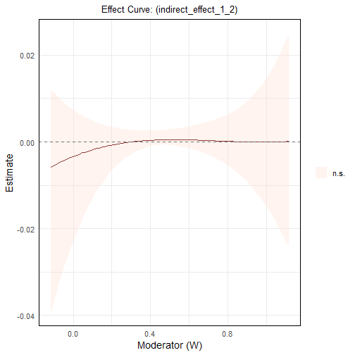
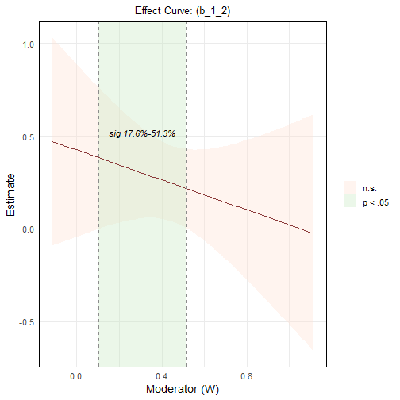
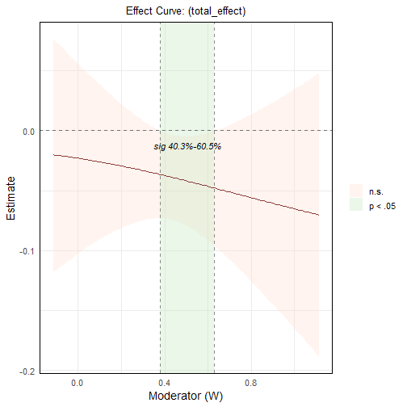

# Introduction

The `wsMed` function is designed for two condition within-subject mediation analysis, incorporating SEM models through the `lavaan` package and Monte Carlo simulation methods. This document provides a detailed description of the function's parameters, workflow, and usage, along with an example demonstration.

------------------------------------------------------------------------

# Main Function

The main steps include:

1. **Input Validation**
   Validate the dataset and key arguments (e.g., mediation structure, missing data method, etc.).

2. **Data Preprocessing**
   Compute difference scores (`Mdiff`, `Ydiff`) and centered averages (`Mavg`) from the two-condition design.

3. **Model Construction**
   Generate SEM syntax according to the specified mediation structure:
   - `"P"`: Parallel mediation
   - `"CN"`: Chained (serial) mediation
   - `"CP"`: Chained + Parallel
   - `"PC"`: Parallel + Chained

4. **Model Fitting and Inference**
   Fit the SEM model with handling of missing data via one of the following methods:
   - `"DE"`: Listwise deletion
   - `"FIML"`: Full Information Maximum Likelihood
   - `"MI"`: Multiple Imputation

   Inference options include:
   - **Bootstrap CI** (`ci_method = "bootstrap"` or `"both"`)
   - **Monte Carlo CI** (`ci_method = "mc"` or `"both"`), using either
     - analytical method (`MCmethod = "mc"`)
     - or bootstrapped SD (`MCmethod = "bootSD"`)

5. **Standardization (Optional)**
   If `standardized = TRUE`, computes standardized effects and their confidence intervals using either bootstrap or Monte Carlo-based methods.

6. **Covariate Handling**
   If covariates are provided, they are automatically processed and incorporated into the SEM model:

   - **Between-subject covariates** (supplied via the `C` argument) are assumed to reflect stable individual characteristics. These variables are mean-centered and added as predictors to all mediator and outcome regression models.

   - **Within-subject covariates** (specified as paired vectors `C_C1` and `C_C2`) are assumed to be measured under Condition 1 and Condition 2, respectively. For each pair, the function computes:
     - a **difference score** (e.g., `Cw1diff = C_C2 - C_C1`)
     - a **centered average** (e.g., `Cw1avg = mean-centered average of C_C1 and C_C2`)

   Both `Cw*_diff` and `Cw*_avg` are then included as predictors in the regression equations for the mediators and the outcome.

---

# Parameter Descriptions

The `wsMed()` function accepts the following parameters:

| **Parameter**       | **Type**        | **Default** | **Description**                                                                 |
|---------------------|-----------------|-------------|---------------------------------------------------------------------------------|
| `data`              | Data frame      | Required    | The input dataset.                                                              |
| `M_C1`              | String vector   | Required    | Mediator variables under Condition 1.                                           |
| `M_C2`              | String vector   | Required    | Mediator variables under Condition 2.                                           |
| `Y_C1`              | String          | Required    | Outcome variable under Condition 1.                                             |
| `Y_C2`              | String          | Required    | Outcome variable under Condition 2.                                             |
| `form`              | String          | `"P"`       | Model type: `"P"`, `"CN"`, `"CP"`, or `"PC"`.                                   |
| `standardized`      | Boolean         | `FALSE`     | Whether to compute standardized results.                                        |
| `Na`                | String          | `"DE"`      | Missing data method: `"DE"`, `"FIML"`, or `"MI"`.                               |
| `ci_method`         | String / NULL   | `NULL`      | CI method: `"bootstrap"`, `"mc"`, or `"both"`. If `NULL`, defaults to `"bootstrap"` for `"DE"` and `"mc"` for `"MI"`/`"FIML"`|
| `bootstrap`         | Integer         | `1000`      | Number of bootstrap samples.                                                    |
| `iseed`             | Integer         | `123`       | Random seed for bootstrap sampling.                                             |
| `boot_ci_type`      | String          | `"perc"`    | Bootstrap CI type: `"perc"`, `"bc"`, `"bca.simple"`.                            |
| `R`                 | Integer         | `20000L`    | Number of Monte Carlo repetitions.                                              |
| `alpha`             | Numeric         | `0.05`      | Significance level for unstandardized CIs.                                      |
| `m`                 | Integer         | `5`         | Number of imputations (for `"MI"` method).                                      |
| `method`            | String          | `"pmm"`     | Imputation method (e.g., `"pmm"`, `"norm"`) used in `mice()`.                   |
| `decomposition`     | String          | `"eigen"`   | Matrix decomposition method: `"eigen"`, `"chol"`, or `"svd"`.                   |
| `pd`                | Boolean         | `TRUE`      | Check positive definiteness of covariance matrix.                               |
| `tol`               | Numeric         | `1e-06`     | Tolerance used in positive definiteness checks.                                 |
| `seed`              | Integer         | `123`       | Random seed for Monte Carlo simulation.                                         |
| `MCmethod`          | String / NULL   | `NULL`      | Monte Carlo method: `"mc"` or `"bootSD"`.                                       |
| `alphastd`          | Numeric         | `0.05`      | Significance level for standardized confidence intervals.                       |
| `fixed.x`           | Boolean         | `FALSE`     | Whether exogenous variables are fixed.                                          |
| `C_C1`              | String vector   | `NULL`      | Within-subject covariates under Condition 1. Must match C_C2 in length.         |
| `C_C2`              | String vector   | `NULL`      | Within-subject covariates under Condition 1.                                    |
| `C`                 | String vector   | `NULL`      | Between-subject covariates to be mean-centered and added to all regressions.    |


The dataset should be in wide format, where each participant has separate columns for measurements in different conditions. Specifically, each mediator variable (e.g., M1) should be split into two columns: one for Condition 1 and one for Condition 2. Similarly, the outcome variable should also have separate columns for each condition. This structure ensures that within-subject changes can be properly analyzed.


``` r
# Simulated example dataset
s_data <- data.frame(
  ID = 1:100,
  M1_C1 = rnorm(100), M1_C2 = rnorm(100),
  M2_C1 = rnorm(100), M2_C2 = rnorm(100),
  Y_C1 = rnorm(100),  Y_C2 = rnorm(100)
)
head(s_data)
```

```
##   ID      M1_C1      M1_C2       M2_C1      M2_C2        Y_C1       Y_C2
## 1  1 -0.1564340  0.8144601 -0.20155994  1.7717497 -0.18031517 -0.7039098
## 2  2 -0.2926131 -0.5993872 -0.31769321 -0.6743578  0.97564729 -1.3956532
## 3  3  0.2807472  1.3681790  0.24951472 -0.8214143 -0.71533455  0.1197344
## 4  4 -0.8065108 -0.3730554  0.86411301 -0.7347126 -1.27855062  1.3582802
## 5  5 -1.4496765  1.5990477  0.01674256  0.6097271 -0.54315115 -0.6736289
## 6  6 -0.5935383 -0.4870189 -0.98868327 -1.6425937  0.01749736  0.2262415
```

# Calling wsMed


## For a complete dataset without missing values

### example 1

``` r
result1 <- wsMed(
  data = example_data, #dataset
  M_C1 = c("A1","B1"), # A1/B1 is A/B mediator variable in condition 1
  M_C2 = c("A2","B2"), # A2/B2 is A/B mediator variable in condition 2
  Y_C1 = "C1", # C1 is outcome variable in condition 1
  Y_C2 = "C2", # C2 is outcome variable in condition 2
  form = "P", # Parallel mediation
)
print(result1)
```

```
## 
## 
## *************** VARIABLES ***************
## Outcome (Y):
##    Condition 1: C1 
##    Condition 2: C2 
## Mediators (M):
##   M1:
##     Condition 1: A1
##     Condition 2: A2
##   M2:
##     Condition 1: B1
##     Condition 2: B2
## Sample size (rows kept): 100 
## 
## 
## *************** MODEL FIT ***************
## 
## 
## |Measure   |  Value|
## |:---------|------:|
## |Chi-Sq    | 11.436|
## |df        |  5.000|
## |p         |  0.043|
## |CFI       |  0.000|
## |TLI       | -1.130|
## |RMSEA     |  0.113|
## |RMSEA Low |  0.018|
## |RMSEA Up  |  0.202|
## |SRMR      |  0.076|
## 
## 
## ************* TOTAL / DIRECT / TOTAL-IND (MC) *************
## 
## 
## |Label          | Estimate|    SE| 2.5%CI.Lo| 97.5%CI.Up|
## |:--------------|--------:|-----:|---------:|----------:|
## |Total effect   |    0.015| 0.016|    -0.017|      0.047|
## |Direct effect  |    0.016| 0.016|    -0.016|      0.048|
## |Total indirect |   -0.001| 0.004|    -0.009|      0.008|
## 
## Indirect effects:
## 
## 
## |Label | Estimate|    SE| 2.5%CI.Lo| 97.5%CI.Up|
## |:-----|--------:|-----:|---------:|----------:|
## |ind_1 |    0.001| 0.003|    -0.005|      0.008|
## |ind_2 |   -0.002| 0.003|    -0.009|      0.003|
## 
## Indirect-effect key:
## 
## 
## |Ind   |Path                 |
## |:-----|:--------------------|
## |ind_1 |X -> M1diff -> Ydiff |
## |ind_2 |X -> M2diff -> Ydiff |
## 
## 
## *************** REGRESSION PATHS (MC) ***************
## 
## 
## |Path           |Label | Estimate|    SE| 2.5%CI.Lo| 97.5%CI.Up|
## |:--------------|:-----|--------:|-----:|---------:|----------:|
## |Ydiff ~ M1diff |b1    |   -0.036| 0.092|    -0.215|      0.144|
## |Ydiff ~ M1avg  |d1    |   -0.062| 0.091|    -0.239|      0.116|
## |Ydiff ~ M2diff |b2    |   -0.112| 0.090|    -0.289|      0.063|
## |Ydiff ~ M2avg  |d2    |   -0.073| 0.083|    -0.236|      0.088|
## 
## 
## *************** INTERCEPTS (MC) ***************
## 
## 
## |Intercept |Label | Estimate|    SE| 2.5%CI.Lo| 97.5%CI.Up|
## |:---------|:-----|--------:|-----:|---------:|----------:|
## |Ydiff~1   |cp    |    0.016| 0.016|    -0.016|      0.048|
## |M1diff~1  |a1    |   -0.027| 0.018|    -0.061|      0.007|
## |M2diff~1  |a2    |    0.014| 0.018|    -0.021|      0.049|
## |M1avg~1   |      |   -0.000| 0.018|    -0.036|      0.036|
## |M2avg~1   |      |    0.000| 0.020|    -0.040|      0.039|
## 
## 
## *************** VARIANCES (MC) ***************
## 
## 
## |Variance       |Label | Estimate|    SE| 2.5%CI.Lo| 97.5%CI.Up|
## |:--------------|:-----|--------:|-----:|---------:|----------:|
## |Ydiff~~Ydiff   |      |    0.026| 0.004|     0.018|      0.033|
## |M1diff~~M1diff |      |    0.031| 0.004|     0.022|      0.039|
## |M2diff~~M2diff |      |    0.032| 0.005|     0.023|      0.041|
## |M1avg~~M1avg   |      |    0.034| 0.005|     0.024|      0.043|
## |M2avg~~M2avg   |      |    0.041| 0.006|     0.030|      0.052|
## 
## 
## *************** MODERATION EFFECTS (d-paths, MC) ***************
## 
## 
## |Coefficient | Estimate|    SE| 2.5%CI.Lo| 97.5%CI.Up|
## |:-----------|--------:|-----:|---------:|----------:|
## |d1          |   -0.062| 0.091|    -0.239|      0.116|
## |d2          |   -0.073| 0.083|    -0.236|      0.088|
## 
## 
## *************** MODERATION KEY (d-paths) ***************
## 
## 
## |Coefficient |Path           |Moderated       |
## |:-----------|:--------------|:---------------|
## |d1          |M1avg -> Ydiff |M1diff -> Ydiff |
## |d2          |M2avg -> Ydiff |M2diff -> Ydiff |
## 
## 
## *************** CONTRAST INDIRECT EFFECTS (No Moderator) ***************
## 
## 
## |Contrast                  | Estimate|    SE| 2.5%CI.Lo| 97.5%CI.Up|
## |:-------------------------|--------:|-----:|---------:|----------:|
## |indirect_2  -  indirect_1 |   -0.003| 0.004|    -0.012|      0.005|
## 
## 
## *************** C1-C2 COEFFICIENTS (No Moderator) ***************
## 
## 
## |Coeff | Estimate|    SE| 2.5%CI.Lo| 97.5%CI.Up|
## |:-----|--------:|-----:|---------:|----------:|
## |X1_b1 |   -0.067| 0.102|    -0.266|      0.132|
## |X0_b1 |   -0.005| 0.102|    -0.204|      0.196|
## |X1_b2 |   -0.149| 0.099|    -0.342|      0.044|
## |X0_b2 |   -0.076| 0.099|    -0.274|      0.116|
```

By default, `wsMed()` uses **Monte Carlo** confidence intervals when `ci_method` is not specified. You can also specify ci_method = "bootstrap" to compute Bootstrap confidence intervals instead of Monte Carlo:


``` r
result1 <- wsMed(
  data = example_data, #dataset
  M_C1 = c("A1","B1"), # A1/B1 is A/B mediator variable in condition 1
  M_C2 = c("A2","B2"), # A2/B2 is A/B mediator variable in condition 2
  Y_C1 = "C1", # C1 is outcome variable in condition 1
  Y_C2 = "C2", # C2 is outcome variable in condition 2
  form = "P", # Parallel mediation
  ci_method = "bootstrap" # use Bootstrap confidence intervals
)
print(result1)
```

### example2
You can further control the behavior of `wsMed()` through additional arguments:

- Set `standardized = TRUE` to compute **standardized effects** and their confidence intervals.
- Adjust `alpha` for the **significance level of CIs**.


``` r
library(wsMed)
result2 <- wsMed(
  data = example_data, #dataset
  M_C1 = c("A1","B1","C1"), # A1/B1/C1 is A/B/C mediator variable in condition 1
  M_C2 = c("A2","B2","C2"), # A2/B2/C2 is A/B/C mediator variable in condition 2
  Y_C1 = "D1", # D1 is outcome variable in condition 1
  Y_C2 = "D2", # D2 is outcome variable in condition 2
  form = "P", # Parallel mediation
  standardized = TRUE, # Compute standardized effects
  alpha =  0.05,  # Significance level
)
print(result2)
```

```
## 
## 
## *************** VARIABLES ***************
## Outcome (Y):
##    Condition 1: D1 
##    Condition 2: D2 
## Mediators (M):
##   M1:
##     Condition 1: A1
##     Condition 2: A2
##   M2:
##     Condition 1: B1
##     Condition 2: B2
##   M3:
##     Condition 1: C1
##     Condition 2: C2
## Sample size (rows kept): 100 
## 
## 
## *************** MODEL FIT ***************
## 
## 
## |Measure   |  Value|
## |:---------|------:|
## |Chi-Sq    | 16.275|
## |df        | 12.000|
## |p         |  0.179|
## |CFI       |  0.000|
## |TLI       | -1.829|
## |RMSEA     |  0.060|
## |RMSEA Low |  0.000|
## |RMSEA Up  |  0.126|
## |SRMR      |  0.072|
## 
## 
## ************* TOTAL / DIRECT / TOTAL-IND (MC) *************
## 
## 
## |Label          | Estimate|    SE| 2.5%CI.Lo| 97.5%CI.Up|
## |:--------------|--------:|-----:|---------:|----------:|
## |Total effect   |   -0.032| 0.017|    -0.065|      0.002|
## |Direct effect  |   -0.031| 0.017|    -0.064|      0.002|
## |Total indirect |   -0.000| 0.005|    -0.010|      0.009|
## 
## Indirect effects:
## 
## 
## |Label | Estimate|    SE| 2.5%CI.Lo| 97.5%CI.Up|
## |:-----|--------:|-----:|---------:|----------:|
## |ind_1 |    0.001| 0.003|    -0.004|      0.009|
## |ind_2 |   -0.001| 0.003|    -0.008|      0.003|
## |ind_3 |   -0.000| 0.002|    -0.006|      0.004|
## 
## Indirect-effect key:
## 
## 
## |Ind   |Path                 |
## |:-----|:--------------------|
## |ind_1 |X -> M1diff -> Ydiff |
## |ind_2 |X -> M2diff -> Ydiff |
## |ind_3 |X -> M3diff -> Ydiff |
## 
## 
## *************** REGRESSION PATHS (MC) ***************
## 
## 
## |Path           |Label | Estimate|    SE| 2.5%CI.Lo| 97.5%CI.Up|
## |:--------------|:-----|--------:|-----:|---------:|----------:|
## |Ydiff ~ M1diff |b1    |   -0.050| 0.094|    -0.232|      0.136|
## |Ydiff ~ M1avg  |d1    |   -0.030| 0.098|    -0.221|      0.163|
## |Ydiff ~ M2diff |b2    |   -0.084| 0.092|    -0.266|      0.094|
## |Ydiff ~ M2avg  |d2    |   -0.006| 0.089|    -0.180|      0.167|
## |Ydiff ~ M3diff |b3    |   -0.017| 0.102|    -0.218|      0.183|
## |Ydiff ~ M3avg  |d3    |   -0.155| 0.104|    -0.360|      0.046|
## 
## 
## *************** INTERCEPTS (MC) ***************
## 
## 
## |Intercept |Label | Estimate|    SE| 2.5%CI.Lo| 97.5%CI.Up|
## |:---------|:-----|--------:|-----:|---------:|----------:|
## |Ydiff~1   |cp    |   -0.031| 0.017|    -0.064|      0.002|
## |M1diff~1  |a1    |   -0.027| 0.017|    -0.061|      0.007|
## |M2diff~1  |a2    |    0.014| 0.018|    -0.021|      0.049|
## |M3diff~1  |a3    |    0.015| 0.016|    -0.016|      0.048|
## |M1avg~1   |      |   -0.000| 0.018|    -0.036|      0.036|
## |M2avg~1   |      |    0.000| 0.020|    -0.039|      0.040|
## |M3avg~1   |      |   -0.000| 0.018|    -0.034|      0.035|
## 
## 
## *************** VARIANCES (MC) ***************
## 
## 
## |Variance       |Label | Estimate|    SE| 2.5%CI.Lo| 97.5%CI.Up|
## |:--------------|:-----|--------:|-----:|---------:|----------:|
## |Ydiff~~Ydiff   |      |    0.028| 0.004|     0.020|      0.035|
## |M1diff~~M1diff |      |    0.031| 0.004|     0.022|      0.039|
## |M2diff~~M2diff |      |    0.032| 0.005|     0.023|      0.041|
## |M3diff~~M3diff |      |    0.026| 0.004|     0.019|      0.034|
## |M1avg~~M1avg   |      |    0.034| 0.005|     0.024|      0.043|
## |M2avg~~M2avg   |      |    0.041| 0.006|     0.029|      0.052|
## |M3avg~~M3avg   |      |    0.031| 0.004|     0.022|      0.039|
## 
## 
## *************** MODERATION EFFECTS (d-paths, MC) ***************
## 
## 
## |Coefficient | Estimate|    SE| 2.5%CI.Lo| 97.5%CI.Up|
## |:-----------|--------:|-----:|---------:|----------:|
## |d1          |   -0.030| 0.098|    -0.221|      0.163|
## |d2          |   -0.006| 0.089|    -0.180|      0.167|
## |d3          |   -0.155| 0.104|    -0.360|      0.046|
## 
## 
## *************** MODERATION KEY (d-paths) ***************
## 
## 
## |Coefficient |Path           |Moderated       |
## |:-----------|:--------------|:---------------|
## |d1          |M1avg -> Ydiff |M1diff -> Ydiff |
## |d2          |M2avg -> Ydiff |M2diff -> Ydiff |
## |d3          |M3avg -> Ydiff |M3diff -> Ydiff |
## 
## 
## *************** CONTRAST INDIRECT EFFECTS (No Moderator) ***************
## 
## 
## |Contrast                  | Estimate|    SE| 2.5%CI.Lo| 97.5%CI.Up|
## |:-------------------------|--------:|-----:|---------:|----------:|
## |indirect_2  -  indirect_1 |   -0.003| 0.004|    -0.012|      0.005|
## |indirect_3  -  indirect_1 |   -0.002| 0.004|    -0.010|      0.006|
## |indirect_3  -  indirect_2 |    0.001| 0.003|    -0.006|      0.009|
## 
## 
## *************** C1-C2 COEFFICIENTS (No Moderator) ***************
## 
## 
## |Coeff | Estimate|    SE| 2.5%CI.Lo| 97.5%CI.Up|
## |:-----|--------:|-----:|---------:|----------:|
## |X1_b1 |   -0.065| 0.105|    -0.272|      0.142|
## |X0_b1 |   -0.034| 0.107|    -0.241|      0.177|
## |X1_b2 |   -0.088| 0.102|    -0.286|      0.112|
## |X0_b2 |   -0.082| 0.103|    -0.285|      0.116|
## |X1_b3 |   -0.094| 0.115|    -0.318|      0.131|
## |X0_b3 |    0.062| 0.115|    -0.164|      0.283|
## 
## 
## *************** STANDARDIZED (MC) ***************
## 
## 
## |Parameter      | Estimate|    SE|         R|   2.5%| 97.5%|
## |:--------------|--------:|-----:|---------:|------:|-----:|
## |cp             |   -0.186| 0.098| 20000.000| -0.376| 0.010|
## |b1             |   -0.052| 0.094| 20000.000| -0.233| 0.135|
## |d1             |   -0.033| 0.103| 20000.000| -0.236| 0.170|
## |b2             |   -0.089| 0.095| 20000.000| -0.272| 0.098|
## |d2             |   -0.007| 0.103| 20000.000| -0.206| 0.194|
## |b3             |   -0.016| 0.095| 20000.000| -0.204| 0.172|
## |d3             |   -0.160| 0.103| 20000.000| -0.356| 0.048|
## |a1             |   -0.155| 0.101| 20000.000| -0.354| 0.041|
## |a2             |    0.081| 0.102| 20000.000| -0.119| 0.279|
## |a3             |    0.095| 0.102| 20000.000| -0.101| 0.298|
## |Ydiff~~Ydiff   |    0.958| 0.047| 20000.000|  0.800| 0.977|
## |M1diff~~M1diff |    1.000| 0.000| 20000.000|  1.000| 1.000|
## |M2diff~~M2diff |    1.000| 0.000| 20000.000|  1.000| 1.000|
## |M3diff~~M3diff |    1.000| 0.000| 20000.000|  1.000| 1.000|
## |M1avg~~M1avg   |    1.000| 0.000| 20000.000|  1.000| 1.000|
## |M1avg~~M2avg   |    0.290| 0.094| 20000.000|  0.093| 0.466|
## |M1avg~~M3avg   |    0.340| 0.091| 20000.000|  0.149| 0.508|
## |M2avg~~M2avg   |    1.000| 0.000| 20000.000|  1.000| 1.000|
## |M2avg~~M3avg   |    0.324| 0.092| 20000.000|  0.133| 0.494|
## |M3avg~~M3avg   |    1.000| 0.000| 20000.000|  1.000| 1.000|
## |M1avg~1        |   -0.000| 0.101| 20000.000| -0.198| 0.200|
## |M2avg~1        |    0.000| 0.101| 20000.000| -0.196| 0.201|
## |M3avg~1        |   -0.000| 0.102| 20000.000| -0.195| 0.201|
## |indirect_1     |    0.008| 0.018| 20000.000| -0.025| 0.049|
## |indirect_2     |   -0.007| 0.015| 20000.000| -0.044| 0.018|
## |indirect_3     |   -0.002| 0.013| 20000.000| -0.032| 0.025|
## |total_indirect |   -0.001| 0.027| 20000.000| -0.056| 0.053|
## |total_effect   |   -0.186| 0.098| 20000.000| -0.378| 0.009|
```

- You can also specify `ci_method = "bootstrap"`.
- Set `bootstrap` to control the **number of bootstrapping** (default = 2000).


``` r
library(wsMed)
result2 <- wsMed(
  data = example_data, #dataset
  M_C1 = c("A1","B1","C1"), # A1/B1/C1 is A/B/C mediator variable in condition 1
  M_C2 = c("A2","B2","C2"), # A2/B2/C2 is A/B/C mediator variable in condition 2
  Y_C1 = "D1", # D1 is outcome variable in condition 1
  Y_C2 = "D2", # D2 is outcome variable in condition 2
  form = "P", # Parallel mediation
  standardized = TRUE, # Compute standardized effects based on Monte Carlo method
  ci_method = "bootstrap", # use Bootstrap confidence intervals
  bootstrap = 1000,   # the number of bootstrap
  alpha =  0.05,  # Significance level
)
print(result2)
```

## For a dataset with missing data
The `wsMed()` function supports three missing data handling strategies via the `Na` argument:

- `"DE"`: Listwise deletion (default).
- `"FIML"`: Full Information Maximum Likelihood.
- `"MI"`: Multiple Imputation using the `mice` package.

**Note**:
- For **`Na = "DE"`**, the default is **bootstrap confidence intervals**, but you can specify `ci_method = "mc"` to use **Monte Carlo** confidence intervals instead.
- For **`Na = "MI"`**and **`Na = "FIML"`**, only **Monte Carlo** confidence intervals are supported. Bootstrap is **not available** when using multiple imputation.


``` r
library(knitr)
data(example_data)
set.seed(123)
example_dataN <- mice::ampute(
  data = example_data,
  prop = 0.1,
)$amp
```

```
## Warning: Data is made numeric because the calculation of weights requires numeric data
```

### example 3

Use 'DE' method for missing data for parallel mediation


``` r
library(wsMed)
result3 <- wsMed(
  data = example_data,# a dataset with missing data
  M_C1 = c("A1","B1"),# A1/B1 is A/B mediator variable in condition 1
  M_C2 = c("A2","B2"),# A2/B2 is A/B mediator variable in condition 2
  Y_C1 = "C1", # C1 is outcome variable in condition 1
  Y_C2 = "C2", # C2 is outcome variable in condition 2
  form = "P",# Parallel mediation
  Na = "DE",# Listwise deletion for the missing data
)
print(result3,digits =4)  # Set number of decimal places to 4 in the output
```

```
## 
## 
## *************** VARIABLES ***************
## Outcome (Y):
##    Condition 1: C1 
##    Condition 2: C2 
## Mediators (M):
##   M1:
##     Condition 1: A1
##     Condition 2: A2
##   M2:
##     Condition 1: B1
##     Condition 2: B2
## Sample size (rows kept): 100 
## 
## 
## *************** MODEL FIT ***************
## 
## 
## |Measure   |  Value|
## |:---------|------:|
## |Chi-Sq    | 11.436|
## |df        |  5.000|
## |p         |  0.043|
## |CFI       |  0.000|
## |TLI       | -1.130|
## |RMSEA     |  0.113|
## |RMSEA Low |  0.018|
## |RMSEA Up  |  0.202|
## |SRMR      |  0.076|
## 
## 
## ************* TOTAL / DIRECT / TOTAL-IND (MC) *************
## 
## 
## |Label          | Estimate|     SE| 2.5%CI.Lo| 97.5%CI.Up|
## |:--------------|--------:|------:|---------:|----------:|
## |Total effect   |   0.0153| 0.0165|   -0.0168|     0.0478|
## |Direct effect  |   0.0160| 0.0164|   -0.0160|     0.0482|
## |Total indirect |  -0.0006| 0.0042|   -0.0096|     0.0078|
## 
## Indirect effects:
## 
## 
## |Label | Estimate|     SE| 2.5%CI.Lo| 97.5%CI.Up|
## |:-----|--------:|------:|---------:|----------:|
## |ind_1 |   0.0010| 0.0030|   -0.0049|     0.0079|
## |ind_2 |  -0.0016| 0.0029|   -0.0085|     0.0032|
## 
## Indirect-effect key:
## 
## 
## |Ind   |Path                 |
## |:-----|:--------------------|
## |ind_1 |X -> M1diff -> Ydiff |
## |ind_2 |X -> M2diff -> Ydiff |
## 
## 
## *************** REGRESSION PATHS (MC) ***************
## 
## 
## |Path           |Label | Estimate|     SE| 2.5%CI.Lo| 97.5%CI.Up|
## |:--------------|:-----|--------:|------:|---------:|----------:|
## |Ydiff ~ M1diff |b1    |  -0.0360| 0.0911|   -0.2157|     0.1431|
## |Ydiff ~ M1avg  |d1    |  -0.0617| 0.0913|   -0.2398|     0.1178|
## |Ydiff ~ M2diff |b2    |  -0.1123| 0.0892|   -0.2871|     0.0625|
## |Ydiff ~ M2avg  |d2    |  -0.0733| 0.0826|   -0.2344|     0.0904|
## 
## 
## *************** INTERCEPTS (MC) ***************
## 
## 
## |Intercept |Label | Estimate|     SE| 2.5%CI.Lo| 97.5%CI.Up|
## |:---------|:-----|--------:|------:|---------:|----------:|
## |Ydiff~1   |cp    |   0.0160| 0.0164|   -0.0160|     0.0482|
## |M1diff~1  |a1    |  -0.0271| 0.0177|   -0.0618|     0.0079|
## |M2diff~1  |a2    |   0.0145| 0.0179|   -0.0205|     0.0494|
## |M1avg~1   |      |  -0.0000| 0.0185|   -0.0361|     0.0366|
## |M2avg~1   |      |   0.0000| 0.0201|   -0.0394|     0.0391|
## 
## 
## *************** VARIANCES (MC) ***************
## 
## 
## |Variance       |Label | Estimate|     SE| 2.5%CI.Lo| 97.5%CI.Up|
## |:--------------|:-----|--------:|------:|---------:|----------:|
## |Ydiff~~Ydiff   |      |   0.0256| 0.0036|    0.0185|     0.0327|
## |M1diff~~M1diff |      |   0.0308| 0.0043|    0.0222|     0.0392|
## |M2diff~~M2diff |      |   0.0323| 0.0046|    0.0233|     0.0412|
## |M1avg~~M1avg   |      |   0.0339| 0.0048|    0.0245|     0.0433|
## |M2avg~~M2avg   |      |   0.0407| 0.0057|    0.0293|     0.0520|
## 
## 
## *************** MODERATION EFFECTS (d-paths, MC) ***************
## 
## 
## |Coefficient | Estimate|     SE| 2.5%CI.Lo| 97.5%CI.Up|
## |:-----------|--------:|------:|---------:|----------:|
## |d1          |  -0.0617| 0.0913|   -0.2398|     0.1178|
## |d2          |  -0.0733| 0.0826|   -0.2344|     0.0904|
## 
## 
## *************** MODERATION KEY (d-paths) ***************
## 
## 
## |Coefficient |Path           |Moderated       |
## |:-----------|:--------------|:---------------|
## |d1          |M1avg -> Ydiff |M1diff -> Ydiff |
## |d2          |M2avg -> Ydiff |M2diff -> Ydiff |
## 
## 
## *************** CONTRAST INDIRECT EFFECTS (No Moderator) ***************
## 
## 
## |Contrast                  | Estimate|     SE| 2.5%CI.Lo| 97.5%CI.Up|
## |:-------------------------|--------:|------:|---------:|----------:|
## |indirect_2  -  indirect_1 |  -0.0030| 0.0040|   -0.0120|     0.0050|
## 
## 
## *************** C1-C2 COEFFICIENTS (No Moderator) ***************
## 
## 
## |Coeff | Estimate|     SE| 2.5%CI.Lo| 97.5%CI.Up|
## |:-----|--------:|------:|---------:|----------:|
## |X1_b1 |  -0.0670| 0.1020|   -0.2670|     0.1340|
## |X0_b1 |  -0.0050| 0.1020|   -0.2080|     0.1930|
## |X1_b2 |  -0.1490| 0.0990|   -0.3420|     0.0450|
## |X0_b2 |  -0.0770| 0.0980|   -0.2700|     0.1140|
```

### example 4

Use 'MI' method for missing data for chained mediation


``` r
result4 <- wsMed(
  data = example_dataN,
  M_C1 = c("A1","B1","C1"),# A1/B1/C1 is A/B/C mediator variable in condition 1
  M_C2 = c("A2","B2","C2"),# A2/B2/C2 is A/B/C mediator variable in condition 2
  Y_C1 = "D1", # D1 is outcome variable in condition 1
  Y_C2 = "D2", # D2 is outcome variable in condition 2
  form = "CN", # chained mediation
  Na = "MI", # Use Multiple Imputation ("MI") for handling missing data
  standardized = TRUE, # Compute standardized effects based on Monte Carlo method
  R = 20000L,  # the number of Monte Carlo repetitions
  alpha =  0.05,  # Significance level
)
print(result4)
```

```
## 
## 
## *************** VARIABLES ***************
## Outcome (Y):
##    Condition 1: D1 
##    Condition 2: D2 
## Mediators (M):
##   M1:
##     Condition 1: A1
##     Condition 2: A2
##   M2:
##     Condition 1: B1
##     Condition 2: B2
##   M3:
##     Condition 1: C1
##     Condition 2: C2
## Sample size (rows kept): 100 
## 
## 
## *************** MODEL FIT ***************
## 
## 
## |Measure   |  Value|
## |:---------|------:|
## |Chi-Sq    |  8.993|
## |df        |  6.000|
## |p         |  0.174|
## |CFI       |  0.093|
## |TLI       | -1.720|
## |RMSEA     |  0.071|
## |RMSEA Low |  0.000|
## |RMSEA Up  |  0.159|
## |SRMR      |  0.047|
## 
## 
## ************* TOTAL / DIRECT / TOTAL-IND (MC) *************
## 
## 
## |Label          | Estimate|    SE| 2.5%CI.Lo| 97.5%CI.Up|
## |:--------------|--------:|-----:|---------:|----------:|
## |Total effect   |   -0.032| 0.017|    -0.066|      0.001|
## |Direct effect  |   -0.032| 0.017|    -0.065|      0.002|
## |Total indirect |    0.000| 0.005|    -0.010|      0.011|
## 
## Indirect effects:
## 
## 
## |Label     | Estimate|    SE| 2.5%CI.Lo| 97.5%CI.Up|
## |:---------|--------:|-----:|---------:|----------:|
## |ind_1     |    0.001| 0.003|    -0.005|      0.009|
## |ind_2     |   -0.002| 0.003|    -0.009|      0.003|
## |ind_3     |   -0.000| 0.002|    -0.005|      0.005|
## |ind_1_2   |    0.001| 0.001|    -0.001|      0.003|
## |ind_1_3   |   -0.000| 0.000|    -0.001|      0.001|
## |ind_2_3   |    0.000| 0.000|    -0.001|      0.001|
## |ind_1_2_3 |   -0.000| 0.000|    -0.000|      0.000|
## 
## Indirect-effect key:
## 
## 
## |Ind       |Path                                     |
## |:---------|:----------------------------------------|
## |ind_1     |X -> M1diff -> Ydiff                     |
## |ind_2     |X -> M2diff -> Ydiff                     |
## |ind_3     |X -> M3diff -> Ydiff                     |
## |ind_1_2   |X -> M1diff -> M2diff -> Ydiff           |
## |ind_1_3   |X -> M1diff -> M3diff -> Ydiff           |
## |ind_2_3   |X -> M2diff -> M3diff -> Ydiff           |
## |ind_1_2_3 |X -> M1diff -> M2diff -> M3diff -> Ydiff |
## 
## 
## *************** REGRESSION PATHS (MC) ***************
## 
## 
## |Path            |Label | Estimate|    SE| 2.5%CI.Lo| 97.5%CI.Up|
## |:---------------|:-----|--------:|-----:|---------:|----------:|
## |Ydiff ~ M1diff  |b1    |   -0.051| 0.098|    -0.242|      0.140|
## |Ydiff ~ M1avg   |d1    |   -0.034| 0.100|    -0.230|      0.162|
## |Ydiff ~ M2diff  |b2    |   -0.077| 0.096|    -0.265|      0.109|
## |Ydiff ~ M2avg   |d2    |   -0.000| 0.090|    -0.176|      0.177|
## |Ydiff ~ M3diff  |b3    |   -0.006| 0.104|    -0.214|      0.195|
## |Ydiff ~ M3avg   |d3    |   -0.149| 0.105|    -0.357|      0.056|
## |M2diff ~ M1diff |b_1_2 |    0.246| 0.102|     0.044|      0.445|
## |M2diff ~ M1avg  |d_1_2 |   -0.060| 0.097|    -0.250|      0.128|
## |M3diff ~ M1diff |b_1_3 |   -0.044| 0.095|    -0.232|      0.141|
## |M3diff ~ M1avg  |d_1_3 |   -0.061| 0.093|    -0.244|      0.117|
## |M3diff ~ M2diff |b_2_3 |   -0.089| 0.097|    -0.283|      0.101|
## |M3diff ~ M2avg  |d_2_3 |   -0.066| 0.086|    -0.234|      0.101|
## 
## 
## *************** INTERCEPTS (MC) ***************
## 
## 
## |Intercept |Label | Estimate|    SE| 2.5%CI.Lo| 97.5%CI.Up|
## |:---------|:-----|--------:|-----:|---------:|----------:|
## |Ydiff~1   |cp    |   -0.032| 0.017|    -0.065|      0.002|
## |M1diff~1  |a1    |   -0.027| 0.017|    -0.062|      0.007|
## |M2diff~1  |a2    |    0.020| 0.018|    -0.016|      0.055|
## |M3diff~1  |a3    |    0.017| 0.017|    -0.016|      0.050|
## |M1avg~1   |      |   -0.000| 0.000|    -0.000|     -0.000|
## |M2avg~1   |      |   -0.000| 0.000|    -0.000|     -0.000|
## |M3avg~1   |      |    0.000| 0.000|     0.000|      0.000|
## 
## 
## *************** VARIANCES (MC) ***************
## 
## 
## |Variance       |Label | Estimate|    SE| 2.5%CI.Lo| 97.5%CI.Up|
## |:--------------|:-----|--------:|-----:|---------:|----------:|
## |Ydiff~~Ydiff   |      |    0.028| 0.004|     0.020|      0.035|
## |M2diff~~M2diff |      |    0.031| 0.005|     0.022|      0.040|
## |M3diff~~M3diff |      |    0.026| 0.004|     0.019|      0.033|
## |M1diff~~M1diff |      |    0.031| 0.004|     0.022|      0.039|
## |M1avg~~M1avg   |      |    0.034| 0.000|     0.034|      0.034|
## |M2avg~~M2avg   |      |    0.040| 0.000|     0.040|      0.040|
## |M3avg~~M3avg   |      |    0.030| 0.000|     0.030|      0.030|
## 
## 
## *************** MODERATION EFFECTS (d-paths, MC) ***************
## 
## 
## |Coefficient | Estimate|    SE| 2.5%CI.Lo| 97.5%CI.Up|
## |:-----------|--------:|-----:|---------:|----------:|
## |d1          |   -0.034| 0.100|    -0.230|      0.162|
## |d2          |   -0.000| 0.090|    -0.176|      0.177|
## |d3          |   -0.149| 0.105|    -0.357|      0.056|
## |d_1_2       |   -0.060| 0.097|    -0.250|      0.128|
## |d_1_3       |   -0.061| 0.093|    -0.244|      0.117|
## |d_2_3       |   -0.066| 0.086|    -0.234|      0.101|
## 
## 
## *************** MODERATION KEY (d-paths) ***************
## 
## 
## |Coefficient |Path            |Moderated        |
## |:-----------|:---------------|:----------------|
## |d1          |M1avg -> Ydiff  |M1diff -> Ydiff  |
## |d2          |M2avg -> Ydiff  |M2diff -> Ydiff  |
## |d3          |M3avg -> Ydiff  |M3diff -> Ydiff  |
## |d_1_2       |M1avg -> M2diff |M1diff -> M2diff |
## |d_1_3       |M1avg -> M3diff |M1diff -> M3diff |
## |d_2_3       |M2avg -> M3diff |M2diff -> M3diff |
## 
## 
## *************** CONTRAST INDIRECT EFFECTS (No Moderator) ***************
## 
## 
## |Contrast                        | Estimate|    SE| 2.5%CI.Lo| 97.5%CI.Up|
## |:-------------------------------|--------:|-----:|---------:|----------:|
## |indirect_2      -  indirect_1   |   -0.003| 0.004|    -0.012|      0.004|
## |indirect_3      -  indirect_1   |   -0.001| 0.004|    -0.011|      0.006|
## |indirect_1_2    -  indirect_1   |   -0.001| 0.003|    -0.009|      0.006|
## |indirect_1_3    -  indirect_1   |   -0.001| 0.003|    -0.009|      0.005|
## |indirect_2_3    -  indirect_1   |   -0.001| 0.003|    -0.009|      0.005|
## |indirect_1_2_3  -  indirect_1   |   -0.001| 0.003|    -0.009|      0.005|
## |indirect_3      -  indirect_2   |    0.001| 0.004|    -0.005|      0.010|
## |indirect_1_2    -  indirect_2   |    0.002| 0.003|    -0.004|      0.010|
## |indirect_1_3    -  indirect_2   |    0.002| 0.003|    -0.003|      0.009|
## |indirect_2_3    -  indirect_2   |    0.002| 0.003|    -0.003|      0.009|
## |indirect_1_2_3  -  indirect_2   |    0.002| 0.003|    -0.003|      0.009|
## |indirect_1_2    -  indirect_3   |    0.001| 0.003|    -0.005|      0.006|
## |indirect_1_3    -  indirect_3   |    0.000| 0.002|    -0.005|      0.005|
## |indirect_2_3    -  indirect_3   |    0.000| 0.003|    -0.006|      0.006|
## |indirect_1_2_3  -  indirect_3   |    0.000| 0.002|    -0.005|      0.005|
## |indirect_1_3    -  indirect_1_2 |   -0.001| 0.001|    -0.003|      0.001|
## |indirect_2_3    -  indirect_1_2 |   -0.001| 0.001|    -0.003|      0.001|
## |indirect_1_2_3  -  indirect_1_2 |   -0.001| 0.001|    -0.003|      0.001|
## |indirect_2_3    -  indirect_1_3 |    0.000| 0.001|    -0.001|      0.001|
## |indirect_1_2_3  -  indirect_1_3 |    0.000| 0.000|    -0.001|      0.001|
## |indirect_1_2_3  -  indirect_2_3 |   -0.000| 0.000|    -0.001|      0.001|
## 
## 
## *************** C1-C2 COEFFICIENTS (No Moderator) ***************
## 
## 
## |Coeff    | Estimate|    SE| 2.5%CI.Lo| 97.5%CI.Up|
## |:--------|--------:|-----:|---------:|----------:|
## |X1_b1    |   -0.067| 0.110|    -0.281|      0.149|
## |X0_b1    |   -0.033| 0.110|    -0.249|      0.182|
## |X1_b2    |   -0.079| 0.105|    -0.285|      0.127|
## |X0_b2    |   -0.079| 0.107|    -0.284|      0.131|
## |X1_b3    |   -0.081| 0.116|    -0.310|      0.144|
## |X0_b3    |    0.068| 0.117|    -0.163|      0.296|
## |X1_b_1_2 |    0.216| 0.112|    -0.005|      0.435|
## |X0_b_1_2 |    0.277| 0.114|     0.053|      0.498|
## |X1_b_1_3 |   -0.075| 0.105|    -0.283|      0.129|
## |X0_b_1_3 |   -0.013| 0.106|    -0.224|      0.195|
## |X1_b_2_3 |   -0.122| 0.105|    -0.329|      0.085|
## |X0_b_2_3 |   -0.056| 0.108|    -0.267|      0.157|
## 
## 
## *************** STANDARDIZED (MC) ***************
## 
## 
## |Parameter      | Estimate|    SE|         R|   2.5%|  97.5%|
## |:--------------|--------:|-----:|---------:|------:|------:|
## |cp             |   -0.188| 0.100| 20000.000| -0.381|  0.009|
## |b1             |   -0.052| 0.098| 20000.000| -0.242|  0.140|
## |d1             |   -0.036| 0.105| 20000.000| -0.240|  0.171|
## |b2             |   -0.083| 0.101| 20000.000| -0.278|  0.117|
## |d2             |   -0.000| 0.103| 20000.000| -0.201|  0.201|
## |b3             |   -0.006| 0.099| 20000.000| -0.204|  0.188|
## |d3             |   -0.153| 0.103| 20000.000| -0.347|  0.056|
## |a1             |   -0.155| 0.101| 20000.000| -0.358|  0.039|
## |a2             |    0.107| 0.099| 20000.000| -0.086|  0.304|
## |b_1_2          |    0.236| 0.095| 20000.000|  0.042|  0.416|
## |d_1_2          |   -0.060| 0.097| 20000.000| -0.248|  0.130|
## |a3             |    0.103| 0.101| 20000.000| -0.099|  0.301|
## |b_1_3          |   -0.047| 0.100| 20000.000| -0.244|  0.148|
## |d_1_3          |   -0.069| 0.102| 20000.000| -0.267|  0.132|
## |b_2_3          |   -0.100| 0.106| 20000.000| -0.302|  0.114|
## |d_2_3          |   -0.081| 0.103| 20000.000| -0.279|  0.123|
## |Ydiff~~Ydiff   |    0.961| 0.046| 20000.000|  0.798|  0.977|
## |M2diff~~M2diff |    0.940| 0.048| 20000.000|  0.809|  0.992|
## |M3diff~~M3diff |    0.972| 0.041| 20000.000|  0.836|  0.990|
## |M1diff~~M1diff |    1.000| 0.000| 20000.000|  1.000|  1.000|
## |M1avg~~M1avg   |    1.000| 0.000| 20000.000|  1.000|  1.000|
## |M1avg~~M2avg   |    0.282| 0.000| 20000.000|  0.282|  0.282|
## |M1avg~~M3avg   |    0.328| 0.000| 20000.000|  0.328|  0.328|
## |M2avg~~M2avg   |    1.000| 0.000| 20000.000|  1.000|  1.000|
## |M2avg~~M3avg   |    0.301| 0.000| 20000.000|  0.301|  0.301|
## |M3avg~~M3avg   |    1.000| 0.000| 20000.000|  1.000|  1.000|
## |M1avg~1        |   -0.000| 0.000| 20000.000| -0.000| -0.000|
## |M2avg~1        |   -0.000| 0.000| 20000.000| -0.000| -0.000|
## |M3avg~1        |    0.000| 0.000| 20000.000|  0.000|  0.000|
## |indirect_1     |    0.008| 0.019| 20000.000| -0.027|  0.052|
## |indirect_2     |   -0.009| 0.017| 20000.000| -0.049|  0.018|
## |indirect_3     |   -0.001| 0.014| 20000.000| -0.031|  0.030|
## |indirect_1_2   |    0.003| 0.005| 20000.000| -0.005|  0.016|
## |indirect_1_3   |   -0.000| 0.002| 20000.000| -0.004|  0.004|
## |indirect_2_3   |    0.000| 0.002| 20000.000| -0.004|  0.005|
## |indirect_1_2_3 |   -0.000| 0.001| 20000.000| -0.001|  0.001|
## |total_indirect |    0.002| 0.029| 20000.000| -0.056|  0.061|
## |total_effect   |   -0.187| 0.100| 20000.000| -0.381|  0.008|
```

### example 5

moderator W +  serial-parallel mediation + missing data


``` r
result5 <- wsMed(
  data = example_dataN,
  M_C1 = c("A1","B1","C1"),# A1/B1/C1 is A/B/C mediator variable in condition 1
  M_C2 = c("A2","B2","C2"),# A2/B2/C2 is A/B/C mediator variable in condition 2
  Y_C1 = "D1",# D1 is outcome variable in condition 1
  Y_C2 = "D2",# D2 is outcome variable in condition 2
  form = "CP",# chained + parallel mediation, M1 is chained mediator by default
  W      = "D3",       W_type = "continuous",
  MP     = c("a1","b2","d1","cp","b_1_2","d_1_2"),
  standardized = "TRUE"
)
print(result5)
```

```
## 
## 
## *************** VARIABLES ***************
## Outcome (Y):
##    Condition 1: D1 
##    Condition 2: D2 
## Mediators (M):
##   M1:
##     Condition 1: A1
##     Condition 2: A2
##   M2:
##     Condition 1: B1
##     Condition 2: B2
##   M3:
##     Condition 1: C1
##     Condition 2: C2
## Moderators (W):
##    W1 : D3 
## Sample size (rows kept): 100 
## 
## 
## *************** MODEL FIT ***************
## 
## 
## |Measure   |  Value|
## |:---------|------:|
## |Chi-Sq    | 14.246|
## |df        | 16.000|
## |p         |  0.580|
## |CFI       |  1.000|
## |TLI       | -0.556|
## |RMSEA     |  0.000|
## |RMSEA Low |  0.000|
## |RMSEA Up  |  0.085|
## |SRMR      |  0.042|
## 
## 
## ************* TOTAL / DIRECT / TOTAL-IND (MC) *************
## 
## 
## |Label          | Estimate|    SE| 2.5%CI.Lo| 97.5%CI.Up|
## |:--------------|--------:|-----:|---------:|----------:|
## |Total effect   |   -0.040| 0.018|    -0.076|     -0.005|
## |Direct effect  |   -0.040| 0.018|    -0.075|     -0.005|
## |Total indirect |   -0.000| 0.005|    -0.010|      0.010|
## 
## Indirect effects:
## 
## 
## |Label   | Estimate|    SE| 2.5%CI.Lo| 97.5%CI.Up|
## |:-------|--------:|-----:|---------:|----------:|
## |ind_1   |    0.002| 0.003|    -0.003|      0.009|
## |ind_2   |   -0.002| 0.003|    -0.010|      0.003|
## |ind_1_2 |    0.000| 0.001|    -0.001|      0.003|
## |ind_3   |   -0.000| 0.003|    -0.006|      0.005|
## |ind_1_3 |   -0.000| 0.000|    -0.001|      0.001|
## 
## Indirect-effect key:
## 
## 
## |Ind     |Path                           |
## |:-------|:------------------------------|
## |ind_1   |X -> M1diff -> Ydiff           |
## |ind_2   |X -> M2diff -> Ydiff           |
## |ind_1_2 |X -> M1diff -> M2diff -> Ydiff |
## |ind_3   |X -> M3diff -> Ydiff           |
## |ind_1_3 |X -> M1diff -> M3diff -> Ydiff |
## 
## 
## *************** REGRESSION PATHS (MC) ***************
## 
## 
## |Path                   |Label     | Estimate|    SE| 2.5%CI.Lo| 97.5%CI.Up|
## |:----------------------|:---------|--------:|-----:|---------:|----------:|
## |Ydiff ~ M1diff         |b1        |   -0.083| 0.100|    -0.279|      0.112|
## |Ydiff ~ M1avg          |d1        |   -0.034| 0.101|    -0.234|      0.161|
## |Ydiff ~ M2diff         |b2        |   -0.102| 0.096|    -0.288|      0.090|
## |Ydiff ~ M2avg          |d2        |    0.021| 0.093|    -0.160|      0.203|
## |Ydiff ~ M3diff         |b3        |   -0.019| 0.105|    -0.229|      0.185|
## |Ydiff ~ M3avg          |d3        |   -0.119| 0.108|    -0.330|      0.094|
## |Ydiff ~ W1             |cpw_W1    |   -0.031| 0.081|    -0.190|      0.128|
## |Ydiff ~ int_M1avg_W1   |dw1_W1    |    0.498| 0.469|    -0.427|      1.409|
## |Ydiff ~ int_M2diff_W1  |bw2_W1    |   -0.673| 0.482|    -1.616|      0.275|
## |M1diff ~ W1            |aw1_W1    |    0.042| 0.077|    -0.108|      0.196|
## |M2diff ~ M1diff        |b_1_2     |    0.243| 0.103|     0.037|      0.447|
## |M2diff ~ M1avg         |d_1_2     |   -0.028| 0.102|    -0.229|      0.173|
## |M2diff ~ W1            |          |   -0.079| 0.083|    -0.241|      0.084|
## |M2diff ~ int_M1diff_W1 |bw_1_2_W1 |   -0.402| 0.471|    -1.316|      0.524|
## |M2diff ~ int_M1avg_W1  |dw_1_2_W1 |    0.346| 0.482|    -0.583|      1.294|
## |M3diff ~ M1diff        |b_1_3     |   -0.120| 0.096|    -0.309|      0.066|
## |M3diff ~ M1avg         |d_1_3     |   -0.056| 0.093|    -0.238|      0.126|
## |M3diff ~ W1            |          |   -0.038| 0.074|    -0.183|      0.110|
## 
## 
## *************** INTERCEPTS (MC) ***************
## 
## 
## |Intercept       |Label | Estimate|    SE| 2.5%CI.Lo| 97.5%CI.Up|
## |:---------------|:-----|--------:|-----:|---------:|----------:|
## |Ydiff~1         |cp    |   -0.040| 0.018|    -0.075|     -0.005|
## |M1diff~1        |a1    |   -0.019| 0.018|    -0.054|      0.016|
## |M2diff~1        |a2    |    0.017| 0.019|    -0.020|      0.055|
## |M3diff~1        |a3    |    0.017| 0.017|    -0.016|      0.050|
## |M1avg~1         |      |   -0.006| 0.019|    -0.044|      0.032|
## |M2avg~1         |      |   -0.006| 0.021|    -0.047|      0.034|
## |M3avg~1         |      |   -0.004| 0.018|    -0.040|      0.031|
## |W1~1            |      |   -0.009| 0.024|    -0.056|      0.038|
## |int_M1avg_W1~1  |      |    0.012| 0.004|     0.004|      0.020|
## |int_M2diff_W1~1 |      |   -0.003| 0.004|    -0.010|      0.004|
## |int_M1diff_W1~1 |      |    0.002| 0.004|    -0.005|      0.010|
## 
## 
## *************** VARIANCES (MC) ***************
## 
## 
## |Variance                     |Label | Estimate|    SE| 2.5%CI.Lo| 97.5%CI.Up|
## |:----------------------------|:-----|--------:|-----:|---------:|----------:|
## |Ydiff~~Ydiff                 |      |    0.027| 0.004|     0.019|      0.035|
## |M1diff~~M1diff               |      |    0.030| 0.004|     0.022|      0.039|
## |M2diff~~M2diff               |      |    0.031| 0.004|     0.022|      0.039|
## |M3diff~~M3diff               |      |    0.026| 0.004|     0.018|      0.033|
## |M1avg~~M1avg                 |      |    0.034| 0.005|     0.024|      0.044|
## |M2avg~~M2avg                 |      |    0.040| 0.006|     0.029|      0.052|
## |M3avg~~M3avg                 |      |    0.030| 0.004|     0.022|      0.039|
## |W1~~W1                       |      |    0.054| 0.008|     0.038|      0.069|
## |int_M1avg_W1~~int_M1avg_W1   |      |    0.001| 0.000|     0.001|      0.002|
## |int_M2diff_W1~~int_M2diff_W1 |      |    0.001| 0.000|     0.001|      0.002|
## |int_M1diff_W1~~int_M1diff_W1 |      |    0.002| 0.000|     0.001|      0.002|
## 
## 
## *************** MODERATION EFFECTS (d-paths, MC) ***************
## 
## 
## |Coefficient | Estimate|    SE| 2.5%CI.Lo| 97.5%CI.Up|
## |:-----------|--------:|-----:|---------:|----------:|
## |d1          |   -0.034| 0.101|    -0.234|      0.161|
## |d2          |    0.021| 0.093|    -0.160|      0.203|
## |d3          |   -0.119| 0.108|    -0.330|      0.094|
## |d_1_2       |   -0.028| 0.102|    -0.229|      0.173|
## |d_1_3       |   -0.056| 0.093|    -0.238|      0.126|
## 
## 
## *************** MODERATION KEY (d-paths) ***************
## 
## 
## |Coefficient |Path            |Moderated        |
## |:-----------|:---------------|:----------------|
## |d1          |M1avg -> Ydiff  |M1diff -> Ydiff  |
## |d2          |M2avg -> Ydiff  |M2diff -> Ydiff  |
## |d3          |M3avg -> Ydiff  |M3diff -> Ydiff  |
## |d_1_2       |M1avg -> M2diff |M1diff -> M2diff |
## |d_1_3       |M1avg -> M3diff |M1diff -> M3diff |
## 
## 
## *************** MODERATION RESULTS (Continuous Moderator) ***************
## 
## --- Moderated Coefficients ---
## 
## 
## |Path      |BaseCoef |W_dummy | Estimate|    SE| 2.5%CI.Lo| 97.5%CI.Up|Sig |
## |:---------|:--------|:-------|--------:|-----:|---------:|----------:|:---|
## |cpw_W1    |cp       |D3      |   -0.030| 0.081|    -0.190|      0.128|    |
## |dw1_W1    |d1       |D3      |    0.487| 0.469|    -0.427|      1.409|    |
## |bw2_W1    |b2       |D3      |   -0.672| 0.482|    -1.616|      0.275|    |
## |aw1_W1    |a1       |D3      |    0.043| 0.077|    -0.108|      0.196|    |
## |bw_1_2_W1 |b_1_2    |D3      |   -0.404| 0.471|    -1.316|      0.524|    |
## |dw_1_2_W1 |d_1_2    |D3      |    0.347| 0.482|    -0.583|      1.294|    |
## 
## --- Conditional Indirect Effects ---
## 
## 
## |Path                |Mediators | Level| W_value| Estimate|    SE| 2.5%CI.Lo| 97.5%CI.Up|Sig |
## |:-------------------|:---------|-----:|-------:|--------:|-----:|---------:|----------:|:---|
## |indirect_effect_1   |1         | -1 SD|   0.223|    0.002| 0.004|    -0.004|      0.013|    |
## |indirect_effect_1   |1         |  0 SD|   0.452|    0.002| 0.003|    -0.003|      0.009|    |
## |indirect_effect_1   |1         | +1 SD|   0.681|    0.001| 0.003|    -0.006|      0.009|    |
## |indirect_effect_1_2 |1 2       | -1 SD|   0.223|   -0.001| 0.002|    -0.006|      0.003|    |
## |indirect_effect_1_2 |1 2       |  0 SD|   0.452|    0.000| 0.001|    -0.001|      0.003|    |
## |indirect_effect_1_2 |1 2       | +1 SD|   0.681|    0.000| 0.002|    -0.003|      0.004|    |
## |indirect_effect_1_3 |1 3       | -1 SD|   0.223|   -0.000| 0.001|    -0.002|      0.001|    |
## |indirect_effect_1_3 |1 3       |  0 SD|   0.452|   -0.000| 0.000|    -0.001|      0.001|    |
## |indirect_effect_1_3 |1 3       | +1 SD|   0.681|   -0.000| 0.000|    -0.001|      0.001|    |
## |indirect_effect_2   |2         | -1 SD|   0.223|    0.001| 0.004|    -0.006|      0.010|    |
## |indirect_effect_2   |2         |  0 SD|   0.452|   -0.002| 0.003|    -0.010|      0.003|    |
## |indirect_effect_2   |2         | +1 SD|   0.681|   -0.004| 0.006|    -0.019|      0.006|    |
## 
## --- Moderated Path Coefficients ---
## 
## 
## |Path  | Level| W_value| Estimate|    SE| 2.5%CI.Lo| 97.5%CI.Up|Sig |
## |:-----|-----:|-------:|--------:|-----:|---------:|----------:|:---|
## |a1    | -1 SD|   0.223|   -0.029| 0.025|    -0.077|      0.019|    |
## |a1    |  0 SD|   0.452|   -0.019| 0.018|    -0.054|      0.016|    |
## |a1    | +1 SD|   0.681|   -0.009| 0.026|    -0.059|      0.041|    |
## |b2    | -1 SD|   0.223|    0.053| 0.146|    -0.236|      0.335|    |
## |b2    |  0 SD|   0.452|   -0.101| 0.096|    -0.288|      0.090|    |
## |b2    | +1 SD|   0.681|   -0.255| 0.146|    -0.539|      0.031|    |
## |d1    | -1 SD|   0.223|   -0.146| 0.155|    -0.451|      0.157|    |
## |d1    |  0 SD|   0.452|   -0.035| 0.101|    -0.234|      0.161|    |
## |d1    | +1 SD|   0.681|    0.077| 0.139|    -0.197|      0.354|    |
## |cp    | -1 SD|   0.223|   -0.031| 0.014|    -0.058|     -0.004|*   |
## |cp    |  0 SD|   0.452|   -0.040| 0.018|    -0.075|     -0.005|*   |
## |cp    | +1 SD|   0.681|   -0.049| 0.022|    -0.092|     -0.006|*   |
## |b_1_2 | -1 SD|   0.223|    0.336| 0.150|     0.039|      0.628|*   |
## |b_1_2 |  0 SD|   0.452|    0.243| 0.103|     0.037|      0.447|*   |
## |b_1_2 | +1 SD|   0.681|    0.151| 0.149|    -0.143|      0.441|    |
## |d_1_2 | -1 SD|   0.223|   -0.107| 0.154|    -0.411|      0.193|    |
## |d_1_2 |  0 SD|   0.452|   -0.027| 0.102|    -0.229|      0.173|    |
## |d_1_2 | +1 SD|   0.681|    0.052| 0.146|    -0.233|      0.340|    |
## 
## --- Conditional Total Effect and Total Indirect Effect ---
## 
## 
## |Effect         | Level| W_value| Estimate|    SE| 2.5%CI.Lo| 97.5%CI.Up|Sig |
## |:--------------|-----:|-------:|--------:|-----:|---------:|----------:|:---|
## |total_indirect | -1 SD|   0.223|    0.003| 0.005|    -0.007|      0.015|    |
## |total_indirect |  0 SD|   0.452|    0.000| 0.004|    -0.009|      0.010|    |
## |total_indirect | +1 SD|   0.681|   -0.003| 0.007|    -0.020|      0.011|    |
## |total_effect   | -1 SD|   0.223|   -0.030| 0.025|    -0.079|      0.018|    |
## |total_effect   |  0 SD|   0.452|   -0.040| 0.018|    -0.075|     -0.004|*   |
## |total_effect   | +1 SD|   0.681|   -0.050| 0.027|    -0.104|      0.003|    |
## 
## 
## *************** STANDARDIZED (MC) ***************
## 
## 
## |Parameter                    | Estimate|    SE|         R|   2.5%|  97.5%|
## |:----------------------------|--------:|-----:|---------:|------:|------:|
## |cp                           |   -0.234| 0.102| 20000.000| -0.426| -0.027|
## |b1                           |   -0.084| 0.098| 20000.000| -0.273|  0.109|
## |d1                           |   -0.037| 0.105| 20000.000| -0.244|  0.170|
## |b2                           |   -0.108| 0.099| 20000.000| -0.298|  0.094|
## |d2                           |    0.025| 0.104| 20000.000| -0.181|  0.228|
## |b3                           |   -0.018| 0.097| 20000.000| -0.211|  0.172|
## |d3                           |   -0.121| 0.105| 20000.000| -0.319|  0.094|
## |cpw_W1                       |   -0.042| 0.105| 20000.000| -0.245|  0.166|
## |dw1_W1                       |    0.111| 0.100| 20000.000| -0.091|  0.300|
## |bw2_W1                       |   -0.142| 0.097| 20000.000| -0.323|  0.056|
## |a1                           |   -0.110| 0.104| 20000.000| -0.315|  0.091|
## |aw1_W1                       |    0.056| 0.102| 20000.000| -0.142|  0.258|
## |a2                           |    0.094| 0.103| 20000.000| -0.108|  0.298|
## |b_1_2                        |    0.234| 0.095| 20000.000|  0.036|  0.408|
## |d_1_2                        |   -0.028| 0.101| 20000.000| -0.227|  0.173|
## |M2diff~W1                    |   -0.101| 0.104| 20000.000| -0.302|  0.106|
## |bw_1_2_W1                    |   -0.086| 0.098| 20000.000| -0.272|  0.111|
## |dw_1_2_W1                    |    0.073| 0.099| 20000.000| -0.121|  0.264|
## |a3                           |    0.103| 0.103| 20000.000| -0.097|  0.307|
## |b_1_3                        |   -0.128| 0.100| 20000.000| -0.323|  0.070|
## |d_1_3                        |   -0.063| 0.104| 20000.000| -0.268|  0.142|
## |M3diff~W1                    |   -0.054| 0.104| 20000.000| -0.255|  0.154|
## |Ydiff~~Ydiff                 |    0.916| 0.060| 20000.000|  0.712|  0.943|
## |M1diff~~M1diff               |    0.997| 0.019| 20000.000|  0.933|  1.000|
## |M2diff~~M2diff               |    0.929| 0.054| 20000.000|  0.764|  0.972|
## |M3diff~~M3diff               |    0.974| 0.039| 20000.000|  0.846|  0.995|
## |M1avg~~M1avg                 |    1.000| 0.000| 20000.000|  1.000|  1.000|
## |M1avg~~M2avg                 |    0.265| 0.099| 20000.000|  0.061|  0.450|
## |M1avg~~M3avg                 |    0.353| 0.092| 20000.000|  0.162|  0.525|
## |M1avg~~W1                    |    0.275| 0.098| 20000.000|  0.072|  0.458|
## |M1avg~~int_M1avg_W1          |    0.097| 0.103| 20000.000| -0.115|  0.291|
## |M1avg~~int_M2diff_W1         |    0.066| 0.106| 20000.000| -0.142|  0.271|
## |M1avg~~int_M1diff_W1         |   -0.079| 0.105| 20000.000| -0.281|  0.131|
## |M2avg~~M2avg                 |    1.000| 0.000| 20000.000|  1.000|  1.000|
## |M2avg~~M3avg                 |    0.311| 0.096| 20000.000|  0.110|  0.490|
## |M2avg~~W1                    |    0.283| 0.097| 20000.000|  0.083|  0.465|
## |M2avg~~int_M1avg_W1          |   -0.032| 0.106| 20000.000| -0.242|  0.175|
## |M2avg~~int_M2diff_W1         |    0.076| 0.104| 20000.000| -0.133|  0.279|
## |M2avg~~int_M1diff_W1         |   -0.048| 0.104| 20000.000| -0.252|  0.159|
## |M3avg~~M3avg                 |    1.000| 0.000| 20000.000|  1.000|  1.000|
## |M3avg~~W1                    |    0.263| 0.098| 20000.000|  0.062|  0.448|
## |M3avg~~int_M1avg_W1          |   -0.059| 0.104| 20000.000| -0.261|  0.148|
## |M3avg~~int_M2diff_W1         |    0.077| 0.105| 20000.000| -0.136|  0.278|
## |M3avg~~int_M1diff_W1         |   -0.080| 0.104| 20000.000| -0.281|  0.129|
## |W1~~W1                       |    1.000| 0.000| 20000.000|  1.000|  1.000|
## |W1~~int_M1avg_W1             |    0.144| 0.103| 20000.000| -0.065|  0.341|
## |W1~~int_M2diff_W1            |    0.093| 0.105| 20000.000| -0.117|  0.294|
## |W1~~int_M1diff_W1            |   -0.191| 0.101| 20000.000| -0.384|  0.014|
## |int_M1avg_W1~~int_M1avg_W1   |    1.000| 0.000| 20000.000|  1.000|  1.000|
## |int_M1avg_W1~~int_M2diff_W1  |   -0.209| 0.101| 20000.000| -0.402| -0.004|
## |int_M1avg_W1~~int_M1diff_W1  |    0.048| 0.105| 20000.000| -0.160|  0.254|
## |int_M2diff_W1~~int_M2diff_W1 |    1.000| 0.000| 20000.000|  1.000|  1.000|
## |int_M2diff_W1~~int_M1diff_W1 |    0.011| 0.105| 20000.000| -0.196|  0.220|
## |int_M1diff_W1~~int_M1diff_W1 |    1.000| 0.000| 20000.000|  1.000|  1.000|
## |M1avg~1                      |   -0.031| 0.104| 20000.000| -0.239|  0.171|
## |M2avg~1                      |   -0.031| 0.104| 20000.000| -0.238|  0.171|
## |M3avg~1                      |   -0.025| 0.105| 20000.000| -0.232|  0.181|
## |W1~1                         |   -0.039| 0.105| 20000.000| -0.246|  0.166|
## |int_M1avg_W1~1               |    0.311| 0.107| 20000.000|  0.107|  0.529|
## |int_M2diff_W1~1              |   -0.084| 0.104| 20000.000| -0.288|  0.117|
## |int_M1diff_W1~1              |    0.063| 0.104| 20000.000| -0.139|  0.270|
## |indirect_1                   |    0.009| 0.017| 20000.000| -0.018|  0.051|
## |indirect_2                   |   -0.010| 0.017| 20000.000| -0.053|  0.018|
## |indirect_1_2                 |    0.003| 0.005| 20000.000| -0.004|  0.015|
## |indirect_3                   |   -0.002| 0.014| 20000.000| -0.034|  0.027|
## |indirect_1_3                 |   -0.000| 0.002| 20000.000| -0.006|  0.005|
## |total_indirect               |   -0.000| 0.028| 20000.000| -0.058|  0.059|
## |total_effect                 |   -0.234| 0.103| 20000.000| -0.430| -0.026|
```

``` r
plot_moderation_curve(result5, "indirect_effect_1_2")
```



``` r
plot_moderation_curve(result5, "b_1_2")
```



``` r
plot_moderation_curve(result5, "total_effect")
```




``` r
result5 <- wsMed(
  data = example_dataN,
  M_C1 = c("A1","B1","C1"),# A1/B1/C1 is A/B/C mediator variable in condition 1
  M_C2 = c("A2","B2","C2"),# A2/B2/C2 is A/B/C mediator variable in condition 2
  Y_C1 = "D1",# D1 is outcome variable in condition 1
  Y_C2 = "D2",# D2 is outcome variable in condition 2
  form = "CP",# chained + parallel mediation, M1 is chained mediator by default
  W      = "D3",       W_type = "continuous",
  ci_method = "bootstrap",
  bootstrap = 2000,
  standardized = "TRUE",
  MP     = c("a1","b2","d1","cp","b_1_2","d_1_2"),
)
plot_moderation_curve(result5, "indirect_effect_1_2")
plot_moderation_curve(result5, "b_1_2")
plot_moderation_curve(result5, "total_effect")
```

### example 6
In this example,three covariates are included:

- `D3` is specified as a **between-subject covariate**, representing a stable individual difference (e.g., trait-level variable). It is mean-centered and entered as a predictor in all regression models.

- `D1` and `D2` form a **within-subject covariate pair**, assumed to be measured under Condition 1 and Condition 2, respectively. The function automatically computes:
  - `Cw1diff = D2 - D1` (difference score)
  - `Cw1avg = mean-centered average of D1 and D2`


These covariates are included as predictors of both the mediators and the outcome in the SEM model.


``` r
example_data2 <- example_data
set.seed(123)  # 为可复现性设随机种子
example_data2$Group <- factor(
  sample(c("G1", "G2", "G3"),      # 三个组别标签
         nrow(example_data2),       # 样本数与数据行数一致
         replace = TRUE)
)

result6 <- wsMed(
  data = example_data2, #dataset
  M_C1 = c("A1","B1","C1"), # A1/B1 is A/B mediator variable in condition 1
  M_C2 = c("A2","B2","C2"), # A2/B2 is A/B mediator variable in condition 2
  Y_C1 = "D1", # D1 is outcome variable in condition 1
  Y_C2 = "D2", # D2 is outcome variable in condition 2
  W      = "Group",
  W_type = "categorical",
  MP     =  c("a1","b1","d1","cp","b_1_2","b_2_3"),
  form   = "CN"
)

print(result6, digits=6)
```

```
## 
## 
## *************** VARIABLES ***************
## Outcome (Y):
##    Condition 1: D1 
##    Condition 2: D2 
## Mediators (M):
##   M1:
##     Condition 1: A1
##     Condition 2: A2
##   M2:
##     Condition 1: B1
##     Condition 2: B2
##   M3:
##     Condition 1: C1
##     Condition 2: C2
## Moderators (W):
##    W1 : Group 
## Sample size (rows kept): 100 
## 
## 
## *************** MODEL FIT ***************
## 
## 
## |Measure   |   Value|
## |:---------|-------:|
## |Chi-Sq    | 257.752|
## |df        |  22.000|
## |p         |   0.000|
## |CFI       |   0.000|
## |TLI       |  -1.287|
## |RMSEA     |   0.327|
## |RMSEA Low |   0.292|
## |RMSEA Up  |   0.364|
## |SRMR      |   0.108|
## 
## 
## ************* TOTAL / DIRECT / TOTAL-IND (MC) *************
## 
## 
## |Label          |  Estimate|       SE| 2.5%CI.Lo| 97.5%CI.Up|
## |:--------------|---------:|--------:|---------:|----------:|
## |Total effect   |  0.003611| 0.029070| -0.051956|   0.060637|
## |Direct effect  |  0.008293| 0.028647| -0.047107|   0.064705|
## |Total indirect | -0.004681| 0.007433| -0.021427|   0.008478|
## 
## Indirect effects:
## 
## 
## |Label     |  Estimate|       SE| 2.5%CI.Lo| 97.5%CI.Up|
## |:---------|---------:|--------:|---------:|----------:|
## |ind_1     | -0.000408| 0.003180| -0.007757|   0.005851|
## |ind_2     | -0.004337| 0.005808| -0.018487|   0.004519|
## |ind_3     | -0.000083| 0.003383| -0.007672|   0.007219|
## |ind_1_2   |  0.000152| 0.000710| -0.001103|   0.001863|
## |ind_1_3   | -0.000001| 0.000312| -0.000658|   0.000617|
## |ind_2_3   | -0.000005| 0.000431| -0.000908|   0.000906|
## |ind_1_2_3 |  0.000000| 0.000043| -0.000080|   0.000079|
## 
## Indirect-effect key:
## 
## 
## |Ind       |Path                                     |
## |:---------|:----------------------------------------|
## |ind_1     |X -> M1diff -> Ydiff                     |
## |ind_2     |X -> M2diff -> Ydiff                     |
## |ind_3     |X -> M3diff -> Ydiff                     |
## |ind_1_2   |X -> M1diff -> M2diff -> Ydiff           |
## |ind_1_3   |X -> M1diff -> M3diff -> Ydiff           |
## |ind_2_3   |X -> M2diff -> M3diff -> Ydiff           |
## |ind_1_2_3 |X -> M1diff -> M2diff -> M3diff -> Ydiff |
## 
## 
## *************** REGRESSION PATHS (MC) ***************
## 
## 
## |Path                   |Label     |  Estimate|       SE| 2.5%CI.Lo| 97.5%CI.Up|
## |:----------------------|:---------|---------:|--------:|---------:|----------:|
## |Ydiff ~ M1diff         |b1        |  0.034994| 0.092941| -0.147562|   0.219036|
## |Ydiff ~ M1avg          |d1        | -0.145306| 0.141209| -0.418286|   0.137213|
## |Ydiff ~ int_M1diff_W1  |bw1_W1    | -0.024468| 0.152146| -0.324001|   0.273795|
## |Ydiff ~ int_M1diff_W2  |bw1_W2    | -0.173094| 0.158177| -0.482334|   0.136497|
## |Ydiff ~ int_M1avg_W1   |dw1_W1    |  0.321326| 0.221915| -0.114576|   0.757579|
## |Ydiff ~ int_M1avg_W2   |dw1_W2    |  0.023605| 0.207938| -0.381179|   0.435322|
## |Ydiff ~ M2diff         |b2        | -0.130034| 0.095410| -0.318678|   0.055794|
## |Ydiff ~ M2avg          |d2        |  0.011848| 0.088474| -0.160322|   0.186093|
## |Ydiff ~ M3diff         |b3        | -0.004489| 0.100554| -0.203687|   0.193831|
## |Ydiff ~ M3avg          |d3        | -0.142113| 0.101600| -0.340050|   0.056150|
## |Ydiff ~ W1             |cpw_W1    | -0.034129| 0.041606| -0.117230|   0.046551|
## |Ydiff ~ W2             |cpw_W2    | -0.074823| 0.040191| -0.154097|   0.002959|
## |M1diff ~ W1            |aw1_W1    | -0.050419| 0.042660| -0.134886|   0.032507|
## |M1diff ~ W2            |aw1_W2    |  0.001879| 0.042456| -0.081971|   0.085454|
## |M2diff ~ M1diff        |b_1_2     |  0.100517| 0.097932| -0.094160|   0.289093|
## |M2diff ~ M1avg         |d_1_2     | -0.064265| 0.093895| -0.247062|   0.120683|
## |M2diff ~ int_M1diff_W1 |bw_1_2_W1 |  0.350442| 0.154618|  0.050991|   0.650450|
## |M2diff ~ int_M1diff_W2 |bw_1_2_W2 |  0.007682| 0.164614| -0.318193|   0.326134|
## |M2diff ~ W1            |          |  0.020509| 0.044091| -0.066109|   0.106112|
## |M2diff ~ W2            |          | -0.044917| 0.041896| -0.126579|   0.037740|
## |M3diff ~ M1diff        |b_1_3     | -0.022458| 0.092193| -0.204223|   0.156670|
## |M3diff ~ M1avg         |d_1_3     | -0.079546| 0.094865| -0.266376|   0.106229|
## |M3diff ~ M2diff        |b_2_3     |  0.030553| 0.091270| -0.147685|   0.207073|
## |M3diff ~ M2avg         |d_2_3     | -0.062334| 0.083416| -0.225315|   0.100114|
## |M3diff ~ int_M2diff_W1 |bw_2_3_W1 | -0.199761| 0.145761| -0.486023|   0.082416|
## |M3diff ~ int_M2diff_W2 |bw_2_3_W2 | -0.253369| 0.176798| -0.601509|   0.092572|
## |M3diff ~ W1            |          |  0.003811| 0.039883| -0.073929|   0.083214|
## |M3diff ~ W2            |          | -0.013734| 0.039099| -0.089595|   0.063421|
## 
## 
## *************** INTERCEPTS (MC) ***************
## 
## 
## |Intercept       |Label |  Estimate|       SE| 2.5%CI.Lo| 97.5%CI.Up|
## |:---------------|:-----|---------:|--------:|---------:|----------:|
## |Ydiff~1         |cp    |  0.008293| 0.028647| -0.047107|   0.064705|
## |M1diff~1        |a1    | -0.011648| 0.030103| -0.070329|   0.047098|
## |M2diff~1        |a2    |  0.033354| 0.030088| -0.026323|   0.091542|
## |M3diff~1        |a3    |  0.018550| 0.028042| -0.036261|   0.073402|
## |M1avg~1         |      | -0.000000| 0.018315| -0.035460|   0.036211|
## |int_M1diff_W1~1 |      | -0.019861| 0.011377| -0.042328|   0.002339|
## |int_M1diff_W2~1 |      | -0.003419| 0.010315| -0.023929|   0.016732|
## |int_M1avg_W1~1  |      | -0.002545| 0.009143| -0.020298|   0.015427|
## |int_M1avg_W2~1  |      | -0.006201| 0.010568| -0.026859|   0.014564|
## |M2avg~1         |      |  0.000000| 0.020259| -0.039733|   0.039836|
## |M3avg~1         |      | -0.000000| 0.017551| -0.034765|   0.034496|
## |W1~1            |      |  0.320000| 0.045857|  0.230112|   0.410651|
## |W2~1            |      |  0.350000| 0.047363|  0.257752|   0.441848|
## |int_M2diff_W1~1 |      |  0.008443| 0.011360| -0.013760|   0.030927|
## |int_M2diff_W2~1 |      | -0.004018| 0.009262| -0.021986|   0.014118|
## 
## 
## *************** VARIANCES (MC) ***************
## 
## 
## |Variance                     |Label | Estimate|       SE| 2.5%CI.Lo| 97.5%CI.Up|
## |:----------------------------|:-----|--------:|--------:|---------:|----------:|
## |Ydiff~~Ydiff                 |      | 0.026001| 0.003669|  0.018802|   0.033199|
## |M1diff~~M1diff               |      | 0.030196| 0.004306|  0.021793|   0.038705|
## |M2diff~~M2diff               |      | 0.029076| 0.004113|  0.021066|   0.037151|
## |M3diff~~M3diff               |      | 0.025181| 0.003536|  0.018160|   0.032036|
## |M1avg~~M1avg                 |      | 0.033889| 0.004750|  0.024644|   0.043126|
## |int_M1diff_W1~~int_M1diff_W1 |      | 0.013004| 0.001838|  0.009435|   0.016596|
## |int_M1diff_W2~~int_M1diff_W2 |      | 0.010747| 0.001521|  0.007740|   0.013694|
## |int_M1avg_W1~~int_M1avg_W1   |      | 0.008539| 0.001207|  0.006163|   0.010878|
## |int_M1avg_W2~~int_M1avg_W2   |      | 0.011276| 0.001576|  0.008178|   0.014365|
## |M2avg~~M2avg                 |      | 0.040696| 0.005784|  0.029302|   0.052090|
## |M3avg~~M3avg                 |      | 0.030585| 0.004327|  0.022016|   0.039042|
## |W1~~W1                       |      | 0.217600| 0.030813|  0.157090|   0.277301|
## |W2~~W2                       |      | 0.227500| 0.032384|  0.163707|   0.289606|
## |int_M2diff_W1~~int_M2diff_W1 |      | 0.012843| 0.001822|  0.009287|   0.016440|
## |int_M2diff_W2~~int_M2diff_W2 |      | 0.008722| 0.001233|  0.006340|   0.011146|
## 
## 
## *************** MODERATION EFFECTS (d-paths, MC) ***************
## 
## 
## |Coefficient |  Estimate|       SE| 2.5%CI.Lo| 97.5%CI.Up|
## |:-----------|---------:|--------:|---------:|----------:|
## |d1          | -0.145306| 0.141209| -0.418286|   0.137213|
## |d2          |  0.011848| 0.088474| -0.160322|   0.186093|
## |d3          | -0.142113| 0.101600| -0.340050|   0.056150|
## |d_1_2       | -0.064265| 0.093895| -0.247062|   0.120683|
## |d_1_3       | -0.079546| 0.094865| -0.266376|   0.106229|
## |d_2_3       | -0.062334| 0.083416| -0.225315|   0.100114|
## 
## 
## *************** MODERATION KEY (d-paths) ***************
## 
## 
## |Coefficient |Path            |Moderated        |
## |:-----------|:---------------|:----------------|
## |d1          |M1avg -> Ydiff  |M1diff -> Ydiff  |
## |d2          |M2avg -> Ydiff  |M2diff -> Ydiff  |
## |d3          |M3avg -> Ydiff  |M3diff -> Ydiff  |
## |d_1_2       |M1avg -> M2diff |M1diff -> M2diff |
## |d_1_3       |M1avg -> M3diff |M1diff -> M3diff |
## |d_2_3       |M2avg -> M3diff |M2diff -> M3diff |
## 
## 
## *************** MODERATION RESULTS (Categorical Moderator) ***************
## 
## --- Conditional Indirect Effects ---
## 
## 
## |IE             |Group |  Estimate|       SE| 2.5%CI.Lo| 97.5%CI.Up|Sig |
## |:--------------|:-----|---------:|--------:|---------:|----------:|:---|
## |indirect_1     |G1    | -0.000388| 0.003180| -0.007757|   0.005851|    |
## |indirect_1     |G2    | -0.000643| 0.012471| -0.027151|   0.025642|    |
## |indirect_1     |G3    |  0.001330| 0.006949| -0.011995|   0.018159|    |
## |indirect_1_2   |G1    |  0.000147| 0.000710| -0.001103|   0.001863|    |
## |indirect_1_2   |G2    |  0.003644| 0.004006| -0.001611|   0.013893|    |
## |indirect_1_2   |G3    |  0.000131| 0.001094| -0.001905|   0.002659|    |
## |indirect_1_2_3 |G1    |  0.000000| 0.000043| -0.000080|   0.000079|    |
## |indirect_1_2_3 |G2    | -0.000018| 0.000810| -0.001773|   0.001668|    |
## |indirect_1_2_3 |G3    | -0.000002| 0.000199| -0.000377|   0.000362|    |
## |indirect_1_3   |G1    | -0.000006| 0.000312| -0.000658|   0.000617|    |
## |indirect_1_3   |G2    | -0.000007| 0.000669| -0.001457|   0.001434|    |
## |indirect_1_3   |G3    | -0.000002| 0.000292| -0.000601|   0.000586|    |
## |indirect_2_3   |G1    | -0.000004| 0.000431| -0.000908|   0.000906|    |
## |indirect_2_3   |G2    |  0.000023| 0.001088| -0.002286|   0.002418|    |
## |indirect_2_3   |G3    |  0.000035| 0.001371| -0.002789|   0.003073|    |
## 
## --- Indirect Effect Contrasts ---
## 
## 
## |IE             |Contrast |  Estimate|       SE| 2.5%CI.Lo| 97.5%CI.Up|Sig |
## |:--------------|:--------|---------:|--------:|---------:|----------:|:---|
## |indirect_1     |G2 - G1  | -0.000255| 0.012354| -0.027019|   0.025595|    |
## |indirect_1     |G3 - G1  |  0.001718| 0.007525| -0.013217|   0.018708|    |
## |indirect_1     |G3 - G2  |  0.001973| 0.013872| -0.026807|   0.030880|    |
## |indirect_1_2   |G2 - G1  |  0.003497| 0.003954| -0.001704|   0.013703|    |
## |indirect_1_2   |G3 - G1  | -0.000016| 0.001278| -0.002717|   0.002724|    |
## |indirect_1_2   |G3 - G2  | -0.003513| 0.004046| -0.013964|   0.001848|    |
## |indirect_1_2_3 |G2 - G1  | -0.000019| 0.000810| -0.001774|   0.001683|    |
## |indirect_1_2_3 |G3 - G1  | -0.000002| 0.000204| -0.000389|   0.000377|    |
## |indirect_1_2_3 |G3 - G2  |  0.000017| 0.000813| -0.001689|   0.001737|    |
## |indirect_1_3   |G2 - G1  | -0.000001| 0.000655| -0.001375|   0.001376|    |
## |indirect_1_3   |G3 - G1  |  0.000004| 0.000408| -0.000809|   0.000833|    |
## |indirect_1_3   |G3 - G2  |  0.000005| 0.000654| -0.001390|   0.001391|    |
## |indirect_2_3   |G2 - G1  |  0.000027| 0.001145| -0.002405|   0.002574|    |
## |indirect_2_3   |G3 - G1  |  0.000039| 0.001413| -0.002927|   0.003193|    |
## |indirect_2_3   |G3 - G2  |  0.000011| 0.001098| -0.002228|   0.002300|    |
## 
## --- Conditional Path Coefficients ---
## 
## 
## |Path  |Group |  Estimate|       SE| 2.5%CI.Lo| 97.5%CI.Up|Sig |
## |:-----|:-----|---------:|--------:|---------:|----------:|:---|
## |a1    |G1    | -0.011480| 0.030103| -0.070329|   0.047098|    |
## |a1    |G2    | -0.062552| 0.030441| -0.122361|  -0.002861|*   |
## |a1    |G3    | -0.009892| 0.029381| -0.067153|   0.047070|    |
## |b1    |G1    |  0.036294| 0.092941| -0.147562|   0.219036|    |
## |b1    |G2    |  0.011044| 0.179887| -0.341120|   0.364810|    |
## |b1    |G3    | -0.137090| 0.182780| -0.496065|   0.216916|    |
## |d1    |G1    | -0.144124| 0.141209| -0.418286|   0.137213|    |
## |d1    |G2    |  0.174723| 0.179161| -0.178977|   0.524336|    |
## |d1    |G3    | -0.119900| 0.161582| -0.435451|   0.197269|    |
## |cp    |G1    |  0.008667| 0.028647| -0.047107|   0.064705|    |
## |cp    |G2    | -0.026168| 0.031116| -0.086767|   0.035233|    |
## |cp    |G3    | -0.066754| 0.027654| -0.120622|  -0.012319|*   |
## |b_1_2 |G1    |  0.099237| 0.097932| -0.094160|   0.289093|    |
## |b_1_2 |G2    |  0.448341| 0.183202|  0.091244|   0.808952|*   |
## |b_1_2 |G3    |  0.107558| 0.190901| -0.268633|   0.478613|    |
## |b_2_3 |G1    |  0.030420| 0.091270| -0.147685|   0.207073|    |
## |b_2_3 |G2    | -0.170016| 0.164238| -0.493818|   0.151232|    |
## |b_2_3 |G3    | -0.223980| 0.198909| -0.616527|   0.160398|    |
## 
## --- Path Coefficient Contrasts ---
## 
## 
## |Path  |Contrast |  Estimate|       SE| 2.5%CI.Lo| 97.5%CI.Up|Sig |
## |:-----|:--------|---------:|--------:|---------:|----------:|:---|
## |a1    |G2 - G1  | -0.051072| 0.042660| -0.134886|   0.032507|    |
## |a1    |G3 - G1  |  0.001588| 0.042456| -0.081971|   0.085454|    |
## |a1    |G3 - G2  |  0.052661| 0.042086| -0.030703|   0.134667|    |
## |b1    |G2 - G1  | -0.025251| 0.152146| -0.324001|   0.273795|    |
## |b1    |G3 - G1  | -0.173384| 0.158177| -0.482334|   0.136497|    |
## |b1    |G3 - G2  | -0.148133| 0.219457| -0.579713|   0.285611|    |
## |d1    |G2 - G1  |  0.318847| 0.221915| -0.114576|   0.757579|    |
## |d1    |G3 - G1  |  0.024224| 0.207938| -0.381179|   0.435322|    |
## |d1    |G3 - G2  | -0.294623| 0.234169| -0.754499|   0.166557|    |
## |cp    |G2 - G1  | -0.034835| 0.041606| -0.117230|   0.046551|    |
## |cp    |G3 - G1  | -0.075421| 0.040191| -0.154097|   0.002959|    |
## |cp    |G3 - G2  | -0.040586| 0.041582| -0.122502|   0.041052|    |
## |b_1_2 |G2 - G1  |  0.349104| 0.154618|  0.050991|   0.650450|*   |
## |b_1_2 |G3 - G1  |  0.008321| 0.164614| -0.318193|   0.326134|    |
## |b_1_2 |G3 - G2  | -0.340783| 0.226389| -0.784652|   0.103494|    |
## |b_2_3 |G2 - G1  | -0.200436| 0.145761| -0.486023|   0.082416|    |
## |b_2_3 |G3 - G1  | -0.254399| 0.176798| -0.601509|   0.092572|    |
## |b_2_3 |G3 - G2  | -0.053963| 0.234108| -0.514419|   0.405996|    |
## 
## --- Conditional Overall Effects ---
## 
## 
## |Effect         |Group |  Estimate|       SE| 2.5%CI.Lo| 97.5%CI.Up|Sig |
## |:--------------|:-----|---------:|--------:|---------:|----------:|:---|
## |total_indirect |G1    | -0.000251| 0.003128| -0.007341|   0.006104|    |
## |total_indirect |G2    |  0.002999| 0.012401| -0.022017|   0.030455|    |
## |total_indirect |G3    |  0.001492| 0.007362| -0.012595|   0.019106|    |
## |total_effect   |G1    |  0.008416| 0.028793| -0.047803|   0.064677|    |
## |total_effect   |G2    | -0.023169| 0.029849| -0.081272|   0.036091|    |
## |total_effect   |G3    | -0.065262| 0.028523| -0.121271|  -0.008852|*   |
## 
## --- Overall Effect Contrasts ---
## 
## 
## |Effect         |Contrast |  Estimate|       SE| 2.5%CI.Lo| 97.5%CI.Up|Sig |
## |:--------------|:--------|---------:|--------:|---------:|----------:|:---|
## |total_indirect |G2 - G1  |  0.003250| 0.012285| -0.021251|   0.030305|    |
## |total_indirect |G3 - G1  |  0.001743| 0.007890| -0.013824|   0.019568|    |
## |total_indirect |G3 - G2  | -0.001507| 0.013965| -0.031602|   0.025838|    |
## |total_effect   |G2 - G1  | -0.031585| 0.040950| -0.113242|   0.049016|    |
## |total_effect   |G3 - G1  | -0.073678| 0.040902| -0.153648|   0.005834|    |
## |total_effect   |G3 - G2  | -0.042093| 0.041168| -0.122282|   0.038228|    |
```


``` r
result6 <- wsMed(
  data = example_data2, #dataset
  M_C1 = c("A1","B1","C1"), # A1/B1 is A/B mediator variable in condition 1
  M_C2 = c("A2","B2","C2"), # A2/B2 is A/B mediator variable in condition 2
  Y_C1 = "D1", # D1 is outcome variable in condition 1
  Y_C2 = "D2", # D2 is outcome variable in condition 2
  W      = "Group",
  W_type = "categorical",
  ci_method = "bootstrap",
  bootstrap = 2000,
  MP     =  c("a1","b1","d1","cp","b_1_2","b_2_3"),
  form   = "CN"
)

print(result6, digits=6)
```
These covariates are included as predictors of both the mediators and the outcome in the SEM model.


``` r
result7 <- wsMed(
  data = example_data, #dataset
  M_C1 = c("A1","B1"), # A1/B1 is A/B mediator variable in condition 1
  M_C2 = c("A2","B2"), # A2/B2 is A/B mediator variable in condition 2
  Y_C1 = "C1", # C1 is outcome variable in condition 1
  Y_C2 = "C2", # C2 is outcome variable in condition 2
  form = "P", # Parallel mediation
  C_C1 = "D1", # within-subject covariate (e.g., measured under D1)
  C_C2 = "D2", # within-subject covariate (e.g., measured under C2)
  C = "D3" # between-subject covariates
)

print(result7)
```

```
## 
## 
## *************** VARIABLES ***************
## Outcome (Y):
##    Condition 1: C1 
##    Condition 2: C2 
## Mediators (M):
##   M1:
##     Condition 1: A1
##     Condition 2: A2
##   M2:
##     Condition 1: B1
##     Condition 2: B2
## Between-subject Covariates:
##    Cb1 : D3 
## Within-subject Covariates:
##   Cw1:
##     Condition 1: D1
##     Condition 2: D2
## Sample size (rows kept): 100 
## 
## 
## *************** MODEL FIT ***************
## 
## 
## |Measure   |   Value|
## |:---------|-------:|
## |Chi-Sq    |  10.704|
## |df        |   5.000|
## |p         |   0.058|
## |CFI       |   0.000|
## |TLI       | -18.893|
## |RMSEA     |   0.107|
## |RMSEA Low |   0.000|
## |RMSEA Up  |   0.196|
## |SRMR      |   0.047|
## 
## 
## ************* TOTAL / DIRECT / TOTAL-IND (MC) *************
## 
## 
## |Label          | Estimate|    SE| 2.5%CI.Lo| 97.5%CI.Up|
## |:--------------|--------:|-----:|---------:|----------:|
## |Total effect   |    0.015| 0.016|    -0.016|      0.047|
## |Direct effect  |    0.016| 0.016|    -0.015|      0.048|
## |Total indirect |   -0.001| 0.004|    -0.010|      0.007|
## 
## Indirect effects:
## 
## 
## |Label | Estimate|    SE| 2.5%CI.Lo| 97.5%CI.Up|
## |:-----|--------:|-----:|---------:|----------:|
## |ind_1 |    0.001| 0.003|    -0.005|      0.007|
## |ind_2 |   -0.002| 0.003|    -0.009|      0.003|
## 
## Indirect-effect key:
## 
## 
## |Ind   |Path                 |
## |:-----|:--------------------|
## |ind_1 |X -> M1diff -> Ydiff |
## |ind_2 |X -> M2diff -> Ydiff |
## 
## 
## *************** REGRESSION PATHS (MC) ***************
## 
## 
## |Path             |Label | Estimate|    SE| 2.5%CI.Lo| 97.5%CI.Up|
## |:----------------|:-----|--------:|-----:|---------:|----------:|
## |Ydiff ~ M1diff   |b1    |   -0.028| 0.090|    -0.205|      0.148|
## |Ydiff ~ M1avg    |d1    |   -0.063| 0.092|    -0.243|      0.119|
## |Ydiff ~ M2diff   |b2    |   -0.112| 0.088|    -0.284|      0.061|
## |Ydiff ~ M2avg    |d2    |   -0.071| 0.084|    -0.235|      0.092|
## |Ydiff ~ Cb1      |      |   -0.158| 0.100|    -0.356|      0.037|
## |Ydiff ~ Cw1diff  |      |   -0.007| 0.094|    -0.191|      0.176|
## |Ydiff ~ Cw1avg   |      |    0.193| 0.113|    -0.029|      0.414|
## |M1diff ~ Cb1     |      |    0.048| 0.109|    -0.167|      0.260|
## |M1diff ~ Cw1diff |      |   -0.068| 0.104|    -0.272|      0.135|
## |M1diff ~ Cw1avg  |      |   -0.054| 0.124|    -0.295|      0.189|
## |M2diff ~ Cb1     |      |   -0.034| 0.110|    -0.250|      0.185|
## |M2diff ~ Cw1diff |      |   -0.088| 0.107|    -0.298|      0.120|
## |M2diff ~ Cw1avg  |      |   -0.046| 0.126|    -0.294|      0.201|
## 
## 
## *************** INTERCEPTS (MC) ***************
## 
## 
## |Intercept |Label | Estimate|    SE| 2.5%CI.Lo| 97.5%CI.Up|
## |:---------|:-----|--------:|-----:|---------:|----------:|
## |Ydiff~1   |cp    |    0.016| 0.016|    -0.015|      0.048|
## |M1diff~1  |a1    |   -0.027| 0.018|    -0.062|      0.008|
## |M2diff~1  |a2    |    0.014| 0.018|    -0.020|      0.049|
## |M1avg~1   |      |   -0.000| 0.018|    -0.036|      0.036|
## |M2avg~1   |      |    0.000| 0.020|    -0.039|      0.039|
## |Cb1~1     |      |    0.000| 0.023|    -0.044|      0.045|
## |Cw1diff~1 |      |    0.000| 0.017|    -0.033|      0.034|
## |Cw1avg~1  |      |    0.000| 0.020|    -0.038|      0.039|
## 
## 
## *************** VARIANCES (MC) ***************
## 
## 
## |Variance         |Label | Estimate|    SE| 2.5%CI.Lo| 97.5%CI.Up|
## |:----------------|:-----|--------:|-----:|---------:|----------:|
## |Ydiff~~Ydiff     |      |    0.025| 0.004|     0.018|      0.032|
## |M1diff~~M1diff   |      |    0.031| 0.004|     0.022|      0.039|
## |M2diff~~M2diff   |      |    0.032| 0.004|     0.023|      0.041|
## |M1avg~~M1avg     |      |    0.034| 0.005|     0.025|      0.043|
## |M2avg~~M2avg     |      |    0.041| 0.006|     0.029|      0.052|
## |Cb1~~Cb1         |      |    0.052| 0.007|     0.038|      0.067|
## |Cw1diff~~Cw1diff |      |    0.029| 0.004|     0.021|      0.037|
## |Cw1avg~~Cw1avg   |      |    0.039| 0.006|     0.029|      0.050|
## 
## 
## *************** MODERATION EFFECTS (d-paths, MC) ***************
## 
## 
## |Coefficient | Estimate|    SE| 2.5%CI.Lo| 97.5%CI.Up|
## |:-----------|--------:|-----:|---------:|----------:|
## |d1          |   -0.063| 0.092|    -0.243|      0.119|
## |d2          |   -0.071| 0.084|    -0.235|      0.092|
## 
## 
## *************** MODERATION KEY (d-paths) ***************
## 
## 
## |Coefficient |Path           |Moderated       |
## |:-----------|:--------------|:---------------|
## |d1          |M1avg -> Ydiff |M1diff -> Ydiff |
## |d2          |M2avg -> Ydiff |M2diff -> Ydiff |
## 
## 
## *************** CONTRAST INDIRECT EFFECTS (No Moderator) ***************
## 
## 
## |Contrast                  | Estimate|    SE| 2.5%CI.Lo| 97.5%CI.Up|
## |:-------------------------|--------:|-----:|---------:|----------:|
## |indirect_2  -  indirect_1 |   -0.002| 0.004|    -0.012|      0.005|
## 
## 
## *************** C1-C2 COEFFICIENTS (No Moderator) ***************
## 
## 
## |Coeff | Estimate|    SE| 2.5%CI.Lo| 97.5%CI.Up|
## |:-----|--------:|-----:|---------:|----------:|
## |X1_b1 |   -0.060| 0.101|    -0.258|      0.139|
## |X0_b1 |    0.003| 0.102|    -0.194|      0.202|
## |X1_b2 |   -0.148| 0.097|    -0.337|      0.041|
## |X0_b2 |   -0.076| 0.098|    -0.269|      0.118|
```


