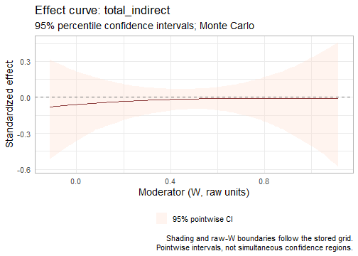

## Introduction

`wsMed()` fits multiple mediation and moderated mediation models for
two-condition within-subject designs. A complete call identifies the paired
mediator and outcome variables, selects the mediation structure, specifies
the estimation options, and, when needed, adds moderators or covariates.

This tutorial shows how to construct a `wsMed()` call one step at a time.
Each section begins with the same basic call and changes only the arguments
needed for the next part of the analysis.

## Quick start

The following example fits a parallel mediation model with two mediators.
It uses `example_data`, which is included in the package.


``` r
data("example_data", package = "wsMed")
```


``` r
result <- wsMed(
  data = example_data,
  M_C1 = c("A1", "B1"),
  M_C2 = c("A2", "B2"),
  Y_C1 = "C1",
  Y_C2 = "C2",
  form = "P",
  Na = "DE",
  ci_method = "mc",
  R = 5000,
  seed = 123
)

print(result)
```

The arguments in this call answer four basic questions:

- Which data set should be analyzed?
- Which columns contain the mediator and outcome measurements under the two
  conditions?
- What is the mediation structure?
- How should missing data and confidence intervals be handled?

The following sections explain how to answer each question.

## Step 1: Specify the repeated-measures variables

The data must be in wide format. Each row represents one participant, and
each repeated measure has a separate column for each condition.

The mediator names are supplied through `M_C1` and `M_C2`. Their positions
must match. For example:

```r
M_C1 = c("A1", "B1")
M_C2 = c("A2", "B2")
```

This tells `wsMed()` that `A1` and `A2` are the two measurements of the
first mediator, whereas `B1` and `B2` are the two measurements of the
second mediator. The outcome pair is supplied through `Y_C1` and `Y_C2`:

```r
Y_C1 = "C1"
Y_C2 = "C2"
```

The variable mapping in the quick-start example is therefore:

| Construct | Condition 1 | Condition 2 | Internal label |
|:----------|:------------|:------------|:---------------|
| A | `A1` | `A2` | `M1` |
| B | `B1` | `B2` | `M2` |
| C | `C1` | `C2` | `Y` |

The internal mediator labels are determined by position. If three mediators
are supplied as follows:

```r
M_C1 = c("A1", "B1", "C1")
M_C2 = c("A2", "B2", "C2")
```

then A, B, and C are labeled `M1`, `M2`, and `M3`, respectively. This
numbering is especially important when specifying a user-defined model in
Step 2.

`wsMed()` automatically prepares the difference and level components used
in the model. Users should supply the original condition-specific columns,
not manually computed difference or average scores.

## Step 2: Choose the mediation structure

The mediation structure is selected with `form`. Users can choose one of
four predefined structures or define the mediator paths themselves.

### Predefined models

The predefined options are:

| `form` | Structure | How the mediators are connected |
|:-------|:----------|:---------------------------------|
| `"P"` | Parallel | All mediators operate in parallel. |
| `"CN"` | Chained/serial | The mediators form one serial chain. |
| `"CP"` | Chained--parallel | The first mediator predicts multiple later mediators. |
| `"PC"` | Parallel--chained | Multiple mediators predict one final mediator. |

For a predefined model, the mediator order in `M_C1` and `M_C2` determines
their positions in the structure. To fit a different predefined structure,
replace the value of `form` in the basic call:

```r
form = "P"
form = "CN"
form = "CP"
form = "PC"
```

For example, the following call fits a three-mediator chained model:


``` r
result_chained <- wsMed(
  data = example_data,
  M_C1 = c("A1", "B1", "C1"),
  M_C2 = c("A2", "B2", "C2"),
  Y_C1 = "D1",
  Y_C2 = "D2",
  form = "CN",
  Na = "DE",
  ci_method = "mc",
  R = 5000,
  seed = 123
)
```

Here, the mediator order defines the chain from A (`M1`) to B (`M2`) and
then to C (`M3`).

### User-defined models

Use `form = "UD"` when the intended paths cannot be represented by one of
the four predefined structures. The mediator labels still come from the
order of `M_C1` and `M_C2`, but the paths are supplied through `paths`.

Suppose A, B, and C are the three mediators and the intended structure
contains:

- a path from A (`M1`) to C (`M3`);
- a path from C (`M3`) to the outcome; and
- a path from B (`M2`) to the outcome.

The path vector is:


``` r
custom_paths <- c(
  "M1 -> M3",
  "M3 -> Y",
  "M2 -> Y"
)
```

Pass this vector to `wsMed()` together with `form = "UD"`:


``` r
result_custom <- wsMed(
  data = example_data,
  M_C1 = c("A1", "B1", "C1"),
  M_C2 = c("A2", "B2", "C2"),
  Y_C1 = "D1",
  Y_C2 = "D2",
  form = "UD",
  paths = custom_paths,
  Na = "DE",
  ci_method = "mc",
  R = 5000,
  seed = 123
)
```

Only mediator-to-mediator and mediator-to-outcome paths are included in
`paths`. Do not add paths beginning with `X`: `wsMed()` automatically adds
the condition-to-mediator paths and the direct path from the condition to
the outcome.

The specified mediator structure must be acyclic. Detailed path rules,
parameter labels, generated equations, and indirect-effect definitions are
described in the `GenerateModelCustom()` vignette.

## Step 3: Choose the estimation options

After selecting the mediation structure, choose how to handle missing data,
construct confidence intervals, and, if required, standardize the effects.

### Missing data and confidence intervals

The `Na` argument selects the missing-data method, and `ci_method` selects
the confidence-interval method.

| `Na` | Missing-data method | Available `ci_method` |
|:-----|:--------------------|:----------------------|
| `"DE"` | Listwise deletion | `"mc"`, `"bootstrap"`, or `"both"` |
| `"FIML"` | Full-information maximum likelihood | `"mc"`, `"bootstrap"`, or `"both"` |
| `"MI"` | Multiple imputation | `"mc"` |

For a complete data analysis using Monte Carlo confidence intervals, use:

```r
Na = "DE"
ci_method = "mc"
R = 5000
seed = 123
```

`R` controls the number of Monte Carlo draws, and `seed` makes the results
reproducible.

To use bootstrap confidence intervals instead, use:

```r
Na = "DE"
ci_method = "bootstrap"
bootstrap = 2000
boot_ci_type = "perc"
iseed = 123
```

The supported values of `boot_ci_type` are `"perc"`, `"bc"`, and
`"bca.simple"`. Setting `ci_method = "both"` requests Monte Carlo and
bootstrap intervals in the same analysis.

The following code creates a copy of `example_data` with missing values for
the FIML and multiple-imputation examples:


``` r
set.seed(123)
example_data_missing <- example_data
analysis_variables <- c("A1", "A2", "B1", "B2", "C1", "C2")

for (variable in analysis_variables) {
  missing_rows <- sample(
    seq_len(nrow(example_data_missing)),
    size = ceiling(0.10 * nrow(example_data_missing))
  )
  example_data_missing[missing_rows, variable] <- NA_real_
}
```

For data with missing values, FIML can be requested by changing `Na`:


``` r
result_fiml <- wsMed(
  data = example_data_missing,
  M_C1 = c("A1", "B1"),
  M_C2 = c("A2", "B2"),
  Y_C1 = "C1",
  Y_C2 = "C2",
  form = "P",
  Na = "FIML",
  ci_method = "mc",
  R = 5000,
  seed = 123
)
```

For FIML with Monte Carlo intervals, use the default `MCmethod = "mc"`.
The current fitting pipeline does not activate a separate `"bootSD"` correction.

Multiple imputation is requested with `Na = "MI"`. Its controls are supplied
through `mi_args`:


``` r
result_mi <- wsMed(
  data = example_data_missing,
  M_C1 = c("A1", "B1"),
  M_C2 = c("A2", "B2"),
  Y_C1 = "C1",
  Y_C2 = "C2",
  form = "P",
  Na = "MI",
  ci_method = "mc",
  mi_args = list(
    m = 20,
    method_num = "pmm"
  ),
  R = 5000,
  seed = 123
)
```

Here, `m` is the number of imputed data sets and `method_num` is the
imputation method passed to the multiple-imputation procedure.

### Standardized effects

Set `standardized = TRUE` when standardized path coefficients and effects
are needed:


``` r
result_standardized <- wsMed(
  data = example_data,
  M_C1 = c("A1", "B1"),
  M_C2 = c("A2", "B2"),
  Y_C1 = "C1",
  Y_C2 = "C2",
  form = "P",
  Na = "DE",
  ci_method = "mc",
  R = 5000,
  standardized = TRUE,
  seed = 123
)
```

Standardization uses marginal model-implied SDs of the difference and
average components; differences are not recentered. A full indirect effect
is divided by the outcome-difference SD, including in serial models.
With a moderator, `standardized = TRUE` also adds `moderation_std` while
preserving raw conditional results in `moderation`. The parameter table
alone does not describe effects at all moderator values.

See [Standardized moderated mediation](StandardizedModeratedMediation.html)
for the scale definitions, executable examples and inference conventions.

## Step 4: Add optional model components

Moderators and covariates are added to the same `wsMed()` call. They do not
require a separate analysis workflow.

### Moderators

A moderated mediation analysis requires three arguments:

- `W` identifies the moderator variable;
- `W_type` specifies whether it is `"continuous"` or `"categorical"`; and
- `MP` identifies the paths moderated by `W`.

For example:


``` r
result_moderated <- wsMed(
  data = example_data,
  M_C1 = c("A1", "B1"),
  M_C2 = c("A2", "B2"),
  Y_C1 = "C1",
  Y_C2 = "C2",
  form = "CN",
  W = "D3",
  W_type = "continuous",
  MP = c("a1", "b_1_2", "b2", "cp"),
  Na = "DE",
  ci_method = "mc",
  R = 5000,
  standardized = TRUE,
  seed = 123
)
```

In this chained model, `a1` is the condition-to-`M1` path, `b_1_2` is the
`M1`-to-`M2` difference-component path, `b2` is the `M2`-to-outcome
difference-component path, and `cp` is the direct effect. Every label in
`MP` must correspond to a path that exists in the selected model.

The same arguments can be used with `form = "UD"`. For example, the
user-defined model in Step 2 contains the labels `b_1_3`, `b2`, and `b3`,
but it does not contain `b1` because `"M1 -> Y"` was not specified.

For a categorical moderator, change the relevant arguments:

```r
W = "Group"
W_type = "categorical"
```

After fitting a moderated model, `plot_moderation_curve()` can be used to
display conditional effects:


``` r
plot_moderation_curve(
  result_moderated,
  "indirect_effect_1_2"
)

plot_moderation_curve(
  result_moderated,
  "b_1_2"
)
```

The conditional indirect effect used by `plot_moderation_curve()` is named
`indirect_effect_1_2`; the corresponding indirect effect in the generated
SEM syntax is named `indirect_1_2`.

### Covariates

Within-subject covariates are supplied as matched pairs through `C_C1` and
`C_C2`. Between-subject covariates are supplied through `C`, with their type
identified by `C_type`.


``` r
result_covariates <- wsMed(
  data = example_data,
  M_C1 = c("A1", "B1"),
  M_C2 = c("A2", "B2"),
  Y_C1 = "C1",
  Y_C2 = "C2",
  form = "P",
  C_C1 = "D1",
  C_C2 = "D2",
  C = "D3",
  C_type = "continuous",
  Na = "DE",
  ci_method = "mc",
  R = 5000,
  seed = 123
)
```

In this example, `D1` and `D2` form one within-subject covariate, and `D3`
is a continuous between-subject covariate. The prepared covariate terms are
included in the mediator and outcome regressions.

## Step 5: Inspect the results

Print the fitted object to obtain the main analysis summary:


``` r
print(result)
```

Depending on the selected options, the printed output includes:

- the variables included in the analysis;
- model-fit information;
- regression paths;
- specific indirect effects;
- the total indirect effect;
- the direct and total effects;
- confidence intervals;
- standardized effects; and
- conditional effects for moderated models.

Use `printGM()` to display the generated model equations:


``` r
printGM(result)
```

Frequently used components of the fitted object can also be accessed
directly:


``` r
result$sem_model       # generated lavaan syntax
result$mc$fit          # fitted lavaan object
result$moderation      # moderation results, when requested
result$paths           # path vector when form = "UD"
```

The exact contents depend on the selected missing-data and
confidence-interval methods.

## Step 6: Interpret the printed results

This section uses two examples to explain the object returned by
`wsMed()`. Example 1 describes the output shared by analyses without an
external moderator. Example 2 then focuses on the additional output
produced when a continuous moderator is included.

The explanations follow the order of the sections printed by `print()`.
They describe what each section contains and how to locate the relevant
results; they are not substantive interpretations of the example data.

### Example 1: A model without an external moderator

The first example fits a parallel mediation model using multiple
imputation and Monte Carlo confidence intervals. Standardized results are
also requested so that all principal output sections are illustrated.


``` r
result4_mi <- wsMed(
  data = example_data_missing,
  M_C1 = c("A1", "B1"),
  M_C2 = c("A2", "B2"),
  Y_C1 = "C1",
  Y_C2 = "C2",
  form = "P",
  Na = "MI",
  ci_method = "mc",
  mi_args = list(
    m = 20,
    method_num = "pmm"
  ),
  R = 5000,
  standardized = TRUE,
  seed = 123
)

print(result4_mi)
#> 
#> 
#> *************** VARIABLES ***************
#> Outcome (Y):
#>    Condition 1: C1 
#>    Condition 2: C2 
#> Mediators (M):
#>   M1:
#>     Condition 1: A1
#>     Condition 2: A2
#>   M2:
#>     Condition 1: B1
#>     Condition 2: B2
#> Sample size (rows kept): 100 
#> 
#> 
#> *************** MODEL FIT ***************
#> 
#> 
#> |Measure   |  Value|
#> |:---------|------:|
#> |Chi-Sq    | 13.724|
#> |df        |  5.000|
#> |p         |  0.017|
#> |CFI       |  0.160|
#> |TLI       | -0.512|
#> |RMSEA     |  0.132|
#> |RMSEA Low |  0.051|
#> |RMSEA Up  |  0.218|
#> |SRMR      |  0.083|
#> 
#> 
#> ************* TOTAL / DIRECT / TOTAL-IND (MC) *************
#> 
#> 
#> |Label          | Estimate|    SE| 2.5%CI.Lo| 97.5%CI.Up|
#> |:--------------|--------:|-----:|---------:|----------:|
#> |Total effect   |    0.026| 0.018|    -0.010|      0.061|
#> |Direct effect  |    0.022| 0.017|    -0.013|      0.056|
#> |Total indirect |    0.004| 0.005|    -0.004|      0.015|
#> 
#> Indirect effects:
#> 
#> 
#> |Label | Estimate|    SE| 2.5%CI.Lo| 97.5%CI.Up|
#> |:-----|--------:|-----:|---------:|----------:|
#> |ind_1 |    0.004| 0.004|    -0.003|      0.014|
#> |ind_2 |   -0.000| 0.002|    -0.005|      0.004|
#> 
#> Indirect-effect key:
#> 
#> 
#> |Ind   |Path                 |
#> |:-----|:--------------------|
#> |ind_1 |X -> M1diff -> Ydiff |
#> |ind_2 |X -> M2diff -> Ydiff |
#> 
#> 
#> *************** MODERATION EFFECTS (d-paths, MC) ***************
#> 
#> 
#> |Coefficient | Estimate|    SE| 2.5%CI.Lo| 97.5%CI.Up|
#> |:-----------|--------:|-----:|---------:|----------:|
#> |d1          |    0.031| 0.105|    -0.171|      0.239|
#> |d2          |   -0.096| 0.089|    -0.271|      0.081|
#> 
#> 
#> *************** MODERATION KEY (d-paths) ***************
#> 
#> 
#> |Coefficient |Path           |Moderated       |
#> |:-----------|:--------------|:---------------|
#> |d1          |M1avg -> Ydiff |M1diff -> Ydiff |
#> |d2          |M2avg -> Ydiff |M2diff -> Ydiff |
#> 
#> UNSTANDARDIZED CONDITIONAL EFFECTS (mc)
#> Percentile intervals; moderator probes and centering references are held fixed.
#> 
#> 
#> *************** CONTRAST INDIRECT EFFECTS (No Moderator) ***************
#> 
#> 
#> |Contrast                  | Estimate|    SE| 2.5%CI.Lo| 97.5%CI.Up|
#> |:-------------------------|--------:|-----:|---------:|----------:|
#> |indirect_2  -  indirect_1 |   -0.004| 0.005|    -0.015|      0.004|
#> 
#> 
#> *************** C1-C2 COEFFICIENTS (No Moderator) ***************
#> 
#> 
#> |Coeff | Estimate|    SE| 2.5%CI.Lo| 97.5%CI.Up|
#> |:-----|--------:|-----:|---------:|----------:|
#> |X1_b1 |   -0.147| 0.105|    -0.348|      0.062|
#> |X0_b1 |   -0.178| 0.109|    -0.396|      0.033|
#> |X1_b2 |   -0.091| 0.105|    -0.298|      0.115|
#> |X0_b2 |    0.005| 0.102|    -0.192|      0.207|
#> 
#> 
#> *************** REGRESSION PATHS (MC) ***************
#> 
#> 
#> |Path           |Label | Estimate|    SE| 2.5%CI.Lo| 97.5%CI.Up|
#> |:--------------|:-----|--------:|-----:|---------:|----------:|
#> |Ydiff ~ M1diff |b1    |   -0.162| 0.094|    -0.345|      0.022|
#> |Ydiff ~ M1avg  |d1    |    0.031| 0.105|    -0.171|      0.239|
#> |Ydiff ~ M2diff |b2    |   -0.043| 0.094|    -0.224|      0.144|
#> |Ydiff ~ M2avg  |d2    |   -0.096| 0.089|    -0.271|      0.081|
#> 
#> 
#> *************** INTERCEPTS (MC) ***************
#> 
#> 
#> |Intercept |Label | Estimate|    SE| 2.5%CI.Lo| 97.5%CI.Up|
#> |:---------|:-----|--------:|-----:|---------:|----------:|
#> |Ydiff~1   |cp    |    0.022| 0.017|    -0.013|      0.056|
#> |M1diff~1  |a1    |   -0.025| 0.020|    -0.064|      0.014|
#> |M2diff~1  |a2    |    0.006| 0.020|    -0.033|      0.044|
#> |M1avg~1   |      |   -0.000| 0.018|    -0.036|      0.035|
#> |M2avg~1   |      |   -0.000| 0.020|    -0.039|      0.040|
#> 
#> 
#> *************** VARIANCES (MC) ***************
#> 
#> 
#> |Variance       |Label | Estimate|    SE| 2.5%CI.Lo| 97.5%CI.Up|
#> |:--------------|:-----|--------:|-----:|---------:|----------:|
#> |Ydiff~~Ydiff   |      |    0.024| 0.004|     0.017|      0.031|
#> |M1diff~~M1diff |      |    0.033| 0.006|     0.022|      0.045|
#> |M2diff~~M2diff |      |    0.033| 0.005|     0.023|      0.044|
#> |M1avg~~M1avg   |      |    0.033| 0.005|     0.024|      0.043|
#> |M2avg~~M2avg   |      |    0.040| 0.006|     0.028|      0.052|
#> 
#> 
#> *************** STANDARDIZED (MC) ***************
#> 
#> 
#> |Parameter      | Estimate|    SE|        R|   2.5%| 97.5%|
#> |:--------------|--------:|-----:|--------:|------:|-----:|
#> |cp             |    0.136| 0.110| 5000.000| -0.082| 0.358|
#> |b1             |   -0.185| 0.103| 5000.000| -0.379| 0.025|
#> |d1             |    0.035| 0.116| 5000.000| -0.196| 0.263|
#> |b2             |   -0.049| 0.105| 5000.000| -0.247| 0.156|
#> |d2             |   -0.121| 0.108| 5000.000| -0.325| 0.100|
#> |a1             |   -0.138| 0.112| 5000.000| -0.366| 0.074|
#> |a2             |    0.032| 0.110| 5000.000| -0.180| 0.250|
#> |Ydiff~~Ydiff   |    0.950| 0.052| 5000.000|  0.783| 0.983|
#> |M1diff~~M1diff |    1.000| 0.000| 5000.000|  1.000| 1.000|
#> |M2diff~~M2diff |    1.000| 0.000| 5000.000|  1.000| 1.000|
#> |M1avg~~M1avg   |    1.000| 0.000| 5000.000|  1.000| 1.000|
#> |M1avg~~M2avg   |    0.274| 0.096| 5000.000|  0.075| 0.455|
#> |M2avg~~M2avg   |    1.000| 0.000| 5000.000|  1.000| 1.000|
#> |M1avg~1        |   -0.000| 0.101| 5000.000| -0.199| 0.197|
#> |M2avg~1        |   -0.000| 0.102| 5000.000| -0.193| 0.201|
#> |indirect_1     |    0.026| 0.026| 5000.000| -0.017| 0.086|
#> |indirect_2     |   -0.002| 0.013| 5000.000| -0.029| 0.027|
#> |total_indirect |    0.024| 0.029| 5000.000| -0.027| 0.091|
#> |total_effect   |    0.160| 0.111| 5000.000| -0.063| 0.380|
```

The output sections and their main purposes are:

| Printed section | What it answers |
|:----------------|:----------------|
| `VARIABLES` | Which observed variables and how many cases were used? |
| `MODEL FIT` | How well does the complete SEM reproduce the observed covariance structure? |
| `TOTAL / DIRECT / TOTAL-IND` | What are the overall, direct, and combined indirect effects? |
| `Indirect effects` and `Indirect-effect key` | What is the estimate for each mediation route, and which route does each label represent? |
| `MODERATION EFFECTS (d-paths)` and its key | What are the level-component coefficients associated with the mediator paths? |
| `CONTRAST INDIRECT EFFECTS` | How do the specific indirect effects differ from one another? |
| `C1-C2 COEFFICIENTS` | What are the reconstructed coefficients for the two conditions? |
| `REGRESSION PATHS` | What are the estimates for the individual regression paths? |
| `INTERCEPTS` | What are the estimated difference-score intercepts, including the `a` and `cp` paths? |
| `VARIANCES` | What are the estimated residual variances? |
| `STANDARDIZED` | What are the standardized estimates and confidence intervals? |

The suffix in a heading identifies the requested confidence-interval
engine. For example, `(MC)` denotes Monte Carlo results. When bootstrap
intervals are requested, the corresponding bootstrap output is printed;
with `ci_method = "both"`, both sets of results can be returned.

#### Variables and analysis sample

The `VARIABLES` section restates the condition-specific outcome and
mediator columns. It also maps each mediator pair to its internal label
(`M1`, `M2`, and so on) and reports the number of rows retained for the
analysis.

This section should be checked before interpreting any estimates. In
particular, verify that:

- the Condition 1 and Condition 2 columns have not been reversed;
- the order of the mediator pairs matches the intended model; and
- the retained sample size is consistent with the selected missing-data
  method.

#### Model fit

The `MODEL FIT` section reports the model chi-squared statistic, degrees of
freedom, its \(p\) value, CFI, TLI, RMSEA with its confidence interval, and
SRMR. These indices evaluate the model as a whole; they do not test an
individual direct or indirect effect.

Fit indices should be interpreted in light of the fitted model. For a
just-identified or saturated model, global fit is perfect by construction
and does not provide evidence that the individual paths are substantively
appropriate.

#### Total, direct, and indirect effects

The `TOTAL / DIRECT / TOTAL-IND` section gives a compact decomposition:

\[
\text{total effect}
=
\text{direct effect}
+
\text{total indirect effect}.
\]

The rows have the following meanings:

- `Total effect` is the overall condition effect on the outcome
  difference.
- `Direct effect` is the remaining condition effect after accounting for
  the mediators; its model label is `cp`.
- `Total indirect` is the sum of all specific indirect effects identified
  by the selected mediation structure.

The `Indirect effects` table then reports each specific route separately.
The accompanying `Indirect-effect key` should be used to translate a
printed label into a path. For example, a key may map `ind_1` to
`X -> M1diff -> Ydiff`. For serial or user-defined models, a label can
refer to a route through more than one mediator.

Each row reports an estimate, its standard error, and confidence limits.
For an indirect effect, inference should be based on the confidence
interval for the complete product rather than on whether every component
path is individually significant. An interval that excludes zero provides
evidence that the corresponding effect differs from zero at the stated
confidence level.

#### Level-component paths and condition-specific coefficients

The printed heading `MODERATION EFFECTS (d-paths)` can appear even when no
external moderator was supplied through `W`. In this section, the
`d` coefficients are the effects of mediator level components, such as
`M1avg`, in the outcome or mediator-difference equation. They are part of
the within-subject parameterization and should not be confused with
moderation by a user-supplied variable.

The associated key maps each `d` label to its regression path. For a
direct mediator-to-outcome path, the difference-component and
level-component terms appear together, for example:

```text
Ydiff ~ b1 * M1diff + d1 * M1avg
```

The `C1-C2 COEFFICIENTS` section expresses this pair as coefficients for
the two conditions. It is useful when the research question concerns
whether the corresponding mediator-to-outcome relation is the same under
both conditions. The `b` coefficient summarizes the common component,
whereas the `d` coefficient captures the difference between the two
condition-specific coefficients.

#### Contrasts between indirect effects

When the model contains more than one specific indirect effect,
`CONTRAST INDIRECT EFFECTS` reports pairwise differences between them. A
contrast should be read according to the order shown in its label. For
example:

```text
indirect_2 - indirect_1
```

compares the second specific indirect effect with the first. Its confidence
interval evaluates the difference between the two effects, not whether
either effect separately differs from zero.

#### Regression paths, intercepts, and variances

`REGRESSION PATHS` lists the individual regression coefficients in the
generated SEM. The `Path` column shows the regression in `lavaan` notation,
whereas `Label` gives the name used elsewhere in the output and in `MP`.
Common labels include:

- `b1`, `b2`, and so on for mediator difference-component paths to the
  outcome;
- `d1`, `d2`, and so on for the corresponding level-component paths; and
- labels such as `b_1_2` and `d_1_2` for paths from one mediator to
  another.

`INTERCEPTS` contains the `a` paths and the direct effect because, after
the paired measurements are transformed, the condition effects are
represented as intercepts of the difference-score equations. Thus,
`a1` is found on the `M1diff ~ 1` row, and `cp` is found on the
`Ydiff ~ 1` row.

`VARIANCES` reports the estimated residual variances for the endogenous
difference components and any other modeled variables. These rows describe
unexplained variability; they are not additional mediation effects.

#### Standardized results

The `STANDARDIZED` section is printed when `standardized = TRUE`. It
contains standardized versions of the path coefficients and derived
effects, including the specific indirect, total indirect, and total
effects when available.

Standardized and unstandardized results answer different reporting needs.
Unstandardized estimates retain the scale of the original variables,
whereas standardized estimates facilitate comparisons across variables or
effects. A report should state explicitly which version is presented and
should not combine an unstandardized estimate with a standardized
confidence interval.

#### Inspecting and extracting Example 1

Use `printGM()` to connect the printed labels to the generated model:


``` r
printGM(result4_mi)
```

The returned object can also be inspected programmatically:


``` r
names(result4_mi)

result4_mi$input_vars    # variables supplied to wsMed()
result4_mi$sem_model     # generated lavaan syntax
result4_mi$mc$fit        # fitted lavaan model
result4_mi$mc$result     # Monte Carlo results
result4_mi$mc$std_mc     # standardized Monte Carlo results
```

`print(result4_mi)` is intended for reading the analysis summary, whereas
the stored components are intended for inspection or downstream
programming.

### Example 2: A model with a continuous moderator

The second example fits a chained--parallel model and adds `D3` as a
continuous moderator. The paths listed in `MP` are allowed to vary with
the moderator.


``` r
result5 <- wsMed(
  data = example_data_missing,
  M_C1 = c("A1", "B1", "C1"),
  M_C2 = c("A2", "B2", "C2"),
  Y_C1 = "D1",
  Y_C2 = "D2",
  form = "CP",
  W = "D3",
  W_type = "continuous",
  MP = c("a1", "b2", "d1", "cp", "b_1_2", "d_1_2"),
  Na = "DE",
  ci_method = "mc",
  R = 5000,
  standardized = TRUE,
  seed = 123
)

print(result5)
#> 
#> 
#> *************** VARIABLES ***************
#> Outcome (Y):
#>    Condition 1: D1 
#>    Condition 2: D2 
#> Mediators (M):
#>   M1:
#>     Condition 1: A1
#>     Condition 2: A2
#>   M2:
#>     Condition 1: B1
#>     Condition 2: B2
#>   M3:
#>     Condition 1: C1
#>     Condition 2: C2
#> Moderators (W):
#>    W1 : D3 
#> Sample size (rows kept): 100 
#> 
#> 
#> *************** MODEL FIT ***************
#> 
#> 
#> |Measure   |  Value|
#> |:---------|------:|
#> |Chi-Sq    | 14.576|
#> |df        | 16.000|
#> |p         |  0.556|
#> |CFI       |  1.000|
#> |TLI       | -2.294|
#> |RMSEA     |  0.000|
#> |RMSEA Low |  0.000|
#> |RMSEA Up  |  0.111|
#> |SRMR      |  0.048|
#> 
#> 
#> ************* TOTAL / DIRECT / TOTAL-IND (MC) *************
#> 
#> 
#> |Label          | Estimate|    SE| 2.5%CI.Lo| 97.5%CI.Up|
#> |:--------------|--------:|-----:|---------:|----------:|
#> |Total effect   |   -0.032| 0.024|    -0.079|      0.015|
#> |Direct effect  |   -0.029| 0.023|    -0.074|      0.017|
#> |Total indirect |   -0.003| 0.008|    -0.019|      0.013|
#> 
#> Indirect effects:
#> 
#> 
#> |Label   | Estimate|    SE| 2.5%CI.Lo| 97.5%CI.Up|
#> |:-------|--------:|-----:|---------:|----------:|
#> |ind_1   |    0.002| 0.005|    -0.006|      0.015|
#> |ind_2   |    0.000| 0.003|    -0.007|      0.007|
#> |ind_1_2 |   -0.000| 0.002|    -0.003|      0.003|
#> |ind_3   |   -0.004| 0.006|    -0.019|      0.005|
#> |ind_1_3 |   -0.001| 0.001|    -0.004|      0.001|
#> 
#> Indirect-effect key:
#> 
#> 
#> |Ind     |Path                           |
#> |:-------|:------------------------------|
#> |ind_1   |X -> M1diff -> Ydiff           |
#> |ind_2   |X -> M2diff -> Ydiff           |
#> |ind_1_2 |X -> M1diff -> M2diff -> Ydiff |
#> |ind_3   |X -> M3diff -> Ydiff           |
#> |ind_1_3 |X -> M1diff -> M3diff -> Ydiff |
#> 
#> 
#> *************** MODERATION EFFECTS (d-paths, MC) ***************
#> 
#> 
#> |Coefficient | Estimate|    SE| 2.5%CI.Lo| 97.5%CI.Up|
#> |:-----------|--------:|-----:|---------:|----------:|
#> |d1          |   -0.040| 0.126|    -0.279|      0.208|
#> |d2          |   -0.000| 0.128|    -0.252|      0.244|
#> |d3          |   -0.160| 0.139|    -0.434|      0.114|
#> |d_1_2       |   -0.044| 0.108|    -0.253|      0.169|
#> |d_1_3       |    0.088| 0.114|    -0.130|      0.316|
#> 
#> 
#> *************** MODERATION KEY (d-paths) ***************
#> 
#> 
#> |Coefficient |Path            |Moderated        |
#> |:-----------|:---------------|:----------------|
#> |d1          |M1avg -> Ydiff  |M1diff -> Ydiff  |
#> |d2          |M2avg -> Ydiff  |M2diff -> Ydiff  |
#> |d3          |M3avg -> Ydiff  |M3diff -> Ydiff  |
#> |d_1_2       |M1avg -> M2diff |M1diff -> M2diff |
#> |d_1_3       |M1avg -> M3diff |M1diff -> M3diff |
#> 
#> UNSTANDARDIZED CONDITIONAL EFFECTS (mc)
#> Percentile intervals; moderator probes and centering references are held fixed.
#> 
#> 
#> *************** MODERATION RESULTS (Continuous Moderator) ***************
#> 
#> --- Moderated Coefficients ---
#> 
#> 
#> |Path      |BaseCoef |W_dummy | Estimate|    SE| 2.5%CI.Lo| 97.5%CI.Up|Sig |
#> |:---------|:--------|:-------|--------:|-----:|---------:|----------:|:---|
#> |cpw_W1    |cp       |D3      |   -0.173| 0.099|    -0.370|      0.023|    |
#> |dw1_W1    |d1       |D3      |   -0.114| 0.656|    -1.413|      1.194|    |
#> |bw2_W1    |b2       |D3      |   -0.514| 0.660|    -1.813|      0.772|    |
#> |aw1_W1    |a1       |D3      |    0.056| 0.100|    -0.142|      0.255|    |
#> |aw2_W1    |a2       |D3      |    0.007| 0.099|    -0.189|      0.191|    |
#> |bw_1_2_W1 |b_1_2    |D3      |   -0.300| 0.557|    -1.390|      0.790|    |
#> |dw_1_2_W1 |d_1_2    |D3      |    0.593| 0.597|    -0.603|      1.742|    |
#> |aw3_W1    |a3       |D3      |   -0.081| 0.095|    -0.271|      0.103|    |
#> 
#> --- Conditional Indirect Effects ---
#> 
#> 
#> |Path                |Mediators | Level| W_value| Estimate|    SE| 2.5.%CI.Lo| 97.5.%CI.Up|Sig |
#> |:-------------------|:---------|-----:|-------:|--------:|-----:|----------:|-----------:|:---|
#> |indirect_effect_1   |1         | -1 SD|   0.223|    0.003| 0.007|     -0.009|       0.021|    |
#> |indirect_effect_1   |1         |  0 SD|   0.452|    0.002| 0.005|     -0.006|       0.015|    |
#> |indirect_effect_1   |1         | +1 SD|   0.681|    0.001| 0.005|     -0.008|       0.015|    |
#> |indirect_effect_1_2 |1 2       | -1 SD|   0.223|   -0.002| 0.005|     -0.014|       0.006|    |
#> |indirect_effect_1_2 |1 2       |  0 SD|   0.452|   -0.000| 0.002|     -0.003|       0.003|    |
#> |indirect_effect_1_2 |1 2       | +1 SD|   0.681|    0.000| 0.002|     -0.004|       0.006|    |
#> |indirect_effect_1_3 |1 3       | -1 SD|   0.223|   -0.001| 0.002|     -0.006|       0.001|    |
#> |indirect_effect_1_3 |1 3       |  0 SD|   0.452|   -0.001| 0.001|     -0.004|       0.001|    |
#> |indirect_effect_1_3 |1 3       | +1 SD|   0.681|   -0.000| 0.001|     -0.004|       0.002|    |
#> |indirect_effect_2   |2         | -1 SD|   0.223|    0.001| 0.008|     -0.014|       0.021|    |
#> |indirect_effect_2   |2         |  0 SD|   0.452|    0.000| 0.003|     -0.007|       0.007|    |
#> |indirect_effect_2   |2         | +1 SD|   0.681|   -0.002| 0.008|     -0.021|       0.013|    |
#> |indirect_effect_3   |3         | -1 SD|   0.223|   -0.008| 0.009|     -0.030|       0.006|    |
#> |indirect_effect_3   |3         |  0 SD|   0.452|   -0.004| 0.006|     -0.019|       0.005|    |
#> |indirect_effect_3   |3         | +1 SD|   0.681|   -0.001| 0.007|     -0.016|       0.013|    |
#> 
#> --- Indirect Effect Contrasts ---
#> 
#> 
#> |Path                |            Contrast| Estimate|    SE| 2.5%CI.Lo| 97.5%CI.Up|Sig |
#> |:-------------------|-------------------:|--------:|-----:|---------:|----------:|:---|
#> |indirect_effect_1   | (0 SD)   -  (-1 SD)|   -0.001| 0.004|    -0.011|      0.006|    |
#> |indirect_effect_1   | (+1 SD)  -  (-1 SD)|   -0.002| 0.008|    -0.022|      0.013|    |
#> |indirect_effect_1   | (+1 SD)  -   (0 SD)|   -0.001| 0.004|    -0.011|      0.006|    |
#> |indirect_effect_1_2 | (0 SD)   -  (-1 SD)|    0.002| 0.004|    -0.005|      0.013|    |
#> |indirect_effect_1_2 | (+1 SD)  -  (-1 SD)|    0.002| 0.005|    -0.007|      0.016|    |
#> |indirect_effect_1_2 | (+1 SD)  -   (0 SD)|    0.000| 0.002|    -0.004|      0.006|    |
#> |indirect_effect_1_3 | (0 SD)   -  (-1 SD)|    0.000| 0.001|    -0.001|      0.003|    |
#> |indirect_effect_1_3 | (+1 SD)  -  (-1 SD)|    0.001| 0.002|    -0.003|      0.006|    |
#> |indirect_effect_1_3 | (+1 SD)  -   (0 SD)|    0.000| 0.001|    -0.001|      0.003|    |
#> |indirect_effect_2   | (0 SD)   -  (-1 SD)|   -0.001| 0.007|    -0.019|      0.013|    |
#> |indirect_effect_2   | (+1 SD)  -  (-1 SD)|   -0.003| 0.011|    -0.029|      0.017|    |
#> |indirect_effect_2   | (+1 SD)  -   (0 SD)|   -0.002| 0.007|    -0.019|      0.011|    |
#> |indirect_effect_3   | (0 SD)   -  (-1 SD)|    0.003| 0.006|    -0.005|      0.017|    |
#> |indirect_effect_3   | (+1 SD)  -  (-1 SD)|    0.007| 0.011|    -0.011|      0.034|    |
#> |indirect_effect_3   | (+1 SD)  -   (0 SD)|    0.003| 0.006|    -0.005|      0.017|    |
#> 
#> --- Moderated Path Coefficients ---
#> 
#> 
#> |Path  | Level| W_value| Estimate|    SE| 2.5.%CI.Lo| 97.5.%CI.Up|Sig |
#> |:-----|-----:|-------:|--------:|-----:|----------:|-----------:|:---|
#> |a1    | -1 SD|   0.223|   -0.039| 0.033|     -0.103|       0.028|    |
#> |a1    |  0 SD|   0.452|   -0.026| 0.023|     -0.072|       0.018|    |
#> |a1    | +1 SD|   0.681|   -0.013| 0.032|     -0.077|       0.049|    |
#> |b2    | -1 SD|   0.223|    0.119| 0.206|     -0.300|       0.514|    |
#> |b2    |  0 SD|   0.452|    0.002| 0.137|     -0.265|       0.272|    |
#> |b2    | +1 SD|   0.681|   -0.116| 0.202|     -0.501|       0.291|    |
#> |d1    | -1 SD|   0.223|   -0.014| 0.204|     -0.414|       0.388|    |
#> |d1    |  0 SD|   0.452|   -0.040| 0.126|     -0.279|       0.208|    |
#> |d1    | +1 SD|   0.681|   -0.066| 0.187|     -0.424|       0.310|    |
#> |cp    | -1 SD|   0.223|    0.010| 0.033|     -0.054|       0.075|    |
#> |cp    |  0 SD|   0.452|   -0.029| 0.023|     -0.074|       0.017|    |
#> |cp    | +1 SD|   0.681|   -0.069| 0.032|     -0.131|      -0.006|*   |
#> |b_1_2 | -1 SD|   0.223|    0.375| 0.173|      0.042|       0.718|*   |
#> |b_1_2 |  0 SD|   0.452|    0.306| 0.118|      0.076|       0.540|*   |
#> |b_1_2 | +1 SD|   0.681|    0.237| 0.175|     -0.110|       0.579|    |
#> |d_1_2 | -1 SD|   0.223|   -0.180| 0.171|     -0.514|       0.160|    |
#> |d_1_2 |  0 SD|   0.452|   -0.044| 0.108|     -0.253|       0.169|    |
#> |d_1_2 | +1 SD|   0.681|    0.092| 0.177|     -0.251|       0.431|    |
#> |a2    | -1 SD|   0.223|    0.012| 0.032|     -0.051|       0.076|    |
#> |a2    |  0 SD|   0.452|    0.014| 0.021|     -0.027|       0.056|    |
#> |a2    | +1 SD|   0.681|    0.015| 0.030|     -0.045|       0.073|    |
#> |a3    | -1 SD|   0.223|    0.041| 0.032|     -0.022|       0.103|    |
#> |a3    |  0 SD|   0.452|    0.023| 0.022|     -0.019|       0.064|    |
#> |a3    | +1 SD|   0.681|    0.004| 0.030|     -0.053|       0.063|    |
#> 
#> --- Path Coefficient Contrasts ---
#> 
#> 
#> |Path  |            Contrast| Estimate|    SE| 2.5%CI.Lo| 97.5%CI.Up|Sig |
#> |:-----|-------------------:|--------:|-----:|---------:|----------:|:---|
#> |a1    | (0 SD)   -  (-1 SD)|    0.013| 0.023|    -0.033|      0.058|    |
#> |a1    | (+1 SD)  -  (-1 SD)|    0.025| 0.046|    -0.065|      0.117|    |
#> |a1    | (+1 SD)  -   (0 SD)|    0.013| 0.023|    -0.033|      0.058|    |
#> |a2    | (0 SD)   -  (-1 SD)|    0.002| 0.023|    -0.043|      0.044|    |
#> |a2    | (+1 SD)  -  (-1 SD)|    0.003| 0.046|    -0.086|      0.088|    |
#> |a2    | (+1 SD)  -   (0 SD)|    0.002| 0.023|    -0.043|      0.044|    |
#> |a3    | (0 SD)   -  (-1 SD)|   -0.019| 0.022|    -0.062|      0.024|    |
#> |a3    | (+1 SD)  -  (-1 SD)|   -0.037| 0.044|    -0.124|      0.047|    |
#> |a3    | (+1 SD)  -   (0 SD)|   -0.019| 0.022|    -0.062|      0.024|    |
#> |b_1_2 | (0 SD)   -  (-1 SD)|   -0.069| 0.128|    -0.319|      0.181|    |
#> |b_1_2 | (+1 SD)  -  (-1 SD)|   -0.138| 0.255|    -0.637|      0.362|    |
#> |b_1_2 | (+1 SD)  -   (0 SD)|   -0.069| 0.128|    -0.319|      0.181|    |
#> |b2    | (0 SD)   -  (-1 SD)|   -0.118| 0.151|    -0.416|      0.177|    |
#> |b2    | (+1 SD)  -  (-1 SD)|   -0.236| 0.303|    -0.831|      0.354|    |
#> |b2    | (+1 SD)  -   (0 SD)|   -0.118| 0.151|    -0.416|      0.177|    |
#> |cp    | (0 SD)   -  (-1 SD)|   -0.040| 0.023|    -0.085|      0.005|    |
#> |cp    | (+1 SD)  -  (-1 SD)|   -0.079| 0.045|    -0.170|      0.010|    |
#> |cp    | (+1 SD)  -   (0 SD)|   -0.040| 0.023|    -0.085|      0.005|    |
#> |d_1_2 | (0 SD)   -  (-1 SD)|    0.136| 0.137|    -0.138|      0.399|    |
#> |d_1_2 | (+1 SD)  -  (-1 SD)|    0.272| 0.274|    -0.276|      0.799|    |
#> |d_1_2 | (+1 SD)  -   (0 SD)|    0.136| 0.137|    -0.138|      0.399|    |
#> |d1    | (0 SD)   -  (-1 SD)|   -0.026| 0.150|    -0.324|      0.274|    |
#> |d1    | (+1 SD)  -  (-1 SD)|   -0.052| 0.301|    -0.648|      0.547|    |
#> |d1    | (+1 SD)  -   (0 SD)|   -0.026| 0.150|    -0.324|      0.274|    |
#> 
#> --- Conditional Total Effect and Total Indirect Effect ---
#> 
#> 
#> |Effect         | Level| W_value| Estimate|    SE| 2.5.%CI.Lo| 97.5.%CI.Up|Sig |
#> |:--------------|-----:|-------:|--------:|-----:|----------:|-----------:|:---|
#> |total_indirect | -1 SD|   0.223|   -0.006| 0.013|     -0.034|       0.019|    |
#> |total_indirect |  0 SD|   0.452|   -0.003| 0.008|     -0.019|       0.013|    |
#> |total_indirect | +1 SD|   0.681|   -0.001| 0.011|     -0.026|       0.021|    |
#> |total_effect   | -1 SD|   0.223|    0.005| 0.034|     -0.062|       0.075|    |
#> |total_effect   |  0 SD|   0.452|   -0.032| 0.024|     -0.079|       0.015|    |
#> |total_effect   | +1 SD|   0.681|   -0.071| 0.033|     -0.137|      -0.005|*   |
#> 
#> STANDARDIZED CONDITIONAL EFFECTS (mc)
#> Marginal endpoint scales; fixed raw W probes; percentile intervals.
#> Moderation coefficients: per SD of continuous W; categorical contrasts keep 0/1 units.
#> 
#> 
#> *************** MODERATION RESULTS (Continuous Moderator) ***************
#> 
#> --- Moderated Coefficients ---
#> 
#> 
#> |Path      |BaseCoef |W_dummy | Estimate|    SE| 2.5%CI.Lo| 97.5%CI.Up|Sig |
#> |:---------|:--------|:-------|--------:|-----:|---------:|----------:|:---|
#> |cpw_W1    |cp       |D3      |   -0.224| 0.119|    -0.439|      0.029|    |
#> |dw1_W1    |d1       |D3      |   -0.029| 0.158|    -0.335|      0.287|    |
#> |bw2_W1    |b2       |D3      |   -0.113| 0.141|    -0.392|      0.164|    |
#> |aw1_W1    |a1       |D3      |    0.073| 0.130|    -0.187|      0.327|    |
#> |aw2_W1    |a2       |D3      |    0.010| 0.132|    -0.254|      0.259|    |
#> |bw_1_2_W1 |b_1_2    |D3      |   -0.073| 0.131|    -0.328|      0.190|    |
#> |dw_1_2_W1 |d_1_2    |D3      |    0.160| 0.155|    -0.156|      0.462|    |
#> |aw3_W1    |a3       |D3      |   -0.111| 0.128|    -0.366|      0.141|    |
#> 
#> --- Conditional Indirect Effects ---
#> 
#> 
#> |Path                |Mediators | Level| W_value| Estimate|    SE| 2.5.%CI.Lo| 97.5.%CI.Up|Sig |
#> |:-------------------|:---------|-----:|-------:|--------:|-----:|----------:|-----------:|:---|
#> |indirect_effect_1   |1         | -1 SD|   0.223|    0.019| 0.039|     -0.047|       0.112|    |
#> |indirect_effect_1   |1         |  0 SD|   0.452|    0.012| 0.027|     -0.032|       0.079|    |
#> |indirect_effect_1   |1         | +1 SD|   0.681|    0.006| 0.029|     -0.043|       0.076|    |
#> |indirect_effect_1_2 |1 2       | -1 SD|   0.223|   -0.010| 0.026|     -0.073|       0.033|    |
#> |indirect_effect_1_2 |1 2       |  0 SD|   0.452|   -0.000| 0.008|     -0.018|       0.017|    |
#> |indirect_effect_1_2 |1 2       | +1 SD|   0.681|    0.002| 0.012|     -0.021|       0.032|    |
#> |indirect_effect_1_3 |1 3       | -1 SD|   0.223|   -0.006| 0.010|     -0.032|       0.008|    |
#> |indirect_effect_1_3 |1 3       |  0 SD|   0.452|   -0.004| 0.007|     -0.023|       0.005|    |
#> |indirect_effect_1_3 |1 3       | +1 SD|   0.681|   -0.002| 0.008|     -0.021|       0.011|    |
#> |indirect_effect_2   |2         | -1 SD|   0.223|    0.008| 0.043|     -0.073|       0.110|    |
#> |indirect_effect_2   |2         |  0 SD|   0.452|    0.000| 0.018|     -0.039|       0.039|    |
#> |indirect_effect_2   |2         | +1 SD|   0.681|   -0.010| 0.040|     -0.108|       0.068|    |
#> |indirect_effect_3   |3         | -1 SD|   0.223|   -0.042| 0.048|     -0.156|       0.031|    |
#> |indirect_effect_3   |3         |  0 SD|   0.452|   -0.023| 0.030|     -0.098|       0.026|    |
#> |indirect_effect_3   |3         | +1 SD|   0.681|   -0.004| 0.035|     -0.081|       0.070|    |
#> 
#> --- Indirect Effect Contrasts ---
#> 
#> 
#> |Path                |            Contrast| Estimate|    SE| 2.5%CI.Lo| 97.5%CI.Up|Sig |
#> |:-------------------|-------------------:|--------:|-----:|---------:|----------:|:---|
#> |indirect_effect_1   | (0 SD)   -  (-1 SD)|   -0.006| 0.021|    -0.056|      0.033|    |
#> |indirect_effect_1   | (+1 SD)  -  (-1 SD)|   -0.012| 0.042|    -0.111|      0.067|    |
#> |indirect_effect_1   | (+1 SD)  -   (0 SD)|   -0.006| 0.021|    -0.056|      0.033|    |
#> |indirect_effect_1_2 | (0 SD)   -  (-1 SD)|    0.010| 0.022|    -0.025|      0.065|    |
#> |indirect_effect_1_2 | (+1 SD)  -  (-1 SD)|    0.012| 0.029|    -0.037|      0.082|    |
#> |indirect_effect_1_2 | (+1 SD)  -   (0 SD)|    0.002| 0.012|    -0.021|      0.030|    |
#> |indirect_effect_1_3 | (0 SD)   -  (-1 SD)|    0.002| 0.006|    -0.007|      0.016|    |
#> |indirect_effect_1_3 | (+1 SD)  -  (-1 SD)|    0.004| 0.012|    -0.014|      0.032|    |
#> |indirect_effect_1_3 | (+1 SD)  -   (0 SD)|    0.002| 0.006|    -0.007|      0.016|    |
#> |indirect_effect_2   | (0 SD)   -  (-1 SD)|   -0.008| 0.038|    -0.096|      0.067|    |
#> |indirect_effect_2   | (+1 SD)  -  (-1 SD)|   -0.018| 0.059|    -0.148|      0.091|    |
#> |indirect_effect_2   | (+1 SD)  -   (0 SD)|   -0.010| 0.036|    -0.095|      0.060|    |
#> |indirect_effect_3   | (0 SD)   -  (-1 SD)|    0.019| 0.029|    -0.028|      0.089|    |
#> |indirect_effect_3   | (+1 SD)  -  (-1 SD)|    0.038| 0.058|    -0.056|      0.178|    |
#> |indirect_effect_3   | (+1 SD)  -   (0 SD)|    0.019| 0.029|    -0.028|      0.089|    |
#> 
#> --- Moderated Path Coefficients ---
#> 
#> 
#> |Path  | Level| W_value| Estimate|    SE| 2.5.%CI.Lo| 97.5.%CI.Up|Sig |
#> |:-----|-----:|-------:|--------:|-----:|----------:|-----------:|:---|
#> |a1    | -1 SD|   0.223|   -0.220| 0.188|     -0.588|       0.155|    |
#> |a1    |  0 SD|   0.452|   -0.148| 0.135|     -0.414|       0.104|    |
#> |a1    | +1 SD|   0.681|   -0.075| 0.185|     -0.447|       0.272|    |
#> |b2    | -1 SD|   0.223|    0.113| 0.189|     -0.272|       0.469|    |
#> |b2    |  0 SD|   0.452|    0.001| 0.126|     -0.243|       0.249|    |
#> |b2    | +1 SD|   0.681|   -0.110| 0.187|     -0.467|       0.270|    |
#> |d1    | -1 SD|   0.223|   -0.016| 0.212|     -0.424|       0.407|    |
#> |d1    |  0 SD|   0.452|   -0.044| 0.130|     -0.292|       0.222|    |
#> |d1    | +1 SD|   0.681|   -0.073| 0.194|     -0.437|       0.323|    |
#> |cp    | -1 SD|   0.223|    0.057| 0.175|     -0.291|       0.392|    |
#> |cp    |  0 SD|   0.452|   -0.165| 0.125|     -0.411|       0.091|    |
#> |cp    | +1 SD|   0.681|   -0.387| 0.168|     -0.689|      -0.035|*   |
#> |b_1_2 | -1 SD|   0.223|    0.391| 0.171|      0.042|       0.718|*   |
#> |b_1_2 |  0 SD|   0.452|    0.319| 0.114|      0.077|       0.528|*   |
#> |b_1_2 | +1 SD|   0.681|    0.248| 0.175|     -0.114|       0.584|    |
#> |d_1_2 | -1 SD|   0.223|   -0.209| 0.190|     -0.567|       0.183|    |
#> |d_1_2 |  0 SD|   0.452|   -0.051| 0.121|     -0.275|       0.187|    |
#> |d_1_2 | +1 SD|   0.681|    0.107| 0.199|     -0.277|       0.486|    |
#> |a2    | -1 SD|   0.223|    0.071| 0.185|     -0.292|       0.439|    |
#> |a2    |  0 SD|   0.452|    0.081| 0.124|     -0.156|       0.324|    |
#> |a2    | +1 SD|   0.681|    0.091| 0.174|     -0.258|       0.420|    |
#> |a3    | -1 SD|   0.223|    0.246| 0.186|     -0.125|       0.603|    |
#> |a3    |  0 SD|   0.452|    0.136| 0.129|     -0.114|       0.393|    |
#> |a3    | +1 SD|   0.681|    0.026| 0.174|     -0.299|       0.382|    |
#> 
#> --- Path Coefficient Contrasts ---
#> 
#> 
#> |Path  |            Contrast| Estimate|    SE| 2.5%CI.Lo| 97.5%CI.Up|Sig |
#> |:-----|-------------------:|--------:|-----:|---------:|----------:|:---|
#> |a1    | (0 SD)   -  (-1 SD)|    0.072| 0.129|    -0.181|      0.318|    |
#> |a1    | (+1 SD)  -  (-1 SD)|    0.145| 0.257|    -0.362|      0.635|    |
#> |a1    | (+1 SD)  -   (0 SD)|    0.072| 0.129|    -0.181|      0.318|    |
#> |a2    | (0 SD)   -  (-1 SD)|    0.010| 0.130|    -0.250|      0.250|    |
#> |a2    | (+1 SD)  -  (-1 SD)|    0.020| 0.260|    -0.499|      0.501|    |
#> |a2    | (+1 SD)  -   (0 SD)|    0.010| 0.130|    -0.250|      0.250|    |
#> |a3    | (0 SD)   -  (-1 SD)|   -0.110| 0.126|    -0.357|      0.142|    |
#> |a3    | (+1 SD)  -  (-1 SD)|   -0.220| 0.252|    -0.713|      0.283|    |
#> |a3    | (+1 SD)  -   (0 SD)|   -0.110| 0.126|    -0.357|      0.142|    |
#> |b_1_2 | (0 SD)   -  (-1 SD)|   -0.072| 0.130|    -0.323|      0.186|    |
#> |b_1_2 | (+1 SD)  -  (-1 SD)|   -0.144| 0.259|    -0.647|      0.372|    |
#> |b_1_2 | (+1 SD)  -   (0 SD)|   -0.072| 0.130|    -0.323|      0.186|    |
#> |b2    | (0 SD)   -  (-1 SD)|   -0.111| 0.140|    -0.377|      0.159|    |
#> |b2    | (+1 SD)  -  (-1 SD)|   -0.223| 0.280|    -0.755|      0.319|    |
#> |b2    | (+1 SD)  -   (0 SD)|   -0.111| 0.140|    -0.377|      0.159|    |
#> |cp    | (0 SD)   -  (-1 SD)|   -0.222| 0.117|    -0.429|      0.028|    |
#> |cp    | (+1 SD)  -  (-1 SD)|   -0.444| 0.234|    -0.858|      0.056|    |
#> |cp    | (+1 SD)  -   (0 SD)|   -0.222| 0.117|    -0.429|      0.028|    |
#> |d_1_2 | (0 SD)   -  (-1 SD)|    0.158| 0.153|    -0.155|      0.447|    |
#> |d_1_2 | (+1 SD)  -  (-1 SD)|    0.316| 0.305|    -0.309|      0.894|    |
#> |d_1_2 | (+1 SD)  -   (0 SD)|    0.158| 0.153|    -0.155|      0.447|    |
#> |d1    | (0 SD)   -  (-1 SD)|   -0.029| 0.156|    -0.326|      0.283|    |
#> |d1    | (+1 SD)  -  (-1 SD)|   -0.057| 0.312|    -0.653|      0.566|    |
#> |d1    | (+1 SD)  -   (0 SD)|   -0.029| 0.156|    -0.326|      0.283|    |
#> 
#> --- Conditional Total Effect and Total Indirect Effect ---
#> 
#> 
#> |Effect         | Level| W_value| Estimate|    SE| 2.5.%CI.Lo| 97.5.%CI.Up|Sig |
#> |:--------------|-----:|-------:|--------:|-----:|----------:|-----------:|:---|
#> |total_indirect | -1 SD|   0.223|   -0.031| 0.071|     -0.179|       0.102|    |
#> |total_indirect |  0 SD|   0.452|   -0.015| 0.042|     -0.102|       0.069|    |
#> |total_indirect | +1 SD|   0.681|   -0.008| 0.060|     -0.133|       0.110|    |
#> |total_effect   | -1 SD|   0.223|    0.026| 0.180|     -0.339|       0.385|    |
#> |total_effect   |  0 SD|   0.452|   -0.180| 0.126|     -0.425|       0.080|    |
#> |total_effect   | +1 SD|   0.681|   -0.395| 0.175|     -0.711|      -0.025|*   |
#> 
#> 
#> *************** REGRESSION PATHS (MC) ***************
#> 
#> 
#> |Path                   |Label     | Estimate|    SE| 2.5%CI.Lo| 97.5%CI.Up|
#> |:----------------------|:---------|--------:|-----:|---------:|----------:|
#> |Ydiff ~ M1diff         |b1        |   -0.085| 0.133|    -0.350|      0.169|
#> |Ydiff ~ M1avg          |d1        |   -0.040| 0.126|    -0.279|      0.208|
#> |Ydiff ~ M2diff         |b2        |    0.002| 0.137|    -0.265|      0.272|
#> |Ydiff ~ M2avg          |d2        |   -0.000| 0.128|    -0.252|      0.244|
#> |Ydiff ~ M3diff         |b3        |   -0.182| 0.133|    -0.434|      0.087|
#> |Ydiff ~ M3avg          |d3        |   -0.160| 0.139|    -0.434|      0.114|
#> |Ydiff ~ W1             |cpw_W1    |   -0.173| 0.099|    -0.370|      0.023|
#> |Ydiff ~ int_M1avg_W1   |dw1_W1    |   -0.114| 0.656|    -1.413|      1.194|
#> |Ydiff ~ int_M2diff_W1  |bw2_W1    |   -0.514| 0.660|    -1.813|      0.772|
#> |M1diff ~ W1            |aw1_W1    |    0.056| 0.100|    -0.142|      0.255|
#> |M2diff ~ M1diff        |b_1_2     |    0.306| 0.118|     0.076|      0.540|
#> |M2diff ~ M1avg         |d_1_2     |   -0.044| 0.108|    -0.253|      0.169|
#> |M2diff ~ W1            |aw2_W1    |    0.007| 0.099|    -0.189|      0.191|
#> |M2diff ~ int_M1diff_W1 |bw_1_2_W1 |   -0.300| 0.557|    -1.390|      0.790|
#> |M2diff ~ int_M1avg_W1  |dw_1_2_W1 |    0.593| 0.597|    -0.603|      1.742|
#> |M3diff ~ M1diff        |b_1_3     |   -0.147| 0.123|    -0.388|      0.095|
#> |M3diff ~ M1avg         |d_1_3     |    0.088| 0.114|    -0.130|      0.316|
#> |M3diff ~ W1            |aw3_W1    |   -0.081| 0.095|    -0.271|      0.103|
#> 
#> 
#> *************** INTERCEPTS (MC) ***************
#> 
#> 
#> |Intercept       |Label | Estimate|    SE| 2.5%CI.Lo| 97.5%CI.Up|
#> |:---------------|:-----|--------:|-----:|---------:|----------:|
#> |Ydiff~1         |cp    |   -0.029| 0.023|    -0.074|      0.017|
#> |M1diff~1        |a1    |   -0.026| 0.023|    -0.072|      0.018|
#> |M2diff~1        |a2    |    0.014| 0.021|    -0.027|      0.056|
#> |M3diff~1        |a3    |    0.023| 0.022|    -0.019|      0.064|
#> |M1avg~1         |      |   -0.014| 0.025|    -0.064|      0.035|
#> |M2avg~1         |      |    0.001| 0.025|    -0.048|      0.052|
#> |M3avg~1         |      |   -0.012| 0.023|    -0.057|      0.035|
#> |W1~1            |      |    0.004| 0.030|    -0.056|      0.063|
#> |int_M1avg_W1~1  |      |    0.009| 0.005|     0.000|      0.018|
#> |int_M2diff_W1~1 |      |    0.002| 0.004|    -0.007|      0.011|
#> |int_M1diff_W1~1 |      |    0.003| 0.005|    -0.008|      0.013|
#> 
#> 
#> *************** VARIANCES (MC) ***************
#> 
#> 
#> |Variance                     |Label | Estimate|    SE| 2.5%CI.Lo| 97.5%CI.Up|
#> |:----------------------------|:-----|--------:|-----:|---------:|----------:|
#> |Ydiff~~Ydiff                 |      |    0.027| 0.005|     0.017|      0.037|
#> |M1diff~~M1diff               |      |    0.031| 0.006|     0.020|      0.042|
#> |M2diff~~M2diff               |      |    0.025| 0.005|     0.016|      0.034|
#> |M3diff~~M3diff               |      |    0.027| 0.005|     0.017|      0.037|
#> |M1avg~~M1avg                 |      |    0.038| 0.007|     0.024|      0.053|
#> |M2avg~~M2avg                 |      |    0.038| 0.007|     0.024|      0.051|
#> |M3avg~~M3avg                 |      |    0.031| 0.006|     0.020|      0.043|
#> |W1~~W1                       |      |    0.054| 0.010|     0.034|      0.074|
#> |int_M1avg_W1~~int_M1avg_W1   |      |    0.001| 0.000|     0.001|      0.002|
#> |int_M2diff_W1~~int_M2diff_W1 |      |    0.001| 0.000|     0.001|      0.002|
#> |int_M1diff_W1~~int_M1diff_W1 |      |    0.002| 0.000|     0.001|      0.002|
#> 
#> 
#> *************** STANDARDIZED (MC) ***************
#> 
#> 
#> |Parameter                    | Estimate|    SE|        R|   2.5%|  97.5%|
#> |:----------------------------|--------:|-----:|--------:|------:|------:|
#> |cp                           |   -0.165| 0.125| 4998.000| -0.411|  0.091|
#> |b1                           |   -0.084| 0.124| 4998.000| -0.327|  0.155|
#> |d1                           |   -0.044| 0.130| 4998.000| -0.292|  0.222|
#> |b2                           |    0.001| 0.126| 4998.000| -0.243|  0.249|
#> |d2                           |   -0.000| 0.130| 4998.000| -0.263|  0.255|
#> |b3                           |   -0.172| 0.120| 4998.000| -0.392|  0.081|
#> |d3                           |   -0.159| 0.130| 4998.000| -0.403|  0.109|
#> |cpw_W1                       |   -0.224| 0.119| 4998.000| -0.439|  0.029|
#> |dw1_W1                       |   -0.029| 0.158| 4998.000| -0.335|  0.287|
#> |bw2_W1                       |   -0.113| 0.141| 4998.000| -0.392|  0.164|
#> |a1                           |   -0.148| 0.135| 4998.000| -0.414|  0.104|
#> |aw1_W1                       |    0.073| 0.130| 4998.000| -0.187|  0.327|
#> |a2                           |    0.081| 0.124| 4998.000| -0.156|  0.324|
#> |b_1_2                        |    0.319| 0.114| 4998.000|  0.077|  0.528|
#> |d_1_2                        |   -0.051| 0.121| 4998.000| -0.275|  0.187|
#> |aw2_W1                       |    0.010| 0.132| 4998.000| -0.254|  0.259|
#> |bw_1_2_W1                    |   -0.073| 0.131| 4998.000| -0.328|  0.190|
#> |dw_1_2_W1                    |    0.160| 0.155| 4998.000| -0.156|  0.462|
#> |a3                           |    0.136| 0.129| 4998.000| -0.114|  0.393|
#> |b_1_3                        |   -0.154| 0.125| 4998.000| -0.384|  0.099|
#> |d_1_3                        |    0.102| 0.129| 4998.000| -0.158|  0.349|
#> |aw3_W1                       |   -0.111| 0.128| 4998.000| -0.366|  0.141|
#> |Ydiff~~Ydiff                 |    0.855| 0.087| 4998.000|  0.568|  0.904|
#> |M1diff~~M1diff               |    0.995| 0.031| 4998.000|  0.891|  1.000|
#> |M2diff~~M2diff               |    0.875| 0.083| 4998.000|  0.625|  0.947|
#> |M3diff~~M3diff               |    0.956| 0.061| 4998.000|  0.766|  0.991|
#> |M1avg~~M1avg                 |    1.000| 0.000| 4998.000|  1.000|  1.000|
#> |M1avg~~M2avg                 |    0.344| 0.122| 4998.000|  0.081|  0.568|
#> |M1avg~~M3avg                 |    0.390| 0.118| 4998.000|  0.131|  0.599|
#> |M1avg~~W1                    |    0.192| 0.130| 4998.000| -0.071|  0.441|
#> |M1avg~~int_M1avg_W1          |   -0.027| 0.109| 4998.000| -0.240|  0.185|
#> |M1avg~~int_M2diff_W1         |    0.073| 0.113| 4998.000| -0.152|  0.294|
#> |M1avg~~int_M1diff_W1         |   -0.132| 0.134| 4998.000| -0.404|  0.135|
#> |M2avg~~M2avg                 |    1.000| 0.000| 4998.000|  1.000|  1.000|
#> |M2avg~~M3avg                 |    0.363| 0.121| 4998.000|  0.097|  0.577|
#> |M2avg~~W1                    |    0.263| 0.128| 4998.000| -0.004|  0.500|
#> |M2avg~~int_M1avg_W1          |   -0.163| 0.110| 4998.000| -0.387|  0.039|
#> |M2avg~~int_M2diff_W1         |    0.050| 0.112| 4998.000| -0.174|  0.271|
#> |M2avg~~int_M1diff_W1         |   -0.142| 0.139| 4998.000| -0.411|  0.131|
#> |M3avg~~M3avg                 |    1.000| 0.000| 4998.000|  1.000|  1.000|
#> |M3avg~~W1                    |    0.176| 0.134| 4998.000| -0.107|  0.424|
#> |M3avg~~int_M1avg_W1          |   -0.165| 0.108| 4998.000| -0.391|  0.036|
#> |M3avg~~int_M2diff_W1         |    0.126| 0.112| 4998.000| -0.106|  0.345|
#> |M3avg~~int_M1diff_W1         |   -0.147| 0.136| 4998.000| -0.417|  0.122|
#> |W1~~W1                       |    1.000| 0.000| 4998.000|  1.000|  1.000|
#> |W1~~int_M1avg_W1             |   -0.001| 0.110| 4998.000| -0.226|  0.211|
#> |W1~~int_M2diff_W1            |    0.054| 0.117| 4998.000| -0.187|  0.285|
#> |W1~~int_M1diff_W1            |   -0.370| 0.136| 4998.000| -0.646| -0.116|
#> |int_M1avg_W1~~int_M1avg_W1   |    0.581| 0.231| 4998.000|  0.313|  1.180|
#> |int_M1avg_W1~~int_M2diff_W1  |   -0.060| 0.092| 4998.000| -0.254|  0.108|
#> |int_M1avg_W1~~int_M1diff_W1  |    0.032| 0.110| 4998.000| -0.183|  0.256|
#> |int_M2diff_W1~~int_M2diff_W1 |    0.727| 0.255| 4998.000|  0.357|  1.347|
#> |int_M2diff_W1~~int_M1diff_W1 |   -0.025| 0.117| 4998.000| -0.254|  0.221|
#> |int_M1diff_W1~~int_M1diff_W1 |    0.985| 0.365| 4998.000|  0.530|  1.905|
#> |M1avg~1                      |   -0.070| 0.132| 4998.000| -0.338|  0.180|
#> |M2avg~1                      |    0.004| 0.134| 4998.000| -0.259|  0.271|
#> |M3avg~1                      |   -0.070| 0.133| 4998.000| -0.333|  0.193|
#> |W1~1                         |    0.017| 0.132| 4998.000| -0.244|  0.277|
#> |int_M1avg_W1~1               |    0.191| 0.108| 4998.000|  0.002|  0.427|
#> |int_M2diff_W1~1              |    0.052| 0.112| 4998.000| -0.168|  0.273|
#> |int_M1diff_W1~1              |    0.071| 0.136| 4998.000| -0.191|  0.349|
#> |indirect_1                   |    0.012| 0.027| 4998.000| -0.032|  0.079|
#> |indirect_2                   |    0.000| 0.018| 4998.000| -0.039|  0.039|
#> |indirect_1_2                 |   -0.000| 0.008| 4998.000| -0.018|  0.017|
#> |indirect_3                   |   -0.023| 0.030| 4998.000| -0.098|  0.026|
#> |indirect_1_3                 |   -0.004| 0.007| 4998.000| -0.023|  0.005|
#> |total_indirect               |   -0.015| 0.042| 4998.000| -0.102|  0.069|
#> |total_effect                 |   -0.180| 0.126| 4998.000| -0.425|  0.080|
```

Most printed sections have the same interpretation as in Example 1. The
important additions are:

| Additional output | What it contains |
|:------------------|:-----------------|
| Moderator in `VARIABLES` | The observed variable mapped to the internal moderator label, such as `W1`. |
| `Moderated Coefficients` | Moderator coefficients, including already-fitted moderator main effects. |
| `Conditional Indirect Effects` | Indirect effects evaluated at selected moderator values. |
| `Indirect Effect Contrasts` | Differences between conditional indirect effects at those values. |
| `Moderated Path Coefficients` | The selected path coefficients evaluated at each moderator value. |
| `Path Coefficient Contrasts` | Differences between conditional path coefficients. |
| `Conditional Total Effect and Total Indirect Effect` | Overall and combined indirect effects evaluated at each moderator value. |

#### Moderated coefficients

The `Moderated Coefficients` table reports requested interactions and
already-fitted moderator main effects used in conditional intercepts. The `BaseCoef` column links the interaction to the
original path. For example, a row whose base coefficient is `a1` indicates
whether the condition-to-`M1` path changes with `D3`.

In the unstandardized table, the interaction estimate describes the expected
change in the base path for a one-unit increase in the moderator. In the
standardized `mod_coeff` table, it is per SD of the continuous moderator. Its confidence interval evaluates
whether that change differs from zero. This table should be consulted
before interpreting the pattern of conditional path coefficients.

Because the continuous moderator is centered during data preparation, the
ordinary path estimates in the main output refer to the value represented
by centered \(W=0\), typically the sample mean of the original moderator.
The conditional tables make the values used for interpretation explicit.

#### Conditional effects

For a continuous moderator, conditional results are commonly reported at
three reference levels:

- one standard deviation below the mean (`-1 SD`);
- the mean (`0 SD`); and
- one standard deviation above the mean (`+1 SD`).

The `W_value` column gives the corresponding value on the moderator's
original scale. The `Estimate`, `SE`, and confidence-limit columns describe
the effect at that value of \(W\).

`Conditional Indirect Effects` reports how each mediation route changes
across these values. Labels used here have the prefix `indirect_effect_`.
For example:

```text
indirect_effect_1_2
```

refers to the conditional indirect route through `M1` and `M2`. This name
is used by the moderation output and plotting functions. The corresponding
defined parameter in the generated SEM uses:

```text
indirect_1_2
```

The `Indirect Effect Contrasts` table directly compares the conditional
indirect effect between moderator levels. These contrasts answer whether
the indirect effect changes between the selected values; they are distinct
from testing the indirect effect against zero at any one value.

`Moderated Path Coefficients` and `Path Coefficient Contrasts` provide the
same two views for the individual paths listed in `MP`. The first table
shows each conditional coefficient, and the second tests differences
between the selected moderator levels.

Finally, `Conditional Total Effect and Total Indirect Effect` combines the
relevant paths at each moderator value. When a specific indirect effect is
of primary interest, its row in `Conditional Indirect Effects` should
still be reported separately rather than relying only on the conditional
total indirect effect.

#### Significance markers and confidence intervals

The `Sig` column provides a compact marker when the reported confidence
interval excludes zero. The confidence limits should remain the primary
basis for interpretation because they show both the direction and
precision of the estimate.

A blank marker does not show that two moderator levels are equivalent. To
evaluate a difference between levels, use the relevant contrast table
rather than comparing the two significance markers.

#### Visualizing conditional effects

`plot_moderation_curve()` displays a conditional indirect effect, an
individual path coefficient, or a total effect across the observed range
of a continuous moderator:


``` r
plot_moderation_curve(
  result5,
  "indirect_effect_1_2"
)

plot_moderation_curve(
  result5,
  "b_1_2"
)

plot_moderation_curve(
  result5,
  "total_effect"
)
```

The first call uses a conditional-effect label from the moderation output.
The second uses an individual model-path label. The third displays the
conditional total effect. The curve shows the estimated effect over
\(W\), the confidence band shows its uncertainty, and the zero reference
line indicates where the interval changes from including to excluding
zero.

Available curve labels can be checked before plotting:


``` r
names(result5$moderation)

unique(result5$moderation$theta_curve$Path)
unique(result5$moderation$path_curve$Path)
```

When `ci_method = "both"`, the Monte Carlo and bootstrap moderation results
are stored separately. Select the desired branch before accessing its
curve data:


``` r
result_both$moderation$mc$theta_curve
result_both$moderation$boot$theta_curve
```

### What to report

The exact reporting format depends on the research question, but a
reproducible summary should identify:

1. the selected model form and the order of the mediators;
2. the missing-data method and confidence-interval method;
3. the number of Monte Carlo draws or bootstrap samples;
4. model-fit information when it is informative for the fitted model;
5. the direct, specific indirect, total indirect, and total effects, with
   confidence intervals;
6. whether the reported estimates are standardized or unstandardized; and
7. for moderated models, the moderator, the paths in `MP`, their
   interaction estimates, and the relevant conditional effects or
   contrasts.

For every indirect-effect label, use the printed key or `printGM()` to
verify the exact mediator route before reporting it.

## Further model details

This tutorial focuses on constructing and running `wsMed()` calls. The
model-generation vignettes provide the corresponding equations,
parameter-label conventions, and indirect-effect definitions:

- `GenerateModelP()` for parallel models;
- `GenerateModelCN()` for chained models;
- `GenerateModelCP()` for chained--parallel models;
- `GenerateModelPC()` for parallel--chained models; and
- `GenerateModelCustom()` for user-defined models.

These vignettes are most useful when users need to inspect how a selected
structure is translated into `lavaan` syntax or determine the label of a
path supplied through `MP`.

## Summary

A `wsMed()` analysis can be completed in six steps:

1. Supply matched mediator and outcome variables for the two conditions.
2. Select a predefined model with `form`, or use `form = "UD"` together
   with `paths`.
3. Choose `Na`, `ci_method`, and whether standardized effects are required.
4. Add moderators or covariates when they are part of the analysis.
5. Print the fitted object and inspect the generated model.
6. Read the shared output first, then interpret any additional conditional
   results for a moderated model.

The same basic call is therefore used across simple, user-defined,
missing-data, moderated, and covariate-adjusted analyses. Only the arguments
needed for the intended analysis have to be added or changed. The returned
object can be read through `print()`, connected to the generated model with
`printGM()`, and accessed directly for further analysis or reporting.


## Reading standardized conditional results

The moderated example above provides both scales:


``` r
head(result5$moderation_std$beta_coef)
#>                  Path Mediators Level W_value    Estimate         SE  2.5.%CI.Lo 97.5.%CI.Up Sig
#> 1   indirect_effect_1         1 -1 SD   0.223  0.01850429 0.03863730 -0.04718447  0.11202225    
#> 2   indirect_effect_1         1  0 SD   0.452  0.01241413 0.02677602 -0.03219050  0.07886759    
#> 3   indirect_effect_1         1 +1 SD   0.681  0.00632397 0.02879524 -0.04328324  0.07639980    
#> 4 indirect_effect_1_2       1 2 -1 SD   0.223 -0.00971052 0.02565889 -0.07252222  0.03279030    
#> 5 indirect_effect_1_2       1 2  0 SD   0.452 -0.00006885 0.00835614 -0.01806136  0.01732678    
#> 6 indirect_effect_1_2       1 2 +1 SD   0.681  0.00204575 0.01222211 -0.02085161  0.03226379
result5$moderation_std$conditional_overall
#>           Effect Level W_value    Estimate         SE 2.5.%CI.Lo 97.5.%CI.Up Sig
#> 1 total_indirect -1 SD   0.223 -0.03126931 0.07053946 -0.1787409  0.10241170    
#> 3 total_indirect  0 SD   0.452 -0.01476154 0.04242579 -0.1018907  0.06867814    
#> 5 total_indirect +1 SD   0.681 -0.00803066 0.05955592 -0.1333891  0.10981518    
#> 2   total_effect -1 SD   0.223  0.02584170 0.17994994 -0.3389402  0.38530321    
#> 4   total_effect  0 SD   0.452 -0.17961634 0.12648832 -0.4249650  0.08011650    
#> 6   total_effect +1 SD   0.681 -0.39485127 0.17484560 -0.7113846 -0.02534065   *
attr(result5$moderation_std, "standardization")
#> $effect_scale
#> [1] "marginal model-implied endpoint scales; IE / SD(Ydiff)"
#> 
#> $moderator_units
#> [1] "raw; fixed numerical probes; dummy coding unchanged"
#> 
#> $mod_coeff_units
#> [1] "per SD of continuous W; per 0/1 dummy contrast"
#> 
#> $interval
#> [1] "percentile"
#> 
#> $engine
#> [1] "mc"
#> 
#> $fixed.x
#> [1] FALSE
#> 
#> $MI_reference
#> NULL
#> 
#> $diagnostics
#> $diagnostics$requested
#> [1] 5000
#> 
#> $diagnostics$valid
#> [1] 4998
#> 
#> $diagnostics$invalid
#> [1] 2
#> 
#> $diagnostics$invalid_indices
#> [1] 1470 1838
#> 
#> $diagnostics$reasons
#> reasons
#> Non-positive-semidefinite residual/exogenous covariance matrix. 
#>                                                               2
```

Continuous interaction coefficients in `mod_coeff` are per SD of the
moderator. Conditional effects and curves are evaluated at fixed numerical
values in the original moderator units, using a common marginal endpoint
scale. These are different reporting quantities. Existing moderator main
effects enter conditional intercepts whether or not `a`/`cp` is listed in
`MP`; totals include all model-implied indirect paths.


``` r
plot_moderation_curve(result5, "total_indirect", standardized = TRUE)
```



Conditional intervals are percentile intervals from jointly transformed
draws, including uncertainty in the SDs when those moments are estimated.
Do not divide raw interval limits by a single fitted SD. Point estimates
evaluate the effect at fitted (or pooled primitive) parameters, rather than
averaging the nonlinear effect over draws. Report the raw moderator probes,
the marginal scale definition, `fixed.x`, and the interval engine.

For `ci_method = "both"`, extract `moderation_std$mc` or
`moderation_std$boot`; choose `engine = "mc"` or `engine = "boot"` in the
plotting call. The [dedicated tutorial](StandardizedModeratedMediation.html)
also covers categorical moderators, post-fit conversion, FIML and MI.


## More plots for reporting

Use `plot_effects()` for an effect forest, `plot_conditional_effects()` for
group or reference-level point intervals, and `plot_contrasts()` for effect
differences with their own confidence intervals. All three support
`standardized` and the MC/bootstrap `engine` selection. See
[Plotting mediation effects and contrasts](PlottingEffects.html) for executed
examples, selection of paths and labels, and export to PDF or PNG.
